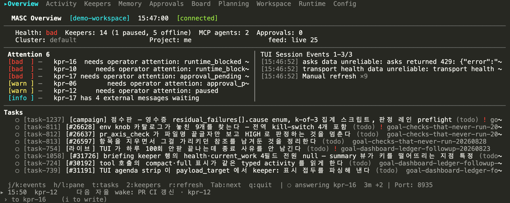
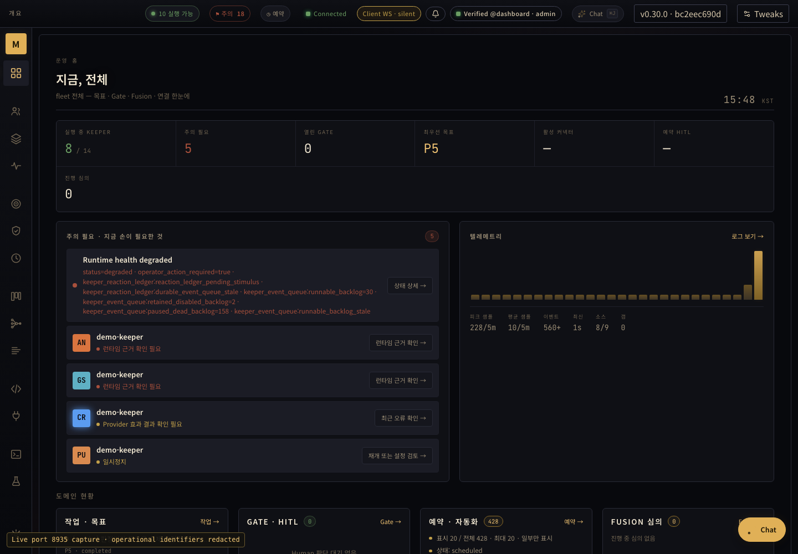

# MASC

[](https://ocaml.org/)
[](LICENSE)

[English](README.md)

MASC(Multi-Agent Shared Context)는 여러 코딩 에이전트가 같이 쓰는 작업 공간입니다.
내 컴퓨터에서 돌아가고, 프로젝트 하나의 목표와 작업, 누가 뭘 맡았는지, 보드에 오간
글, 그리고 무엇을 했는지 남긴 기록을 `.masc/` 디렉터리 한 곳에 모아 둡니다. 이
상태를 MCP로 열어 주기 때문에, MCP를 지원하는 클라이언트라면 무엇이든 같은 작업
공간에 들어올 수 있습니다.

만든 이유는 이렇습니다. 같은 저장소에서 에이전트를 둘 돌리면 각자 자기 기억만
가집니다. 같은 결정을 다시 내리고, 같은 파일을 동시에 잡고, 상대가 이미 해 본 걸
볼 방법이 없습니다. MASC는 그 상태를 에이전트 밖으로 꺼내서, 둘 다 읽고 쓰는 한
곳에 둡니다.

**Keeper**는 MASC가 직접 띄우고 지켜보는 상주 에이전트입니다. 작업을 집어 들고,
셸 명령을 돌리고, 파일을 고치고, 무엇을 했는지 작업 공간에 다시 올립니다. 꼭
있어야 하는 건 아닙니다. Keeper 없이 MCP 협업 서버로만 써도 됩니다.

> **개발 상태:** MASC는 1.0 이전 프로젝트이고, 믿을 수 있는 내 컴퓨터 안에서 쓰는
> 걸 전제로 합니다. 운영 서비스가 아니고 보안 경계도 아닙니다. Gate, 사람
> 승인(HITL), Docker 실행은 특정 작업을 막아 주지만, 사람이 보지 않는 사이에
> 에이전트가 하는 위험한 일을 전부 막지는 못합니다. `main`은 빠르게 바뀌어서 최신
> 공개 바이너리보다 한참 앞서 있을 수 있습니다.

## 들어가는 길 세 가지

같은 작업 공간을 세 가지 방법으로 볼 수 있습니다. 셋 다 같은 `.masc/` 상태를 읽고
씁니다. 지금 하려는 일에 맞는 걸 고르면 됩니다.

| 방법 | 이럴 때 씁니다 | 어떻게 얻나요 |
|---|---|---|
| **MCP** | 내가 쓰는 에이전트를 작업 공간에 참여시킬 때. 작업을 잡고, 보드에 글을 쓰고, 기록을 남깁니다 | MCP 클라이언트로 `http://127.0.0.1:8935/mcp` 에 붙습니다 |
| **대시보드** | 브라우저에서 전체를 보고 운영자로서 조작할 때 | 서버가 같은 프로세스에서 `/dashboard/` 로 띄웁니다 |
| **TUI** | 터미널에서 Keeper를 지켜보고 지시할 때. 코드와 diff도 여기서 봅니다 | 터미널에서 `masc` 를 치면 열립니다. 이름으로 부르려면 `masc-tui` |

터미널에서 `masc` 를 치면 TUI가 열리고, 포트에 아무도 응답하지 않으면 서버도
거기서 같이 띄웁니다. 한 단어로 작업 공간이 뜹니다. 터미널이 아닌 곳에서는 같은
`masc` 가 예전처럼 서버입니다 — 파이프, systemd 유닛, 컨테이너, CI 단계에는 TTY가
없으니 서버가 뜹니다. 터미널이든 아니든 서버만 원하면 `masc start` 입니다.



로컬에서 실행 중인 MASC의 터미널 UI입니다. Keeper 이름과 경로는 같은 글자 수의
가짜 값으로 바꿨습니다. 다섯 장과 캡처 조건은
[화면 목록](docs/screenshots/tui/2026-09-04/surfaces/README.md)에 있습니다.

## 처음 실행하기

### 소스에서 실행

OCaml 의존성을 한 번 설치한 뒤 서버를 띄웁니다. 기본 quickstart는 Keeper를 띄우지
않고, 모델 프로바이더 키도 필요 없습니다.

```bash
git clone https://github.com/jeong-sik/masc.git
cd masc

scripts/opam-pin-external-deps.sh --install
opam install . --deps-only
./quickstart.sh

BASE_PATH="${MASC_QUICKSTART_HOME:-$HOME/masc-quickstart}"
source "$BASE_PATH/.masc/config/mcp-client.env"
curl http://127.0.0.1:8935/health
```

기본값은 이렇습니다.

- 런타임 상태: `~/masc-quickstart/.masc`
- HTTP 포트: `8935`
- 대시보드: `http://127.0.0.1:8935/dashboard/`
- MCP 주소: `http://127.0.0.1:8935/mcp`
- Keeper 구성: 없음
- 런타임: `config/runtime.toml`의 현재 `[runtime].default`
- MCP bearer export: `~/masc-quickstart/.masc/config/mcp-client.env`

`--base-path`, `--team`, `--port`, `--no-open`, `--no-start` 옵션은
`./quickstart.sh --help`에서 볼 수 있습니다.

`classic` Keeper 구성으로 시작하려면 첫 실행에 모델 키를 넘깁니다.

```bash
export OLLAMA_CLOUD_API_KEY=...
./quickstart.sh --team classic
```

컴파일러와 Dune 버전은 `dune-project`에 적혀 있습니다. 소스에서 처음 실행하면
OCaml 서버와 대시보드를 같이 빌드하므로 몇 분 걸립니다.

### 공개 바이너리

공개된 릴리스는 `main`보다 뒤처져 있을 수 있습니다.
[GitHub Releases](https://github.com/jeong-sik/masc/releases)에서 태그를 하나
고르고, 설치 스크립트도 **같은 태그의 것**을 쓰세요. 둘을 섞으면 새 설치
스크립트가 옛 릴리스 파일을 다루게 됩니다.

```bash
TAG=vX.Y.Z
curl -fsSL "https://raw.githubusercontent.com/jeong-sik/masc/${TAG}/scripts/install.sh" \
  -o /tmp/masc-install.sh
less /tmp/masc-install.sh
bash /tmp/masc-install.sh --version "$TAG"
```

설치 동작은 고른 태그를 따라갑니다. 최근 릴리스 스크립트는 `SHA256SUMS`가 있으면
검증하고, 꼭 필요한 파일이 없으면 멈춥니다. 지원 플랫폼은 그 릴리스에 붙은
자산이 전부입니다. 설치가 끝나면 화면에 찍힌 login과 start 명령을 그대로
따르세요. login 명령이 MCP 클라이언트용 worker bearer를 만들어 줍니다. 기본
설정에서는 토큰 없는 클라이언트를 받지 않습니다.

릴리스에는 서버 바이너리와 터미널 UI, 배포 점검 도구가 들어갑니다. 설치 스크립트가
`masc-tui`를 `masc` 옆에 놓고, 실행 명령까지 화면에 찍어 줍니다.

### 처음 설정

바이너리를 놓은 뒤 설치 스크립트가 일회성 설정 마법사를 실행합니다(`--no-wizard`
로 건너뜀). 아무것도 쓰기 전에 이 호스트에서 감지한 것을 먼저 보여주고, 실제로
쓰는 것은 `runtime.toml`의
`[runtime].default` 둘뿐입니다.

두 축을 보여줍니다. **모델 소스**는 턴이 토큰을 받는 곳입니다.

- 클라우드 provider(Anthropic, OpenAI, GLM, DeepSeek …)는 API 키 환경 변수로
  제안됩니다. `--provider <id>`로 묻지 않고 고르고, `--api-key`나
  `--api-key-stdin`으로 키를 줍니다.
- 로컬 서버(Ollama, llama-server, MLX)는 healthcheck 경로로 curl해
  `reachable`(도달) / `not running`(안 뜸)으로 표시합니다. 안 떠 있는 서버가
  고르기 전에 보입니다.
- subscription CLI(Claude Code, Codex, Antigravity)는 그 CLI 자신의 로그인으로
  연결돼 키가 필요 없습니다. 명령이 `PATH`에 있으면 `installed`(설치됨), 자체
  로그인 검사를 통과하면 `signed in`(로그인됨)으로 표시합니다.

**실행 샌드박스**는 Keeper의 도구가 도는 곳입니다. 마법사는 호스트가 제공 가능한
백엔드를 **감지·표시만** 합니다 — `docker`(데몬 도달), macOS의 Apple `container`
CLI로 `microvm`, `remote_ssh`(runtime.toml에 endpoint 선언). 고르지는 않습니다.
샌드박스는 `.masc/config/keepers/<name>.toml`에서 Keeper마다, 또는 자기 선택을
지닌 `--team <preset>`으로 정합니다(`--sandbox docker|microvm|remote_ssh`로 그
팀의 샌드박스를 지정할 수 있습니다).

subscription 로그인 확인은 독립 명령이기도 합니다. `masc runtime-probe
<runtime_id>`는 CLI가 로그인돼 있으면 `0`, 아니면 `1`로 끝나며, 자격증명 파일을
읽지 않고 서버의 로그인 probe를 재사용합니다.

### 설치가 끝나도 아직 없는 것

설치가 끝나면 MCP와 대시보드를 서비스하는 워크스페이스가 생깁니다. 일부러 하지
않는 일이 넷 있고, 각각이 다음 단계입니다.

**Keeper가 한 명도 없습니다.** 설정 시드는 런타임 설정, 프롬프트, 도구 정의,
커넥터 선언을 쓰고 `config/keepers/`는 비워 둡니다. 누가 일할지는 워크스페이스마다
다르니 설치 스크립트도 서버도 대신 정하지 않습니다. TUI의 Keepers 화면에서
만들거나, 서버가 떠 있는 상태에서 `masc keeper-create`로 만듭니다. 설치할 때
`--team <preset>`을 주면 그 팀이 대신 들어갑니다.

**샌드박스 이미지가 아직 없습니다.** Keeper는 매 턴을 이미지 안에서 돌립니다
(`docker`도 `microvm`도 이미지를 씁니다). 없으면 매 턴이
`docker_preflight_failed`로 멈춥니다. Keeper가 기본으로 받는 이미지를 만드세요 —
Debian 위에 bash, ripgrep, git. 저장소를 읽고 찾고 고치는 데 한 턴이 필요로 하는
것들입니다.

```bash
masc sandbox-image                 # masc-sandbox:general 을 만듭니다
masc sandbox-image --print         # 먼저 레시피를 읽고 싶으면
```

레시피는 바이너리에 들어 있고 docker 에 stdin 으로 갑니다. 체크아웃이 한 번도
없던 호스트에서도 됩니다. 일부러 다국어 이미지로 만들지 않았습니다 — 프로젝트를
**빌드**해야 하는 Keeper 는 그 프로젝트의 툴체인이 필요하고, 그건 Keeper 마다
TOML 에 `sandbox_image = "node:22-bookworm"` 처럼 적습니다.

MASC 자신의 개발 이미지 `masc-keeper-sandbox:local`(OCaml + 이 저장소의 opam
의존성)은 더 이상 기본값이 아닙니다. 그게 필요한 Keeper 가 이름을 적습니다. 그리고
그 이미지는 Dockerfile 이 이 저장소의 opam 파일을 복사하므로 여전히 체크아웃이
있어야 만들어집니다.

```bash
scripts/build-keeper-sandbox-image.sh
```

호스트에서 그냥 도는 선택지는 없습니다. 프로필은 `docker`, `microvm`,
`remote_ssh` 셋뿐이라 Docker도 `container`도 SSH endpoint도 없는 호스트는
워크스페이스는 띄워도 Keeper는 못 돌립니다. `microvm`은 하이퍼바이저 뒤의 게스트를
뜻하지 런타임 하나를 뜻하지 않습니다. `microvm_backend`가 `apple_container`,
`microsandbox`, `nerdctl_kata` 중에서 고르고, 호스트에서 자동으로 정해지는 건
기본값뿐입니다 — macOS면 Apple의 `container`, 그 밖에는 없음. 그래서 Linux
호스트는 백엔드를 물려받는 대신 직접 적습니다. 아무것도 안 적힌 곳에서 microVM을
요청한 Keeper는 조용히 공유 커널을 받는 대신 부팅에서 거절됩니다. 각 백엔드가
지금 어디까지 되는지는 위 표에 있습니다.

**그리고 그 이미지는 MASC 자신의 개발 환경입니다.** 범용이 아닙니다.
`ocaml/opam:ubuntu-24.04-ocaml-5.5` 에 이 저장소의 opam 의존성을 미리 넣어 둔
것입니다. Keeper 의 한 턴은 `docker run --rm` 으로 매번 새 컨테이너에서 돌고
rootfs 는 읽기 전용, `--cap-drop=ALL` 입니다. 턴이 시작된 뒤에는 아무것도 설치할
수 없으니 필요한 건 전부 이미지에 미리 있어야 합니다. TypeScript나 Python
프로젝트를 맡은 Keeper 는 엉뚱한 툴체인을 만나고 맞는 걸 받아 올 수도 없습니다.

그 일에 맞는 이미지를 Keeper 마다 TOML 에 적으세요.

```toml
[keeper]
sandbox_profile = "docker"
sandbox_image = "node:22-bookworm"
network_mode = "none"
```

`MASC_KEEPER_SANDBOX_DOCKER_IMAGE` 는 이미지를 안 적은 모든 Keeper 의 기본값을
바꿉니다. 한 턴은 `<이미지> bash -l -s` 로 돌고 도구 스크립트가 stdin 으로
들어가므로, 어떤 이미지든 세 가지를 만족해야 합니다.

- **`bash` 가 `PATH` 에 있을 것.** 턴을 받는 건 로그인 셸이라 `sh` 만 있는 Alpine
  이미지는 턴을 못 받습니다.
- **호스트 uid 로 돌 수 있을 것.** 컨테이너는 `--user <내 uid>:<gid>` 로 돕니다.
  자기 전용 사용자로만 동작하는 이미지는 홈 디렉터리 없이 떨어집니다.
- **툴체인이 이미 들어 있을 것.** rootfs 는 tmpfs 하나와 마운트된 작업 공간을 빼면
  읽기 전용이고 `--cap-drop=ALL` 에 `no-new-privileges` 라, 턴이 없는 걸 발견해도
  설치할 수 없습니다.

**모델 제공자 키는 서버 환경에 있어야 합니다.** 변수 이름은 provider마다
`runtime.toml`이 정합니다 — `OLLAMA_CLOUD_API_KEY`, `DEEPSEEK_API_KEY` 같은
것들이고, 서버는 자기가 시작된 환경에서 그 값을 읽습니다. `masc`를 띄우는 셸에서
export 하세요. TUI로 시작할 때 놓치기 쉬운데, TUI가 띄운 서버는 TUI의 환경을 그대로
물려받기 때문입니다. 켜기 **전에** export 하세요.

**시드된 모델 카탈로그는 모두 keeper-dispatchable 합니다.** 카탈로그에는 예시를 겸해
provider/model 바인딩 31개가 들어 있고, 31개 모두 `max-request-body-bytes`를 선언하여
설정된 어떤 모델이든 부팅 경고 없이 Keeper 턴을 받을 수 있습니다. `[runtime].default`는
31개 안에 있습니다.

### 갓 만든 Keeper가 할 수 있는 일

새 Keeper가 손을 뻗는 곳은 전부 닫힌 채로 시작합니다. 그중 처음 마주치는 네 가지입니다.

**승인 레인이 둘이고, 시작 위치가 다릅니다.** 워크스페이스 레인은 `auto_judge`로
시작합니다 — 모델이 각 호출을 읽고 판단합니다. 외부 서비스 레인, 그러니까 Jira나
GitHub나 Slack처럼 붙여 둔 바깥으로 나가는 호출은 `manual`로 시작해서 사람이 하나씩
답합니다. 일부러 갈라 둔 것입니다. 2026-08-27 측정에서 Gate 판정 379건 중 374건이
워크스페이스 `always_allow`를 타고 지나갔고, 그 스위치를 같이 물려받는 레인이었다면
그날 사고의 Jira 쓰기가 감사 기록만 남긴 채 통과했을 겁니다.

**`auto_judge`는 자기 모델이 따로 필요하고, 그게 fleet 기본값이 아닙니다.** 판정은
`hitl_auto_judge` exact-output 레인에서 돌고, 그 슬롯은 `glm-coding`과
`ollama_cloud`를 가리킵니다. 그래서 키를 하나만 넣은 설치는 대개 그 레인에 못
닿습니다. 판정을 못 한 호출은 허용도 거부도 아니고 Approvals 대기열로 넘어갑니다 —
`manual`이 보내는 곳과 같습니다. 첫 작업에서 Keeper가 멈춘 것처럼 보이면 대개 거기
있습니다.

**샌드박스에 네트워크가 없습니다.** `docker`와 `microvm` 게스트는
`network_mode = "none"`으로 시작합니다. 그 안에서 웹 검색도, `git push`도, HTTP
호출도 실패합니다. 그 Keeper의 TOML이 `inherit`(호스트 네트워크) 또는
`policy`(서버가 소유한 프록시를 거쳐 `egress_allow`에 적힌 목적지만)라고 말해야
열립니다. `remote_ssh`는 `inherit`으로 시작합니다 — endpoint 자체가 이미 자기
네트워크를 가진 기계이기 때문입니다. `masc keeper-create`는 대신 골라 주지 않고
`--network-mode`를 반드시 받습니다.

**연결된 커넥터가 하나도 없습니다.** `config/identity/` 아래 선언들은 연결이 아니라
제공자 설명입니다. 갓 설치한 상태에서 `GET /api/v1/keepers/oauth/providers`는 전부
`has_client: false`로 답합니다. 붙이려면 클라이언트가 먼저 있어야 합니다. 등록
endpoint를 공개하는 제공자는 그 자리에서 클라이언트를 받고, 그렇지 않은 쪽은 —
GitHub이 그렇습니다 — 앱을 직접 만들어 그 id와 secret을 Connectors 화면에서 `A`로
넣거나 `POST /api/v1/keepers/oauth/client`로 보냅니다. 그다음에야 Keeper가 자기
자격증명을 붙입니다.

## MCP 클라이언트 설정

한 번에 끝내는 길은 `masc mcp-config`입니다. bearer를 발급하고 클라이언트용
완성 config 블록을 찍어 주므로, URL·토큰·헤더를 손으로 맞추지 않고 한 블록만
붙여 넣으면 됩니다.

```bash
masc mcp-config --base-path /path/to/project --client codex
masc mcp-config --base-path /path/to/project --client claude-desktop
masc mcp-config --base-path /path/to/project --client env   # 셸 export
```

long-lived worker 토큰을 발급하며(`--expiring`으로 세션 한정), 고른 클라이언트에
맞게 endpoint·토큰·헤더를 담습니다. 아래 수동 블록은 이 명령이 다루지 않는
클라이언트를 직접 배선할 때 쓰는 같은 형식입니다.

### 토큰

`masc login` 은 agent 이름 하나에 bearer 하나를 발급합니다. `masc mcp-config` 는
같은 발급에 클라이언트 설정 블록을 씌운 것입니다. 둘 다 로컬 작업이라 서버가 떠
있지 않아도 됩니다.

**다시 발급하는 것이 곧 회전입니다.** 워크스페이스는 agent 이름당 자격증명 하나를
들고 있어서, `masc login --agent ops` 를 두 번째로 부르면 첫 번째를 대체하고 옛
bearer 는 다음 요청부터 통하지 않습니다. 따로 폐기할 게 없습니다. 다만 옛 값을
export 해 둔 곳은 새 값으로 바꿔야 합니다.

**저장소에는 bearer 가 없습니다.** `.masc/auth/agents/<agent>.json` 은 토큰의
SHA-256 만 들고 있어서, 잃어버린 토큰을 거기서 읽어낼 수 없습니다. raw 는 딱 한
군데 — `.masc/auth/<agent>.token`, 권한 `0600` — 과 export 해 둔 셸에만 남습니다.

```bash
masc token list             # agent, 역할, 만료, raw 가 디스크에 있는지
masc token revoke ops       # 새로 발급하지 않고 하나만 폐기
masc token prune --dry-run  # 지울 대상 미리 보기
masc token prune            # 만료된 것과 고아 스텁 전부 폐기
```

`prune` 이 건드리는 건 둘이고, 둘 다 아무것도 인증하지 못합니다 — 만료가 지난
자격증명과, 대상 파일이 사라진 리다이렉트 스텁입니다. 지우는 게 보안 판단이 아니라
청소인 이유이고, `revoke` 가 대상을 이름으로 받게 하면서 `prune` 은 확인을 안 받는
이유입니다. 고아 스텁은 목록에 안 보입니다 — 리다이렉트를 따라가면 아무것도 안
나와서 `masc token list` 가 건너뛰고, `prune` 만 찾아냅니다.

`--no-expiry` 로 만든 토큰은 그 집합에 절대 안 들어갑니다. 그 클라이언트를 더 안
쓰면 이름으로 폐기하세요.

공개된 MCP 경로는 HTTP입니다. 먼저 `quickstart.sh`가 만든 worker bearer를
불러옵니다.

```bash
BASE_PATH="${MASC_QUICKSTART_HOME:-$HOME/masc-quickstart}"
source "$BASE_PATH/.masc/config/mcp-client.env"
```

환경 변수 기반 bearer 토큰을 지원하는 클라이언트(예: Codex나 스크립트):

```toml
[mcp_servers.masc]
url = "http://127.0.0.1:8935/mcp"
bearer_token_env_var = "MASC_TOKEN"
http_headers = { "Accept" = "application/json, text/event-stream" }
```

Claude Desktop (`claude_desktop_config.json`, `mcp-remote` 사용):

```json
{
  "mcpServers": {
    "masc": {
      "command": "npx",
      "args": ["-y", "mcp-remote", "http://127.0.0.1:8935/mcp"],
      "env": {
        "MASC_TOKEN": "mcp-client.env 파일 안의 토큰값"
      }
    }
  }
}
```

### 멀티 에이전트 협업 흐름

여러 에이전트가 같은 작업 공간에 접속하면 작업 점유(claim)와 증거 기반 전이를 통해 충돌을 피합니다.

```text
# 1. Agent A가 작업 공간에 참여하고 작업 점유 선언
masc_start(path="/path/to/project", task_title="인증 토큰 갱신 버그 수정")
masc_transition(task_id="task-001", action="claim")

# 2. Agent B가 참여하여 활성 상태를 확인하고 다른 작업을 점유
masc_start(path="/path/to/project")
masc_status()  # task-001이 Agent A에 의해 점유 중임을 확인
masc_add_task(title="인증 흐름 통합 테스트 작성")
masc_transition(task_id="task-002", action="claim")

# 3. Agent A가 작업 완료 후 검증 증거와 함께 제출
masc_transition(
  task_id="task-001",
  action="submit_for_verification",
  handoff_context={
    "summary": "토큰 갱신 테스트 통과",
    "evidence_refs": ["artifact:tests/auth_test.log"]
  }
)
```

### Goal 생명주기와 자율 검증 (RFC-0387)

Goal은 개별 에이전트의 소유(`owner`)가 아닌 팀 전체의 공유 목표입니다.

- **Goal 생성**: 정량적 성공 기준(`metric`, `target_value`)이 필수입니다 (예: `masc_goal_upsert(title="테스트 커버리지 개선", metric="coverage", target_value=">=85%")`).
- **자율 검증 전이**: `Executing → Verifying → Completed` 상태를 따릅니다. `masc_goal_transition(goal_id=..., action="request_complete")`로 완료를 요청하면 `verifier_exact` 자율 판정자가 작업 증거를 검사하여 최종 판정을 확정합니다.

도구는 계속 늘어나니, 여기 적힌 숫자를 믿지 말고 붙어 있는 서버에 직접 물어보세요
— 같은 세션에서 `tools/list`가 답합니다. 2026-08-26 빌드는 43개 작업 공간 도구로 답했습니다.

URL만 적어 두면 기본 인증 설정에서 `401 Unauthorized`가 납니다. 다른 클라이언트
형식, initialize 직접 확인, bearer 수동 발급은
[`docs/MCP-TEMPLATE.md`](docs/MCP-TEMPLATE.md)에 있습니다. 관리자만 쓸 수 있는
대시보드 조작은
[`docs/LOCAL-DASHBOARD-AUTH-RUNBOOK.md`](docs/LOCAL-DASHBOARD-AUTH-RUNBOOK.md)를
보세요.

## 터미널 UI

`masc-tui`는 같은 작업 공간을 터미널에서 보는 프로그램입니다. `.masc/`를 디스크에서
바로 읽고, 서버가 떠 있으면 HTTP로만 볼 수 있는 화면까지 더해 줍니다. 릴리스로
설치하면 `PATH`에 올라가고, 소스에서는 Dune 대상 하나로 빌드합니다.

```bash
dune build --root . bin/masc_tui.exe
./_build/default/bin/masc_tui.exe --base-path /path/to/project
```

넘기는 경로 바로 아래에 `.masc`가 있어야 합니다. `--base-path`를 안 주면
`MASC_BASE_PATH`를, 그것도 없으면 현재 디렉터리를 씁니다. `dune install`이나 opam
설치를 하면 `masc-tui` 이름으로 `PATH`에 올라갑니다.

`Tab`을 누르면 화면 20개를 돌아가며 보여 주고, 지금 보는 화면은 맨 윗줄 띠에
표시됩니다.

| 화면 | 보여 주는 것 |
|---|---|
| Overview | 작업 공간 요약, 할 일 목록, 지금 손이 필요한 것 |
| Acting | 모든 Keeper의 도구 호출, 턴 시작과 종료를 들어오는 대로 |
| Keepers | Keeper 명단, 그리고 Keeper별 대화·로그·도구 호출·런타임, 그 Keeper가 들고 있는 비밀의 이름 |
| Lanes, Runtime | 런타임 레인과 후보 순서, 프로바이더에 실제로 닿는지 |
| Approvals | Gate 승인 대기 목록과 Keeper가 답을 기다리는 질문. 터미널에서 바로 승인·거절하고 답합니다 |
| Board | 사람, 에이전트, 자동화, 시스템이 올린 글 |
| Planning, Schedules, Verify | 계획과 목표, 예약된 작업, 검증 판정 |
| Repositories, Code, Changes | 등록된 저장소, 그 안의 파일 탐색, Keeper가 최근에 고친 것 |
| Harness, Fusion, Tools, Resources, Config, Connectors, Logs | 하네스 실행, 패널·심사 실행, 도구 목록, MCP 리소스, `runtime.toml`, 외부 채널 연결, 런타임 로그 |

입력줄 바로 위 한 줄이 모든 화면에서 다음 예약 시각과, 사람을 기다리며 멈춘
Keeper를 알려 줍니다. 둘 다 없으면 그 줄도 없습니다.

보기만 하는 화면은 아닙니다. 맨 아래 입력줄은 지금 지정된 Keeper에게 메시지를
보내고, `/task <제목>`을 치면 `masc_add_task`로 작업을 만든 뒤 그 작업 번호를 붙여
Keeper에게 바로 넘깁니다. `masc_ask`로 질문을 던진 Keeper에게는 터미널에서 바로
답합니다 — 입력줄 위 그 줄이 가리키는 것이 이겁니다. Code 화면에서는 `Enter`로
파일을 열고, `d`로 HEAD 대비 지금 고친 내용을, `H`로 그 파일을 건드린 커밋을,
`m`으로 그 파일에 달린 메모를 봅니다. `K`와 `D`는 커서가 놓인 이름의 타입과
정의를 언어 서버에 물어봅니다.

언어 서버는 MASC가 같이 배포하지 않습니다. 프로젝트 언어에 맞는 프로그램을
`PATH`에서 찾아 직접 띄우고, 없으면 짐작하는 대신 `Command_not_found`로
답합니다. OCaml은 `ocamllsp`, TypeScript와 JavaScript는
`typescript-language-server`, Python은 `pyright-langserver`, Rust는 `rust-analyzer`, Go는
`gopls`입니다. 언어별 프로그램과 프로젝트 표지는 아래 표와 같습니다. Keeper의 `keeper_code_query` 도구도 같은 서버를 쓰므로, 서버가
없는 언어를 맡은 Keeper는 파일을 글자로 읽는 데까지만 갑니다. OCaml에서
`references`는 `dune build @ocaml-index`가 추가로 필요하고, 없으면 답이 그
명령을 알려 줍니다.

| 언어 | 프로그램 | 프로젝트 표지 |
|---|---|---|
| OCaml | `ocamllsp` | `dune-project`, `dune-workspace` |
| TypeScript | `typescript-language-server` | `tsconfig.json`, `package.json` |
| JavaScript | `typescript-language-server` | `jsconfig.json`, `package.json` |
| Python | `pyright-langserver` | `pyproject.toml`, `setup.py`, `setup.cfg` |
| Rust | `rust-analyzer` | `Cargo.toml` |
| Go | `gopls` | `go.mod` |
| C | `clangd` | `compile_commands.json`, `CMakeLists.txt`, `Makefile` |
| C++ | `clangd` | `compile_commands.json`, `CMakeLists.txt`, `Makefile` |
| Swift | `sourcekit-lsp` | `Package.swift` |
| Java | `jdtls` | `pom.xml`, `build.gradle`, `build.gradle.kts` |
| Kotlin | `kotlin-language-server` | `build.gradle.kts`, `settings.gradle.kts`, `build.gradle` |
| Ruby | `ruby-lsp` | `Gemfile` |
| PHP | `intelephense` | `composer.json` |
| Lua | `lua-language-server` | `.luarc.json` |
| Bash | `bash-language-server` | 작업 공간 경계 |
| JSON | `vscode-json-language-server` | 작업 공간 경계 |
| YAML | `yaml-language-server` | 작업 공간 경계 |
| Zig | `zls` | `build.zig` |
| Haskell | `haskell-language-server-wrapper` | `stack.yaml`, `cabal.project` |
| Elixir | `elixir-ls` | `mix.exs` |
| Dart | `dart` | `pubspec.yaml` |
| Scala | `metals` | `build.sbt` |
| C# | `csharp-ls` | 작업 공간 경계 |
| Markdown | `marksman` | 작업 공간 경계 |

TUI와 서버가 서로 다른 작업 공간을 보고 있으면 머리글이 그렇게 말합니다 — 연결
표시 옆 `[workspace mismatch]`, 그리고 아래 줄에 두 경로가 같이 나옵니다. 그동안
둘을 섞을 읽기는 거절되지만, 서버가 답하는 화면은 그대로 그려집니다.

포트에 아무도 응답하지 않으면 TUI가 옆에 있는 `masc` 를 자식 프로세스로 띄우고
`/health` 를 기다립니다. TUI를 닫으면 그 서버도 같이 내려갑니다 — 다만 이미 돌고
있던 서버는 건드리지 않습니다. 자동 시작은 세션당 한 번입니다. 안 뜨면(포트를 다른
게 쓰고 있거나, `masc` 가 TUI 옆에 없거나) Keepers 화면에서 `s` 로 다시 시도할 수
있고, 무엇이 실패했는지는 아래 줄에 나옵니다.

서버가 꺼져 있어도 Keeper 명단, Keeper 상세, 할 일 목록은 디스크에서 읽으므로 그대로
보입니다. Approvals, Board, Planning, Fusion, Runtime, 로그, 메시지 보내기는 서버가
있어야 하고, 없으면 빈 목록 대신 안 됐다고 말합니다. `data unreliable` 옆의 `0`은
"읽기가 실패했다"는 뜻이지 "비어 있다"는 뜻이 아닙니다.

TUI는 입력을 받을 수 있는 TTY가 필요하고, `dumb`이 아닌 터미널이어야 합니다. 키
목록과 화면별 동작, 문제 해결은 [`docs/TUI-GUIDE.md`](docs/TUI-GUIDE.md)에 있습니다.

## 지금 할 수 있는 것

| 영역 | 지금 쓰는 방식 | 알아 둘 한계 |
|---|---|---|
| 작업 공간 협업 | 목표, 작업, 담당, 상태 전이, 보드 글, 검증 기록을 MCP로 공유 | 여기 담긴 정보가 동시 코드 수정을 막아 주지는 않습니다 |
| Keeper | 설정한 에이전트가 작업 공간 이벤트에 반응하고 실행 기록을 남김 | 익숙해진 다음에 쓰는 기능입니다. 고른 런타임과 Keeper 설정에 따라 동작이 달라집니다 |
| 대시보드 | 작업 공간과 런타임 상태를 읽고 운영자로서 조작 | 빌드된 SPA와 인증 방식에 따라 쓸 수 있는 범위가 달라집니다 |
| 터미널 UI | Keeper를 지켜보고, Gate 대기 목록에 답하고, 메시지를 보내고, 저장소 파일과 diff를 봄 | 입력 가능한 TTY가 필요합니다. `main`에서 화면 구성이 자주 바뀝니다 |
| Gate와 사람 승인 | 외부에 영향을 주는 작업을 항상 허용 / 모델 판단 / 사람 승인 중 하나로 처리 | 승인 절차이지 샌드박스나 자격증명 경계가 아닙니다 |
| 런타임 배정 | Keeper마다 프로바이더와 모델을 정하고, 레인에 후보 순서를 지정 | 유효한 카탈로그와 프로바이더 자격증명은 따로 필요합니다 |
| Fusion | `masc_fusion`으로 패널과 심사 흐름을 실행 | 미리 정의한 구성과 심사 런타임이 있어야 합니다 |
| 커넥터 | 작업 공간 활동을 Discord, iMessage, Slack, Telegram 에 연결. Discord·iMessage·Slack 은 서버 안에서 돌고, Telegram 만 아직 사이드카를 거칩니다 | 토큰과 채널–Keeper 연결은 운영자가 직접 설정합니다 |
| 로컬 / Docker 실행 | Keeper의 셸 작업을 `local` 또는 `docker`로 실행 | `local`은 호스트에서 그대로 돕니다. Docker 프로파일도 완전한 보안 경계는 아닙니다 |
| IDE | 대시보드 안의 실험적인 협업 화면 | 평소 작업의 정식 입구가 아닙니다 |

제품의 정식 입구는 저장소 작업 공간 협업입니다. Keeper 감독과 운영자 조작은 그
다음입니다. 원격에서 안전하게 쓰기, 클러스터 배포, 운영 서비스 수준의 보장은 아직
약속하는 범위가 아닙니다. [`docs/PRODUCT-OPERATING-PLAN.md`](docs/PRODUCT-OPERATING-PLAN.md)를
보세요.

## 설정

MASC는 런타임 데이터를 `<base-path>/.masc` 아래에서 찾습니다. 사람이 쓰는 설정은
`<base-path>/.masc/config` 아래에 둡니다. `MASC_CONFIG_DIR`로 다른 위치를 지정하면
그쪽을 씁니다.

| 경로 | 용도 |
|---|---|
| `runtime.toml` | 프로바이더·모델 목록, 필수 항목인 `[runtime].default`, 런타임 레인, Keeper 배정 |
| `config/tools/*.toml` | 130여 개 MASC 도구의 정적 스키마 정의 (작업 공간, 보드, 작업, 목표, 키퍼 제어 등) |
| `agent-core-models-overlay.toml` | 배포 환경에서만 쓰는 모델 능력 항목. 파일이 없으면 내장 Agent Core 목록을 씁니다 |
| `keepers/<name>.toml` | Keeper 하나에 필요한 전부. 운영 설정, 프롬프트(`keeper.instructions`), `[keeper.tools]` 도구 포스처 |
| `repositories.toml` | 저장소 작업에 쓰는 저장소 정보와 체크아웃 경로 |
| `keeper_repo_mappings.toml` | Keeper–저장소 기본 연결. 권한 경계가 아니라 기본값입니다 |

같은 뿌리 아래 한 디렉터리는 생성물이 아니라 사람이 씁니다.

| 경로 | 쓰임 |
|---|---|
| `<base-path>/.masc/skills/<이름>/SKILL.md` | Keeper에게 이름으로 건네줄 수 있는 능력. frontmatter의 `name`은 디렉터리 이름과 같아야 합니다 — 작업이 스킬을 그 디렉터리 이름으로 가리키기 때문입니다 |

Keeper 하나는 파일 하나로 만듭니다. `<base-path>/.masc/config/keepers/reviewer.toml`:

```toml
[keeper]
autoboot_enabled = true
proactive_enabled = true
sandbox_profile = "local"
mention_targets = ["operator"]

[keeper.tools]
native = "read"  # "none" | "read" | "full" (Auto 모드에서는 read로 안전 강등)

instructions = """
당신은 리뷰 Keeper입니다. 지금 변경을 살펴보고 파일 경로와 명령을 붙여
구체적인 근거를 보고해 주세요.
"""
```

TOML에 모르는 키가 있으면 거부합니다.

### Keeper 이벤트 반응형 생명주기

Keeper가 백그라운드에서 실행될 때는 이벤트 반응형 루프를 따릅니다.

1. **자극 수신 (Stimulus Intake)**: 보드 멘션(`@keeper`), 예약된 타이머, 또는 대기열에 할당되지 않은 작업이 들어오면 자극 큐가 Keeper를 즉시 깨웁니다.
2. **턴 실행 (Turn Execution)**: 셸 명령 실행과 파일 수정을 수행합니다 (자율턴 사고 CoT는 RFC-0385에 따라 대화 재생 체크포인트에서 제외되어 컨텍스트 팽창을 방지).
3. **내구성 게이트 (Durable Gate)**: 외부 서비스 쓰기 액션(Jira, GitHub, Slack 등)은 안전을 위해 내구성 있는 Gate 승인 큐를 거칩니다.
4. **증거 영속화 (Evidence Persistence)**: 실행 기록과 도구 아티팩트를 `<base-path>/.masc/`에 영속화한 후 다시 대기 상태로 돌아갑니다.

런타임 배정은 `runtime.toml`에 적습니다:

```toml
[runtime.assignments]
reviewer = "<provider>.<model>"
```

파일 규칙 전체는 [`docs/KEEPER-FILE-MODEL.md`](docs/KEEPER-FILE-MODEL.md)에,
런타임이 읽는 환경 변수는 [`docs/ENV-CONTRACT.md`](docs/ENV-CONTRACT.md)에
있습니다. 실제로 적용된 설정은 `masc_config` 도구나
`/api/v1/dashboard/config`로 확인합니다.

## 실행 방법

| 명령 | 용도 |
|---|---|
| `masc start --base-path <path>` | 설치된 바이너리로 실행. 하위 명령 없이 `masc`만 쳐도 같습니다 |
| `./start-masc.sh --http --base-path <path>` | 소스 체크아웃에서 전체 런타임 실행 |
| `scripts/start-loopback.sh` | `127.0.0.1:8935`로 실행. 따로 켜지 않으면 Keeper를 띄우지 않습니다 |
| `scripts/run-local.sh --target-dir <path>` | 경로에서 포트를 뽑아 개발용으로 따로 실행 |

`masc`에는 `init`, `login`, `runtime-default-set`, `runtime-wizard-catalog`,
`schedule-prune`, `keeper-github` 하위 명령도 있습니다. 각각 이름 그대로 초기 설정과
신원 등록에 씁니다.

상태를 건드리기 전에 지금 어떤 경로를 쓰고 있는지 항상 먼저 확인하세요.

```bash
curl -fsS 'http://127.0.0.1:8935/health?full=1' \
  | jq '.paths | {effective_base_path, effective_masc_root, roots_diverge}'
```

`.masc/config/` 밖의 파일은 런타임이 직접 관리합니다. 설정 파일이 아닙니다. Keeper
스냅샷, 작업 저장소, 보드 로그, 영수증, 승인 기록을 손으로 고치지 마세요.

## 대시보드

서버가 `/dashboard/`로 대시보드를 띄웁니다. 화면 구성은
`dashboard/src/config/navigation.ts`에 정의돼 있습니다.



로컬에서 실행 중인 MASC의 대시보드입니다. 운영 정보는 알아볼 수 없도록 바꿨습니다.

왼쪽 주 메뉴 화면:

| 화면 | 용도 |
|---|---|
| Overview | 작업 공간과 런타임 요약 |
| Keepers | Keeper 명단, 대화, 컨텍스트 |
| Registry | Keeper 선언과 런타임 연결 |
| Monitor | 전체 Keeper, 도구, 런타임, 관측 화면 |
| Work | 목표, 계획, 저장소, 검증 |
| Gate | 사람 승인 대기 목록과 항상 허용 규칙 |
| Schedule | 예약된 작업과 깨우기 신호 |
| Board | 사람, 에이전트, 자동화, 시스템 글 |
| Fusion | 패널과 심사 실행 |
| Logs | 런타임 이벤트 로그 |
| IDE | 실험적인 협업 화면 |
| Connectors | 외부 채널 상태와 연결 |
| Settings | 운영 설정 화면 |

메뉴에 보이는 두 번째 단계:

| 화면 | 하위 항목 |
|---|---|
| Monitor | `agents`, `internal-agents`, `fleet-health`, `runtime`, `observatory`, `skills` |
| Work | `work`, `planning`, `repositories`, `verification` |
| Connectors | `connector-status` |
| IDE | `ide-shell` |
| Lab | `tools`, `harness`, `performance`, `keeper-memory-health` |

`Lab`과 `Command`는 주소로 열 수 있지만 주 메뉴에 고정돼 있지 않습니다. 숨겨진
진단 화면은 메뉴 규약에 포함되지 않습니다.

현재 대시보드 규약이 요구하는 주소 예시입니다.
`dashboard#monitoring?section=journey`,
`dashboard#command?section=operations`,
`dashboard#connectors?section=connector-status`,
`dashboard#workspace?section=verification`. 이 중 `journey`는 숨겨진 진단
화면입니다.

주 메뉴, Monitor, Work, Lab 화면을 캡처한
[24개 화면 목록](docs/screenshots/dashboard/2026-09-04/README.md)도 있습니다.

## 저장소 구조

```text
masc/
├── bin/          서버, CLI, 터미널 UI 진입점
├── lib/          작업 공간, Keeper, 런타임, Gate, 서버 코드
├── packages/     내장 Agent Core 패키지
├── dashboard/    TypeScript, Preact 대시보드 소스
├── assets/       빌드된 웹 자산
├── config/       기본 설정 씨앗 파일
├── docs/         런북, 규약, 스펙, 지난 RFC
├── scripts/      빌드, 설치, 검증, 로컬 운영 스크립트
└── test/         OCaml 테스트와 fixture
```

## 문서

| 문서 | 용도 |
|---|---|
| [`docs/MCP-TEMPLATE.md`](docs/MCP-TEMPLATE.md) | MCP 클라이언트 설정 |
| [`docs/TUI-GUIDE.md`](docs/TUI-GUIDE.md) | 터미널 UI 화면, 키, 문제 해결 |
| [`docs/KEEPER-USER-MANUAL.ko.md`](docs/KEEPER-USER-MANUAL.ko.md) | Keeper 를 만들고 켜고 지켜보는 법 |
| [`docs/KEEPER-IDENTITY-MANUAL.ko.md`](docs/KEEPER-IDENTITY-MANUAL.ko.md) | Jira·Notion·Google 등 54개 업무 서비스를 Keeper 에 붙이는 법 |
| [`docs/KEEPER-FILE-MODEL.md`](docs/KEEPER-FILE-MODEL.md) | Keeper 파일과 런타임 배정 규칙 |
| [`docs/SKILLS.md`](docs/SKILLS.md) | `SKILL.md`로 능력을 선언하고 Keeper에게 건네는 법 |
| [`docs/ENV-CONTRACT.md`](docs/ENV-CONTRACT.md) | 런타임이 읽는 환경 변수 |
| [`docs/LOCAL-DASHBOARD-AUTH-RUNBOOK.md`](docs/LOCAL-DASHBOARD-AUTH-RUNBOOK.md) | 로컬 bearer와 대시보드 쓰기 권한 |
| [`docs/AGENT-CORE-BOUNDARY.md`](docs/AGENT-CORE-BOUNDARY.md) | MASC와 내장 Agent Core의 역할 구분 |
| [`docs/spec/SPEC-INDEX.md`](docs/spec/SPEC-INDEX.md) | 스펙 목록. 안에 적힌 개수는 따로 표시가 없으면 과거 기준입니다 |
| [`docs/RELEASE-EVIDENCE.md`](docs/RELEASE-EVIDENCE.md) | 릴리스 증거 형식. 다시 쓰기 전에 버전 헤더를 확인하세요 |
| [`CONTRIBUTING.md`](CONTRIBUTING.md) | 빌드, 테스트, PR 절차 |
| [`ROADMAP.md`](ROADMAP.md) | 현재 계획. 릴리스 약속은 아닙니다 |

## 개발과 릴리스 상태

- 패키지 버전은 `dune-project`에 있고 `masc.opam`으로 생성됩니다.
- `CHANGELOG.md`가 소스 릴리스 흐름을 기록합니다.
- 공개된 바이너리와 자산의 기준은
  [GitHub Releases](https://github.com/jeong-sik/masc/releases)입니다.
- 1.0 전까지 API와 설정은 바뀔 수 있습니다.

## 라이선스

MIT. [`LICENSE`](LICENSE)를 보세요.
