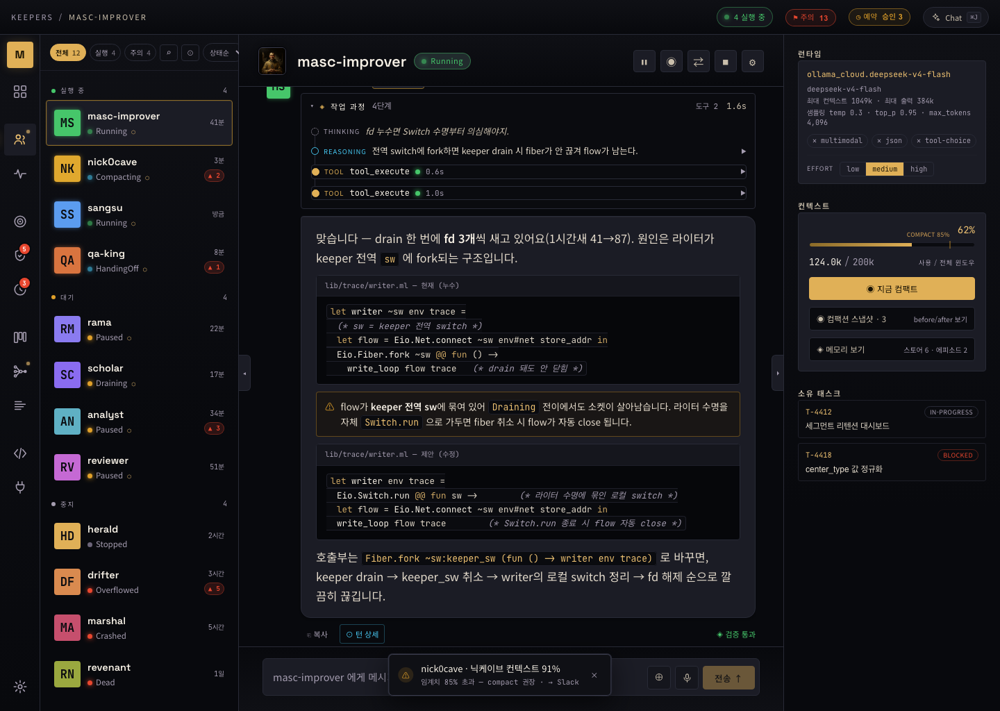

# MASC

[](https://ocaml.org/)
[](https://github.com/jeong-sik/oas)
[](LICENSE)

[한국어 버전](README.ko.md)

**MASC is a local coordination and observability layer for agent work.** It runs
next to a repository as an MCP server, so coding agents and resident Keepers can
share goals, tasks, board posts, repository ownership, and approval state. The
dashboard and per-turn receipts make agent decisions and failures inspectable.

It is not meant to be the fastest way to get work done. MASC trades speed for
coordination, observability, and experiments with long-running persona-based
agents. Some design choices are practical; some are playful.
Accidental jokes, odd names, and small bits of fiction are part of the project
taste; they are there because they make the experiment more fun, not because
they are architecture requirements.

> **Development status:** MASC is still a pre-1.0 experiment. It is not a
> productivity tool, production service, or security boundary. Use it for local
> experiments and observation only. CODE/IDE workflows are not usable yet, and
> HITL/Sandbox features can reduce some accidents but cannot be relied on to
> protect code, secrets, infrastructure, or unattended agents. The current goal
> is to make agent failures visible enough to discover which workflows may
> become useful.

A **Keeper** is an optional resident agent managed by MASC. It stays alive while
the server is running, wakes on heartbeat intervals, and reacts to mentions or
messages.

### Why "Keeper"

Agents in this environment are called **Keepers**, a nickname borrowed from Bullfrog's *Dungeon Keeper* by Peter Molyneux. This is project vocabulary and a playful naming choice, not a deeper architecture claim. The project intentionally leaves room for incidental jokes and character-like naming.

---

## What you can do with MASC

- **Run shared Goals and Tasks through MCP tools.** Keep task ownership, status transitions, and verification evidence in one local workspace.
- **Run and observe resident Keepers.** Give a Keeper its own persona, goal, and instructions, and let it communicate over shared topics or repositories.
- **Experiment with different agent styles.** Keepers can carry different concerns and instructions, so you can watch what they decide and where they clash.
- **Attach existing coding agents.** Because MASC is an MCP server, MCP clients such as Claude Code or Codex can connect to `/mcp` and join the same workspace — sharing task claim/transition, board, and goals, and waking Keepers via `masc_broadcast` or @mention. (There is no synchronous external tool for directly invoking a Keeper turn; interaction is through the workspace and mentions.)
- **Reduce obvious collisions when multiple agents touch the same code.** Turns, locks, and worker ownership can coordinate multiple Keepers working on one repository, but this is not a concurrency-safety guarantee.
- **Inspect decisions and failures.** The web dashboard shows Keeper / Goal / Task / Board state in real time, and every turn leaves a receipt.
- **Route external effects through one Gate.** Always Allow, LLM Auto Judge, and HITL are explicit non-hierarchical modes. HITL persists the exact request without blocking the Keeper; its lane is woken when the decision arrives.
- **Run each Keeper on a different model.** A single line in `runtime.toml` routes a Keeper to a provider × model from the runtime catalog.

---

## Features

Legend — ✅ working now · 🟡 partially working · ❌ not working. Status is about implemented local paths, not production readiness or security assurance. Broader plans (cluster mode, external IDE extensions, additional platform binaries, etc.) are in [`ROADMAP.md`](ROADMAP.md).

| Feature | Status | One-line description | Entry point |
|------|:----:|-----------|--------------|
| **Keepers** | ✅ | Resident agents with persona, goal, and instructions. Auto-boot when the server starts; state persists to disk | `.masc/config/keepers/*.toml` |
| **Gate: Always Allow / Auto Judge / HITL** | 🟡 | Product-neutral external-effect boundary with exact one-use grants and per-Keeper wake-up | Dashboard approvals queue |
| **Board** | ✅ | Keepers collaborate asynchronously via posts, comments, and votes; publishing wakes related Keepers | `masc_board_*` tools / dashboard |
| **Sandbox (Docker)** | 🟡 | Docker-profile shell execution uses containers, but local profiles and fallback paths mean this is not a security boundary | keeper toml `sandbox_profile` |
| **Dashboard** | ✅ | Web SPA for observing and commanding Keeper/Goal/Task/Board in real time | `dashboard/` (vite) |
| **TUI** | ❌ | Not working — `masc-tui` binary exists, but major gaps (CJK/emoji layout, streaming progress, rich-block rendering) make it unusable in practice | `masc-tui` |
| **CODE / IDE (observational)** | ❌ | Not working — LSP proxy, annotation overlay, and dashboard CODE shell are implemented, but the observational command-only flow is not validated, so it is unusable in practice | Dashboard Code |
| **OpenTelemetry** | 🟡 | OTLP HTTP exporter + GenAI semconv spans/metrics work, but many signals and instrumentation gaps are not yet collected | `OTEL_EXPORTER_OTLP_ENDPOINT` |
| **Goal + Task** | 🟡 | Goal/Task CRUD, transitions, verification, and prompt injection work. Automatic scheduling is not implemented | `masc_goal_*` / `masc_*task*` tools |
| **Multi-Runtime** | 🟡 | Keeper-specific provider × model routing | `runtime.toml` |
| **Provider Failover** | ❌ | No automatic failover on provider failure; requires manual config change + server restart | `runtime.toml` |
| **Fusion (+ JoJ)** | 🟡 | Ask several models the same question and let a judge synthesize consensus/contradictions/blind spots. Simple/Refine/Conditional work; JoJ is not wired | `masc_fusion` tool |
| **Multi-Channel** | 🟡 | External channel messages start/respond to turns. Only Discord is live today; Slack/Telegram need sidecars | `POST /api/v1/gate/message` |

### Current behavior and limits

- **Keepers** — Each Keeper is a long-running agent that stays resident while the server is alive. It wakes on heartbeat, runs turns, and its memory and decision logs persist across restarts. **A Keeper runs only one turn at a time** — parallelism comes from multiple Keepers running together. `[autonomous] concurrency` is a dead legacy key; MASC does not impose a global active-Keeper cap.
- **Gate / HITL** — The dispatch boundary sends the opaque operation identity and complete typed input to one Gate. Workspace or Keeper Always Allow proceeds directly; Auto Judge runs asynchronously; Manual persists a HITL request. Deferred requests return to the Keeper instead of awaiting a promise, and an exact approved request is consumed once when that Keeper lane wakes. Gate decisions are authorization workflow, not a sandbox or credential boundary.
- **Sandbox** — Actually invokes `docker run --rm` with cap-drop / no-new-privileges / read-only rootfs. MASC observes active Docker operations but does not pre-admit them through a global spawn slot. Network is controlled by the keeper's `network_mode` (default `inherit`, can be `none`). *Limit*: not every Keeper runs Docker (some use `local`=host execution). If the image is missing and the path is inside the playground, execution falls back to host (telemetry is recorded). Do not treat this as a security boundary.
- **Multi-Runtime** — A single line in `runtime.toml` under `runtime.assignments`, `keeper = provider.model`, sends every turn for that Keeper to the chosen provider.
- **Provider Failover** — Ordered automatic failover on provider failure is not implemented. When a provider fails, you must manually edit default/assignment and restart the server.
- **Fusion + JoJ** — When a Keeper calls `masc_fusion`, panel models answer the same question independently and a judge synthesizes consensus, contradictions, and blind spots. *Limit*: The Judge-of-Judges (JoJ) phase has code and call paths, but the live config lacks a first-order `judges` panel, so JoJ calls **fail-closed with an error**. The result registry is in-memory and is lost on restart.
- **Goal + Task** — Goals and tasks are created via MCP tools, transitioned through states, and active goals are injected into the Keeper system prompt. *Limit*: the goal-loop scheduler does not drive Keeper turns (it is observational). Turns are driven by channels/events.
- **OpenTelemetry** — The OTLP HTTP exporter and GenAI semconv spans/metrics work. *Limit*: many signals and instrumentation gaps are not yet collected. For example, low-level Keeper turn events, internal fusion metrics, and per-provider latency breakdowns are only partially covered.
- **CODE / IDE (observational, not working)** — The aim is an observational IDE where humans issue commands rather than editing code directly. The LSP proxy, annotation overlay, and dashboard CODE shell are implemented, but **the observational command-only flow is not validated, so CODE is not usable in practice.**

---

## Quick Start (5 minutes)

### One-touch (recommended)

From a clone, one command builds/starts the server, seeds a four-keeper team
(tech lead, backend, frontend, QA) on `ollama_cloud.deepseek-v4-flash`, and opens
the dashboard. Works on macOS and Linux.

```bash
export OLLAMA_CLOUD_API_KEY=...      # from https://ollama.com/settings/keys
./quickstart.sh                      # native build+run, then opens the dashboard
#   or fully containerized (self-contained image, builds from source):
./quickstart.sh --docker
```

Then open `http://127.0.0.1:8935/dashboard`. Options: `--team <preset>` (see
`presets/`), `--port N`, `--base-path DIR`, `--no-open`, `--no-start`,
`./quickstart.sh --help`.

- **Native** binds loopback, so the dashboard is served with data and needs no
  login — this is the path to actually see the dashboard.
- **`--docker`** builds a self-contained image and reproducibly boots the server
  + the team; the container binds a network address, so the dashboard shell
  serves but its live data needs an admin token (the zero-auth loopback dev-token
  is intentionally not exposed on a non-loopback bind). Use it to verify the
  install/boot; use native to browse the dashboard.

For the `curl | bash` installer, add `--team classic` to seed the same team:

```bash
curl -fsSL https://raw.githubusercontent.com/jeong-sik/masc/main/scripts/install.sh \
  | bash -s -- --team classic
```

### Manual (step by step)

```bash
# 1. Install the binary (macOS arm64 / Linux x86_64)
brew install jeong-sik/masc/masc            # Homebrew (Formula/masc.rb in this repo)
#   or:  curl -fsSL https://raw.githubusercontent.com/jeong-sik/masc/main/scripts/install.sh | bash
#   from source: git clone https://github.com/jeong-sik/masc.git && cd masc &&
#     scripts/opam-pin-external-deps.sh --install && opam install . --deps-only &&
#     scripts/dune-local.sh build @default

# 2. Seed config, then set your provider key
masc init
#   edit .masc/config/.env.local:
#     export OLLAMA_CLOUD_API_KEY=...     # one provider, see table below

# 3. Load your key + start
source .masc/config/.env.local && masc start
curl http://127.0.0.1:8935/health        # → 200 OK

# 4. (optional) Dashboard
cd dashboard && pnpm install && pnpm dev
```

Provider keys (put the one you use in `.masc/config/.env.local`):

| Provider in `runtime.toml` | Environment variable |
|---|---|
| `ollama_cloud` | `OLLAMA_CLOUD_API_KEY` |
| `deepseek` | `DEEPSEEK_API_KEY` |
| `glm-coding` | `ZAI_API_KEY_SB` |
| `ollama` (local) | — (no key) |

> `masc init` seeds `.masc/config/runtime.toml`, which already sets `[runtime].default`. If the server logs `refusing to boot`, run `masc init` in your workspace first. `masc start` is the same as running `masc` with no subcommand (kept as an explicit name for tutorials).

---

## Install

### Prebuilt binary

Prefer inspecting the install script and pinning a release:

```bash
curl -fsSL https://raw.githubusercontent.com/jeong-sik/masc/main/scripts/install.sh -o /tmp/masc-install.sh
less /tmp/masc-install.sh
bash /tmp/masc-install.sh --version <release-tag>
```

For disposable local installs, the convenience path is:

```bash
curl -fsSL https://raw.githubusercontent.com/jeong-sik/masc/main/scripts/install.sh | bash
```

This installs the binary to `$HOME/.local/bin/masc` and seeds `runtime.toml` into `<base-path>/.masc/config/`. Binaries are provided for **macOS arm64** and **Linux x86_64**. Other platforms build from source.

Installer requirements: `curl` and standard Unix tools (`uname`, `chmod`, `mkdir`, `mktemp`). `jq` is required only when `--version` / `MASC_VERSION` is omitted and the script queries GitHub for the latest release. Use `--version <release-tag>` when you need a reproducible install.

Release assets are downloaded from GitHub releases. When the selected release publishes `SHA256SUMS`, the installer verifies the downloaded binary plus seeded `runtime.toml`; every expected entry must exist and match. Some existing releases do not publish `SHA256SUMS`; for those releases, the verified binary install path is unavailable. If the checksum file cannot be fetched, the installer fails closed by default. Use the source build path below, or bypass verification only for a disposable or air-gapped install by passing `--allow-unverified` or setting `MASC_ALLOW_UNVERIFIED=1`; the script prints a warning before continuing.

> If `runtime.toml` is missing (or its `[runtime].default` is absent), the server logs `refusing to boot` and exits with status 1 — there is no environment-default fallback. Because the file is required to start, the install script seeds [`config/runtime.toml`](config/runtime.toml). To write it manually, define `[runtime].default = "<provider>.<model>"` and a matching `[provider.model]` runtime binding table; `[runtime.assignments]` is optional and only overrides individual Keepers.

### From source

```bash
git clone https://github.com/jeong-sik/masc.git
cd masc
scripts/opam-pin-external-deps.sh --install   # pin and install external OCaml dependencies
opam install . --deps-only
scripts/dune-local.sh build @default
```

Requirements: OCaml >= 5.4, opam >= 2.0, dune >= 3.22. Build/test/CI details are in [`CONTRIBUTING.md`](CONTRIBUTING.md).

`scripts/dune-local.sh` uses a global lock file (`/tmp/me-dune-local.lock`) to avoid concurrent build collisions across worktrees, and disables the Dune shared cache by default for local builds. This avoids stale native artifacts after shared opam pins move; set `MASC_DUNE_CACHE=enabled` explicitly if you need to re-enable it.

### Run modes

- **`scripts/start-loopback.sh`**: starts on fixed port `8935` with the Keeper scheduler off for local mock debugging. Pass `--with-keeper-bootstrap` when Keeper autoboot is required.
- **`scripts/run-local.sh --target-dir /path`**: starts an isolated runtime for the target directory. The port is auto-allocated in the `9100-9999` range from the directory path hash.
- **`./start-masc.sh --http --port <port>`**: starts the full runtime including the Keeper scheduler.

---

## Run

MASC is an MCP server. Start it, then attach agents or MCP clients.

```bash
# 1. Start the server (loopback)
PORT=8935   # use another local port if 8935 is already busy
masc --base-path "$PWD" --port "$PORT"     # if installed from binary
# or from source:
./start-masc.sh --http --port "$PORT"

# 2. Health check
curl "http://127.0.0.1:${PORT}/health"

# 3. Connect an MCP client to http://127.0.0.1:${PORT}/mcp
```

| Mode | Command | Purpose |
|----------|------|------|
| Full runtime | `./start-masc.sh --http --port <port>` | Official start including Keeper scheduler |
| Isolated | `scripts/run-local.sh --target-dir /path` | Per-directory isolation, auto-allocated local port |
| Loopback | `scripts/start-loopback.sh` | Fixed loopback port, scheduler off (local debugging) |

Start the dashboard separately:

```bash
cd dashboard && pnpm install && pnpm dev   # vite proxies to the local server
# production build: pnpm build
```

The prebuilt binary installer does not clone dashboard source. The dashboard commands above are for a repository checkout. For local dashboard auth and admin-token setup, see [`docs/LOCAL-DASHBOARD-AUTH-RUNBOOK.md`](docs/LOCAL-DASHBOARD-AUTH-RUNBOOK.md).

---

## Configuration

Runtime settings and state live under `.masc/` below `--base-path`. Config files are in `.masc/config/`.

**Required to start**

| File | Role |
|------|------|
| `runtime.toml` | Provider/model catalog + `[runtime].default`. Required to start: if it (or `[runtime].default`) is missing, the server logs `refusing to boot` and exits 1 — no environment-default fallback |
⚠️ **Legacy / unused keys**: If your `runtime.toml` contains `[autonomous] concurrency` or `[bootstrap] max_active_keepers`, remove it; neither key controls execution.

**When creating agents**

| File | Role |
|------|------|
| `prompts/keeper.world.md` | The shared **World prompt** injected into every Keeper (common stage and rules, `<world>` block). Editing it changes the whole stage |
| `keepers/<name>.toml` | Keeper (character) definition — goal, instructions, `persona_name`, `sandbox_profile`. Stacked on top of the World |
| `personas/<name>/profile.json` | (Optional) Hand-written persona JSON. Referenced by `persona_name` and can be shared by multiple Keepers |

**Only when asking agents to work on repositories**

| File | Role |
|------|------|
| `repositories.toml` | Register repositories for Keeper clone/work. Not needed if there is no repo work |
| `keeper_repo_mappings.toml` | Keeper → credential + accessible repository mapping |
| `credentials.toml` | GitHub credentials for PR work |

> The remaining files under `prompts/` are behavior, analysis, deliberation, verification, and memory system templates. They are loaded by name where needed and work with defaults, so you usually do not edit them. The file to edit when you want to change the "stage" is `keeper.world.md`.
>
> The files you hand-author are `keepers/<name>.toml` (Keeper definitions) and `personas/<name>/profile.json` (personas). Runtime state (`.masc/keepers/*.json` + `*.jsonl` logs) is created by the server and should not be edited.
>
> The active runtime `.masc/` is wherever `--base-path` points. The `masc/.masc/` inside a repository is for locks and scratch only.

Example Keeper definition (`keepers/<name>.toml`):

```toml
[keeper]
name = "albini"
persona_name = "albini"
goal = "Call out and chase owners of stalled tasks. Does not write code."
active_goal_ids = ["goal-pm-flow"]
sandbox_profile = "docker"     # or "local"

instructions = """
... Keeper behavior instructions ...
"""
```

Keeper → runtime assignment is done in `runtime.toml` (the keeper toml does not hold model/runtime directly):

```toml
[runtime.assignments]
albini = "<provider>.<model>"   # replace with an id from config/runtime.toml
```

If the selected runtime uses a cloud provider, export the provider credentials before starting the server. Treat [`config/runtime.toml`](config/runtime.toml) and [`docs/runtime-tunables.md`](docs/runtime-tunables.md) as the source of truth for runtime IDs and environment knobs instead of copying provider key names into docs.

---

## Directory layout

```
masc/
├── bin/            Server and CLI entry points (main_eio = HTTP server, masc_tui = TUI, fusion_run …)
├── lib/            Core logic (keeper/, board/, fusion/, gate/, ide/, server/, runtime/ …)
├── dashboard/      TypeScript + Preact dashboard SPA
├── docs/           Specs, runbooks, RFCs, boundary docs
├── scripts/        Install, build, CI, and ops scripts
├── config/         Checked-in defaults used as seeds by the runtime
├── test/           Alcotest suite
└── start-masc.sh   Full-runtime launch script

<base-path>/.masc/ (runtime state, under --base-path)
├── config/         runtime.toml, keepers/, repositories.toml, credentials.toml …
├── keepers/        Per-Keeper runtime state and memory (*.json + *.jsonl logs, created by server)
├── goals.json      Goal state
├── tasks/          Task backlog and goal↔task links
├── board_*.jsonl   Board posts, comments, votes (append-only)
└── audit-approvals/  HITL approval history
```

---

## Related Projects

Older versions of this README carried a detailed comparison against other agent
runtimes. That comparison was useful as a snapshot, but it is not maintained as
a live upstream inventory. Treat MASC's current local contract as the material
above: repo-local MCP workspace, Keeper turns, dashboard/receipt visibility,
filesystem state under `<base-path>/.masc/`, and runtime assignment through
`runtime.toml`.

---

## Dashboard

The dashboard is a web panel that exposes surfaces through a hash-based router (`dashboard#<tab>?section=<section>`). The canonical definitions of surfaces and sections are in `dashboard/src/config/navigation.ts` (`DASHBOARD_SURFACES` and `DASHBOARD_SECTION_ITEMS`); items marked `hidden: true` (e.g., cockpit) are not exposed in the UI.

Surfaces pinned to the main navigation rail (`V2_PRIMARY_SURFACE_IDS`):

| Surface | Description |
|---|---|
| Overview | Quick signals and briefing summary |
| Workspace | Work goals, plans, repositories, verification |
| Keepers | Keeper roster, conversations, context workspace |
| Board | Human / agent / automation / system posts |
| Schedule | Scheduled Keeper automations and wake signals |
| Approvals | Keeper HITL approval queue (tool-call gate) |
| Fusion | masc_fusion panel and judge deliberation |
| Code | Experimental CODE/IDE shell; not usable for real coding workflows yet |
| Connectors | Channel sidecars and Keeper bindings |
| Settings | Keeper settings operations console |
| Logs | System execution logs |

Additional surfaces reachable outside the rail: Monitor (keeper fleet, tool monitor, runtime, observatory), Command (intervention / Gate / approvals), Lab (tool diagnostics, safety harness, performance, Memory OS, keeper memory state).

Route examples: `dashboard#monitoring?section=agents`, `dashboard#monitoring?section=journey`, `dashboard#command?section=operations`, `dashboard#connectors?section=connector-status`, `dashboard#lab?section=memory-subsystems`, `dashboard#workspace?section=verification`.

(Some diagnostic views such as `monitoring?section=journey` are provided by a route-only mapping in `dashboard/src/components/status.ts` rather than a rail surface — reachable by route but not by rail label.)

### Design preview

A v2 Keeper Agent surface mockup (roster rail, per-turn detail, runtime panel). This is a design mockup, not a snapshot of the current build.

[](docs/design/2026-07-04-masc-v2-keeper-agent-design.md)

See [docs/design/2026-07-04-masc-v2-keeper-agent-design.md](docs/design/2026-07-04-masc-v2-keeper-agent-design.md) for the layout breakdown.

---

## Documentation

Docs in this repo are not all equally current. Prefer files that name their
status and `last_verified` date, and treat older design/RFC files as historical
unless they are linked from a current runbook.

| Document | Use it for | Currentness note |
|---|---|---|
| [`CONTRIBUTING.md`](CONTRIBUTING.md) | Build/test/PR expectations | Contributor workflow, not product marketing |
| [`ROADMAP.md`](ROADMAP.md) | 6-8 week operating view | Check its version header against `dune-project` and `CHANGELOG.md` |
| [`docs/OAS-MASC-BOUNDARY.md`](docs/OAS-MASC-BOUNDARY.md) | MASC ↔ OAS boundary | Reference doc; prefer its `last_verified` and generated pin block over old prose elsewhere |
| [`docs/spec/SPEC-INDEX.md`](docs/spec/SPEC-INDEX.md) | Spec suite entry point | Living draft; individual spec files may still carry migration context |
| [`docs/KEEPER-USER-MANUAL.md`](docs/KEEPER-USER-MANUAL.md) | Keeper concepts and operator notes | Older manual; for config truth prefer [`docs/KEEPER-FILE-MODEL.md`](docs/KEEPER-FILE-MODEL.md), [`config/runtime.toml`](config/runtime.toml), and live code |
| [`docs/keeper-turn-lifecycle.md`](docs/keeper-turn-lifecycle.md) | Historical lifecycle notes | Superseded by [`docs/spec/04-turn-lifecycle.md`](docs/spec/04-turn-lifecycle.md) |
| [`docs/RELEASE-EVIDENCE.md`](docs/RELEASE-EVIDENCE.md) | Release evidence bundle | Evidence format; version lines must match current release metadata before use |

See the [Dashboard](#dashboard) section above for dashboard route formats and surface list.

---

## Roadmap / Remaining work

The table below lists concrete remaining tasks derived from the current limits described above. Broader operating plans are in [`ROADMAP.md`](ROADMAP.md).

| # | Area | Remaining work | Expected status change |
|---|------|---------------|------------------------|
| 1 | **Keepers / Fleet** | Remove the dead `[autonomous] concurrency` key from deployed `runtime.toml` files and keep fleet documentation aligned with the no-global-cap runtime contract. | 🟡→✅ |
| 2 | **Provider Failover** | Implement provider-health based **ordered automatic failover**. When a provider fails, automatically route a Keeper's turn to the next candidate provider and log/metric recovery. | ❌→✅ |
| 3 | **Fusion + JoJ** | Add a first-order judge panel config for the Judge-of-Judges (JoJ) phase in `runtime.toml`, and persist the fusion result registry to disk. | 🟡→✅ |
| 4 | **Goal + Task** | Let the goal-loop scheduler drive Keeper turns in addition to channel events, e.g. auto-wake on goal state change, deadline proximity, or blocked task detection. | 🟡→✅ |
| 5 | **TUI** | Make `masc-tui` usable in practice. The binary exists but is currently unusable due to CJK/emoji layout, streaming progress, and rich-block rendering gaps. | ❌→🟡/✅ |
| 6 | **IDE** | Make the observational IDE usable in practice. The LSP proxy, annotation overlay, and dashboard IDE shell exist, but the command-only flow is not validated and the IDE is currently unusable. | ❌→🟡/✅ |
| 7 | **Multi-Channel** | Add **sidecars** for Slack, Telegram, and other channels outside Discord, and extend the gate message schema per channel. | 🟡→✅ |
| 8 | **Sandbox** | Reduce host-execution fallback cases when Docker image is missing or the path is inside the playground, and document `sandbox_profile=local` usage explicitly. | ✅ stabilization |
| 9 | **HITL** | Keep human decisions nonblocking: persist the exact request, let the Keeper continue other work, and wake only that Keeper lane when a decision arrives. | ✅ stabilization |
| 10 | **Gate** | Keep Always Allow, LLM Auto Judge, and HITL as non-hierarchical choices; audit exact one-use grants without classifying products, commands, or risk levels. | ✅ stabilization |
| 11 | **OpenTelemetry** | Add missing signals and instrumentation such as low-level Keeper turn events, internal fusion metrics, and per-provider latency breakdowns. | 🟡→✅ |

---

## Status

pre-1.0 (`0.y.z`). APIs and configuration formats may change. `1.0.0` will not be declared until repository collaboration, release, and operator paths are trustworthy without caveats.

## License

MIT. Provided "as is" without warranty. See [`LICENSE`](LICENSE) for details.
