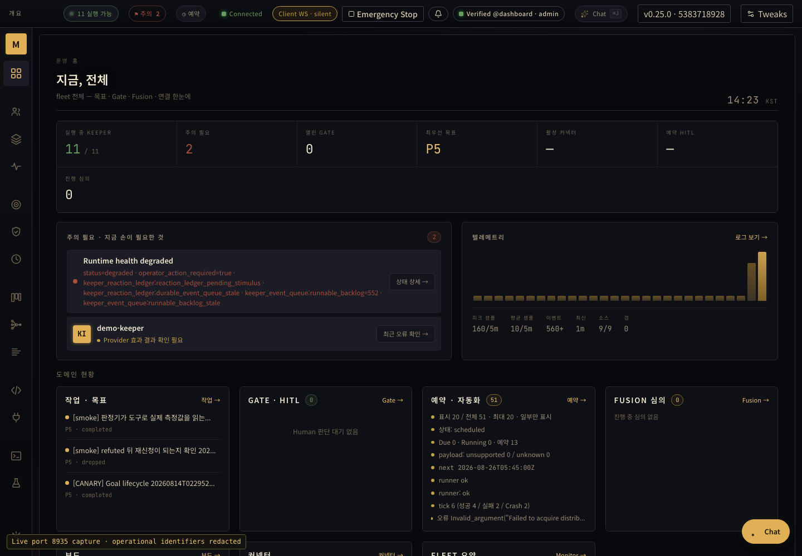
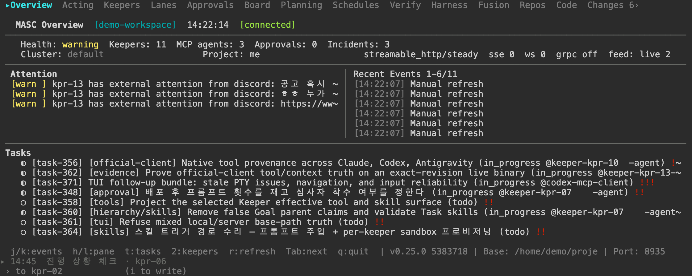

# MASC

[](https://ocaml.org/)
[](LICENSE)

[한국어](README.ko.md)

MASC (Multi-Agent Shared Context) is a workspace that several coding agents can
share. It runs on your own machine, holds the goals, tasks, ownership, board
posts, and execution evidence for one project in a `.masc/` directory, and
serves that state over MCP so any MCP client can join it.

The problem it addresses is that two agents in the same repository each keep
their own memory. They re-decide the same question, claim the same file, and
neither can see what the other already tried. MASC moves that state out of the
agents and into one place both of them read and write.

A **Keeper** is an optional long-running agent that MASC starts and supervises.
Keepers pick up tasks, run shell commands, edit files, and post what they did
back to the workspace. They are an advanced path; MASC works as a plain MCP
collaboration server without any of them.

> **Status:** MASC is a pre-1.0 project for local, trusted environments. It is
> not a production service or a security boundary. Gate, HITL, and Docker
> execution can constrain specific operations, but they do not protect an
> unattended agent from every unsafe action. `main` moves fast and can be well
> ahead of the latest published binary release.

## Three ways in

The same workspace answers on three surfaces. Pick the one that fits what you
are doing; they read and write the same `.masc/` state.

| Surface | Use it for | How you get it |
|---|---|---|
| **MCP** | Your own agent joins the workspace: claim a task, post to the board, record evidence | Any MCP client over `http://127.0.0.1:8935/mcp` |
| **Dashboard** | Reading the whole workspace in a browser and taking operator actions | Served at `/dashboard/` by the same process |
| **TUI** | Watching and steering Keepers from a terminal, including browsing code and diffs | `masc-tui`, installed beside `masc` or built from source |



This image was captured from a live local runtime with operational identifiers
redacted. The [dashboard inventory](docs/screenshots/dashboard/2026-08-26/README.md)
contains 24 screens and the exact capture metadata.

## Start here

### Local source checkout

Install the OCaml dependencies once, then run the workspace server. The default
quickstart does not start Keepers and does not require a model-provider key.

```bash
git clone https://github.com/jeong-sik/masc.git
cd masc

scripts/opam-pin-external-deps.sh --install
opam install . --deps-only
./quickstart.sh

BASE_PATH="${MASC_QUICKSTART_HOME:-$HOME/masc-quickstart}"
source "$BASE_PATH/.masc/config/mcp-client.env"
curl http://127.0.0.1:8935/health
```

Defaults:

- runtime state: `~/masc-quickstart/.masc`
- HTTP port: `8935`
- dashboard: `http://127.0.0.1:8935/dashboard/`
- MCP endpoint: `http://127.0.0.1:8935/mcp`
- Keeper preset: none
- runtime: the current `[runtime].default` in `config/runtime.toml`
- MCP bearer exports: `~/masc-quickstart/.masc/config/mcp-client.env`

Use `./quickstart.sh --help` for `--base-path`, `--team`, `--port`,
`--no-open`, and `--no-start`.

To start the `classic` Keeper preset, provide its model key on the first run:

```bash
export OLLAMA_CLOUD_API_KEY=...
./quickstart.sh --team classic
```

The exact compiler and Dune versions are defined in `dune-project`. The first
source run builds the OCaml server and dashboard and can take several minutes.

### Published binaries

Published releases can lag behind `main`. Choose a tag from
[GitHub Releases](https://github.com/jeong-sik/masc/releases), then use the
installer from that same tag. Keeping the script and assets on one tag avoids
mixing a newer installer contract with older release files.

```bash
TAG=vX.Y.Z
curl -fsSL "https://raw.githubusercontent.com/jeong-sik/masc/${TAG}/scripts/install.sh" \
  -o /tmp/masc-install.sh
less /tmp/masc-install.sh
bash /tmp/masc-install.sh --version "$TAG"
```

Installation behavior is versioned with the selected tag. Recent release
scripts verify `SHA256SUMS` when it is present and stop when required files are
absent. Supported platforms are the assets attached to that release. Follow
the login and start commands printed by the installer. The login command mints
a worker bearer for the MCP client; the endpoint does not accept an
unauthenticated client by default.

A release carries the server binary, the terminal UI, and the deployment
preflight helpers. The installer puts `masc-tui` next to `masc` and prints the
command that starts it.

## MCP client setup

HTTP is the public MCP path. First load the worker bearer created by
`quickstart.sh`:

```bash
BASE_PATH="${MASC_QUICKSTART_HOME:-$HOME/masc-quickstart}"
source "$BASE_PATH/.masc/config/mcp-client.env"
```

For clients that support a bearer-token environment variable, use this shape:

```toml
[mcp_servers.masc]
url = "http://127.0.0.1:8935/mcp"
bearer_token_env_var = "MASC_TOKEN"
http_headers = { "Accept" = "application/json, text/event-stream" }
```

After the client connects, the shortest workspace flow is:

```text
masc_start(path="/path/to/project", task_title="Describe the first task")
masc_status()
```

`masc_start` selects the project, joins the workspace, and optionally creates
and claims a task. Goals, tasks, board posts, and status changes are then shared
through the MASC tool set, grouped as workspace lifecycle, messaging, tasks,
goals, plans, schedules, Keeper control, and the board. `masc_tool_help`
describes any one of them from inside a client.

The set grows, so ask the server you are on rather than trusting a number
written here — `tools/list` over the same session answers it. A 2026-08-26
build answered with 43.

URL-only configuration fails with `401 Unauthorized` under the default local
auth policy. For other client formats, a direct initialize probe, and manual
bearer creation, see [`docs/MCP-TEMPLATE.md`](docs/MCP-TEMPLATE.md). Admin-only
dashboard operations are covered by
[`docs/LOCAL-DASHBOARD-AUTH-RUNBOOK.md`](docs/LOCAL-DASHBOARD-AUTH-RUNBOOK.md).

## Terminal UI

`masc-tui` is a terminal client for the same workspace. It reads `.masc/`
from disk directly, and adds the surfaces that only exist over HTTP when a
server answers on the configured port. A release install puts it on `PATH`;
from a source checkout it is one Dune target.

```bash
dune build --root . bin/masc_tui.exe
./_build/default/bin/masc_tui.exe --base-path /path/to/project
```

`.masc` must sit directly below the path you pass. `--base-path` falls back to
`MASC_BASE_PATH` and then the current directory. `dune install` or an opam
install puts the same program on `PATH` as `masc-tui`.



Keeper names and the base path in this frame were replaced with stand-ins of the
same width; the [surface inventory](docs/screenshots/tui/2026-08-26/surfaces/README.md)
holds four more and the capture metadata.

`Tab` rotates through 20 surfaces, and the active one is highlighted in a strip
on the top row:

| Surface | Shows |
|---|---|
| Overview | Workspace summary, the task backlog, and what needs attention |
| Acting | Every Keeper's tool calls, turn boundaries, and settlements as they land |
| Keepers | The roster, plus per-Keeper chat, logs, tool calls, runtime, and the names of the secrets it holds |
| Lanes, Runtime | Runtime lanes, their ordered candidates, and provider reachability |
| Approvals | The Gate queue, approved or denied from the terminal, and the questions Keepers are waiting on an answer to |
| Board | Posts from people, agents, automation, and the system |
| Planning, Schedules, Verify | Plans and goals, scheduled work, and verification verdicts |
| Repositories, Code, Changes | Registered repositories, a file browser over them, and recent Keeper edits |
| Harness, Fusion, Tools, Resources, Config, Connectors, Logs | Harness runs, panel and judge runs, the tool tree, MCP resources, `runtime.toml`, external channels, and the runtime log |

Above the input row, one line on every surface names the next scheduled wake
and whichever Keeper is stopped waiting on a person. It is absent when there is
neither.

Three things make it more than a viewer. The input row at the bottom sends a
message to the Keeper it names. `/task <title>` creates a task through
`masc_add_task` and hands the Keeper its id in the same breath. And a Keeper
that asked a question through `masc_ask` is answered from the terminal, which
is what the line above the composer is pointing at. On the Code surface,
`Enter` opens a file, `d` shows its working-tree diff against HEAD, `H` shows
the commits that touched it, and `m` shows the notes anchored to it.

The header says when the TUI and the server disagree about which workspace
they are on: `[workspace mismatch]` beside the connection badge, with both
paths in the footer. Reads that would mix the two are refused while it is up;
everything the server answers still draws.

Without a server the Keeper roster, per-Keeper detail, and the task backlog
still read from disk. Approvals, Board, Planning, Fusion, Runtime, the logs,
and messaging need the server, and say so rather than showing an empty list —
a count of `0` next to `data unreliable` means the read failed.

The TUI needs an interactive TTY and a terminal other than `dumb`. Full key
tables, per-surface behavior, and troubleshooting are in
[`docs/TUI-GUIDE.md`](docs/TUI-GUIDE.md).

## Current scope

| Area | Current use | Important limit |
|---|---|---|
| Workspace collaboration | Share Goals, Tasks, claims, transitions, board posts, and verification evidence through MCP | Coordination data does not provide transactional protection for concurrent source edits |
| Keepers | Run configured agents that react to workspace events and write execution records | Advanced path; behavior depends on the selected runtime and Keeper configuration |
| Dashboard | Read workspace and runtime state and perform operator actions | Availability and write access depend on the built SPA and auth mode |
| Terminal UI | Watch Keepers, answer the Gate queue, message a Keeper, and browse repository files and diffs | Needs an interactive TTY; the surface set changes often on `main` |
| Gate and HITL | Apply Always Allow, model judgment, or human approval to supported external effects | Authorization workflow, not a sandbox or credential boundary |
| Runtime routing | Assign a provider/model runtime to each Keeper and define ordered runtime lanes | A valid catalog and provider credentials are still required |
| Fusion | Run panel and judge workflows through `masc_fusion` | Presets and judge runtimes must be configured before use |
| Connectors | Connect workspace activity to supported external channels, including Discord and Slack | Tokens and channel-to-Keeper bindings are explicit operator configuration |
| Local or Docker execution | Select `local` or `docker` for Keeper shell work | `local` runs on the host; Docker profiles are not a complete security boundary |
| IDE | Inspect the experimental in-dashboard collaboration shell | Not the supported front door for normal work |

The product front door is repo workspace collaboration. Keeper supervision and
operator controls are secondary. Remote-safe operation, cluster deployment,
and production service guarantees are outside the current promise. See
[`docs/PRODUCT-OPERATING-PLAN.md`](docs/PRODUCT-OPERATING-PLAN.md).

## Configuration

MASC resolves runtime data below `<base-path>/.masc`. Authored configuration is
under `<base-path>/.masc/config` unless `MASC_CONFIG_DIR` explicitly selects a
different config root.

| Path | Purpose |
|---|---|
| `runtime.toml` | Provider/model catalog, required `[runtime].default`, runtime lanes, and Keeper assignments |
| `agent-core-models-overlay.toml` | Optional deployment-specific model capability rows; the embedded Agent Core catalog is used when the file is absent |
| `keepers/<name>.toml` | Everything one Keeper needs: operational settings and its prompt, in `keeper.instructions` |
| `repositories.toml` | Registered repository identity and checkout metadata for repository workflows |
| `keeper_repo_mappings.toml` | Keeper-to-repository preferences; these are defaults, not an authorization boundary |
| `.env.local` | Provider environment variables written by current installer and quickstart flows |

One directory below the same root is authored rather than generated:

| Path | Purpose |
|---|---|
| `<base-path>/.masc/skills/<name>/SKILL.md` | A capability a Keeper can be handed by name. `name` in the frontmatter has to equal the directory name, because a task names a skill by that directory |

A Keeper is one authored file, `<base-path>/.masc/config/keepers/reviewer.toml`:

```toml
[keeper]
autoboot_enabled = true
proactive_enabled = true
sandbox_profile = "local"
mention_targets = ["operator"]
allowed_paths = ["workspace/yousleepwhen/masc"]

instructions = """
You are the review Keeper. Inspect the current change and report concrete
evidence with file paths and commands.
"""
```

Unknown Keeper TOML keys are rejected.

Runtime assignment belongs in `runtime.toml`:

```toml
[runtime.assignments]
reviewer = "<provider>.<model>"
```

Use [`docs/KEEPER-FILE-MODEL.md`](docs/KEEPER-FILE-MODEL.md) for the complete
file contract, and [`docs/ENV-CONTRACT.md`](docs/ENV-CONTRACT.md) for the
environment variables the runtime reads. Use the `masc_config` tool or
`/api/v1/dashboard/config` to inspect the resolved configuration.

## Run modes

| Command | Use |
|---|---|
| `masc start --base-path <path>` | Start an installed binary; `masc` with no subcommand is equivalent |
| `./start-masc.sh --http --base-path <path>` | Start the full source-checkout runtime |
| `scripts/start-loopback.sh` | Start on `127.0.0.1:8935` with Keeper bootstrap disabled unless explicitly enabled |
| `scripts/run-local.sh --target-dir <path>` | Start an isolated development runtime with a path-derived port |

`masc` also carries `init`, `login`, `runtime-default-set`,
`runtime-wizard-catalog`, `schedule-prune`, and `keeper-github` for the setup
and identity steps those names describe.

Always inspect the effective runtime root before editing state:

```bash
curl -fsS 'http://127.0.0.1:8935/health?full=1' \
  | jq '.paths | {effective_base_path, effective_masc_root, roots_diverge}'
```

Runtime-owned files outside `.masc/config/` are not configuration inputs. Do
not edit Keeper snapshots, task stores, board logs, receipts, or approval
history by hand.

## Dashboard

The server exposes the dashboard at `/dashboard/`. Navigation is defined in
`dashboard/src/config/navigation.ts`.

Primary sidebar screens:

| Screen | Purpose |
|---|---|
| Overview | Workspace and runtime summary |
| Keepers | Keeper roster, conversation, and context |
| Registry | Keeper declarations and runtime bindings |
| Monitor | Fleet, tool, runtime, and observation views |
| Work | Goals, plans, repositories, and verification |
| Gate | Human approval queue and Always rules |
| Schedule | Scheduled work and wake signals |
| Board | Human, agent, automation, and system posts |
| Fusion | Panel and judge runs |
| Logs | Runtime event log |
| IDE | Experimental collaboration shell |
| Connectors | External channel status and bindings |
| Settings | Operator configuration views |

Visible second-level sections:

| Screen | Sections |
|---|---|
| Monitor | `agents`, `internal-agents`, `fleet-health`, `runtime`, `observatory`, `skills` |
| Work | `work`, `planning`, `repositories`, `verification` |
| Connectors | `connector-status` |
| IDE | `ide-shell` |
| Lab | `tools`, `harness`, `performance`, `keeper-memory-health` |

`Lab` and `Command` are addressable but are not pinned to the primary sidebar.
Hidden diagnostics are not part of the visible navigation contract.

Route examples required by the current dashboard contract:
`dashboard#monitoring?section=journey`,
`dashboard#command?section=operations`,
`dashboard#connectors?section=connector-status`, and
`dashboard#workspace?section=verification`. `journey` is a hidden diagnostic.

See the [24-screen inventory](docs/screenshots/dashboard/2026-08-26/README.md)
for the captured primary, Monitor, Work, and Lab views.

## Repository layout

```text
masc/
├── bin/          server, CLI, and terminal UI entry points
├── lib/          workspace, Keeper, runtime, Gate, and server code
├── packages/     embedded Agent Core package
├── dashboard/    TypeScript and Preact dashboard source
├── assets/       built web assets
├── config/       default configuration seeds
├── docs/         runbooks, contracts, specs, and historical RFCs
├── scripts/      build, install, validation, and local operations
└── test/         OCaml tests and fixtures
```

## Documentation

| Document | Use |
|---|---|
| [`docs/MCP-TEMPLATE.md`](docs/MCP-TEMPLATE.md) | MCP client configuration |
| [`docs/TUI-GUIDE.md`](docs/TUI-GUIDE.md) | Terminal UI surfaces, keys, and troubleshooting |
| [`docs/KEEPER-USER-MANUAL.md`](docs/KEEPER-USER-MANUAL.md) | Configuring, starting, and watching Keepers |
| [`docs/KEEPER-IDENTITY-MANUAL.md`](docs/KEEPER-IDENTITY-MANUAL.md) | Attaching Jira, Notion, Google and 51 other services to a Keeper |
| [`docs/KEEPER-FILE-MODEL.md`](docs/KEEPER-FILE-MODEL.md) | Current Keeper file and runtime assignment contract |
| [`docs/SKILLS.md`](docs/SKILLS.md) | Declaring a capability in `SKILL.md` and handing it to a Keeper |
| [`docs/ENV-CONTRACT.md`](docs/ENV-CONTRACT.md) | Environment variables the runtime reads |
| [`docs/LOCAL-DASHBOARD-AUTH-RUNBOOK.md`](docs/LOCAL-DASHBOARD-AUTH-RUNBOOK.md) | Local bearer and dashboard write access |
| [`docs/AGENT-CORE-BOUNDARY.md`](docs/AGENT-CORE-BOUNDARY.md) | Responsibility split between MASC and embedded Agent Core |
| [`docs/spec/SPEC-INDEX.md`](docs/spec/SPEC-INDEX.md) | Specification index; inventory counts inside it are historical unless marked current |
| [`docs/RELEASE-EVIDENCE.md`](docs/RELEASE-EVIDENCE.md) | Release evidence format; verify its version header before reuse |
| [`CONTRIBUTING.md`](CONTRIBUTING.md) | Build, test, and pull-request workflow |
| [`ROADMAP.md`](ROADMAP.md) | Current planning view, not a release promise |

## Development and release status

- The package version is defined in `dune-project` and generated into
  `masc.opam`.
- `CHANGELOG.md` records the source release line.
- [GitHub Releases](https://github.com/jeong-sik/masc/releases) is the source of
  truth for published binaries and their assets.
- APIs and configuration may change before 1.0.

## License

MIT. See [`LICENSE`](LICENSE).
