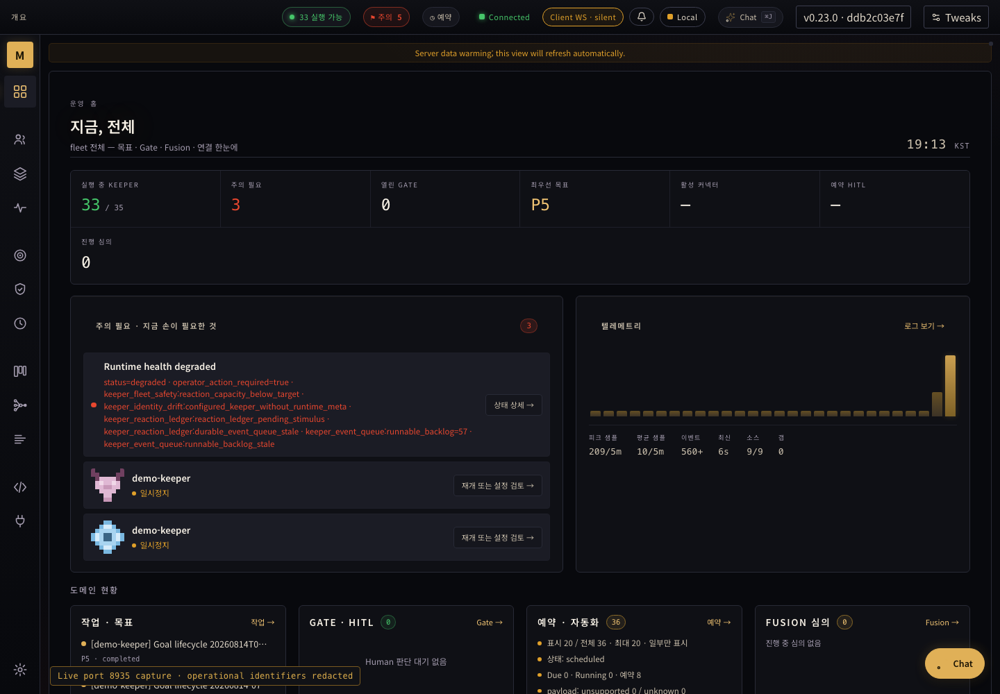

# MASC

[](https://ocaml.org/)
[](LICENSE)

[한국어](README.ko.md)

MASC (Multi-Agent Shared Context) is a repo-local MCP server for agents that
work in the same project. It keeps goals, tasks, ownership, board messages, and
execution evidence in one workspace and exposes that state through MCP and a
web dashboard.

A **Keeper** is an optional long-running agent managed by MASC. Keepers add
autonomous and event-driven work to the shared workspace. They are an advanced
path, not a requirement for using MASC as an MCP collaboration server.

> **Status:** MASC is a pre-1.0 project for local, trusted environments. It is
> not a production service or a security boundary. Gate, HITL, and Docker
> execution can constrain specific operations, but they do not protect an
> unattended agent from every unsafe action. The IDE and TUI are experimental.
> `main` can be ahead of the latest published binary release.



This image was captured from a live local runtime with operational identifiers
redacted. The [dashboard inventory](docs/screenshots/dashboard/2026-08-21/README.md)
contains 24 screens and the exact capture metadata.

## Start here

### Local source checkout

The native launcher uses the default runtime in `config/runtime.toml`, seeds the
`classic` four-Keeper preset, starts the server, and opens the dashboard.
It expects the OCaml dependencies to be installed already.

```bash
git clone https://github.com/jeong-sik/masc.git
cd masc

export OLLAMA_CLOUD_API_KEY=...
./quickstart.sh
```

Defaults:

- runtime state: `~/masc-quickstart/.masc`
- HTTP port: `8935`
- dashboard: `http://127.0.0.1:8935/dashboard/`
- MCP endpoint: `http://127.0.0.1:8935/mcp`
- Keeper preset: `classic`
- runtime: the current `[runtime].default` in `config/runtime.toml`

Use `./quickstart.sh --help` for `--base-path`, `--team`, `--port`,
`--no-open`, and `--no-start`.

`./quickstart.sh --docker` builds a self-contained image. The container binds a
network address, so dashboard data requires an explicit bearer token. The
loopback native path is the simpler dashboard path.

### Build from source manually

The exact compiler and Dune versions are defined in `dune-project`.

```bash
scripts/opam-pin-external-deps.sh --install
opam install . --deps-only
scripts/dune-local.sh build @default

export OLLAMA_CLOUD_API_KEY=...
./start-masc.sh --http --base-path "$PWD" --port 8935
curl http://127.0.0.1:8935/health
```

`start-masc.sh` builds the dashboard when its source is newer than the checked-in
bundle. Use `cd dashboard && pnpm dev` only when developing the dashboard with
Vite.

### Published binaries

Published releases can lag behind `main`. Choose a tag from
[GitHub Releases](https://github.com/jeong-sik/masc/releases), then use the
installer from that same tag. Keeping the script and assets on one tag avoids
mixing a newer installer contract with older release files.

```bash
TAG=vX.Y.Z
curl -fsSL "https://raw.githubusercontent.com/jeong-sik/masc/${TAG}/scripts/install.sh" \
  -o /tmp/masc-install.sh
less /tmp/masc-install.sh
bash /tmp/masc-install.sh --version "$TAG"
```

Installation behavior is versioned with the selected tag. Recent release
scripts verify `SHA256SUMS` when it is present and stop when required files are
absent. Supported platforms are the assets attached to that release. Follow
the start command printed by the installer.

## MCP client setup

HTTP is the public MCP path. Merge this entry into the MCP configuration used
by your client:

```json
{
  "mcpServers": {
    "masc": {
      "type": "http",
      "url": "http://127.0.0.1:8935/mcp"
    }
  }
}
```

After the client connects, the shortest workspace flow is:

```text
masc_start(path="/path/to/project", task_title="Describe the first task")
masc_status()
```

`masc_start` selects the project, joins the workspace, and optionally creates
and claims a task. Goals, tasks, board posts, and status changes are then shared
through the MASC tool set.

Loopback development can run without a client bearer depending on the active
auth configuration. Non-loopback binds and stricter local setups require an
explicit token. See [`docs/MCP-TEMPLATE.md`](docs/MCP-TEMPLATE.md) and
[`docs/LOCAL-DASHBOARD-AUTH-RUNBOOK.md`](docs/LOCAL-DASHBOARD-AUTH-RUNBOOK.md).

## Current scope

| Area | Current use | Important limit |
|---|---|---|
| Workspace collaboration | Share Goals, Tasks, claims, transitions, board posts, and verification evidence through MCP | Coordination data does not provide transactional protection for concurrent source edits |
| Keepers | Run configured agents that react to workspace events and write execution records | Advanced path; behavior depends on the selected runtime and Keeper configuration |
| Dashboard | Read workspace and runtime state and perform operator actions | Availability and write access depend on the built SPA and auth mode |
| Gate and HITL | Apply Always Allow, model judgment, or human approval to supported external effects | Authorization workflow, not a sandbox or credential boundary |
| Runtime routing | Assign a provider/model runtime to each Keeper and define ordered runtime lanes | A valid catalog and provider credentials are still required |
| Fusion | Run panel and judge workflows through `masc_fusion` | Presets and judge runtimes must be configured before use |
| Connectors | Connect workspace activity to supported external channels, including Discord and Slack | Tokens and channel-to-Keeper bindings are explicit operator configuration |
| Local or Docker execution | Select `local` or `docker` for Keeper shell work | `local` runs on the host; Docker profiles are not a complete security boundary |
| IDE and TUI | Inspect experimental interfaces | Not the supported front door for normal work |

The product front door is repo workspace collaboration. Keeper supervision and
operator controls are secondary. Remote-safe operation, cluster deployment,
and production service guarantees are outside the current promise. See
[`docs/PRODUCT-OPERATING-PLAN.md`](docs/PRODUCT-OPERATING-PLAN.md).

## Configuration

MASC resolves runtime data below `<base-path>/.masc`. Authored configuration is
under `<base-path>/.masc/config` unless `MASC_CONFIG_DIR` explicitly selects a
different config root.

| Path | Purpose |
|---|---|
| `runtime.toml` | Provider/model catalog, required `[runtime].default`, runtime lanes, and Keeper assignments |
| `agent-core-models-overlay.toml` | Optional deployment-specific model capability rows; the embedded Agent Core catalog is used when the file is absent |
| `keepers/<name>.toml` | Operational Keeper settings |
| `keepers/<name>/AGENT.md` | Complete Keeper prompt; required for every TOML-backed Keeper |
| `repositories.toml` | Registered repository identity and checkout metadata for repository workflows |
| `keeper_repo_mappings.toml` | Keeper-to-repository preferences; these are defaults, not an authorization boundary |
| `.env.local` | Provider environment variables written by current installer and quickstart flows |

A Keeper uses two authored files:

```text
<base-path>/.masc/config/keepers/reviewer.toml
<base-path>/.masc/config/keepers/reviewer/AGENT.md
```

```toml
# keepers/reviewer.toml
[keeper]
autoboot_enabled = true
proactive_enabled = true
sandbox_profile = "local"
mention_targets = ["operator"]
allowed_paths = ["workspace/yousleepwhen/masc"]
```

```markdown
<!-- keepers/reviewer/AGENT.md -->
You are the review Keeper. Inspect the current change and report concrete
evidence with file paths and commands.
```

Keeper TOML contains operational settings only. Prompt text belongs in
`AGENT.md`. Unknown Keeper TOML keys are rejected.

Runtime assignment belongs in `runtime.toml`:

```toml
[runtime.assignments]
reviewer = "<provider>.<model>"
```

Use [`docs/KEEPER-FILE-MODEL.md`](docs/KEEPER-FILE-MODEL.md) for the complete
file contract. Use the `masc_config` tool or `/api/v1/dashboard/config` to
inspect the resolved configuration.

## Run modes

| Command | Use |
|---|---|
| `masc start --base-path <path>` | Start an installed binary; `masc` with no subcommand is equivalent |
| `./start-masc.sh --http --base-path <path>` | Start the full source-checkout runtime |
| `scripts/start-loopback.sh` | Start on `127.0.0.1:8935` with Keeper bootstrap disabled unless explicitly enabled |
| `scripts/run-local.sh --target-dir <path>` | Start an isolated development runtime with a path-derived port |

Always inspect the effective runtime root before editing state:

```bash
curl -fsS 'http://127.0.0.1:8935/health?full=1' \
  | jq '.paths | {effective_base_path, effective_masc_root, roots_diverge}'
```

Runtime-owned files outside `.masc/config/` are not configuration inputs. Do
not edit Keeper snapshots, task stores, board logs, receipts, or approval
history by hand.

## Dashboard

The server exposes the dashboard at `/dashboard/`. Navigation is defined in
`dashboard/src/config/navigation.ts`.

Primary sidebar screens:

| Screen | Purpose |
|---|---|
| Overview | Workspace and runtime summary |
| Keepers | Keeper roster, conversation, and context |
| Registry | Keeper declarations and runtime bindings |
| Monitor | Fleet, tool, runtime, and observation views |
| Work | Goals, plans, repositories, and verification |
| Gate | Human approval queue and Always rules |
| Schedule | Scheduled work and wake signals |
| Board | Human, agent, automation, and system posts |
| Fusion | Panel and judge runs |
| Logs | Runtime event log |
| IDE | Experimental collaboration shell |
| Connectors | External channel status and bindings |
| Settings | Operator configuration views |

Visible second-level sections:

| Screen | Sections |
|---|---|
| Monitor | `agents`, `internal-agents`, `fleet-health`, `runtime`, `observatory` |
| Work | `work`, `planning`, `repositories`, `verification` |
| Connectors | `connector-status` |
| IDE | `ide-shell` |
| Lab | `tools`, `harness`, `performance`, `keeper-memory-health` |

`Lab` and `Command` are addressable but are not pinned to the primary sidebar.
Hidden diagnostics are not part of the visible navigation contract.

Route examples required by the current dashboard contract:
`dashboard#monitoring?section=journey`,
`dashboard#command?section=operations`,
`dashboard#connectors?section=connector-status`, and
`dashboard#workspace?section=verification`. `journey` is a hidden diagnostic.

See the [24-screen inventory](docs/screenshots/dashboard/2026-08-21/README.md)
for the captured primary, Monitor, Work, and Lab views.

## Repository layout

```text
masc/
├── bin/          server and CLI entry points
├── lib/          workspace, Keeper, runtime, Gate, and server code
├── packages/     embedded Agent Core package
├── dashboard/    TypeScript and Preact dashboard source
├── assets/       built web assets
├── config/       default configuration seeds
├── docs/         runbooks, contracts, specs, and historical RFCs
├── scripts/      build, install, validation, and local operations
└── test/         OCaml tests and fixtures
```

## Documentation

| Document | Use |
|---|---|
| [`docs/MCP-TEMPLATE.md`](docs/MCP-TEMPLATE.md) | MCP client configuration |
| [`docs/KEEPER-FILE-MODEL.md`](docs/KEEPER-FILE-MODEL.md) | Current Keeper file and runtime assignment contract |
| [`docs/LOCAL-DASHBOARD-AUTH-RUNBOOK.md`](docs/LOCAL-DASHBOARD-AUTH-RUNBOOK.md) | Local bearer and dashboard write access |
| [`docs/AGENT-CORE-BOUNDARY.md`](docs/AGENT-CORE-BOUNDARY.md) | Responsibility split between MASC and embedded Agent Core |
| [`docs/spec/SPEC-INDEX.md`](docs/spec/SPEC-INDEX.md) | Specification index; inventory counts inside it are historical unless marked current |
| [`docs/RELEASE-EVIDENCE.md`](docs/RELEASE-EVIDENCE.md) | Release evidence format; verify its version header before reuse |
| [`CONTRIBUTING.md`](CONTRIBUTING.md) | Build, test, and pull-request workflow |
| [`ROADMAP.md`](ROADMAP.md) | Current planning view, not a release promise |

## Development and release status

- The package version is defined in `dune-project` and generated into
  `masc.opam`.
- `CHANGELOG.md` records the source release line.
- [GitHub Releases](https://github.com/jeong-sik/masc/releases) is the source of
  truth for published binaries and their assets.
- APIs and configuration may change before 1.0.

## License

MIT. See [`LICENSE`](LICENSE).
