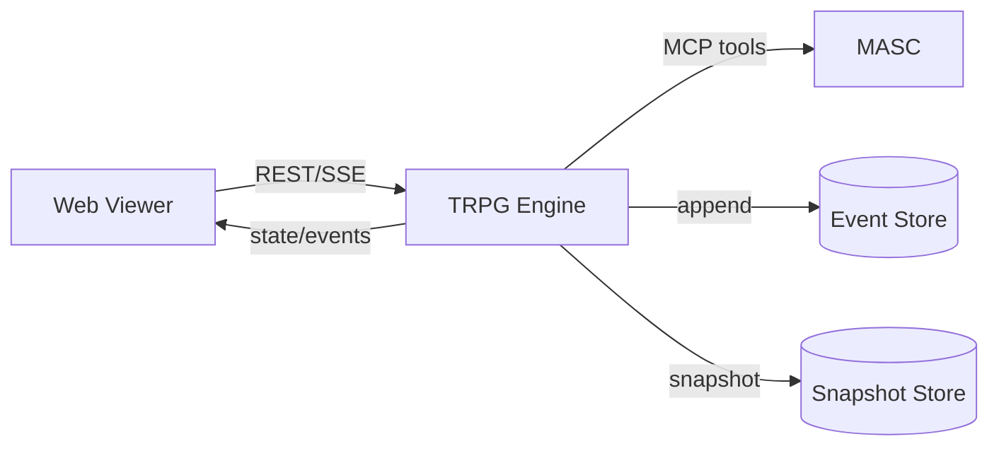
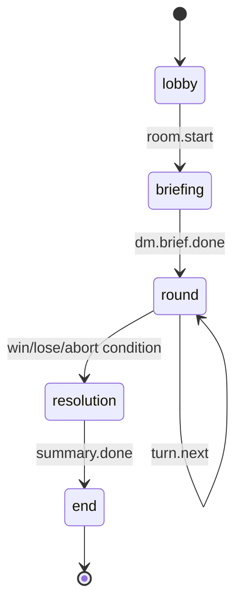

# TRPG MVP Blueprint (MASC + Engine + Viewer)

Status: draft for implementation kickoff  
Updated: 2026-02-15

## 1. Scope

### 1.1 MVP Goal

- `MASC`는 범용 에이전트 실행 엔진으로 유지한다.
- `TRPG Engine`은 게임 상태머신/판정/실험 메트릭 계산을 담당한다.
- `Web Viewer`는 시각화와 조작만 담당한다.
- DM 제어 모드를 `keeper` 또는 `human`으로 선택 가능해야 한다.

### 1.2 Non-Goals (MVP 제외)

- 복잡한 DnD급 룰셋
- 실시간 액션 게임
- 멀티 클러스터 분산 오케스트레이션

## 2. Architecture



### Boundary Rules

- `Viewer -> Engine`: 허용
- `Engine -> MASC`: 허용
- `Viewer -> MASC`: 금지(운영 디버그 용도만 예외)

## 3. Runtime State Machine



### Phases

- `lobby`: 참가자 정합성 확인 (DM/Player keeper 연결)
- `briefing`: DM 오프닝/세계관 브리핑
- `round`: 턴 반복(행동 제안 -> 판정 -> 적용)
- `resolution`: 결과 산출(성공/실패/협상결렬/실험종료)
- `end`: 요약 및 아카이브

## 4. Engine Contract

## 4.1 REST API (MVP)

| Method | Path | Purpose |
|---|---|---|
| `POST` | `/rooms` | 룸 생성 |
| `POST` | `/rooms/{room_id}/start` | 게임 시작 |
| `POST` | `/rooms/{room_id}/input` | 외부 입력 주입(인간/운영자) |
| `POST` | `/rooms/{room_id}/dm/input` | 인간 DM 발화/판정 주입 |
| `GET` | `/rooms/{room_id}/state` | 현재 상태 조회 |
| `GET` | `/rooms/{room_id}/events?after_seq=N` | 이벤트 증분 조회 |
| `GET` | `/rooms/{room_id}/stream` | SSE 실시간 스트림 |

### 4.2 Event Envelope (SSOT)

```json
{
  "seq": 42,
  "room_id": "room-trpg-001",
  "ts": "2026-02-15T09:30:00Z",
  "type": "turn.action.resolved",
  "actor_id": "player-2",
  "generation": 1,
  "payload": {
    "action": "persuade",
    "target": "faction-b",
    "roll": 17,
    "dc": 14,
    "result": "success",
    "effects": [
      { "field": "trust.faction-b", "delta": 0.12 }
    ]
  }
}
```

### 4.3 Minimum Event Types

- `room.created`
- `room.started`
- `phase.changed`
- `turn.started`
- `turn.action.proposed`
- `turn.action.resolved`
- `turn.timeout`
- `keeper.unavailable`
- `metric.updated`
- `room.ended`

## 5. MASC Adapter Contract

Engine는 아래 MCP 도구를 최소 사용한다.

- `masc_keeper_status` (liveness, model, runtime 메타)
- `masc_keeper_msg` (턴 입력 전달, 응답 수집)
- `masc_post_create` (선택: 보드 내러티브 동기화)

입력/출력 표준화:

- Engine -> Keeper 입력은 `room_id`, `phase`, `turn_id`, `visible_state`, `task` 포함
- Keeper -> Engine 출력은 `intent`, `content`, `structured_action`(optional) 포함
- structured_action 파싱 실패 시 `content` 기반 fallback 판정

DM이 `human`일 때:

- Engine은 `masc_keeper_msg(dm)`를 호출하지 않는다.
- 대신 `/rooms/{room_id}/dm/input`으로 DM 행동/판정을 받는다.
- DM 입력 미도착 timeout 시 `turn.timeout` 이벤트를 남기고 대기/스킵 정책 적용.

## 6. Recovery and Reliability

- Event append 실패 시 턴 확정 금지
- `N=100` 이벤트마다 스냅샷 저장
- 재시작 시 `snapshot(last_seq)` + `events(after last_seq)`로 복구
- keeper timeout 시 정책:
- 1차 재시도
- 2차 대체 행동(`wait`/`fallback action`)
- 3차 `keeper.unavailable` 이벤트 기록 후 다음 턴 진행

## 7. Viewer Contract (Graphical)

Viewer는 아래 데이터만으로 렌더링 가능해야 한다.

- `state.phase`, `state.turn`, `state.round`
- 최근 이벤트 스트림
- 참가자 stat(HP, trust, resource, relation)
- 실험 메트릭 시계열

MVP 패널:

- Timeline (event seq 기반)
- Turn HUD (현재 턴/남은 시간)
- Party/Actor Cards
- Metrics Charts
- Relationship Graph (node=actor, edge=trust/hostility)
- DM Console (human DM 모드에서 입력/판정 전용)

## 8. Implementation Checklist

1. `TRPG Engine` 저장소/모듈 골격 생성
2. Event Store + Snapshot Store 구현
3. 룸 상태머신 구현
4. MASC adapter 구현
5. REST + SSE 제공
6. Viewer 연결
7. 복구/장애 테스트 하네스

## 9. Done Criteria

- 100턴 연속 실행에서 이벤트 seq 역전/누락 없음
- 프로세스 재시작 후 동일 room 상태 재구성 성공
- keeper 1개 실패 시 게임 계속 진행
- Viewer에서 phase/turn/metrics/graph 실시간 갱신 확인
