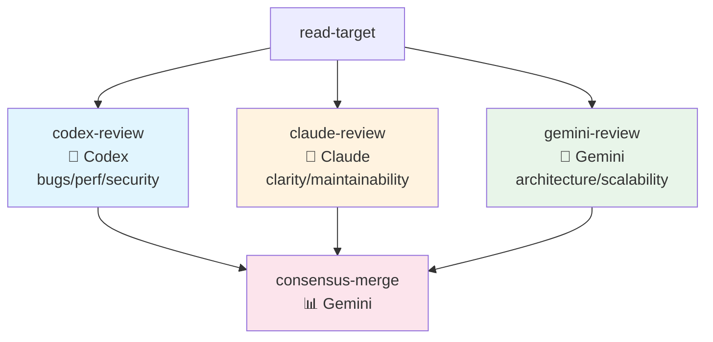
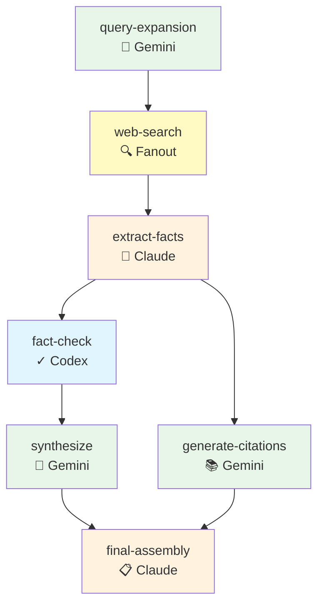
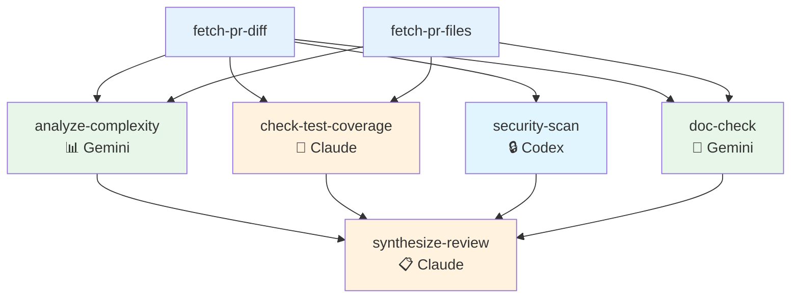
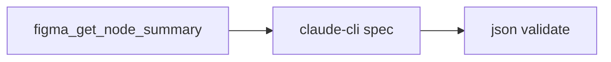
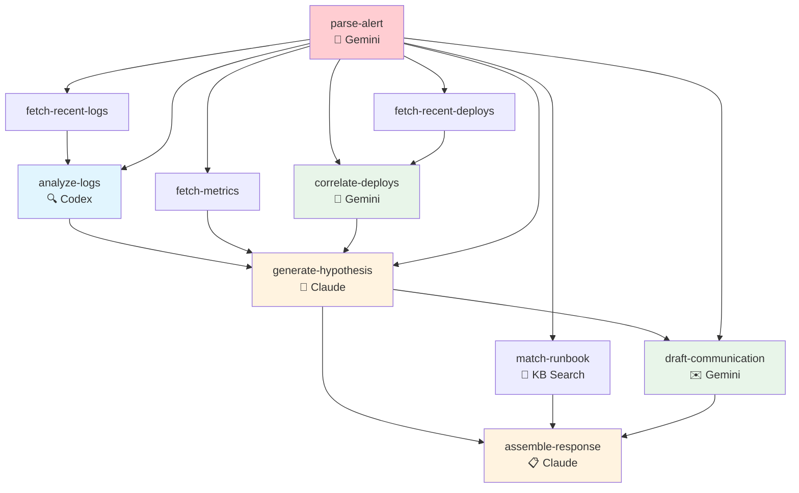
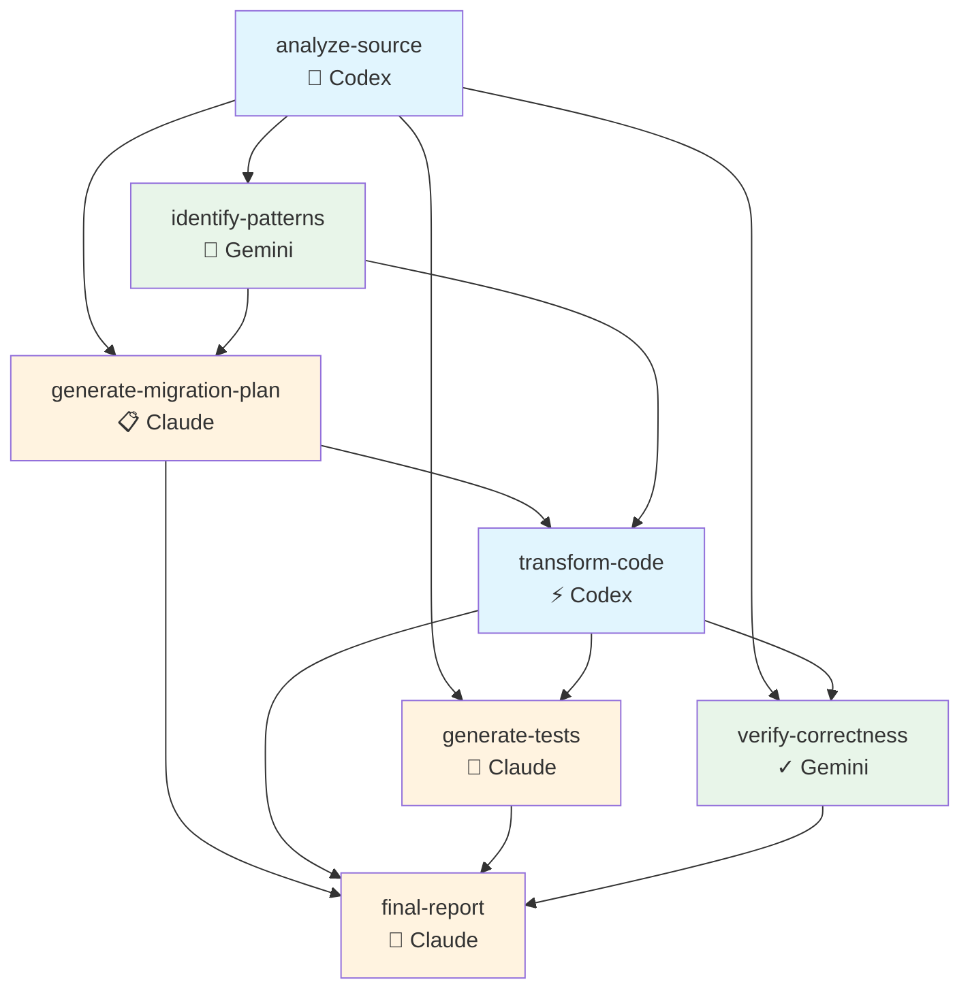
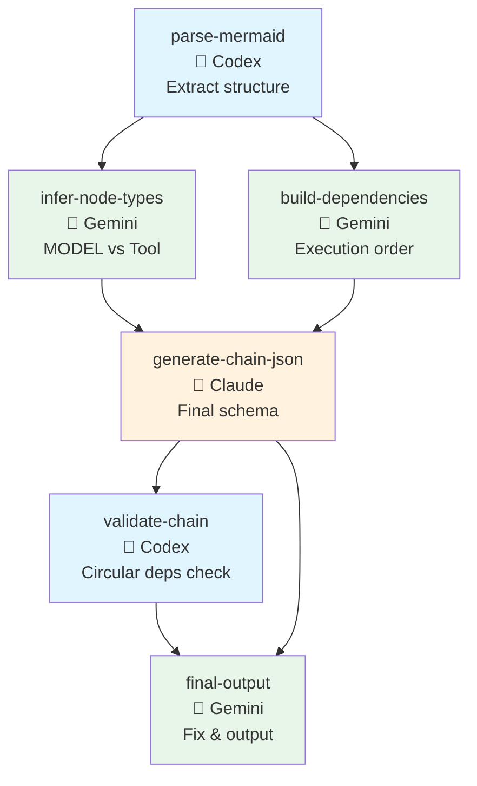

# Chain Examples

Real-world chain examples demonstrating the Chain Engine's DAG execution capabilities.

## Available Chains

| Chain | Description | Est. Time | Est. Cost |
|-------|-------------|-----------|-----------|
| [consensus-review](#consensus-review) | 3-MODEL consensus code review | 120s | $0.15 |
| [deep-research](#deep-research) | Multi-source research with fact-checking | 180s | $0.25 |
| [pr-review-pipeline](#pr-review-pipeline) | Automated PR review | 90s | $0.12 |
| [incident-response](#incident-response) | Automated incident triage | 120s | $0.18 |
| [code-migration](#code-migration) | Code transformation with verification | 180s | $0.25 |
| [mermaid-to-chain](#mermaid-to-chain) | Convert Mermaid diagrams to Chain JSON | 60s | $0.10 |
| [figma-to-component-spec](#figma-to-component-spec) | Figma summary → component spec JSON | 30s | $0.02 |

---

## Consensus Review

3-MODEL consensus code review using Codex, Claude, and Gemini.



**Usage:**
```bash
chain.orchestrate consensus-review file_path=src/main.ts
```

---

## Deep Research

Multi-source research pipeline with fact-checking and synthesis.



**Usage:**
```bash
chain.orchestrate deep-research query="What are the latest advances in AI agents?"
```

---

## PR Review Pipeline

Automated PR review: diff analysis, test coverage, security scan, documentation check.



**Usage:**
```bash
chain.orchestrate pr-review-pipeline repo=owner/repo pr_number=123
```

---

## Figma → Component Spec (JSON)

Figma summary를 기반으로 컴포넌트 스펙(JSON)을 생성합니다. 실패 시 fallback JSON을 반환합니다.



**Usage:**
```bash
chain.run figma-to-component-spec url="https://www.figma.com/design/...?...node-id=2089-10737"
```

## Incident Response

Automated incident triage: log analysis, root cause hypothesis, runbook matching.



**Usage:**
```bash
chain.orchestrate incident-response alert_text="[P1] API latency spike on payment-service..."
```

---

## Code Migration

Automated code migration: analyze, transform, verify equivalence.



**Usage:**
```bash
chain.orchestrate code-migration source_code="..." source_lang=Python target_lang=TypeScript
```

---

## Mermaid to Chain

Convert Mermaid graph diagrams to executable Chain JSON definitions. **Visual Programming for Multi-MODEL workflows!**



**Usage:**
```bash
chain.orchestrate mermaid-to-chain mermaid="graph TD
    A[fetch-data] --> B[analyze<br/>🔬 Codex]
    A --> C[summarize<br/>👩 Claude]
    B --> D[merge]
    C --> D"
```

**Input**: Any Mermaid `graph TD` or `graph LR` diagram with node hints (🔬=Codex, 👩=Claude, 🎯=Gemini, 🔍=Tool).

**Output**: Valid Chain JSON ready for execution.

---

## Architecture Patterns

### 1. **Parallel Analysis (Fan-out/Fan-in)**
Multiple models analyze the same input in parallel, then merge results.
```
Input → [MODEL-A, MODEL-B, MODEL-C] → Merge → Output
```

### 2. **Sequential Pipeline**
Each stage builds on the previous one.
```
Input → Stage1 → Stage2 → Stage3 → Output
```

### 3. **Tool-MODEL Interleaving**
Alternate between tool calls (data fetching) and MODEL analysis.
```
Tool → MODEL → Tool → MODEL → Output
```

### 4. **Consensus Pattern**
Multiple models provide independent reviews, then a coordinator synthesizes.
```
        ┌─ MODEL-A ─┐
Input ──┼─ MODEL-B ─┼── Coordinator ── Output
        └─ MODEL-C ─┘
```

---

## Running Chains

### Via MCP Tool
```json
{
  "tool": "chain.orchestrate",
  "args": {
    "chain_id": "consensus-review",
    "input": {
      "file_path": "src/main.ts"
    }
  }
}
```

### Via OCaml API
```ocaml
let open Chain_engine in
let chain = load_chain "consensus-review" in
let input = `Assoc [("file_path", `String "src/main.ts")] in
let result = execute ~sw ~clock ~env chain input in
print_endline (Yojson.Safe.pretty_to_string result)
```

---

## Category Theory Integration

These chains leverage the Chain Engine's Category Theory abstractions:

- **Functor**: Map transformations across node outputs
- **Monad**: Sequential composition with dependency injection
- **Monoid**: Aggregate token usage and stats across parallel branches

See `lib/chain_category.ml` for implementation details.
