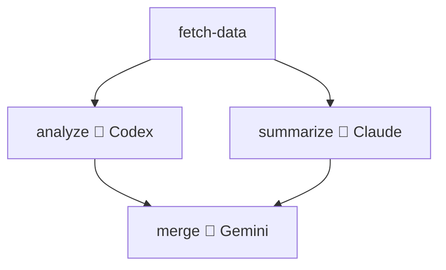

# Chain JSON Specification v1.0

**Multi-MODEL DAG Workflow Definition Protocol**

## Overview

Chain JSON is a declarative format for defining multi-MODEL orchestration workflows as Directed Acyclic Graphs (DAGs). It enables:

- **Visual Programming**: Convert from Mermaid diagrams
- **Multi-MODEL**: Mix Codex, Claude, Gemini in one workflow
- **Tool Integration**: Seamlessly call MCP tools between MODEL nodes
- **Parallel Execution**: Automatic parallelization of independent nodes
- **Type Safety**: JSON Schema validation for inputs/outputs

## Design Principles

1. **Declarative over Imperative** - Define *what*, not *how*
2. **Language Agnostic** - Execute in OCaml, Python, TypeScript, etc.
3. **MODEL Agnostic** - Swap models without changing workflow logic
4. **Category Theory Foundation** - Composable via Functor, Monad, Monoid

## Schema

```
Chain
├── id: string (kebab-case)
├── name: string
├── description?: string
├── version: semver (default: "1.0.0")
├── nodes: Node[]
├── input_schema?: JSONSchema
├── output_schema?: JSONSchema
└── metadata?: Metadata

Node
├── id: string (kebab-case)
├── type: "model" | "tool"
├── model?: ModelConfig
├── tool?: ToolConfig
├── depends_on?: string[] (node IDs)
├── output_key?: string
├── condition?: string (expression)
├── retry?: RetryConfig
└── timeout_ms?: number

ModelConfig
├── model: "codex" | "claude-cli" | "gemini" | "default"
├── prompt: string (with {{variable}} placeholders)
├── system_prompt?: string
├── temperature?: number (0-2)
└── max_tokens?: number

ToolConfig
├── server: string (MCP server name)
├── name: string (tool name)
└── args?: object (with {{variable}} placeholders)
```

## Variable Interpolation

Use `{{variable}}` syntax to reference:

| Pattern | Description |
|---------|-------------|
| `{{input.field}}` | Chain input field |
| `{{node_output_key}}` | Output from dependency node |
| `{{node_id.field}}` | Specific field from node output |

## Execution Model

```
1. Parse Chain JSON
2. Build DAG from depends_on edges
3. Topological sort → execution order
4. Execute nodes (parallel where possible)
5. Aggregate results
```

### Parallel Execution

Nodes without dependencies on each other run in parallel:

```
A ──┬── B ──┬── D
    └── C ──┘
```

Here, B and C run in parallel after A completes.

## Patterns

### 1. Fan-out/Fan-in (Consensus)
```json
{
  "nodes": [
    {"id": "input", "type": "tool", ...},
    {"id": "model-a", "type": "model", "depends_on": ["input"], ...},
    {"id": "model-b", "type": "model", "depends_on": ["input"], ...},
    {"id": "merge", "type": "model", "depends_on": ["model-a", "model-b"], ...}
  ]
}
```

### 2. Sequential Pipeline
```json
{
  "nodes": [
    {"id": "step-1", "type": "model", ...},
    {"id": "step-2", "type": "model", "depends_on": ["step-1"], ...},
    {"id": "step-3", "type": "model", "depends_on": ["step-2"], ...}
  ]
}
```

### 3. Tool-MODEL Interleaving
```json
{
  "nodes": [
    {"id": "fetch", "type": "tool", ...},
    {"id": "analyze", "type": "model", "depends_on": ["fetch"], ...},
    {"id": "store", "type": "tool", "depends_on": ["analyze"], ...}
  ]
}
```

## Mermaid Conversion

Chain JSON can be generated from Mermaid diagrams:



Emoji hints:
- 🔬 → `codex`
- 👩 → `claude-cli`
- 🎯 → `gemini`
- 🔍 → `tool`

## Category Theory Integration

Chain JSON execution leverages:

- **Functor**: `map` transformations across outputs
- **Monad**: Sequential composition with dependency injection
- **Monoid**: Aggregate stats (tokens, cost) across parallel branches

See `lib/chain_category.ml` for implementation.

## Validation

Validate chains using the JSON Schema:

```bash
# Using ajv-cli
ajv validate -s schema/chain-v1.schema.json -d my-chain.json

# Using OCaml
dune exec -- masc-mcp chain.validate my-chain.json
```

## Versioning

Chain JSON follows semantic versioning:
- **MAJOR**: Breaking schema changes
- **MINOR**: New optional fields
- **PATCH**: Documentation/examples

Current version: **1.0.0**

## License

MIT License - Use freely, attribution appreciated.

---

*Part of the MASC chain plane*
