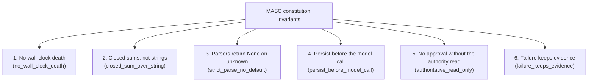

The MASC runtime and every agent under it follow the constitution defined in `docs/constitution.xml`. This page summarizes that file; the XML is the source of truth.

---

## Six domain-wide invariants

1. **`no_wall_clock_death`** — The passage of time does not kill state. Neither Tasks nor Board attention Pending entries expire; the Board's default TTL is 0, meaning permanent. If an expiry seems needed, a state transition is usually missing.
2. **`closed_sum_over_string`** — State and verdicts are expressed as closed sum types. task_status, Goal_phase, attempt result, board_error, and delivery are all variants; no branching on wire-string comparison.
3. **`strict_parse_no_default`** — Parsers return `None` on unknown input. No unknown value is coerced into a convenient default. A Goal decode fails if a `status` field arrives.
4. **`persist_before_model_call`** — The subject of a judgment is persisted before the model is called. The Board attention candidate is this shape.
5. **`authoritative_read_only`** — A change is not approved when the authoritative store cannot be read. A recovery snapshot does not authorize a mutation.
6. **`failure_keeps_evidence`** — A delivery failure leaves evidence and does not consume its target. A failure never quietly advances state.

---

## Seven forbidden patterns

| Pattern | What it forbids |
|---|---|
| **`magic_number`** | No controlling keeper flow with weights or numeric comparisons. Exceptions exist only with the value's justification in a comment (three repetition-detection bounds, re-measured after deploy). |
| **`string_matching`** | No deciding the next logic on String, substring, or regex comparison. If code can only be written by comparing strings, it has reached the bottom. |
| **`budget_gate`** | No gate that limits behavior on cumulative turn, time, token, or cost counts. Restart/failure counters are observation only. Output-token ranges for task decomposition, provider hard limits, and safety/resource boundaries are not covered by this ban. |
| **`greedy_shortcut`** | No implementation that merely builds and appears to work. The correct implementation, however long it takes. |
| **`hardcoded_path`** | No hardcoded paths inside code and tools. Remember the base path. |
| **`env_var_sprawl`** | Before creating another environment variable, ask whether it already exists and whether TOML would not do. |
| **`legacy_residue`** | Legacy is deleted, not kept. No time spent on past-data compatibility, and not even a "no longer used" marker is left. Fields are not force-migrated when a feature changes. |
