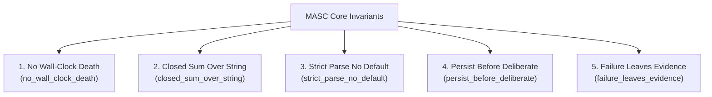

The MASC runtime and all participating agents strictly adhere to the contract defined in `docs/constitution.xml`.

---

## 5 Core Invariants

1. **No Wall-Clock Death (`no_wall_clock_death`)**: Tasks, attention items, and pending states never expire due to elapsed real-world time. State transitions require explicit terminal events.
2. **Closed Sum Over String (`closed_sum_over_string`)**: Control flow never branches on heuristic substring matching. Statuses and decisions are strictly typed OCaml closed variant sums.
3. **Strict Parse No Default (`strict_parse_no_default`)**: Unknown fields or invalid values fail parsing immediately. Coercing malformed data into silent default values is forbidden.
4. **Persist Before Deliberate (`persist_before_deliberate`)**: Context and intent must be committed to durable storage before invoking external LLM APIs.
5. **Failure Leaves Evidence (`failure_leaves_evidence`)**: Failed tool executions and network errors must write timestamped failure evidence rather than silently advancing.

---

## 7 Forbidden Anti-Patterns

| Anti-Pattern | Definition | Rationale |
|---|---|---|
| **Magic Numbers** | Controlling logic via arbitrary numeric thresholds | Eliminates determinism and traceability |
| **String Guessing** | Substring checks on model outputs | Fragile against phrasing variations |
| **Turn Limit Kill** | Terminating agents solely due to iteration count | Arbitrary interruption without valid state transition |
| **Hacky Shortcuts** | Writing workaround fixes that bypass root cause | Causes downstream regressions |
| **Hardcoded Paths** | Hardcoding host absolute paths | Breaks portability across machines and containers |
| **Env Var Sprawl** | Introducing ad-hoc environment variables | Violates configuration SSOT (`.masc/config/*.toml`) |
| **Dead Code** | Commenting out obsolete code blocks | Degrades readability (git history preserves past states) |
