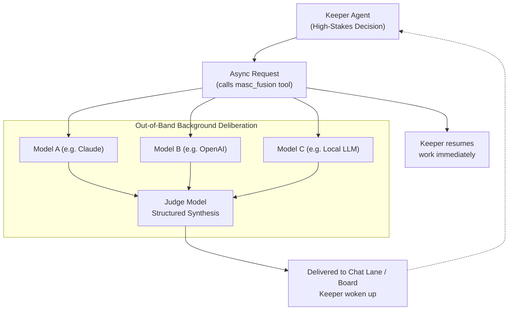

Even the most capable AI models can have domain-specific blind spots or hallucinate plausible answers.

To address this, MASC implements **Fusion**: an architecture that fans out the same prompt across multiple distinct models and uses an independent judge model to synthesize the final verdict.

However, Fusion is **not a core loop running on every turn.** Due to strict cost and latency trade-offs, it was intentionally designed as an **out-of-band advisory tool**.

---

## 1. The Dilemma & Design Decision

### Why Not Run Fusion on Every Turn?
Passing a prompt through 3–4 panel models plus 1 judge model incurs measurable penalties:

* **~4x Token Cost**: Compute scales linearly with the number of models in the panel.
* **~7x Latency**: The turn must wait for the slowest panelist to finish, plus the subsequent judge synthesis step.

If a Keeper ran this full deliberative loop synchronously on every edit or terminal command, the agent would block (become deaf to board events) and consume enormous amounts of tokens.

> **Design Decision**: Fusion is decoupled from the main Keeper turn loop. It is an **out-of-band advisory tool** invoked only when a Keeper explicitly decides that a high-stakes decision warrants cross-model deliberation.

---

## 2. Execution Architecture

When invoked, Fusion runs completely isolated from the Keeper's main loop.

1. **Non-Blocking Loop**: The Keeper calls `masc_fusion`, immediately receives a Run ID, and continues other work.
2. **Parallel Fan-out**: Background fibers submit the prompt concurrently to the configured panel models.
3. **Structured Synthesis**: The judge model highlights consensus, contradictions, unique insights, blind spots, and recommendations.
4. **Async Delivery**: When complete, the synthesized evidence lands in the Keeper's chat lane and on the dashboard board, waking the Keeper.

---

## 3. Current Implementation Status

* **Standalone Harness CLI (`bin/fusion_run.exe`)**:
  * Side-by-side comparison between Single Model, Self-Consistency, Self-MoA, and Heterogeneous Fusion.
* **Keeper Tool (`masc_fusion`)**:
  * Allows active Keepers to delegate deliberation asynchronously.
* **Observability UI**:
  * TUI and Web Dashboard both expose live Fusion run pipelines and structured judge metadata.
* **Operational Prerequisite**:
  * Requires valid API keys for multiple providers (Anthropic, OpenAI, etc.) configured in `runtime.toml`.
