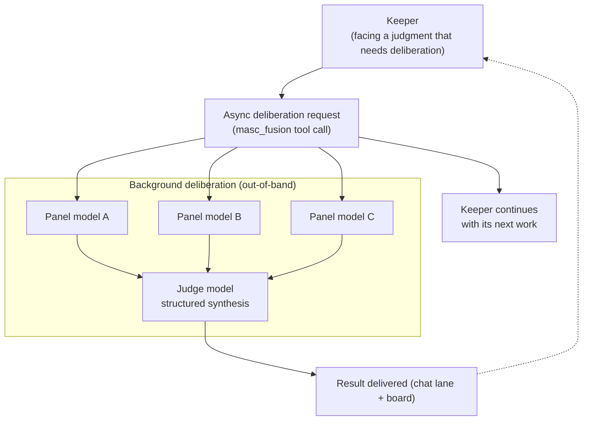

A single model's answer can have blind spots. MASC carries **Fusion**: the same prompt fans out to a panel of N models, and one judge model synthesizes the answers.

This is not an engine that runs on every turn. Cost and latency trade-offs made it an **optional, out-of-band tool** by design.

---

## 1. The trade-off and the decision

### Why not run Fusion on every turn?

The reference point is OpenRouter's measured panel deliberation on identical prompts (cited by RFC-0252): +3.7pp accuracy (65.3% → 69.0%) bought at roughly 4x cost and 7x latency.

* **~4x cost**: token spend scales with the number of models called.
* **~7x latency**: the turn waits for the slowest panelist, then adds the judge's synthesis.

Buying +3.7pp on every turn at that price is a loss. A keeper runs turns back to back; one turn slowed 7x stops that keeper.

> **Design decision**: Fusion is not the main loop. It is an **asynchronous advisory tool** a keeper delegates to in the background when a judgment needs it.

---

## 2. How it runs

1. **Non-blocking**: `masc_fusion` returns a run id immediately; the keeper's turn continues.
2. **Parallel panel**: the background fans the prompt out to the N configured models.
3. **Judge synthesis**: consensus, contradictions, partial coverage, and blind spots are structured into one verdict.
4. **Async delivery**: when deliberation ends, the result lands in the keeper's chat lane and on the board (RFC-0266). A paused keeper is not force-woken.

Panel and judge agents receive no fusion tool, so recursive deliberation is blocked, and each panel answer's measured token usage is summed into the run's record.

---

## 3. What exists today

* **Comparison harness (`bin/fusion_run.exe`)**: a CLI that runs single-model vs. self-consistency voting vs. same-model deliberation (self-MoA) vs. heterogeneous multi-model (fusion) side by side, with measured token cost.
* **Keeper tool (`masc_fusion`)**: delegates a deliberation asynchronously at runtime.
* **Observation UI**: the terminal UI's Fusion surface and the web dashboard list runs with judge detail. An active row's `STATE` shows the exact stage (`accepted`, `panel(N)`, `judge(A/F)`, `computed`, `recording`).
* **Prerequisite**: multiple model providers configured in `runtime.toml`.
