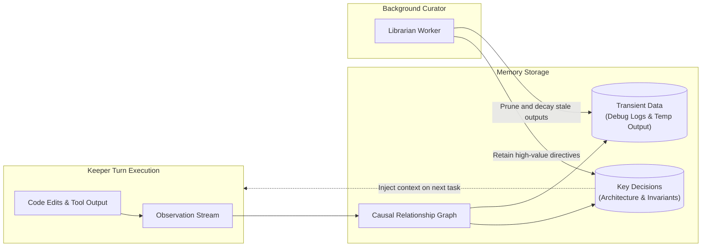
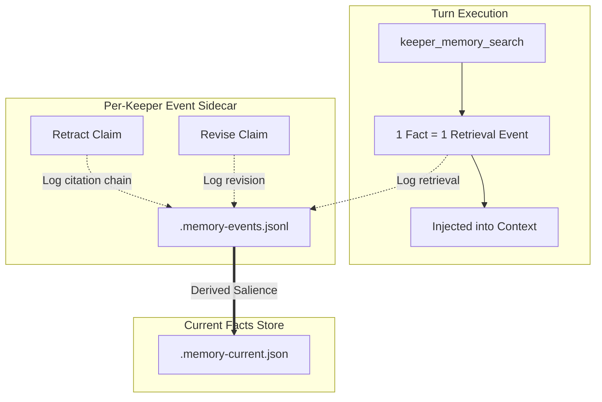

Memory OS is a local persistent memory subsystem that retains causality and intent across context window truncations and process restarts.

---

## Memory Pipeline

---

## Core Primitives

### 1. Causal Graph Storage
Rather than flat text embeddings, Memory OS records directed edges between task triggers, technical decisions, and empirical execution outcomes.

### 2. Node Lifecycle & Decay
* **Retained Nodes**: Operator directives, invariant violations, and verified architectural decisions.
* **Transient Nodes**: Ephemeral build outputs, intermediate tool errors, and scratch data slated for decay.

### 3. Asynchronous Curation (Librarian Worker)
Graph deduplication and compression run in background fibers decoupled from the active Keeper turn execution loop.

---

## Usage-Driven Reinforcement (RFC-0418)

In conventional memory systems, a memory node is often reinforced when the identical claim is re-observed. However, LLM generation variability means identical claims are rarely emitted byte-for-byte, leaving static re-observation counters stagnant.

Memory OS establishes that **memory solidifies when retrieved and applied, not passively re-observed**:

### 1. Typed Sidecar Event Stream
Each Keeper records lifecycle actions into an append-only JSONL sidecar (`<keeper>.memory-events.jsonl`):
* `retrieval`: Recorded per fact returned by `keeper_memory_search`.
* `citation`: Recorded when a retract or update operation cites a prior fact.
* `revision`: Recorded when an existing claim's boundary or text is formally revised.

### 2. Elimination of Dead Counters
The legacy `fact.reinforcement` integer counter in the fact store has been removed. High confidence and confirmed badges in the TUI reflect verified retrieval velocity and explicit citations rather than duplicate ingestion counts.

