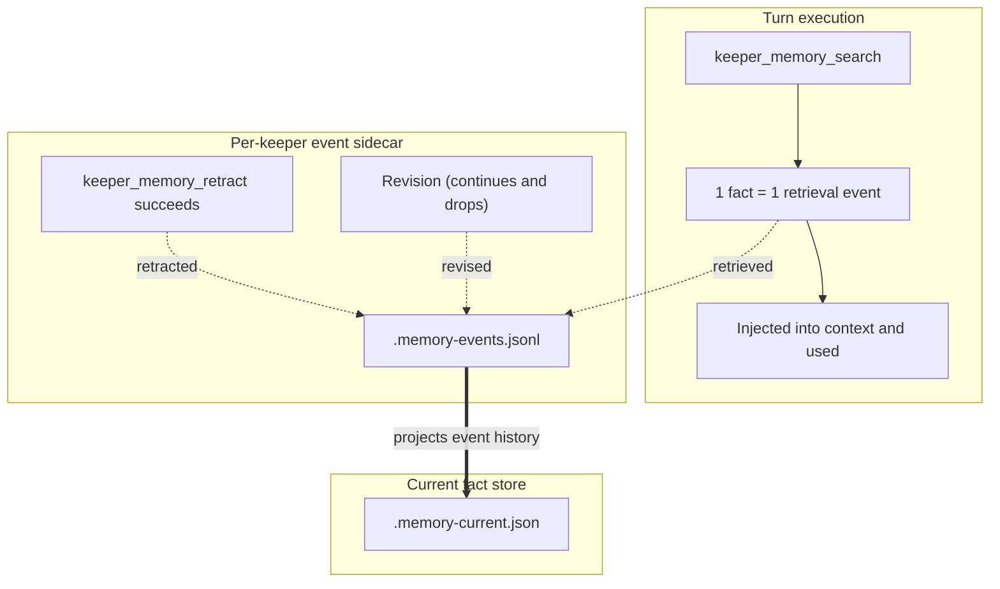

Memory OS is the subsystem that keeps the facts a Keeper learns across turns. Facts live in per-keeper stores on disk, survive a server restart, and are re-injected into later turns' context.

---

## Two stores

Each keeper has two memory stores.

| Store | What it holds |
|---|---|
| Ordinary | The keeper's current facts |
| Source-bound | Facts bound to their source material, with invalidation records |

A keeper whose ordinary snapshot is gone while the source-bound snapshot remains shows as `source-only`. The terminal UI's Memory surface reports the health of both stores per keeper.

---

## Usage-driven reinforcement (RFC-0418)

Raising a counter when the same claim is observed again does not work: an LLM does not regenerate a fact byte-identically, so a static reobservation counter stays at zero.

Memory OS follows the principle **"a memory solidifies when it is retrieved and used"**:

### 1. Typed sidecar event stream
Each keeper appends memory history events to one JSONL sidecar (`<keeper>.memory-events.jsonl`). The closed set of kinds:
* `retrieved`: the fact was among the results `keeper_memory_search` returned for a query.
* `retracted`: `keeper_memory_retract` successfully removed the fact identified by its `memory_id`.
* `revised`: the librarian wrote a new claim that continues this fact and dropped this one; `superseded_by` carries the new fact's id.

A dropped fact keeps its events — events outlive facts, and readers attach them only to facts that still exist. If the same claim is added again, the API row and terminal UI show its retrieved, retracted, and revised history from this sidecar.

### 2. Dead counters removed
The static integer counter (`fact.reinforcement`) is gone from the fact store. A fact's row in the terminal UI shows the counts gathered from these events — retrieved, distinct days, last retrieval, retracted, revised-from — as they are.

---

## Curation: the librarian lane

Curation runs on a background lane, separate from the keeper's own execution. The librarian reads the keeper's instructions, the whole current memory, and a bounded slice of new conversation, and answers in structured JSON:

* Every existing memory ID must appear exactly once, either in `retained_memory_ids` (kept) or in `dropped` (removed with a one-sentence reason). An ID in neither rejects the whole answer.
* What matters is judged relative to that keeper's charge and ongoing work. A fact worthless to a general assistant can be central to this keeper, and the reverse.
* There is no target item count and no deterministic ranking after the judgment. No numeric scores, no decay curves.

The terminal UI's Memory surface shows the lane state (`librarian lane-busy · failures`) per keeper.

---

## Viewing it in the terminal UI

On the Memory surface, `Enter` opens the fact browser. `c`/`C` cycles the category filter, `s` changes the sort (recency, last retrieved, retrieved count, category, claim), and `/` sets a text filter. See the [terminal UI guide](/guides/tui/) for the full key table.
