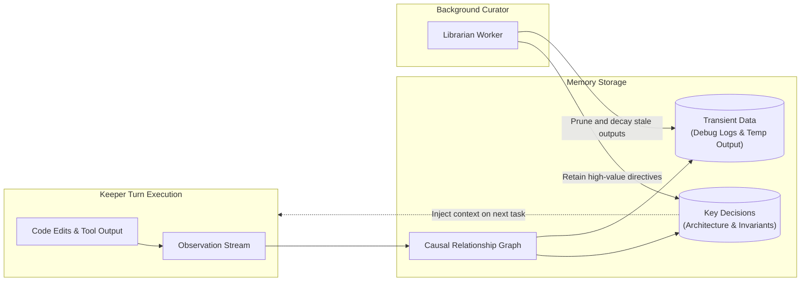

Memory OS is a local persistent memory subsystem that retains causality and intent across context window truncations and process restarts.

---

## Memory Pipeline

---

## Core Primitives

### 1. Causal Graph Storage
Rather than flat text embeddings, Memory OS records directed edges between task triggers, technical decisions, and empirical execution outcomes.

### 2. Node Lifecycle & Decay
* **Retained Nodes**: Operator directives, invariant violations, and verified architectural decisions.
* **Transient Nodes**: Ephemeral build outputs, intermediate tool errors, and scratch data slated for decay.

### 3. Asynchronous Curation (Librarian Worker)
Graph deduplication and compression run in background fibers decoupled from the active Keeper turn execution loop.
