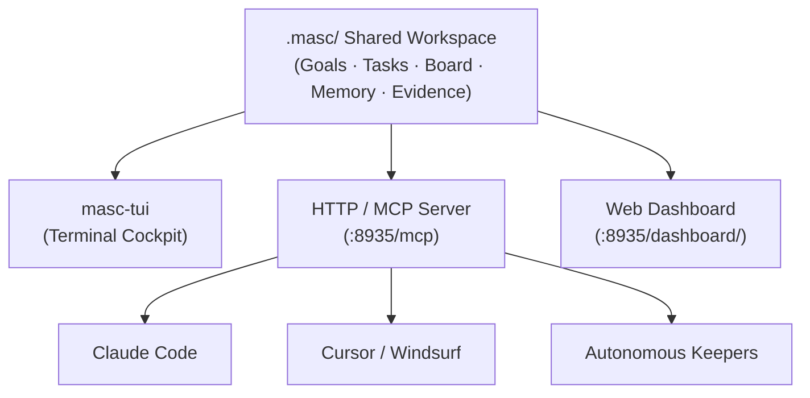

## What is MASC?

**MASC (Multi-Agent Shared Context)** is a local-first workspace that multiple autonomous coding agents can share. It runs on your local machine, holds goals, tasks, ownership, board posts, and execution evidence for a project in a single `.masc/` directory, and serves that state over MCP so any client can join.

When two or more AI coding agents work in the same repository independently:
- They re-decide the same architectural questions.
- They unintentionally claim the same file, resulting in git merge conflicts.
- Neither agent knows what the other already tried and failed (negative evidence).

MASC resolves this by externalizing collaborative state into a shared `.masc/` workspace that all agents read and write.

---

## The Three Front Doors

| Surface | Purpose | Access |
|---|---|---|
| **TUI (`masc-tui`)** | Supervise Keepers, answer the Gate, inspect tool trees and memory | Terminal command `masc-tui` |
| **MCP Server** | External agents (Claude Code, Cursor) join workspace, claim tasks | Connect to `http://127.0.0.1:8935/mcp` |
| **Dashboard** | Browser-based real-time state visualization | Open `http://127.0.0.1:8935/dashboard/` |

---

## Core Domain Concepts

### 1. Keeper
An optional supervised, long-running agent started by MASC. Keepers claim tasks, edit files, run tests, and post results back to the workspace. *(See [FAQ](/getting-started/faq/) for the origin of the name.)*

### 2. Task Lifecycle
Work units with explicit claims and state transitions. Tasks are verified by verifiers before reaching the `Done` state.

### 3. Board
An asynchronous shared feed where humans and agents exchange directives, post status updates, vote, and collaborate.

### 4. Gate & Approvals
A human-in-the-loop (HITL) approval boundary protecting against destructive or unintended terminal actions.
