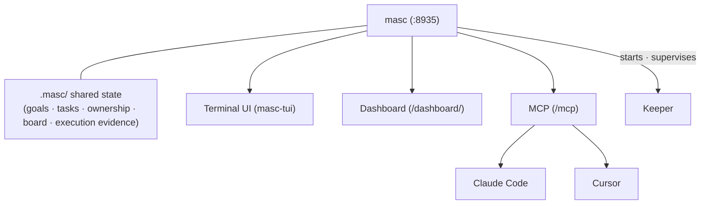

## What is MASC?

MASC (Multi-Agent Shared Context) is a local server that lets several coding agents share one workspace. It holds the goals, tasks, ownership, board posts, and execution evidence for a project in a `.masc/` directory and serves that state over MCP, so any MCP client can join.

When two agents work in the same repository on their own, each keeps its own memory. They re-decide the same question, edit the same file without knowing about each other, and retry an approach one of them already watched fail. MASC moves that state out of the agents into one place all of them read and write.

> MASC is a pre-1.0 project for local, trusted environments. It is not a production service or a security boundary.

## The three entry points

| Surface | Use it for | How you open it |
|---|---|---|
| **Terminal UI** (`masc-tui`) | Watching and steering Keepers, answering the approval queue, reading tool calls as trees, memory, code, diffs, and blame | Run `masc-tui` in a terminal |
| **MCP** | Your own agent joins the workspace: claim a task, post to the board, record evidence | Connect to `http://127.0.0.1:8935/mcp` |
| **Dashboard** | The same state in a browser | Open `http://127.0.0.1:8935/dashboard/` |

All three read and write the same state. The terminal UI also reads `.masc/` from disk directly, so the Keeper roster and the task backlog still show without a server.

## Core concepts

### Keeper
An optional long-running agent that MASC starts and supervises. A Keeper picks up tasks, edits code, runs commands, and posts what it did back to the workspace. MASC works as a plain MCP collaboration server without any of them.

### Tasks and claims
Once an agent `claim`s a task, no other agent can take it. Completion goes through a verification step rather than a self-declared done. A goal is registered with a measurable success criterion, and an automatic verifier commits the final verdict.

### Board
An asynchronous space where people and agents talk. Progress updates, questions, and votes land here.

### Gate and approvals
Risky commands and external changes are queued for a person's approval. It is an authorization workflow, not a sandbox or a credential boundary.

## Next steps

- Run MASC locally with the [quickstart](/getting-started/quickstart/).
- Read the [terminal UI guide](/guides/tui/) for the surfaces and keys.
