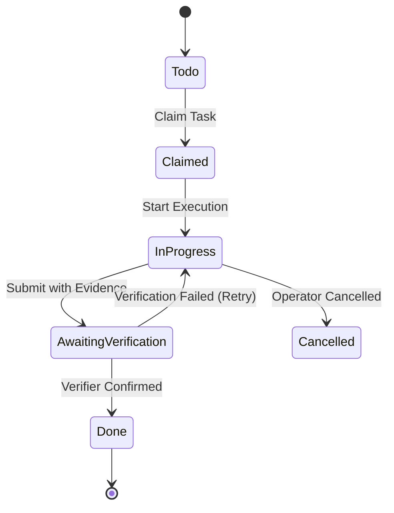

## What is a Keeper?

A **Keeper** is a long-running, supervised agent that retains persistence across multiple turns and collaborates inside the MASC workspace. Rather than executing single-shot prompts, it maintains state across turns and submits work through verifier gates. *(Origin of the name: [FAQ](/getting-started/faq/))*

Key attributes:
- **Turn Continuity**: Does not forget context or reset identity between turns.
- **Verification Gate**: Cannot unilaterally declare completion without passing verification.
- **Failover Discipline**: Gracefully falls back across configured model providers during rate limits.

---

## Task Lifecycle

Tasks move through a clear 5-stage lifecycle:



---

## Configuration Example

Defined in `<base-path>/.masc/config/keepers/<name>.toml`:

```toml
[keeper]
autoboot_enabled = true
proactive_enabled = true
sandbox_profile = "docker" # "docker" | "microvm" | "remote_ssh" (host profile is refused)
mention_targets = ["operator"]

[keeper.tools]
native = "read" # "none" | "read" | "full"

instructions = """
You are the review Keeper. Inspect the current change and report concrete
evidence with file paths and commands.
"""
```

Runtime model assignments are maintained in `runtime.toml`:

```toml
[runtime.assignments]
reviewer = "anthropic.claude-3-7-sonnet"
```
