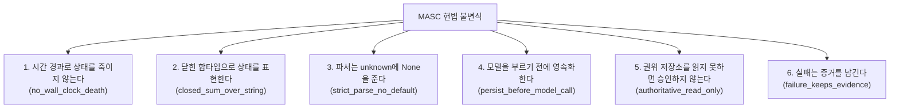

MASC 런타임과 모든 하위 에이전트는 `docs/constitution.xml`에 정의된 헌법 불변식을 따릅니다. 이 페이지는 그 원문을 요약한 것이며, 원본은 XML 쪽입니다.

---

## 6대 도메인 불변식 (Invariants)

1. **`no_wall_clock_death`** — 시간 경과로 상태를 죽이지 않습니다. Task에도 Board attention Pending에도 만료가 없고, Board 기본 TTL은 0(영구)입니다. 만료가 필요해 보이면 그건 대개 상태 전이가 빠진 것입니다.
2. **`closed_sum_over_string`** — 상태와 판정은 닫힌 합타입으로 표현합니다. task_status, Goal_phase, attempt result, board_error, delivery 모두 variant이며, wire 문자열을 비교해 분기하지 않습니다.
3. **`strict_parse_no_default`** — 파서는 unknown 입력에 `None`을 줍니다. 모르는 값을 편리한 기본값으로 눌러 담지 않습니다. Goal은 `status` 필드가 들어오면 decode를 실패시킵니다.
4. **`persist_before_model_call`** — 모델을 부르기 전에 판단 대상을 먼저 영속화합니다. Board attention candidate가 이 형태입니다.
5. **`authoritative_read_only`** — 권위 있는 저장소를 읽지 못하면 변경을 승인하지 않습니다. 복구 스냅샷으로 mutation을 허가하지 않습니다.
6. **`failure_keeps_evidence`** — 전달 실패는 증거를 남기고 대상을 소비하지 않습니다. 실패가 상태를 조용히 진행시키지 않습니다.

---

## 7대 금지 조항 (Forbidden)

| 조항 | 내용 |
|---|---|
| **`magic_number`** | 가중치나 숫자 비교로 Keeper 흐름을 제어하지 않습니다. 예외는 값의 근거를 주석으로 남긴 경우뿐입니다(반복 감지 bound 세 개가 이 예외로, 배포 후 재측정으로 판정합니다). |
| **`string_matching`** | String·Substring·정규식 비교로 다음 로직을 결정하지 않습니다. 문자열을 비교해야만 코드를 짤 수 있다면 바닥까지 온 것입니다. |
| **`budget_gate`** | 누적 turn·time·token·cost 숫자로 행동을 제한하는 게이트를 만들지 않습니다. restart/failure 카운터는 관측(observation)으로만 씁니다. 작업 분해용 output token 범위, provider hard limit, 안전·자원 경계는 이 금지의 대상이 아닙니다. |
| **`greedy_shortcut`** | 빌드만 성공하고 돌아가는 척하는 구현을 하지 않습니다. 시간이 걸려도 맞는 구현을 합니다. |
| **`hardcoded_path`** | 코드와 도구 내부에 경로를 하드코딩하지 않습니다. base path를 기억합니다. |
| **`env_var_sprawl`** | 환경변수를 또 만들기 전에, 이미 있는 환경변수인지, TOML로 쓰면 안 되는지 먼저 묻습니다. |
| **`legacy_residue`** | 레거시를 남기지 않고 지웁니다. 과거 데이터 호환에 시간을 쓰지 않고, "더 이상 쓰지 않음" 같은 흔적 표기조차 쓰지 않습니다. 기능이 바뀌면 필드를 억지로 마이그레이션하지 않습니다. |
