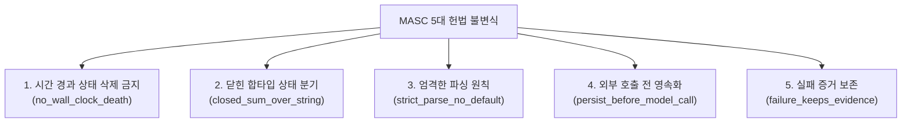

MASC 런타임 및 모든 하위 에이전트는 `docs/constitution.xml`에 정의된 헌법 불변식(Invariants)을 준수합니다.

---

## 5대 핵심 불변식 (Invariants)

1. **시간 경과 상태 삭제 금지 (`no_wall_clock_death`)**: 시간 경과(wall-clock)를 이유로 Task나 Pending 상태를 만료시키지 않습니다. 상태 전이는 오직 명시적 취소/실패 이벤트로만 기록됩니다.
2. **닫힌 합타입 상태 분기 (`closed_sum_over_string`)**: 문자열 휴리스틱 부분 일치로 로직을 분기하지 않습니다. OCaml 닫힌 variant 합타입(closed sum)으로만 상태를 전이합니다.
3. **엄격한 파싱 원칙 (`strict_parse_no_default`)**: 알 수 없는 입력값에 임의의 기본값을 주입하지 않고 즉시 디코딩 실패 처리합니다.
4. **외부 호출 전 영속화 (`persist_before_model_call`)**: 외부 LLM API 호출 전 의도와 입력 대상을 디스크에 먼저 기록합니다.
5. **실패 증거 보존 (`failure_keeps_evidence`)**: 도구 실행이나 통신 실패 시 타임스탬프와 실패 내역을 증거 레코드에 기록합니다.

---

## 7대 금지 조항 (Anti-Patterns)

| 금지 항목 | 내용 | 사유 |
|---|---|---|
| **마법의 숫자 (Magic Numbers)** | 임의 수치 비교나 가중치 기반 제어 | 결정론적 상태 추적 불가 |
| **문자열 추측 (String Guessing)** | wire 문자열 부분 일치 기반 분기 | 프롬프트 출력 변화 시 오작동 |
| **임의 종료 카운터 (Turn Kill)** | 턴 수 도달을 이유로 강제 종료 | 상태 전이 없는 프로세스 중단 방지 |
| **임시 땜질 (Hacky Shortcuts)** | 근본 원인 해결 대신 회피 코드 작성 | 리그레션 유발 |
| **절대 경로 하드코딩 (Hardcoded Paths)** | 호스트 로컬 절대 경로 사용 | 환경 이식성 저해 |
| **환경 변수 남발 (Env Sprawl)** | 개별 설정마다 신규 환경 변수 생성 | 설정 SSOT(`.masc/config/*.toml`) 위반 |
| **미사용 주석 코드 (Dead Code)** | 폐기된 코드 블록 주석 잔존 | 코드베이스 가독성 저해 (git 기록으로 대체) |
