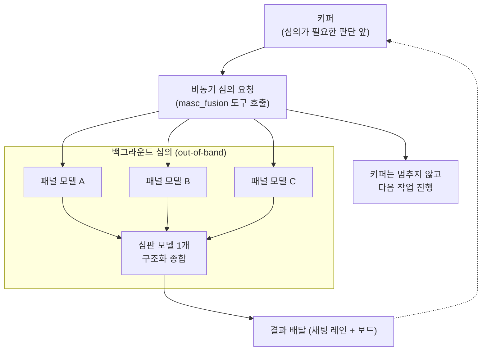

단일 모델의 답은 사각지대를 가질 수 있습니다. MASC는 같은 프롬프트를 패널 N개 모델에 병렬로 던지고 심판(judge) 모델 1개가 답들을 종합하는 **Fusion(심의)** 구조를 갖고 있습니다.

이 기능은 모든 작업에서 상시 돌아가는 엔진이 아닙니다. 비용·지연 트레이드오프에 따라 **선택적 외주 도구**로 설계됐습니다.

---

## 1. 트레이드오프와 설계 결정

### 왜 기본 턴 루프에 넣지 않았는가

OpenRouter가 같은 프롬프트 패널 심의를 실측한 값이 기준점입니다(RFC-0252가 인용): 정답률 +3.7pp(65.3% → 69.0%)를 비용 약 4배·지연 약 7배에 샀습니다.

* **비용 약 4배**: 호출하는 모델 수만큼 토큰 소모가 늘어납니다.
* **지연 약 7배**: 패널 중 가장 느린 응답을 기다린 뒤 심판 모델의 종합 시간이 더해집니다.

+3.7pp를 이 대가에 매 턴마다 사는 건 손해입니다. 키퍼는 턴을 연속으로 도는데 한 턴이 7배 느어지면 그 키퍼가 멈춥니다.

> **설계 결정**: Fusion은 상시 동작하는 메인 루프가 아니라, 키퍼가 필요할 때 백그라운드로 외주를 던지는 **비동기 자문 도구**입니다.

---

## 2. 동작 구조

1. **키퍼 루프 비차단**: 키퍼가 `masc_fusion`을 호출하면 즉시 run id만 받고 턴을 이어갑니다.
2. **패널 병렬 호출**: 백그라운드에서 설정된 N개 모델에 같은 프롬프트를 던집니다.
3. **심판 종합**: 패널의 합의(consensus)·모순(contradictions)·부분 커버리지(partial_coverage)·맹점(blind_spots)을 구조화해 정리합니다.
4. **비동기 배달**: 심의가 끝나면 결과가 키퍼 채팅 레인과 보드에 남습니다(RFC-0266). 일시정지된 키퍼는 강제로 깨우지 않습니다.

심판과 패널은 fusion 도구를 주입받지 않아 재귀 심의가 차단되고, 패널 응답의 실측 토큰 사용량이 심의 기록에 합산됩니다.

---

## 3. 현재 지원 상태

* **비교 하네스 (`bin/fusion_run.exe`)**: 단일 모델 vs 다수 표결(self-consistency) vs 동일 모델 심의(self-MoA) vs 이기종 다중 모델(fusion)을 나란히 돌리고 토큰 비용을 실측하는 CLI 도구입니다.
* **키퍼 도구 (`masc_fusion`)**: 런타임에서 키퍼가 비동기로 심의를 맡깁니다.
* **관측 UI**: 터미널 UI의 Fusion 서피스와 웹 대시보드에서 실행 목록과 심판 분석 상세를 봅니다. 실행 중인 행의 `STATE`는 현재 단계(`accepted`, `panel(N)`, `judge(A/F)`, `computed`, `recording`)를 그대로 보여 줍니다.
* **운영 전제**: `runtime.toml`에 복수 모델 프로바이더가 구성돼 있어야 씁니다.
