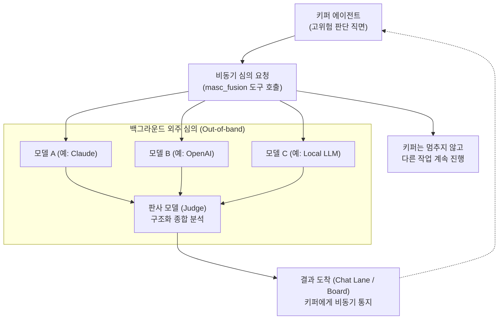

단일 AI 모델은 아무리 성능이 뛰어나도 특정 도메인이나 복잡한 조건에서 사각지대(Blind spot)와 그럴듯한 환각(Hallucination)을 보일 수 있습니다.

MASC는 이를 해결하기 위해 여러 모델에게 동일한 프롬프트를 보내고 독립된 판사(Judge) 모델이 종합 판정하는 **Fusion(심의)** 구조를 설계하고 구현해 두었습니다.

그러나 이 기능은 **모든 작업에서 상시 돌아가는 핵심 엔진이 아닙니다.** 철저한 비용·지연 트레이드오프에 따라 **선택적 외주 도구**로 결정되었습니다.

---

## 1. 핵심 딜레마와 설계 결정

### 왜 기본 턴 루프에 넣지 않았는가?
단일 모델 대신 3~4개의 모델 패널과 1개의 판사 모델을 거치면 실측상 다음과 같은 명확한 대가를 치릅니다.

* **비용 약 4배 증가**: 호출하는 모델 수만큼 토큰 소모가 정비례합니다.
* **지연 약 7배 증가**: 패널 모델 중 가장 느린 응답을 기다려야 하고, 이후 판사 모델의 종합 시간까지 더해집니다.

만약 에이전트가 코드를 한 줄 고치거나 터미널 명령을 내릴 때마다 이 루프를 동기(Sync)로 돌린다면, 키퍼가 멈춰 서고(Deaf) 엄청난 API 비용이 낭비됩니다.

> **설계 결정**: Fusion은 상시 동작하는 메인 루프가 아니라, 키퍼가 위험한 결정을 내릴 때 백그라운드로 외주를 던지는 **비동기 자문 도구(Out-of-band Advisory Tool)**로 분리했습니다.

---

## 2. 동작 구조

Fusion이 발동할 때는 키퍼의 일상적인 턴을 방해하지 않도록 완전히 격리되어 실행됩니다.

1. **키퍼 루프 비차단**: 키퍼가 `masc_fusion` 도구를 호출하면 즉시 티켓(Run ID)만 받고 다음 작업을 이어갑니다.
2. **패널 병렬 호출**: 백그라운드 파이버에서 설정된 N개 모델에 동일 프롬프트를 던집니다.
3. **판사 모델 종합**: 패널의 의견 차이, 공통 합의점, 맹점, 최종 권고안을 구조화된 형식으로 정리합니다.
4. **비동기 통지**: 심의가 끝나면 키퍼 채팅 레인과 대시보드 보드에 결과가 배달되어 키퍼를 깨웁니다.

---

## 3. 현재 지원 상태

* **독립 비교 하네스 (`bin/fusion_run.exe`)**:
  * 단일 모델 vs 다수 표결(Self-Consistency) vs 동일 모델 심의(Self-MoA) vs 이기종 다중 모델(Fusion)을 나란히 비교할 수 있는 CLI 도구가 제공됩니다.
* **키퍼 도구 (`masc_fusion`)**:
  * 런타임에서 키퍼가 비동기로 심의를 맡길 수 있습니다.
* **관측 UI**:
  * TUI와 웹 대시보드에서 진행 중인 심의 런(Run) 목록과 판사 분석 상세를 조회할 수 있습니다.
* **운영 제약**:
  * 실제로 사용하려면 `runtime.toml`에 복수의 외부 모델 API 키(Anthropic, OpenAI 등)가 정상 구성되어 있어야 합니다.
