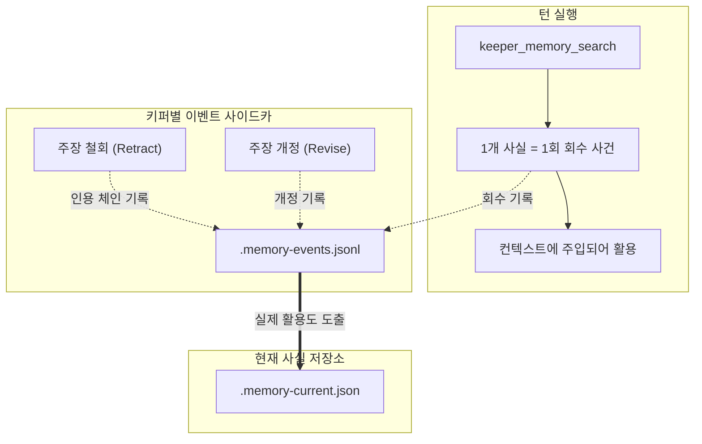

Memory OS는 키퍼가 학습한 사실을 턴 너머로 유지하는 하위 시스템입니다. 사실은 키퍼별 저장소에 파일로 남고, 서버를 다시 띄워도 사라지지 않으며, 다음 턴의 컨텍스트에 다시 주입됩니다.

---

## 두 개의 저장소

키퍼마다 두 개의 기억 저장소가 있습니다.

| 저장소 | 무엇을 담나 |
|---|---|
| 일반 저장소 (ordinary) | 키퍼의 현재 사실 |
| 원천 결속 저장소 (source-bound) | 원천 자료에 결속된 사실과 그 무효화(invalidation) 기록 |

일반 저장소 스냅샷은 없고 원천 결속 스냅샷만 남은 키퍼는 `source-only`로 표시됩니다. 터미널 UI의 Memory 화면은 이 두 저장소의 건강 상태를 키퍼별로 보여 줍니다.

---

## 사용 기반 강화 (RFC-0418)

같은 주장이 다시 관측될 때 카운터를 올리는 방식은 작동하지 않습니다. LLM은 같은 사실이라도 바이트 단위로 똑같이 재생성하지 않으므로, 정적 재관측 카운터는 0에 머뭅니다.

Memory OS는 **"기억은 다시 꺼내 쓸 때 굳는다"**는 원칙을 따릅니다:

### 1. 타입화된 사이드카 이벤트 스트림
각 키퍼는 기억 사용 사건을 단일 JSONL 사이드카(`<keeper>.memory-events.jsonl`)에 순차 기록합니다:
* `retrieval`: `keeper_memory_search` 결과로 반환된 사실마다 1건.
* `citation`: 철회(retract) 또는 업데이트 시 이전 사실을 인용한 체인.
* `revision`: 기존 주장의 경계나 문장을 정식 개정할 때.

API 행과 터미널 UI는 각 사실에 대해 키퍼가 실제로 무엇을 했는지(회수·인용·개정) 이 사이드카에서 보여 줍니다.

### 2. 정적 카운터 제거
사실 저장소에서 의미를 잃은 정적 정수 카운터(`fact.reinforcement`)를 걷어냈습니다. 터미널 UI의 신뢰도 표기는 중복 저장 횟수가 아니라 실제 검색·인용 빈도로 계산됩니다.

---

## 정리: librarian 레인

기억 정리는 키퍼 실행과 분리된 백그라운드 레인(librarian)이 맡습니다. librarian은 키퍼의 instructions, 현재 기억 전체, 한정된 분량의 새 대화를 읽고 구조화 JSON으로 판정합니다:

* 기존 기억 ID는 전부 `retained_memory_ids`(유지) 또는 `dropped`(사유 한 문장과 함께 제거) 중 정확히 한 곳에 나와야 합니다. 어느 쪽에도 없는 ID는 판정 전체를 거부시킵니다.
* 무엇이 중요한지는 그 키퍼의 책무와 진행 중인 일에 상대적으로 판단합니다. 범용 어시스턴트에게 무가치한 사실이 이 키퍼에게는 핵심일 수 있습니다.
* 목표 항목 수도, 판정 뒤의 결정론적 순위 매김도 없습니다. 수치 점수나 감쇠 곡선은 쓰지 않습니다.

터미널 UI의 Memory 화면은 레인 상태(`librarian lane-busy · failures`)를 키퍼별로 보여 줍니다.

---

## 터미널 UI에서 보기

Memory 화면에서 `Enter`를 누르면 팩트 브라우저가 열립니다. `c`/`C`는 카테고리 필터, `s`는 정렬(최신, 마지막 인출, 인출 횟수, 카테고리, 내용), `/`는 텍스트 필터입니다. 자세한 키는 [터미널 UI 가이드](/ko/guides/tui/)를 보세요.
