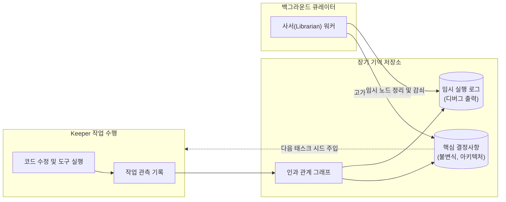

Memory OS는 컨텍스트 윈도우 초기화 및 세션 분절 시에도 상태를 보존하는 로컬 인과 그래프 기반 장기 기억 서브시스템입니다.

---

## 메모리 파이프라인

---

## 핵심 구조

### 1. 인과 그래프 기반 저장 (Causal Graph)
단순 텍스트 검색 대신 작업 동기(Trigger), 기술적 결정(Decision), 도구 실행 결과(Outcome) 간의 인과 엣지를 유지합니다.

### 2. 메모리 수명 주기 및 감쇠 (Decay)
* **영구 보존 노드**: 사용자 디렉티브, 아키텍처 불변식, 검증된 성공 패턴.
* **휘발성 노드**: 중간 빌드 출력, 임시 쉘 로그 등 작업 완료 후 감쇠 대상 데이터.

### 3. 비동기 백그라운드 정제 (Librarian Worker)
메모리 노드의 압축 및 중복 정리는 키퍼의 메인 실행 파이버를 차단하지 않는 별도의 백그라운드 워커(Librarian)가 수행합니다.
