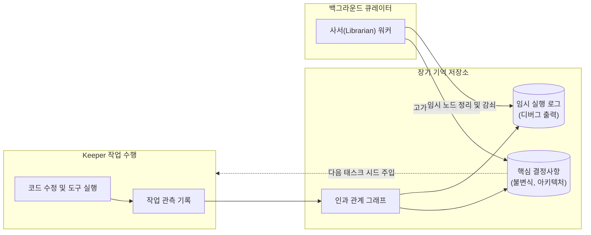
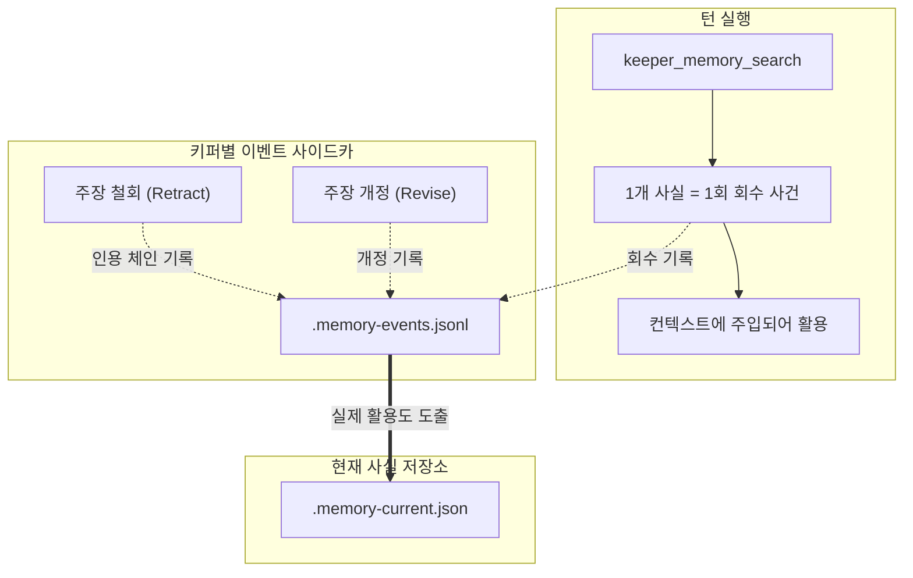

Memory OS는 컨텍스트 윈도우 초기화 및 세션 분절 시에도 상태를 보존하는 로컬 인과 그래프 기반 장기 기억 서브시스템입니다.

---

## 메모리 파이프라인

---

## 핵심 구조

### 1. 인과 그래프 기반 저장 (Causal Graph)
단순 텍스트 검색 대신 작업 동기(Trigger), 기술적 결정(Decision), 도구 실행 결과(Outcome) 간의 인과 엣지를 유지합니다.

### 2. 메모리 수명 주기 및 감쇠 (Decay)
* **영구 보존 노드**: 사용자 디렉티브, 아키텍처 불변식, 검증된 성공 패턴.
* **휘발성 노드**: 중간 빌드 출력, 임시 쉘 로그 등 작업 완료 후 감쇠 대상 데이터.

### 3. 비동기 백그라운드 정제 (Librarian Worker)
메모리 노드의 압축 및 중복 정리는 키퍼의 메인 실행 파이버를 차단하지 않는 별도의 백그라운드 워커(Librarian)가 수행합니다.

---

## 사용 기반 강화 (RFC-0418)

전통적인 메모리 시스템은 동일한 주장이 다시 관측될 때 강화 카운터를 올립니다. 그러나 LLM은 같은 사실이라도 바이트 단위로 동일하게 재생성하지 않으므로, 정적 재관측 카운터는 0에 머무릅니다.

Memory OS는 **"기억은 다시 꺼내 쓸 때 굳는다"**는 원칙을 확립했습니다:

### 1. 타입화된 사이드카 이벤트 스트림
각 키퍼는 장기 기억 라이프사이클 사건을 단일 JSONL 사이드카(`<keeper>.memory-events.jsonl`)에 순차 기록합니다:
* `retrieval`: `keeper_memory_search` 결과로 반환된 사실마다 1건 기록.
* `citation`: 철회(retract) 또는 업데이트 시 이전 사실을 인용한 체인 기록.
* `revision`: 기존 주장의 경계나 문장을 정식 개정할 때 기록.

### 2. 정적 카운터 제거
사실 저장소(`fact store`)에서 의미를 잃은 정적 정수 카운터(`fact.reinforcement`)를 완전히 걷어냈습니다. TUI의 `(Confirmed)`, `(High Confidence)` 등의 신뢰도 표기는 중복 저장 횟수가 아닌 실제 검색 및 인용 빈도를 기반으로 계산됩니다.

