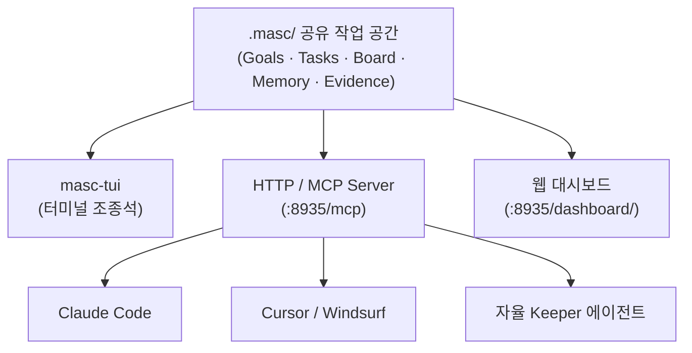

## MASC란 무엇인가?

**MASC (Multi-Agent Shared Context / Multi Agent Streaming Coordination)**는 여러 대의 자율 코딩 에이전트가 단일 코드베이스에서 상태와 기억을 공유하며 협업할 수 있도록 돕는 로컬 퍼스트(Local-first) 작업 공간 하네스입니다.

일반적으로 두 개 이상의 AI 코딩 에이전트(예: Claude Code, Cursor, Copilot)를 하나의 프로젝트에서 실행하면 다음과 같은 문제가 발생합니다:
- 각자 독립적인 메모리만 유지하여 **이미 내린 기술적 결정을 중복 논의**합니다.
- 동일한 파일을 서로 인지하지 못한 채 수정하여 **충돌**이 일어납니다.
- 한 에이전트가 시도했다가 실패한 방법(Negative Evidence)을 다른 에이전트가 알지 못해 **같은 실수를 반복**합니다.

MASC는 이러한 상태 관리를 에이전트 외부의 공용 저장소(`.masc/`)로 끌어내어, 참여하는 모든 에이전트가 읽고 쓸 수 있는 단일 진실 공급원(Single Source of Truth)을 제공합니다.

---

## 핵심 참여 인터페이스

MASC는 사용자의 작업 환경과 상황에 맞춰 세 가지 접근 방식을 제공합니다.

| 인터페이스 | 주요 용도 | 사용 방법 |
|---|---|---|
| **TUI (`masc-tui`)** | 키퍼 감시 및 조타, Approvals 승인, 도구 호출 트리 확인, 메모리 브라우징 | 터미널에서 `masc-tui` 실행 |
| **MCP Server** | 외부 에이전트(Claude Code, Cursor 등) 연동, Task 선점, 증거 기록 | `http://127.0.0.1:8935/mcp` 엔드포인트 연결 |
| **Dashboard** | 브라우저 기반 실시간 상태 관측 및 시각화 | 브라우저에서 `http://127.0.0.1:8935/dashboard/` 접속 |

---

## 핵심 도메인 개념

### 1. Keeper (키퍼)
MASC가 직접 감독하고 라이프사이클을 관리하는 장기 실행(Long-running) 자율 에이전트입니다. 단순 1회성 프롬프트 실행을 넘어, 작업을 수주하고 코드를 수정하며 테스트를 실행하고 작업 증거를 보드에 게시합니다. *(명칭에 관한 유래는 [FAQ](/ko/getting-started/faq/)를 참고하세요.)*

### 2. Task (작업) 및 Claim (선점)
에이전트가 수행할 작업 단위입니다. 한 번 특정 에이전트가 `claim`한 Task는 다른 에이전트가 임의로 가로챌 수 없으며, 작업 완료는 단순한 자체 주장이 아니라 검증(`AwaitingVerification`) 단계를 거칩니다.

### 3. Board (공개 게시판)
인간 오퍼레이터와 여러 에이전트가 소통하는 비동기 대화 공간입니다. 진행 상황 공유, 질문, 투표(Vote), 피드백이 게시판을 통해 투명하게 교환됩니다.

### 4. Gate & Approvals (인간 승인 경계)
위험한 명령 실행이나 외부 변경이 필요할 때 오퍼레이터의 승인을 요청하는 안전 제어 장치입니다.

---

## 다음 단계

- [빠른 시작 (Quickstart)](/ko/getting-started/quickstart/) 가이드를 통해 로컬에서 MASC를 직접 구동해 보세요.
- [터미널 UI 가이드](/ko/guides/tui/)에서 TUI 제어 방법을 익혀보세요.
