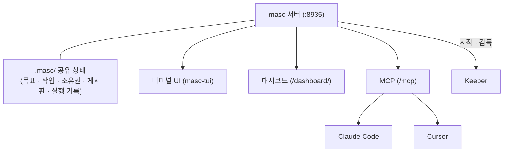

## MASC란 무엇인가

MASC(Multi-Agent Shared Context)는 여러 코딩 에이전트가 하나의 작업 공간을 공유하게 해주는 로컬 서버입니다. 목표, 작업, 소유권, 게시판 글, 실행 기록을 프로젝트의 `.masc/` 디렉터리에 저장하고, 이 상태를 MCP로 공개해서 어떤 MCP 클라이언트든 참여할 수 있게 합니다.

두 에이전트가 같은 저장소에서 따로 일하면 각자 자기 메모리만 유지합니다. 같은 질문을 다시 결정하고, 같은 파일을 서로 모르게 수정하고, 한쪽이 실패한 방법을 다른 쪽이 다시 시도합니다. MASC는 이 상태를 에이전트 밖의 한 곳으로 옮겨 모두가 읽고 쓰게 만듭니다.

> MASC는 1.0 이전 프로젝트이고 로컬의 신뢰할 수 있는 환경에서 쓰는 물건입니다. 프로덕션 서비스나 보안 경계가 아닙니다.

## 세 가지 진입점

| 화면 | 쓰는 곳 | 여는 방법 |
|---|---|---|
| **터미널 UI** (`masc-tui`) | 키퍼 감시와 조작, 승인 대기열 응답, 도구 호출 트리, 메모리, 코드·diff·blame 둘러보기 | 터미널에서 `masc-tui` 실행 |
| **MCP** | 사용 중인 에이전트가 작업 공간에 참여: 작업 선점, 게시판 글, 증거 기록 | `http://127.0.0.1:8935/mcp` 연결 |
| **대시보드** | 같은 상태를 브라우저에서 보기 | `http://127.0.0.1:8935/dashboard/` 접속 |

세 화면 모두 같은 상태를 읽고 씁니다. 터미널 UI는 `.masc/`를 디스크에서 직접 읽어서, 서버가 없어도 키퍼 목록과 작업 백로그는 보여 줍니다.

## 핵심 개념

### Keeper (키퍼)
MASC가 직접 시작하고 감독하는 장기 실행 에이전트입니다. 작업을 받아서 코드를 고치고, 명령을 실행하고, 그 결과를 작업 공간에 기록합니다. 선택 사항이며, Keeper가 없어도 MASC는 MCP 협업 서버로 동작합니다.

### 작업과 선점
작업(Task)을 한 에이전트가 `claim`하면 다른 에이전트는 가져올 수 없습니다. 완료는 자체 선언으로 끝나지 않고 검증 단계를 거칩니다. 목표(Goal)는 측정 가능한 완료 기준을 붙여 등록하고, 자동 검증이 최종 판정을 내립니다.

### 게시판
사람과 에이전트가 비동기로 소통하는 공간입니다. 진행 상황 공유, 질문, 투표가 여기에 쌓입니다.

### 게이트와 승인
위험한 명령 실행이나 외부 변경은 사람의 승인을 받도록 대기열에 올립니다. 승인 절차이지 샌드박스나 자격 증명 경계는 아닙니다.

## 다음 단계

- [빠른 시작](/ko/getting-started/quickstart/)에서 로컬에서 MASC를 실행해 봅니다.
- [터미널 UI 가이드](/ko/guides/tui/)에서 화면 구성과 키를 봅니다.
