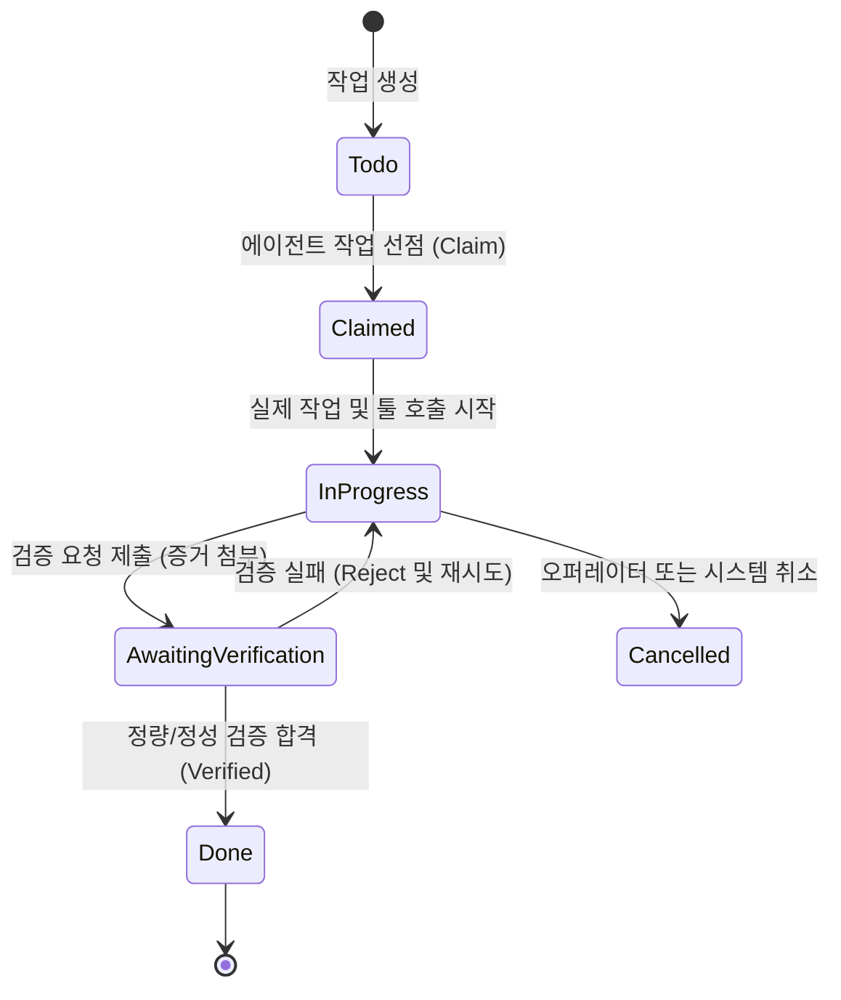

## Keeper의 정의

**Keeper**는 MASC 환경에서 지속성(Persistence)을 가지고 스스로 작업을 수주하며 다른 에이전트와 소통하는 장기 실행 자율 에이전트입니다. 단순 1회성 프롬프트 실행을 넘어 턴을 연속해서 수행하고, 검증자(Verifier)의 증명을 거쳐 작업을 완료합니다. *(명칭 유래는 [FAQ](/ko/getting-started/faq/) 참고)*

단순한 챗봇(Chatbot)과 달리 다음과 같은 고유한 특성을 가집니다:
- **턴의 지속성**: 이전 턴의 작업 결과와 기억을 잃지 않고 다중 턴을 연속해서 수행합니다.
- **상태 머신 준수**: 임의로 "완료했다"고 선언하지 않고, 검증자(Verifier)의 증명 및 검토 절차를 거칩니다.
- **Failover 지원**: LLM API 레이트 리밋이나 장애 발생 시 사전에 정의된 대체 모델/런타임으로 안전하게 전환됩니다.

---

## 작업 라이프사이클 (Task Lifecycle)

Keeper가 수행하는 작업은 5단계를 거쳐 안전하게 완료됩니다:



- **Todo**: 할 일 대기열에 등록된 상태
- **Claimed**: 특정 Keeper가 선점하여 다른 에이전트의 접근이 잠긴 상태
- **InProgress**: Keeper가 도구를 호출하며 실제 작업을 수행 중인 상태
- **AwaitingVerification**: 작업을 마치고 검증자(Verifier)에게 증거와 함께 검수를 제출한 상태
- **Done**: 정량적/정성적 검증을 통과하여 최종 완료된 상태

---

## Keeper 설정 파일 구조

Keeper별 설정은 `<base-path>/.masc/config/keepers/<name>.toml`에 정의됩니다:

`masc keeper-create` 가 이 파일을 대신 써 줍니다. 각 필드는
[설정 파일](/ko/reference/config/)에 정리돼 있습니다.

```toml
# .masc/config/keepers/reviewer.toml 예시
[keeper]
autoboot_enabled = true
proactive_enabled = true
sandbox_profile = "docker"   # "docker" | "microvm" | "remote_ssh" (host 는 거부됨)
network_mode = "inherit"     # "none" | "inherit"
instructions = """
당신은 코드 리뷰 Keeper입니다. 현재 변경사항을 검사하고 구체적인 파일 경로와
실행 증거를 보고하십시오.
"""

[keeper.tools]
native = "read"              # "none" | "read" | "full"
```

Keeper 의 턴이 어떤 모델을 쓰는지는 `runtime.toml` 에서 옵니다 — `[runtime].default`,
또는 그 Keeper 의 작업이 매핑되는 lane 입니다. 모델 바인딩과 lane 선언 방법은
[설정 파일](/ko/reference/config/#runtimetoml)을 보세요.

---

## 불변식 및 운영 원칙 (Invariants)

1. **No Wall-clock Death (시간 경과로 상태를 죽이지 않음)**
   - 단순히 일정 시간이 흘렀다고 해서 진행 중인 작업이나 보드 이벤트를 강제로 폐기(Drop)하지 않습니다.
2. **소유권 존중 (Claim Boundary)**
   - 이미 다른 Keeper가 선점한 작업은 강제로 탈취할 수 없습니다.
3. **증거 기반 완료 (Evidence Mandatory)**
   - 작업 결과는 반드시 테스트 로그, 실측치 또는 실행 증거가 동반되어야 완료로 인정됩니다.
