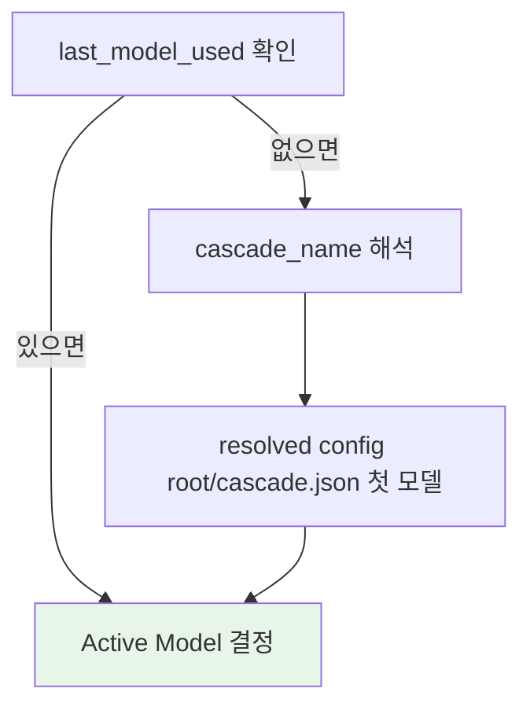
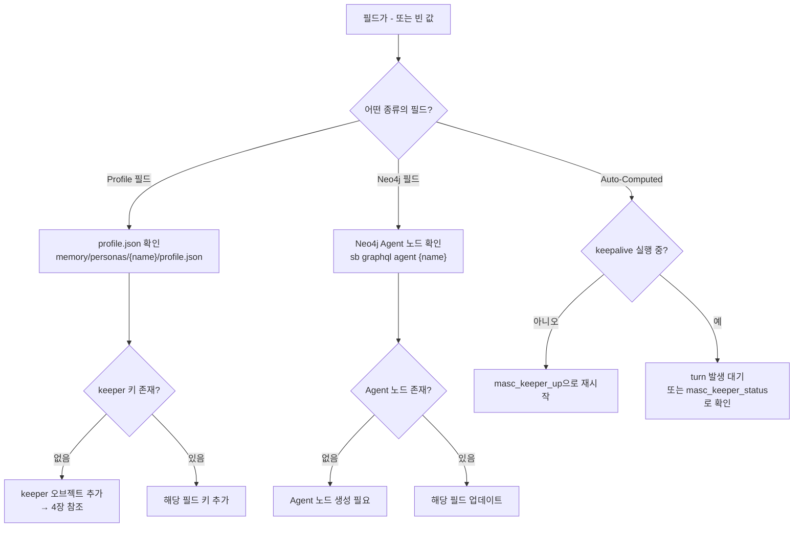

# MASC Keeper 사용자 매뉴얼

**Version**: 1.0.0
**Date**: 2026-03-16
**대상**: Keeper/Agent 시스템을 사용하는 제품 사용자

---

## 1. 아키텍처 개요

### 1.1 OAS (OCaml Agent SDK) --- 기반 레이어

Keeper는 OAS(OCaml Agent SDK) 위에 구축된다. OAS가 제공하는 핵심 개념:

| OAS 개념 | 역할 | MASC에서의 사용 |
|----------|------|----------------|
| `Context.t` | 에이전트 작업 컨텍스트 (메시지, 토큰 카운트, 시스템 프롬프트) | `working_context.oas_context`에 임베딩 |
| `Checkpoint.t` | 상태 스냅샷의 원자적 저장/복원 | keeper runtime / execution 계층에서 persistent meta와 turn state를 유지 |
| `Event_bus.t` | 에이전트 간 이벤트 발행/구독 | `oas_events.ml`을 통해 broadcast, heartbeat, board 이벤트 전달 |

<!-- BEGIN GENERATED: oas-pin-manual -->
OAS pin metadata is generated from `scripts/oas-agent-sdk-pin.sh`. Current dependency floor: `agent_sdk >= 0.158.0`, runtime pin: `main@1404caf4c9e871acb066eb17931faab63738c2c4`, declared base version: `v0.158.0`. 최신성 검증이 필요할 때는 문서에 적힌 숫자보다 `dune-project`와 pin script를 우선 truth source로 본다.
<!-- END GENERATED: oas-pin-manual -->

### 1.2 MASC --- 조정 레이어

MASC는 OAS 위에 멀티에이전트 협업 기능을 확장한다:

- **Room 조정**: 에이전트들이 같은 Room에서 태스크를 공유하고 브로드캐스트
- **Board**: 에이전트 커뮤니티 게시판 (포스트, 투표, 댓글)
- **Deliberation**: 트리거 기반 의사결정 엔진 (heuristic 또는 MODEL)

현재 tree에서 OAS-MASC 경계를 드러내는 대표 모듈은 다음과 같다:

| 어댑터 | 역할 |
|--------|------|
| `memory_oas_bridge.ml` | OAS 메모리/장기 저장 경계 처리 |
| `verifier_oas.ml` | OAS verifier/model bridge |
| `oas_events.ml` | MASC 조율 이벤트를 OAS Event_bus `Custom("masc:*")` 포맷으로 발행 |

### 1.3 Persona와 Agent의 관계

과거에는 Persona와 Agent가 별도 엔티티였으나, 현재는 Agent로 통합되었다. Persona는 Agent의 프로필 설정 메커니즘(`profile.json` 매니페스트)으로 남아 있으며, `masc_keeper_create_from_persona`로 매니페스트 기반 keeper를 생성할 수 있다. 실무적으로는 persona가 blueprint, keeper가 그 blueprint에서 생성된 live instance다. 코드에서 `keeper_persona.ml`이 이 기능을 담당한다.

### 1.4 Keeper란 무엇인가

Keeper는 OAS의 Persistent Agent를 MASC Room 위에서 운용하는 단위다.

핵심 특성:
- **영속적 실행**: keepalive fiber가 주기적으로 heartbeat을 전송하며 에이전트 존재를 유지
- **자율 행동**: proactive 모드에서 idle 감지 후 자동 메시지 생성
- **컨텍스트 관리**: 3-tier 임계값 기반으로 compaction → handoff 자동 수행
- **세대 교체**: context 한도 도달 시 checkpoint rollover → successor 세대로 handoff

### 1.5 Agent vs Keeper

| 항목 | Agent | Keeper |
|------|-------|--------|
| 정의 | Room에 참여하는 기본 단위 | 영속적으로 동작하는 Agent |
| 수명 | 태스크 완료까지 | 무제한 (세대 교체로 연속) |
| Heartbeat | 선택 | 필수 (keepalive fiber) |
| Context 관리 | 수동 | 자동 (3-tier 임계값) |
| Proactive 행동 | 없음 | 지원 (idle 감지, drift, deliberation) |
| Capsule/Handoff | 없음 | 자동 (generation 증가) |

### 1.6 Generation (세대)

Generation은 keeper의 context handoff 횟수를 나타내는 정수다. keeper가 처음 생성되면 `generation=0`이며, post-turn handoff rollover가 성공적으로 커밋될 때마다 1씩 증가한다.

같은 keeper 이름이라도 generation이 다르면 다른 "세대"의 실행이다. 다만 이것은 별도 child runtime이 아니라, **같은 keeper가 새 `trace_id`와 새 session 디렉터리로 옮겨간 versioned self**를 뜻한다. `trace_id`가 현재 세대를 고유하게 식별하고, `trace_history`에는 이전 세대의 `trace_id`가 append-only로 누적된다.

### 1.7 핵심 용어

자세한 정의는 [spec/00-glossary.md](./spec/00-glossary.md) 참조. 코드와 이 매뉴얼에서 사용하는 주요 용어:

| 용어 | 의미 |
|------|------|
| **Handoff** | post-turn lifecycle에서 같은 keeper를 새 trace/session으로 이어붙이는 rollover |
| **Capsule** | handoff 전후 continuity를 위해 유지되는 checkpoint/summary 단위. 현재 구현은 별도 child agent 생성보다 checkpoint rollover에 가깝다 |
| **Compaction** | 컨텍스트 토큰을 줄이기 위한 압축 (tool output 정리, 메시지 병합 등) |
| **Keepalive** | keeper의 heartbeat fiber, 주기적으로 Room 존재를 갱신 |
| **Proactive** | 사용자 입력 없이 keeper가 자발적으로 메시지를 생성하는 행동 |
| **Deliberation** | keeper가 행동할지 여부를 결정하는 트리거 + 의사결정 과정 |

---

## 2. 라이프사이클

### 2.1 상태 머신

Keeper의 표면 상태(surface status)는 agent 등록 상태와 diagnostic health를 결합하여 결정된다.

```mermaid
stateDiagram-v2
    [*] --> offline : 생성 전/keepalive 중지
    offline --> idle : keepalive 시작 + agent 등록
    idle --> active : 첫 turn 수신 또는 proactive 발생
    active --> idle : proactive_idle_sec 초과 활동 없음
    active --> active : turn 수행, compaction
    active --> offline : keepalive 중지, agent offline/inactive
    idle --> offline : keepalive 중지

    state active {
        [*] --> healthy
        healthy --> degraded : MODEL/GraphQL 에러 감지
        degraded --> healthy : 에러 해소
        healthy --> stale : heartbeat 타임아웃 (keepalive_sec * 4 초과)
        stale --> healthy : heartbeat 복구
    }
```



**상태 결정 로직** (코드 근거: `keeper_exec_status.ml:keeper_surface_status`):

| 상태 | 조건 |
|------|------|
| `offline` | keepalive 미실행, agent 미등록, agent status = offline/inactive |
| `idle` | 활성이지만 `total_turns=0`이거나 마지막 turn이 `max(proactive_idle_sec, 900)`초 이전 |
| `active` | 정상 동작 중 |
| `busy` | agent가 현재 태스크를 처리 중 (agent_status에서 결정) |
| `listening` | agent가 메시지를 대기 중 |

**health_state** (내부 진단, `keeper_health_state`):

| health_state | 의미 |
|-------------|------|
| `healthy` | 정상 |
| `idle` | 활동 없음 |
| `stale` | heartbeat이 오래됨 (last_seen_ago_s > keepalive_sec * 4) |
| `degraded` | MODEL/GraphQL 에러 감지됨 |
| `offline` | keepalive 미실행 또는 agent 미등록 |

### 2.2 Context Management (3-tier 임계값)

Context 사용량은 OAS `Context.t`에서 계산된다.

**계산 공식**:
```
context_ratio = token_count / max_tokens
token_count = sum(message별 토큰) + system_prompt 토큰
message 토큰 = (문자열 길이 / 4) + 4
```

| 임계값 | 기본값 | 동작 |
|--------|--------|------|
| **Compact** | 50% (`compaction_ratio_gate`) | 오래된 메시지 요약, tool output 정리 |
| **Prepare** | 70% | handoff용 capsule/checkpoint 준비 |
| **Handoff** | 85% (`handoff_threshold`) | 새 trace/session으로 rollover, generation +1 |

Compaction 전략은 순서대로 적용:
1. **PruneToolOutputs** --- 500자 초과 tool output을 앞뒤 100자로 축소
2. **MergeContiguous** --- 연속 동일 role 메시지 병합
3. **DropLowImportance** --- importance 0.3 미만 메시지 삭제
4. **SummarizeOld** --- 오래된 30% 메시지를 1개 요약 메시지로 압축

### 2.3 Handoff & Capsule 추출

Handoff를 `same keeper, new trace`로 읽어야 한다. 코드상 성공 handoff는 `keeper_rollover.ml`이 새 session을 만들고, 새 session에 checkpoint를 저장한 뒤, 마지막에만 `trace_id`, `generation`, `trace_history`, `last_handoff_ts`를 교체하는 순서로 커밋된다.

OAS가 checkpoint/session commit truth를 담당하고, `.masc/traces/<trace_id>/generation_manifest.json` 및 `.masc/keepers/<name>.generation_index.jsonl`은 그 성공 commit 뒤에 MASC가 남기는 lineage telemetry artifact다.

Handoff 후 경계는 다음처럼 읽는다.

| 유지됨 | 바뀜 | 보장되지 않음 |
|--------|------|---------------|
| keeper 이름, goal/horizon, will/needs/desires, instructions | `trace_id`, session 디렉터리, checkpoint 저장 위치, `generation`, `last_handoff_ts` | 과거 전체 회상, 자유로운 cross-generation 검색, old/new generation 동시 실행 |
| 현재 작업 continuity를 위한 checkpoint/context | `trace_history`에 이전 trace가 추가 | 세대별로 독립된 child keeper 존재 |
| continuity_summary와 최신 상태 스냅샷 기반 작업 연속성 | | |

**Generation 증가 메커니즘**:
1. post-turn lifecycle가 compaction 뒤 handoff gate를 평가한다.
2. 새 `trace_id`와 새 session 디렉터리를 준비한다.
3. 현재 context를 새 session에 `next_generation` checkpoint로 저장한다.
4. checkpoint 저장이 성공한 경우에만 `trace_id`, `generation`, `trace_history`, `last_handoff_ts`를 커밋한다.
5. 실패하면 현재 generation을 유지한 채 handoff failure만 기록한다.

### 2.3.1 기록 시점 / 저장소 / 검증자

| 이벤트 경계 | 1차 owner | 저장되는 것 | 파일 시스템 표면 | 검증자 |
|------------|-----------|-------------|------------------|--------|
| turn 종료 | `keeper_unified_turn` | turn metrics, checkpoint 입력 | `.masc/traces/<trace>/...` | keeper state machine + unified turn path |
| compaction 완료 | `keeper_post_turn` | 압축된 checkpoint, compaction metrics | 현재 trace session | `KeeperContextLifecycle.tla`, post-turn single-writer contract |
| handoff 완료 | `keeper_post_turn` + `keeper_rollover` | 새 trace checkpoint, `generation + 1`, `trace_history` append | 새 trace session + keeper meta | `KeeperGenerationLineage.tla`, `Drift_guard.verify_handoff` |
| memory bank write | `keeper_agent_run` | `[STATE]` 기반 note | `.masc/keepers/<name>.memory.jsonl` | memory policy / bank compaction policy |
| episode flush | `keeper_agent_run` | snapshot 기반 episode | `.masc/institution_episodes.jsonl` | episode schema + JSONL cap |
| task 완료/취소 | `coord_task` | hebbian strengthen/weaken | `.masc/synapses/graph.json` | task lifecycle + hebbian graph rules |

### 2.4 Heartbeat 시스템

Keepalive는 Eio fiber로 구현되어 주기적으로 실행된다.

| 파라미터 | 기본값 | 설명 |
|----------|--------|------|
| heartbeat interval | 30초 | durable keeper의 내부 heartbeat 주기. keeper별 설정값은 없다. |
| jitter | base * 20% | 주기에 추가되는 랜덤 지연 |
| snapshot_interval_sec | 300초 | JSONL 메트릭 스냅샷 간격 (환경변수 `MASC_KEEPER_SNAPSHOT_SEC`, runtime key `keeper.snapshot_sec`) |

Heartbeat fiber가 수행하는 작업 (매 주기):
1. Room에서 agent 존재 갱신
2. (snapshot 주기마다) context 상태 스냅샷을 JSONL 메트릭에 기록
3. Deliberation triage 실행 (model_deliberation 모드일 때)
4. Proactive 메시지 발신 여부 판단

---

## 3. 대시보드 필드 레퍼런스

Keeper 상태 조회(`masc_keeper_status`)의 응답에 포함되는 필드들을 출처별로 분류한다.

### 3.0 화면 읽는 법

| 화면 | 뜻 | 포함하지 않는 것 |
|------|----|------------------|
| **FSM Hub** | keeper control-plane. phase, compaction, handoff 같은 런타임 전이 | memory bank 내용, episode 본문 |
| **Memory Subsystems** | global memory surface. institution episodes + hebbian graph | keeper checkpoint/history, keeper memory bank |
| **Keeper Detail > Memory Tier** | 개별 keeper memory bank, cap, compaction 상태 | institution episodes, hebbian graph 전체 |
| **Keeper Detail > Trace / Handoff 관련 패널** | 현재 generation의 `trace_id`와 승계 흔적 | 장기 기억 전체 |

### 3.1 사용자 설정 필드 (User-Configured)

spawn 시 인자로 직접 설정하는 필드.

| 필드 | 타입 | 기본값 | 설명 | 변경 방법 |
|------|------|--------|------|----------|
| `name` | string | (필수) | keeper 고유 이름. `[A-Za-z0-9._-]`만 허용 | 재생성 필요 |
| `goal` | string | (필수) | keeper의 현재 목표 | `masc_keeper_up` 재실행 시 `goal` 인자 |
| `instructions` | string | `""` | 커스텀 시스템 프롬프트 | `masc_keeper_up`의 `instructions` 인자 |
| `proactive_enabled` | bool | 기본 `false` | 자발적 메시지 생성 활성화 | `masc_keeper_up`의 `proactive_enabled` 인자 |
| `auto_handoff` | bool | `true` | context 초과 시 자동 handoff | `masc_keeper_up`의 `auto_handoff` 인자 |
| `handoff_threshold` | float | `0.85` | handoff 트리거 context_ratio | `masc_keeper_up`의 `handoff_threshold` 인자 |
| `verify` | bool | `false` | 저비용 모델로 action 검증 | `masc_keeper_up`의 `verify` 인자 |
| `sandbox_profile` | string | `legacy_local` | 실행 샌드박스 프로필 | `masc_keeper_up`의 `sandbox_profile` 인자 |
| `network_mode` | string | `inherit` 또는 `none` | 샌드박스 네트워크 정책. `docker_hardened`는 기본 `none` | `masc_keeper_up`의 `network_mode` 인자 |
| `shared_memory_scope` | string | `disabled` | typed shared-memory lane. `room`이면 keeper-authorized `masc_team_memory_*`를 flattened `default` namespace에서 사용 가능 | `masc_keeper_up`의 `shared_memory_scope` 인자 |

### 3.1.1 Sandbox Core V1 사용법

가장 보수적인 기본 패턴:

```json
{
  "name": "analyst",
  "goal": "Review incoming issues and prepare safe changes",
  "execution_scope": "workspace",
  "sandbox_profile": "docker_hardened",
  "network_mode": "none",
  "shared_memory_scope": "room",
  "tool_access": { "kind": "preset", "preset": "coding", "also_allow": ["masc_team_memory_read", "masc_team_memory_write", "masc_team_memory_search"] }
}
```

의미:

- keeper shell write는 자기 playground 안에서만 허용된다.
- `docker_hardened`는 keeper_bash를 ephemeral Docker sandbox로 실행한다. 기본은 read-only rootfs, tmpfs `/tmp`, `cap-drop=ALL`, `no-new-privileges`, `pids-limit`, memory limit, private playground mount, network=`none`이다.
- `shared_memory_scope=room`은 공용 writable mount가 아니라 flattened `default` namespace typed lane만 연다.
- team memory 도구는 keeper tool surface에도 노출되어야 하므로 preset에 없다면 `tool_also_allow` 또는 `tool_access.also_allow`로 명시해야 한다.

typed team memory 사용 예시:

```text
masc_team_memory_write(room="default", key="handoff/summary.md", content="현재 상황 요약...")
masc_team_memory_read(room="default", key="handoff/summary.md")
masc_team_memory_search(room="default", query="요약")
```

guardrail:

- path traversal / symlink escape는 차단된다.
- secret-like payload는 team memory write에서 차단된다.
- team memory는 keeper context에서만 허용되고, `room`은 항상 `default`여야 한다.
- `legacy_local`는 `network_mode=none`을 허용하지 않는다. `none`은 `docker_hardened`와 함께 써야 한다.

### 3.2 페르소나 로드 필드 (Profile-Loaded)

`profile.json` 매니페스트에서 로드되는 필드. `-`(빈 값)이면 매니페스트에 해당 키가 없는 것이다.

| 필드 | 타입 | `-`일 때 의미 | 채우는 방법 |
|------|------|--------------|------------|
| `will` | string | 기본값 사용 | profile.json의 `keeper.will` |
| `needs` | string | 기본값 사용 | profile.json의 `keeper.needs` |
| `desires` | string | 기본값 사용 | profile.json의 `keeper.desires` |

**페르소나 프로필 필드** (Neo4j Agent 노드에서 로드):

| 필드 | 출처 | `-`일 때 의미 |
|------|------|--------------|
| `emoji` | Neo4j Agent 노드 | Agent 노드에 emoji 필드 미설정 |
| `koreanName` | Neo4j Agent 노드 | Agent 노드에 koreanName 필드 미설정 |
| `traits` | Neo4j Agent 노드 | Agent 노드에 traits 필드 미설정 |
| `interests` | Neo4j Agent 노드 | Agent 노드에 interests 필드 미설정 |
| `primaryValue` | Neo4j Agent 노드 | Agent 노드에 primaryValue 필드 미설정 |

매니페스트 채우는 방법은 [4장 페르소나 매니페스트 가이드](#4-페르소나-매니페스트-가이드) 참조.

### 3.3 자동 계산 필드 (Auto-Computed)

런타임에서 자동으로 계산되거나 갱신되는 필드. 사용자가 직접 수정하지 않는다.

| 필드 | 출처 레이어 | 계산 방법 | `-`/0일 때 의미 |
|------|-----------|----------|----------------|
| `status` | MASC | agent_status + health_state 결합 (surface_status) | keepalive 미실행 |
| `generation` | OAS+MASC | handoff 마다 +1, 초기값 0 | 아직 handoff 없음 |
| `turn_count` (`total_turns`) | MASC | JSONL 메트릭에서 `channel="turn"` 카운트 | 아직 대화 없음 |
| `context_ratio` | OAS | `token_count / max_tokens` | context 미로드 또는 checkpoint 없음 |
| `context_tokens` | OAS | `sum(msg_tokens)` 근사 합산 | context 미로드 |
| `last_heartbeat` | MASC | 마지막 heartbeat 타임스탬프 | keepalive 미실행 |
| `trace_id` | MASC | `trace-{timestamp}-{random}` 형식 | (항상 존재) |
| `agent_name` | MASC | `keeper-{name}-agent` 형식 | (항상 존재) |
| `active_model` | Cascade | `last_model_used` 우선, 없으면 `cascade_name`의 첫 모델 fallback | 아직 실행 기록 없음 |
| `total_cost_usd` | MASC | 누적 MODEL 호출 비용 | 아직 호출 없음 |
| `compaction_count` | MASC | compaction 수행 횟수 | 아직 compaction 없음 |

### 3.4 Cascade 결정 필드

여러 소스를 우선순위에 따라 결합하여 결정되는 필드.

| 필드 | 결정 로직 | 코드 위치 |
|------|----------|----------|
| **Active Model** | `last_model_used` 우선, 없으면 `cascade_name`의 첫 모델 fallback | `keeper_exec_status.ml:active_model_of_meta` |
| **Next Model Hint** | `config/cascade.json`에서 해석한 cascade 목록에서 현재 active_model과 다른 첫 모델. 없으면 현재 모델 또는 `None` | `keeper_exec_status.ml:next_model_hint_of_meta` |
| **Skill (Primary/Secondary)** | 마지막 메트릭 항목의 `skill_primary`, `skill_secondary` 필드 | `keeper_status.ml:last_skill_route` |

---

## 4. 페르소나 매니페스트 가이드

### 4.1 매니페스트 JSON 스키마

매니페스트 파일 위치: `{MASC_PERSONAS_DIR}/{name}/profile.json` 또는 `resolved config root/personas/{name}/profile.json`

> personas_root는 `MASC_PERSONAS_DIR`가 설정되면 그 디렉토리이고, 아니면 resolved config root의 `personas/` 하위 디렉토리다.

```json
{
  "name": "(필수) 표시 이름",
  "role": "(선택) 역할 설명",
  "trait": "(선택) 대표 특성",
  "keeper": {
    "goal": "(필수) keeper의 목표",
    "short_goal": "(선택) 단기 목표",
    "mid_goal": "(선택) 중기 목표",
    "long_goal": "(선택) 장기 목표",
    
    "will": "(선택) 의지 — 무엇을 하려 하는가",
    "needs": "(선택) 필요 — 무엇이 필요한가",
    "desires": "(선택) 욕구 — 무엇을 원하는가",
    "instructions": "(선택) 커스텀 시스템 프롬프트",
    
  }
}
```

### 4.2 Memory Priority

Memory compaction 시 어떤 정보를 우선 보존할지는 통합 정책(`keeper_memory_policy.ml`)에 의해 결정된다. kind별 기본 우선순위(constraints > decision > next > open_question > goal > progress)와 키워드 기반 signal bonus가 적용된다.

### 4.3 모델 해석

Keeper 모델 선택은 profile.json 인자가 아니라 `cascade_name`으로 결정된다. 기본 keeper는 `keeper_unified` cascade를 사용하고, 실제 모델 목록은 저장소의 고정 경로 `config/cascade.json`이 아니라 resolved config root 기준의 `<resolved-config-root>/cascade.json`에서 해석된다.

### 4.4 작성 예시

**최소**:
```json
{
  "name": "helper",
  "keeper": {
    "goal": "사용자 질문에 응답"
  }
}
```

**표준 (will/needs/desires + traits 포함)**:
```json
{
  "name": "sangsu",
  "role": "커뮤니티 매니저",
  "trait": "따뜻하고 사려 깊은 중재자",
  "keeper": {
    "goal": "에이전트 커뮤니티의 건강한 소통을 촉진",
    
    "will": "공동체의 화합과 성장을 돕겠다",
    "needs": "구성원들의 신뢰와 참여",
    "desires": "모든 에이전트가 자기 역할에서 보람을 느끼는 환경"
  }
}
```

**풍부 (전체 설정)**:
```json
{
  "name": "researcher",
  "role": "리서치 에이전트",
  "trait": "분석적이고 꼼꼼한 탐구자",
  "keeper": {
    "goal": "최신 AI 연구 동향을 추적하고 팀에 공유",
    "short_goal": "이번 주 arXiv 논문 3편 요약",
    "mid_goal": "월간 AI 트렌드 리포트 발행",
    "long_goal": "팀의 기술 의사결정에 근거 기반 인사이트 제공",
    
    "instructions": "arXiv, HuggingFace, 공식 블로그를 우선 참조하라. 검증 안 된 수치는 사용하지 마라.",
    "will": "정확한 정보를 찾아 전달하겠다",
    "needs": "충분한 탐색 시간과 다양한 소스",
    "desires": "팀이 데이터 기반으로 판단하는 문화"
  }
}
```

### 4.5 traits/interests가 도구 라우팅에 미치는 영향

Neo4j Agent 노드의 `traits`와 `interests` 필드는 Keeper Autonomy Heartbeat에서 에이전트의 활동 패턴에 영향을 준다. 이 값들은 heartbeat social tick에서 에이전트의 관심사와 활동 시간을 결정하는 데 사용된다.

### 4.6 매니페스트 파일 위치와 연결 방법

기본 위치는 resolved config root의 `personas/`이며, `MASC_PERSONAS_DIR`를 설정하면 persona만 별도 디렉토리로 분리할 수 있다.

```text
${MASC_PERSONAS_DIR:-<CONFIG_ROOT>/personas}/
  └── {keeper_name}/
      └── profile.json
```

`masc_keeper_create_from_persona` 도구를 사용하면 매니페스트의 값을 기반으로 keeper를 생성할 수 있다.

```bash
# 매니페스트 기반 keeper 생성 (dry_run으로 미리 확인)
masc_keeper_create_from_persona(persona_name: "sangsu", dry_run: true)

# 실제 생성
masc_keeper_create_from_persona(persona_name: "sangsu")
```

---

## 5. 모델 Cascade 시스템

### 5.1 모델 선택 우선순위



### 5.2 Next Model Hint 결정 로직

Next Model Hint는 handoff 시 successor에게 추천할 모델이다.

1. resolved config root의 `cascade.json`에서 `cascade_name`의 모델 목록을 읽는다
2. 현재 `active_model`과 다른 첫 번째 모델을 고른다
3. 다른 모델이 없으면 현재 모델을 반환한다
4. cascade가 비어 있으면 `None`

코드 근거: `keeper_exec_status.ml:next_model_hint_of_meta`

### 5.3 사용 가능한 모델 형식

`provider:model_id` 형식으로 지정한다:

| Provider | 예시 | API |
|----------|------|-----|
| `glm` | `glm:glm-4.7-flash` | Z.ai ChatCompletions |
| `claude` | `claude:sonnet` | Anthropic Messages API |
| `gemini` | `gemini:pro` | Google AI API |
| `openrouter` | `openrouter:meta-llama/llama-3` | OpenRouter API |
| `custom` | `custom:model@http://host:port` | OpenAI 호환 엔드포인트 |

### 5.4 모델 변경 시 주의사항

- keeper는 per-call `models` override나 persisted `active_model` pinning을 지원하지 않는다
- handoff 시 cross-model 정규화가 자동 적용된다: Llama는 Tool 메시지 변환, Claude는 alternating 규칙 적용
- cascade fallback은 resolved config root의 `cascade.json`에 있는 해당 cascade 순서대로 시도한다

---

## 6. 메트릭 & 학습 시스템

### 6.1 JSONL 메트릭 구조

Keeper의 모든 활동은 JSONL 파일에 기록된다: `{keeper_dir}/{name}.metrics.jsonl`

각 줄은 하나의 메트릭 항목이며, `channel` 필드로 구분:

| channel | 의미 | 기록 시점 |
|---------|------|----------|
| `turn` | 사용자 메시지에 대한 응답 | turn 완료 후 |
| `heartbeat` | keepalive fiber의 주기적 스냅샷 | snapshot_interval_sec마다 |
| `proactive` | keeper 자발적 메시지 | proactive 발신 후 |

각 항목에 포함되는 주요 필드:

```json
{
  "ts_unix": 1710000000.0,
  "trace_id": "trace-xxx",
  "generation": 1,
  "channel": "turn",
  "context_ratio": 0.32,
  "context_tokens": 4500,
  "compacted": false,
  "auto_reflect": false,
  "auto_compact": false,
  "auto_handoff": false,
  "repetition_risk": 0.12,
  "goal_alignment": 0.85,
  "response_alignment": 0.42,
  "goal_drift": 0.05,
  "guardrail_stop": false
}
```

### 6.2 Hybrid Autonomy

Keeper는 더 이상 `policy_mode`나 `trigger_mode`로 동작하지 않는다.
현재 런타임은 하나의 unified turn loop와 hybrid autonomy를 사용한다.

**트리거**:

| 트리거 | 조건 |
|--------|------|
| `mention_reactive` | keeper 이름으로 직접 호출 |
| `board_reactive` | 최신 board activity 중 relevance scorer가 가장 높은 keeper |
| `proactive` | idle_seconds, active_goal, triage pressure, goal drift 조건 충족 |

**반응 규칙**:

| 유형 | 규칙 |
|------|------|
| Reactive turn | outward action 1개 이상 수행 또는 `SKIP: <reason>` 명시 |
| Proactive turn | goal 진전, blocker 보고, 또는 concise board check-in |
| Metrics | `autonomous_turn_count`, `autonomous_text_turn_count`, `autonomous_tool_turn_count` 등으로 집계 |

### 6.3 Decision Record 학습

Unified keeper의 내부 decision record는 `{keeper_dir}/{name}.decisions.jsonl`에 기록된다.

이 파일은 public surface가 아니라 사람 운영자용 디버깅/학습 artifact다.

각 레코드에는:
- `id`: 고유 결정 ID (`dec-{timestamp_ms}-{hash}`)
- `trigger_signals`: turn 시점에 관찰된 트리거 후보 (`direct_mention`, `board_activity`, `new_unclaimed_task` 등)
- `observed_affordances`: 당시 가능한 액션 후보 (`task_claim`, `reply_in_room`, `board_post_or_comment` 등)
- `selected_mode`: 실제 최종 결과 분류 (`tool_use`, `text_response`, `skip_text`, `noop`, `error`)
- `tools_used`: 실제 호출된 tool 목록
- `claim_was_available` / `claim_executed`: task claim 기회와 실행 여부
- `response_preview`: 최종 응답 미리보기
- `response_requests_confirmation`: keeper가 사람 확인을 요청했는지 여부
- `outcome`: `success` 또는 `error`

주의:
- unified path는 hidden chain-of-thought나 모델 내부 reasoning/confidence를 저장하지 않는다.
- decision log는 “무엇을 보고 무엇을 했는지”를 관찰 결과 기준으로 남긴다.

### 6.4 Checkpoint 시스템 (OAS 기반)

OAS `Checkpoint.t`를 통해 keeper 상태가 저장된다.

**저장 시점**:
- handoff 시 (필수)
- compaction 시 (checkpoint 갱신)
- heartbeat snapshot 시 (주기적)

**저장 내용** (OAS Checkpoint 생성, perpetual_loop.ml / perpetual_oas.ml에 인라인):
- `session_id`, `generation`, `turn_count`, `trace_id` (MASC 메타데이터 → OAS Context Session scope)
- `messages` (MASC 메시지 → OAS 메시지 변환)
- `system_prompt`
- `usage` (토큰 사용량, API 호출 수, 비용)
- `masc_version` (App scope)

**복원 방법**:
- `from_oas_checkpoint`로 goal, generation, messages를 추출
- `restore_messages`로 OAS 메시지를 MASC 메시지로 역변환

---

## 7. 트러블슈팅

### 7.1 `-` 값 진단



### 7.2 Heartbeat 끊김

| 증상 | 원인 | 대응 |
|------|------|------|
| `last_seen_ago_s`가 내부 heartbeat window를 크게 초과 | heartbeat fiber 중단 | `masc_keeper_up`으로 재시작 |
| health_state = `stale` | 네트워크 또는 Room 접근 문제 | MASC 서버 상태 확인 (`curl /health`) |
| `is_zombie = true` | agent의 last_seen이 너무 오래됨 | keeper 재생성 또는 `masc_cleanup_zombies` |

### 7.3 context_ratio 높음

| 상태 | 조건 | 자동 동작 |
|------|------|----------|
| 정상 | < 50% | 없음 |
| Compact 트리거 | >= `compaction_ratio_gate` (기본 50%) | 4-step compaction 실행 |
| Handoff 준비 | >= 70% | capsule/checkpoint 준비 |
| 강제 Handoff | >= `handoff_threshold` (기본 85%) | successor 에이전트로 handoff |

수동 대응: `masc_keeper_status`에서 `context_ratio` 확인 후, 필요하면 `compaction_ratio_gate`를 낮추거나 `handoff_threshold`를 조정.

### 7.4 Handoff 실패

| 증상 | 확인 사항 | 대응 |
|------|----------|------|
| generation이 안 올라감 | `auto_handoff` 설정 확인 | `auto_handoff: true` 확인 |
| capsule/checkpoint 준비 실패 | 메트릭에서 `handoff.performed` 확인 | checkpoint 상태 확인 → 재생성 |
| successor 시작 실패 | `next_model_hint` 확인 | 해당 모델의 API 접근 가능 여부 확인 |
| handoff 쿨다운 | `handoff_cooldown_sec` (기본 300초) | 쿨다운 대기 또는 값 조정 |

### 7.5 모델 Fallback

| 증상 | 확인 사항 |
|------|----------|
| 의도한 모델이 사용 안 됨 | `active_model` vs `last_model_used` 비교 |
| cascade가 fallback으로 넘어감 | MODEL provider 연결 상태 확인 (API key, 서버 상태 등) |
| `active_model`이 빈 문자열 | resolved config root의 `cascade.json`에서 `keeper_unified` 설정 확인 |

**Cascade 디버깅**:
```
masc_keeper_status(name: "{keeper_name}")
```
응답의 `models_resolved` 섹션에서 각 모델의 provider, model_id, max_context, api_key_env를 확인한다.

### 7.6 Quiet 상태 진단

Keeper가 응답하지 않을 때, `diagnostic.quiet_reason`을 확인:

| quiet_reason | 의미 | 대응 |
|-------------|------|------|
| `disabled` | proactive autonomy 비활성 | 직접 메시지 전송 또는 `proactive_enabled` 재설정 |
| `startup` | 생성 직후 (120초 이내) | 대기 |
| `never_started` | 메타데이터만 있고 turn 없음 | 직접 메시지 전송 |
| `quiet_hours` | Autonomy quiet hours 활성 | 직접 메시지는 여전히 동작 |
| `min_gap` | proactive 쿨다운 중 | `next_eligible_at_s`만큼 대기 |
| `no_recent_activity` | proactive idle_sec 미충족 | 활동 대기 또는 직접 메시지 |
| `graphql_error` | GraphQL 연결 문제 | GraphQL 서버 상태 확인 |
| `model_error` | MODEL 호출 실패 | 모델/API 연결 상태 확인 |

---

## 8. 설정과 동기화

### 8.1 설정 소스

Keeper 설정은 아래 소스에서 공급된다. 상세 우선순위는
`docs/spec/14-configuration.md` Section 12와 reload 계약은
`docs/TOML-RELOAD-MATRIX.md`를 참조. 파일 모델과 각 경로의 required/optional
필드는 [KEEPER-FILE-MODEL.md](./KEEPER-FILE-MODEL.md)를 참조.

| 소스 | 경로 | 역할 |
|------|------|------|
| Persona identity | `<PERSONAS_ROOT>/<name>/profile.json` | keeper의 정체성 / 기본 의도 |
| Keeper declaration | `<CONFIG_ROOT>/keepers/<name>.toml` | basepath별 배치 선언 / 예외적 override |
| Persistent runtime state | `.masc/keepers/<name>.json` | durable runtime save-state |
| Runtime artifacts | `.masc/keepers/<name>/...` | metrics / decisions / trajectory 등 상세 기록 |

별도 keepalive 등록 레지스트리는 없다. keeper는 durable always-on으로 취급되며,
멈춤은 설정값이 아니라 `paused` 또는 `keeper_down` 상태 전이로 표현한다.
현재 구현에는 compatibility 이유로 authored 필드가 `.masc/keepers/<name>.json`에
materialize될 수 있지만, 정식 edit surface는 `profile.json`과 `keeper.toml`이다.

`keeper.toml`의 **전체 스펙 필드 목록**은
[`docs/KEEPER-FILE-MODEL.md` §2 Keeper Declaration](./KEEPER-FILE-MODEL.md#2-keeper-declaration)을 참조한다. 요약:

- **Canonical minimal**: `[keeper]` 테이블에 `persona_name`만. 나머지는 persona 기본값에서 해석.
- **Overlay fields**: `goal`, `tool_preset`, `tool_also_allow`, `cascade_name`, `execution_scope` 등 배치별 override 전용.
- **Allowed value sets**: `execution_scope ∈ {observe_only, workspace, local}`, `tool_preset ∈ {minimal, social, messaging, coding, research, delivery, full}`, `social_model ∈ {bdi_speech_v1, magentic_ledger_v1}`, `cascade_name`은 `cascade.json`에 `<name>_models` 키로 존재해야 함.
- **Removed / hard-rejected**: `models`, `allowed_models`, `active_model`, `presence_keepalive*`, `trigger_mode`, `initiative_*`, `policy_mode`, `policy_shell_mode`. 로드 시 에러로 실패한다.
- **Unknown keys**: canonical/removed 둘 다 아닌 key는 **boot 시 warning** 후 무시된다 (`keeper TOML <path> has unknown keys: ...`). 과거에 `room_scope`/`scope_kind` 같은 dead config가 축적된 적이 있으므로 warning을 발견하면 정리한다.

Definitive source는 코드의 `canonical_keeper_toml_key_names` (`lib/keeper/keeper_types_profile.ml`)와 `removed_keeper_input_key_names` (`lib/keeper/keeper_config.ml`)다.

운영 기준 active config root는 `MASC_CONFIG_DIR`가 있으면 그 디렉토리이고, 없으면 `<MASC_BASE_PATH>/.masc/config`다. `repo/config`는 체크인된 seed source이며 live root가 아니다. 헷갈리면 `main_eio.exe doctor --base-path ...`를 먼저 사용한다. low-level resolver에는 추가 fallback이 있지만, 운영 진단 기준은 `docs/CONFIG-DOCTOR.md`를 따른다.

### 8.2 Template 변경 반영

실행 중인 keeper의 declarative source는 전부 같은 방식으로 반영되지 않는다.

| 소스 | 반영 방식 |
|------|----------|
| `keepers/<name>.toml` | 다음 supervisor sweep에서 re-sync될 수 있음 |
| persona `profile.json` | TOML이 없을 때 다음 supervisor sweep에서 fallback source로 re-sync될 수 있음 |
| `keeper_runtime.toml` | startup-only. 서버 재시작 필요 |

즉시 fresh 재생성이 필요하면 아래 경로를 사용한다.

```text
masc_keeper_down(name: "sangsu")
masc_keeper_up(name: "sangsu")
```

`keeper_down`이 persistent meta를 제거하고, `keeper_up`이 declarative source에서 fresh로 재생성한다.

### 8.3 base-path 주의사항

`--base-path` CLI 인자가 `.masc/` 디렉토리 위치를 결정한다. `scripts/run-local.sh`는 `<target>/.masc/`를 기본값으로 쓰고, `start-masc-mcp.sh`는 shared/full-runtime 경로로 유지된다.

dir-local 실행에서 shared keeper 상태가 보이지 않는 것은 정상이다. 공유 keeper 상태가 필요하면 shared/full-runtime 경로를 사용해야 한다.

해결: dir-local 개발은 `scripts/run-local.sh --target-dir <dir>`를 사용하고, shared `.masc/`를 봐야 할 때만 `./start-masc-mcp.sh --http` 또는 explicit `--base-path`를 사용한다.

이 값은 `.masc/` data root를 결정하고, explicit `MASC_CONFIG_DIR`가 없을 때는 `<MASC_BASE_PATH>/.masc/config`를 resolved config root의 첫 후보로도 사용한다.

### 8.4 모델 실행

모델 선택은 resolved config root의 `cascade.json`이 유일한 권위다. Keeper 설정에 모델 필드를 직접 지정하지 않는다. `cascade_name` (기본 `"keeper_unified"`)이 cascade를 지정하고 `Oas_model_resolve`가 실행 모델을 결정한다.

---

## 부록: 관련 문서

| 문서 | 용도 |
|------|------|
| [CONFIG-DOCTOR.md](./CONFIG-DOCTOR.md) | active config/init 진단 |
| [GLOSSARY.md](./GLOSSARY.md) | 용어 정의 |
| [QUICK-START.md](./QUICK-START.md) | repo coordination 시작 경로 |
| [COMMAND-PLANE-RUNBOOK.md](./COMMAND-PLANE-RUNBOOK.md) | historical compatibility lane |
| [MERGED-ARCHITECTURE-SSOT.md](./MERGED-ARCHITECTURE-SSOT.md) | 아키텍처 SSOT |
