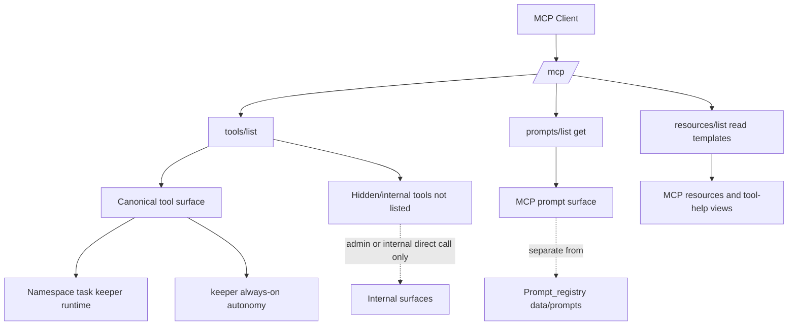
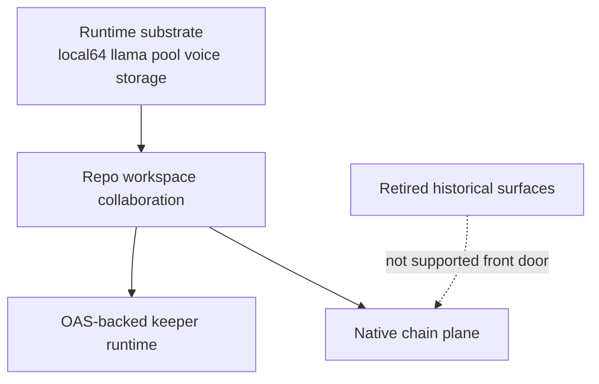

# MCP Surface Audit

Current-state audit of `masc` MCP exposure, public design, and documentation boundaries.

As of `2026-04-16`, the supported front door is repo workspace collaboration plus keeper/runtime visibility. Operator remains a reduced supporting surface; team-session and command-plane are retired historical surfaces.

## Evidence

- Local contract tests:
  - `_build/default/test/test_mcp_server_eio.exe`
  - `_build/default/test/test_mode_tool_count.exe`
- Live inventory diagnostics:
  - `_build/_tests/mode_tool_count/diagnostics.000.output`
- Public entrypoints:
  - [README.md](../README.md)
  - [SPEC-INDEX.md](./spec/SPEC-INDEX.md)
  - [01-system-overview.md](./spec/01-system-overview.md)
- MCP implementation:
  - [mcp_server.ml](../lib/mcp_server.ml)
  - [mcp_server_eio.ml](../lib/mcp_server_eio.ml)
  - [mcp_prompt_surface.ml](../lib/mcp_prompt_surface.ml)
  - [CAPABILITY-REGISTRY-SSOT.md](./CAPABILITY-REGISTRY-SSOT.md)

## Inventory Summary

| Surface | Count | Source | Notes |
|--------|------:|--------|-------|
| Raw tool schemas | ~156 | `Config.raw_all_tool_schemas` | Code-verified count (25 modules, 157 before `retired_front_door_schema_names` filter). Intentionally wider than `Tools.all_schemas_extended` (adds Board, Compact, Agent_timeline schemas that depend on Config). |
| Visible tool schemas | runtime-filtered | `Config.visible_tool_schemas ()` | Default `tools/list` public surface. Filtered by `Tool_catalog.is_visible` (Hidden, Deprecated, Admin-only excluded). Exact count varies by config. |
| MCP prompts | 1 | `lib/mcp_prompt_surface.ml` | `tool_help` |
| Fixed MCP resources | 21 | `lib/mcp_server.ml` | Status, tasks, messages, events, worktrees, schema, institution, library, tool-help index |
| MCP resource templates | 7 | `lib/mcp_server.ml` | Message/event ranges, library docs, per-tool help |
| Internal prompt templates | 18 | `data/prompts/` + `config/prompts/` | Chain/runtime prompt registry plus markdown-managed operator prompts, not MCP-discoverable |

The key split is intentional:

- `prompts/list/get` exposes a very small human-facing MCP prompt surface.
- `Prompt_registry` serves chain/runtime internals and should not be described as the public MCP prompt API.

## Public Surface Groups

| Group | Public Discovery Path | Canonical Examples | Notes |
|------|------------------------|--------------------|-------|
| Canonical MCP tools | `tools/list` | `masc_start`, `masc_transition`, `masc_keeper_status`, `masc_keeper_up`, `masc_board_post` | Default surface for normal clients, including keeper lifecycle diagnosis/recovery |
| Managed agent MCP | `/mcp/managed` | `masc_status`, `masc_tasks`, `masc_claim_next`, `masc_transition` | Internal managed-agent surface with canonical task-control tools plus curated passthrough tools; hidden call-only aliases are not supported |
| Removed alias ghosts | Not discoverable; not supported | `masc_claim`, `experiment_start`, `masc_trpg_*` | Do not preserve or reintroduce; use canonical task-control tools and current public schemas |
| MCP prompts | `prompts/list`, `prompts/get` | `tool_help` | Explanation/help layer, not runtime prompt registry |
| MCP resources | `resources/list/read` | `masc://status`, `masc://tasks`, `masc://tool-help-index` | Snapshot/read layer |
| Internal prompt/runtime plane | Not MCP-discoverable | `Prompt_registry`, `data/prompts/*.json`, `config/prompts/*.md` | Used by chains, keepers, dashboard judges, and runtime execution |

Web tool contract note:

- `masc_web_search` / `masc_web_fetch` are Keeper-internal backend tool names for the `WebSearch` / `WebFetch` aliases.
- They are not part of the canonical MCP `tools/list` public surface.
- Runtime selection remains config/env driven for Keeper web access: official APIs first when configured, scraping fallback second.

## Public Surface Map

## Workflow Pipelines

### 1. Project Scope and Task Hygiene

### 2. Repo Workspace + Keeper Runtime

### 3. Removed Game View Alias Lane

`decision.*`, `experiment.*`, `trpg.*`, `experiment_start`, and `masc_trpg_*`
are not current MCP front-door tools. Historical references belong only in
archive/audit records; root docs and tests must not document them as callable
surfaces unless a future product decision reintroduces them through the normal
tool schema/catalog path.

## Architecture Layers

## Findings

### What is working

- MCP server capabilities are exposed correctly for `tools`, `resources`, and `prompts`.
- `tools/list`, `prompts/list/get`, `resources/list/read/templates/list`, pagination, and resource subscriptions are covered by passing local tests.
- The public default surface remains coherent after retiring command-plane/team-session front-door exposure.

### What was confusing

- Historical docs still mention team-session/command-plane as if they were canonical.
- The root game-view protocol draft has been removed; `decision.*`, `experiment.*`, `trpg.*`, `experiment_start`, and `masc_trpg_*` must not be reintroduced as live docs.
- `Prompt_registry` and `Mcp_prompt_surface` describe two different prompt systems; without an explicit note, they look like one broken or incomplete system.
- `docs/spec/SPEC-INDEX.md` still contains historical descriptions that should not be treated as the current front door.
- `Config.raw_all_tool_schemas` and `Tools.all_schemas_extended` are two different assembly lists; the former includes Config-dependent modules (Board, Compact, Agent_timeline) that the latter deliberately omits to avoid a cycle.

### What this change fixes

- Front-door docs point to repo workspace collaboration and keeper runtime first.
- Team-session/command-plane paths are no longer treated as canonical.

## Orphan Classification

| Type | Examples | Status |
|------|----------|--------|
| Removed alias ghosts | `masc_claim`, `experiment_start`, `masc_trpg_*` | Deletion target; do not preserve for compatibility |
| Retired front-door | none in the live MCP/tool spec tables | Previously removed names should stay out of active specs and schemas |
| Intentional internal-only | `Prompt_registry`, `data/prompts/*.json`, `config/prompts/*.md` | Real runtime feature, not public MCP surface |
| Experimental but documented | `SWARM-RISC` | Keep clearly labeled as non-canonical or draft |
| Placeholder / review-needed | none | Dead hidden placeholder removed from the MCP schema inventory |
| Documentation orphan | old count claims, old module lists, stale “full spec” prose | Should be downgraded to historical or refreshed |

## Requirements Coverage

| Question | Best Source |
|---------|-------------|
| What tools are truly public? | `tools/list` plus [README.md](../README.md) |
| What hidden or deprecated tools still exist? | `masc_tool_help`, `Tool_catalog` |
| What prompts are public MCP prompts? | `prompts/list`, [mcp_prompt_surface.ml](../lib/mcp_prompt_surface.ml) |
| What prompt templates exist internally? | `data/prompts/`, `config/prompts/`, `Prompt_registry` |
| What resources exist? | `resources/list`, `resources/templates/list`, [mcp_server.ml](../lib/mcp_server.ml) |
| What is the canonical architecture? | [SPEC-INDEX.md](./spec/SPEC-INDEX.md) + [01-system-overview.md](./spec/01-system-overview.md) |
| What is the historical managed-operation flow? | [COMMAND-PLANE-RUNBOOK.md](./COMMAND-PLANE-RUNBOOK.md) |

## Design Judgment

- Fundamentally, the design is good enough to explain and operate.
- The main weakness is not missing architecture; it is overlapping explanation layers.
- The repo already has a real operating spine:
  - `Namespace / task hygiene`
  - `Keeper runtime on OAS`
- The biggest remaining risk is documentation drift, not core protocol shape.

## SSOT Rewrite Order

1. `README.md`
2. `docs/spec/01-system-overview.md`
3. `docs/QUICK-START.md`
4. `docs/COMMAND-PLANE-RUNBOOK.md`
5. `docs/spec/SPEC-INDEX.md` as historical snapshot, not current SSOT
