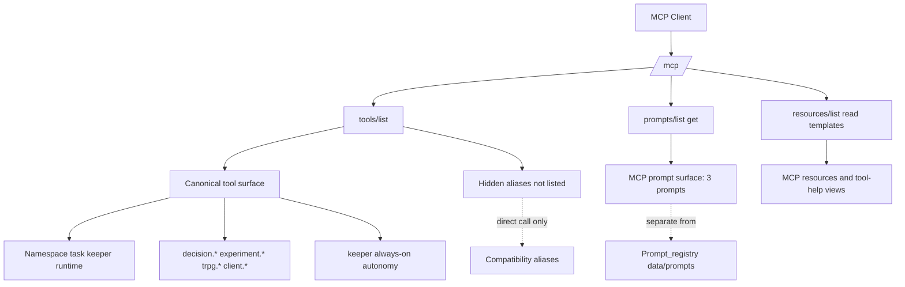
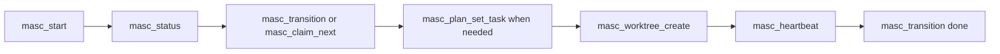
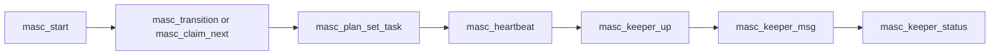
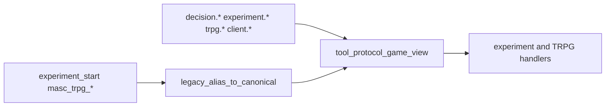
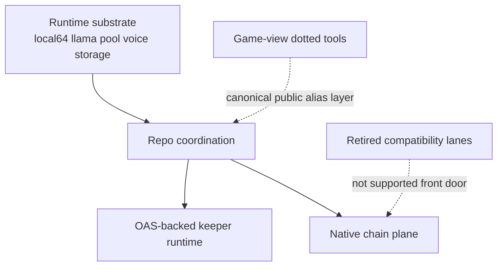

# MCP Surface Audit

Current-state audit of `masc-mcp` MCP exposure, public design, and documentation boundaries.

As of `2026-04-16`, the supported front door is repo coordination plus keeper/runtime visibility. Operator remains a reduced supporting surface; team-session and command-plane are historical compatibility lanes.

## Evidence

- Local contract tests:
  - `_build/default/test/test_mcp_server_eio.exe`
  - `_build/default/test/test_mode_tool_count.exe`
- Live inventory diagnostics:
  - `_build/_tests/mode_tool_count/diagnostics.000.output`
- Public entrypoints:
  - [README.md](../README.md)
  - [MERGED-ARCHITECTURE-SSOT.md](./MERGED-ARCHITECTURE-SSOT.md)
- MCP implementation:
  - [mcp_server.ml](../lib/mcp_server.ml)
  - [mcp_server_eio.ml](../lib/mcp_server_eio.ml)
  - [mcp_prompt_surface.ml](../lib/mcp_prompt_surface.ml)
  - [CAPABILITY-REGISTRY-SSOT.md](./CAPABILITY-REGISTRY-SSOT.md)

## Inventory Summary

| Surface | Count | Source | Notes |
|--------|------:|--------|-------|
| Raw tool schemas | 449 | `Config.raw_all_tool_schemas` | Includes hidden, deprecated, placeholder, and compatibility aliases |
| Visible tool schemas | 403 | `Config.visible_tool_schemas ()` | Default `tools/list` public surface |
| MCP prompts | 3 | `lib/mcp_prompt_surface.ml` | `tool_help`, `team_session_proof`, `command_truth` |
| Fixed MCP resources | 21 | `lib/mcp_server.ml` | Status, tasks, messages, events, worktrees, schema, institution, library, tool-help index |
| MCP resource templates | 7 | `lib/mcp_server.ml` | Message/event ranges, library docs, per-tool help |
| Internal prompt templates | 18 | `data/prompts/` + `config/prompts/` | Chain/runtime prompt registry plus markdown-managed operator prompts, not MCP-discoverable |

The key split is intentional:

- `prompts/list/get` exposes a very small human-facing MCP prompt surface.
- `Prompt_registry` serves chain/runtime internals and should not be described as the public MCP prompt API.

## Public Surface Groups

| Group | Public Discovery Path | Canonical Examples | Notes |
|------|------------------------|--------------------|-------|
| Canonical MCP tools | `tools/list` | `masc_start`, `masc_transition`, `masc_keeper_status`, `decision.create`, `experiment.start`, `trpg.dice.roll` | Default surface for normal clients |
| Managed agent MCP | `/mcp/managed` | `masc_room_status`, `masc_list_tasks`, `masc_claim_task`, `masc_plan_set_task` | Internal managed-agent surface with SDK aliases such as `masc_set_current_task` plus curated passthrough tools |
| Compatibility aliases | Deprecated and excluded from default `tools/list` | `masc_claim`, `experiment_start`, `masc_trpg_dice_roll` | Still callable for compatibility; not part of the truthful default inventory |
| MCP prompts | `prompts/list`, `prompts/get` | `tool_help`, `team_session_proof`, `command_truth` | Explanation/proof layer, not runtime prompt registry |
| MCP resources | `resources/list/read` | `masc://status`, `masc://tasks`, `masc://tool-help-index` | Snapshot/read layer |
| Internal prompt/runtime plane | Not MCP-discoverable | `Prompt_registry`, `data/prompts/*.json`, `config/prompts/*.md` | Used by chains, keepers, dashboard judges, and runtime execution |

`masc_web_search` public contract note:

- Public tool name remains `masc_web_search`.
- Request contract remains `query` + optional `limit`.
- Response contract remains `{status:"ok", result:{query, engine, search_url, result_count, results[]}}`, with normalized per-result metadata (`source`, `rank`, optional `published_at`) added inside `results[]`.
- Runtime selection is config/env driven: official APIs first when configured, scraping fallback second.

## Public Surface Map

## Workflow Pipelines

### 1. Project Scope and Task Hygiene

### 2. Repo Coordination + Keeper Runtime

### 3. Game View and Legacy Alias Lane

## Architecture Layers

## Findings

### What is working

- MCP server capabilities are exposed correctly for `tools`, `resources`, and `prompts`.
- `tools/list`, `prompts/list/get`, `resources/list/read/templates/list`, pagination, and resource subscriptions are covered by passing local tests.
- The dotted canonical names for `decision.*`, `experiment.*`, and `trpg.*` are real public tools, not just documentation fiction.
- The public default surface remains coherent after retiring command-plane/team-session front-door exposure.

### What was confusing

- Historical docs still mention team-session/command-plane as if they were canonical.
- `Prompt_registry` and `Mcp_prompt_surface` describe two different prompt systems; without an explicit note, they look like one broken or incomplete system.
- `docs/spec/SPEC-INDEX.md` still contains historical descriptions that should not be treated as the current front door.

### What this change fixes

- Front-door docs point to repo coordination and keeper runtime first.
- Team-session/command-plane compatibility paths are no longer treated as canonical.

## Orphan Classification

| Type | Examples | Status |
|------|----------|--------|
| Intentional compatibility | `masc_claim`, `experiment_start`, `masc_trpg_*` | Deprecated/default-off aliases; keep if compatibility matters |
| Intentional internal-only | `Prompt_registry`, `data/prompts/*.json`, `config/prompts/*.md` | Real runtime feature, not public MCP surface |
| Experimental but documented | `SWARM-RISC`, `GAME-VIEW-PROTOCOL` draft | Keep clearly labeled as non-canonical or draft |
| Placeholder / review-needed | none | Dead hidden placeholder removed from the MCP schema inventory |
| Documentation orphan | old count claims, old module lists, stale “full spec” prose | Should be downgraded to historical or refreshed |

## Requirements Coverage

| Question | Best Source |
|---------|-------------|
| What tools are truly public? | `tools/list` plus [README.md](../README.md) |
| What hidden or deprecated tools still exist? | `masc_tool_admin_snapshot`, `masc_tool_help`, `Tool_catalog` |
| What prompts are public MCP prompts? | `prompts/list`, [mcp_prompt_surface.ml](../lib/mcp_prompt_surface.ml) |
| What prompt templates exist internally? | `data/prompts/`, `config/prompts/`, `Prompt_registry` |
| What resources exist? | `resources/list`, `resources/templates/list`, [mcp_server.ml](../lib/mcp_server.ml) |
| What is the canonical architecture? | [MERGED-ARCHITECTURE-SSOT.md](./MERGED-ARCHITECTURE-SSOT.md) |
| What is the historical managed-operation flow? | [COMMAND-PLANE-RUNBOOK.md](./COMMAND-PLANE-RUNBOOK.md) |

## Design Judgment

- Fundamentally, the design is good enough to explain and operate.
- The main weakness is not missing architecture; it is overlapping explanation layers.
- The repo already has a real operating spine:
  - `Namespace / task hygiene`
  - `Keeper runtime on OAS`
  - optional dotted game-view aliases
- The biggest remaining risk is documentation drift, not core protocol shape.

## SSOT Rewrite Order

1. `README.md`
2. `docs/spec/01-system-overview.md`
3. `docs/QUICK-START.md`
4. `docs/COMMAND-PLANE-RUNBOOK.md`
5. `docs/GAME-VIEW-PROTOCOL.md` as explicit draft
6. `docs/spec/SPEC-INDEX.md` as historical snapshot, not current SSOT
