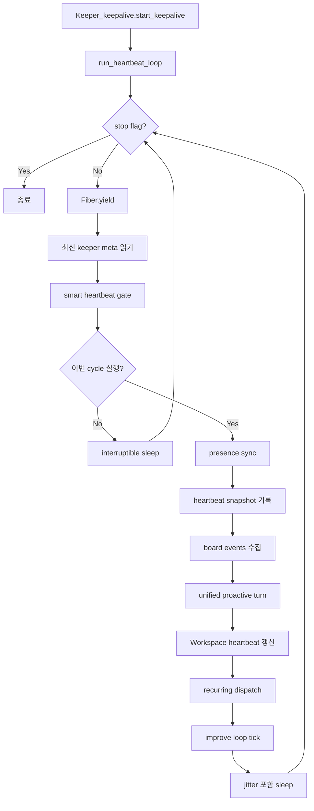

# MASC Quick Start

이 문서는 `처음 띄우고`, `연결하고`, `첫 작업을 시작하는` 데 필요한 최소 절차만 모은다.
세부 운영 규칙은 runbook 문서를 SSOT로 본다.

## 1. 설치와 서버 시작

```bash
git clone https://github.com/jeong-sik/masc.git
cd masc

chmod +x scripts/opam-pin-external-deps.sh
scripts/opam-pin-external-deps.sh

opam install . --deps-only
dune build --root .

./start-masc.sh --http
PORT="$(./start-masc.sh --print-port)"  # query the effective port for this checkout
```

기본 포트:

- repo root checkout: `8935`
- git worktree checkout: `9100-9999` 범위에서 checkout path 기준 자동 파생
- 기본 bind host: `127.0.0.1`

메모:

- 현재 checkout의 기본 포트 확인: `./start-masc.sh --print-port`
- worktree에서 `--port`를 생략하면 script가 worktree별 기본 포트를 자동 선택한다.
- `--print-port`는 현재 checkout의 기본 포트 조회용이다. 서버 시작은 보통 `./start-masc.sh --http`로 충분하다.

### 서버 내부 기본 루프 순서도

`./start-masc.sh --http` 로 띄우면 실제 런타임은 아래 흐름으로 돈다.


keeper가 올라온 뒤의 기본 keepalive loop는 아래와 같다.



코드 기준 진입점:

- `start-masc.sh`
- `bin/main_eio.ml`
- `lib/server/server_runtime_bootstrap.ml`
- `lib/server/server_bootstrap_http.ml`
- `lib/server/server_bootstrap_loops.ml`
- `lib/keeper/keeper_keepalive.ml`

## 2. Health Check

```bash
curl "http://127.0.0.1:${PORT}/health"

INIT_HEADERS="$(mktemp)"
curl -sS -D "$INIT_HEADERS" "http://127.0.0.1:${PORT}/mcp" \
  -H "Accept: application/json, text/event-stream" \
  -H "Content-Type: application/json" \
  -d '{"jsonrpc":"2.0","id":1,"method":"initialize","params":{"protocolVersion":"2025-11-25","capabilities":{},"clientInfo":{"name":"manual-check","version":"0.1"}}}'

SESSION_ID="$(awk -F': ' 'tolower($1)=="mcp-session-id"{gsub("\r", "", $2); print $2}' "$INIT_HEADERS")"
PROTOCOL_VERSION="$(awk -F': ' 'tolower($1)=="mcp-protocol-version"{gsub("\r", "", $2); print $2}' "$INIT_HEADERS")"
curl -sS "http://127.0.0.1:${PORT}/mcp" \
  -H "Accept: application/json, text/event-stream" \
  -H "Content-Type: application/json" \
  -H "Mcp-Session-Id: ${SESSION_ID}" \
  -H "Mcp-Protocol-Version: ${PROTOCOL_VERSION}" \
  -d '{"jsonrpc":"2.0","method":"notifications/initialized","params":{}}' >/dev/null
curl -sS "http://127.0.0.1:${PORT}/mcp" \
  -H "Accept: application/json, text/event-stream" \
  -H "Content-Type: application/json" \
  -H "Mcp-Session-Id: ${SESSION_ID}" \
  -H "Mcp-Protocol-Version: ${PROTOCOL_VERSION}" \
  -d '{"jsonrpc":"2.0","id":2,"method":"tools/list","params":{}}'
rm -f "$INIT_HEADERS"
```

fresh temp-dir launcher proof:

```bash
scripts/harness/contract/run_local_fresh_boot_contract.sh
```

## 3. MCP 연결

HTTP가 canonical public path다. 템플릿 전체는 `docs/MCP-TEMPLATE.md`를 본다.

```json
{
  "mcpServers": {
    "masc": {
      "type": "http",
      "url": "http://127.0.0.1:8935/mcp"
    }
  }
}
```

worktree에서는 `8935` 대신 `./start-masc.sh --print-port` 출력값으로 바꾼다.

## 4. 첫 Workflow

가장 짧은 진입:

```text
masc_start(path="/your/project", task_title="My first task")
```

이 호출은 project scope 설정, default namespace join, task 생성, claim, `current_task` 바인딩까지 한 번에 처리한다.

수동 제어가 필요하면:

```text
masc_start(path="/your/project")
masc_status()
masc_add_task(title="My task")
masc_claim_next()
# masc_claim_next auto-binds current_task in current builds
# masc_plan_set_task(task_id="task-001")  # only if current_task is still missing
```

수동 제어가 필요해도 기본 온보딩은 `masc_start(path=...)` 를 유지한다. 이 호출이 project scope 설정과 default namespace join까지 처리하므로, 같은 흐름에서 `masc_bind(...)` 를 바로 이어 호출하지 않는다.

## 5. 현재 front door

지원하는 front door는 repo workspace collaboration, keeper runtime, 그리고 dashboard/operator read visibility다.

- repo workspace collaboration: `masc_start`, `masc_status`, `masc_transition`, `masc_plan_set_task`, `masc_heartbeat`
- keeper runtime front door: `masc_keeper_list`, `masc_keeper_status`, `masc_keeper_up`, `masc_keeper_down`
- keeper async turn injection: `masc_keeper_msg` (advanced/callable, hidden from default `tools/list`)

retired orchestration surfaces are historical only. 새 사용자는 repo workspace collaboration과 keeper runtime에서 시작하고, read visibility가 필요할 때만 dashboard/operator surface로 내려간다.

## 6. Tool Surface

`tools/list`는 기본 공개 surface만 보여준다. hidden/internal tool도 `tools/call`로는 호출 가능하다.

```bash
# Add specific tools to the public surface
MASC_PUBLIC_TOOLS_EXTRA=masc_board_search,masc_pause

# Restore the full inventory (debugging)
MASC_FULL_SURFACE=1

# Web search provider control
MASC_WEB_SEARCH_PROVIDER=brave
MASC_WEB_SEARCH_FALLBACKS=ddg,bing_rss
BRAVE_SEARCH_API_KEY=...  # optional; without provider credentials the tool falls back to scraping

# Local SearXNG provider for MASC-owned WebSearch / WebFetch
scripts/searxng-local.sh start
scripts/searxng-local.sh smoke "Tortoise Glass Museum"
```

Then add the endpoint to the active config root's `runtime.toml` and restart
MASC:

```toml
[web_search]
searxng_url = "http://localhost:8888"
```

For one-off CI/test overrides, `MASC_SEARXNG_URL=http://localhost:8888` still
takes precedence over the TOML value.

```bash

# Query all tools via API after initialize
curl -sS "http://127.0.0.1:${PORT}/mcp" \
  -H "Accept: application/json, text/event-stream" \
  -H "Content-Type: application/json" \
  -H "Mcp-Session-Id: ${SESSION_ID}" \
  -d '{"jsonrpc":"2.0","id":3,"method":"tools/list","params":{"include_hidden":true}}'
```

Allowlist SSOT: `lib/tool/tool_catalog.ml` > `public_mcp_tools`

Keeper WebSearch/WebFetch backend 메모:

- `masc_web_search` / `masc_web_fetch`는 Keeper-internal backend 이름이며 MCP `tools/list` public surface에는 노출되지 않는다.
- `web_search` / `web_fetch` are not OAS-owned capabilities; Keeper agents should call the MASC-owned public aliases shown in their tool list (`WebSearch` / `WebFetch`).
- `WebSearch { includeContent: true }`는 keeper가 바로 읽는 `content_text`와 결과별 raw `page_content`를 best-effort로 붙인다. `WebFetch`는 선택한 단일 URL을 더 깊게 읽을 때 쓴다.
- `[web_search].searxng_url` 또는 `MASC_SEARXNG_URL` 설정 시 self-hosted SearXNG가 최우선 provider로 작동한다.
- 로컬 검색 품질이 필요하면 `scripts/searxng-local.sh start`로 Docker SearXNG를 올리고 active `runtime.toml`의 `[web_search].searxng_url = "http://localhost:8888"`만 설정한다. 별도 WebSearch MCP wrapper는 필요 없다.
- `scripts/searxng-local.sh status|smoke|logs|stop`으로 로컬 provider를 점검한다. 기본 config는 `${MASC_BASE_PATH:-$HOME/me}/.local/share/masc-searxng/settings.yml`에 생성되며 MASC가 쓰는 JSON search format을 켠다.
- 기본 auto 모드는 공식 provider key가 있으면 `searxng`, `brave`, `tavily`, `exa`, `bing_api` 순으로 먼저 시도한다.
- 공식 provider가 없거나 실패하면 `duckduckgo`, `bing_rss` 순으로 fallback 한다.
- env:
  - `MASC_SEARXNG_URL` (self-hosted SearXNG instance URL)
  - `MASC_WEB_SEARCH_PROVIDER`
  - `MASC_WEB_SEARCH_PROVIDER_ORDER`
  - `MASC_WEB_SEARCH_FALLBACKS`
  - `MASC_WEB_SEARCH_TIMEOUT_SEC`
  - `MASC_WEB_SEARCH_CACHE_TTL_SEC`
  - `MASC_WEB_SEARCH_RATE_LIMIT_WINDOW_SEC`
  - `MASC_WEB_SEARCH_RATE_LIMIT_MAX_CALLS`
- runtime.toml:
  - `[web_search].searxng_url`
  - `[web_search].provider`
  - `[web_search].provider_order`
  - `[web_search].fallbacks`
  - `[web_search].timeout_sec`
  - `[web_search].cache_ttl_sec`
  - `[web_search].rate_limit_window_sec`
  - `[web_search].rate_limit_max_calls`
- provider credentials:
  - `MASC_SEARXNG_URL` (SearXNG, self-hosted)
  - `BRAVE_SEARCH_API_KEY`
  - `TAVILY_API_KEY`
  - `EXA_API_KEY`
  - `BING_SEARCH_API_KEY` or `AZURE_BING_SEARCH_API_KEY`

## 7. Error Recovery

Failed tool calls include recovery hints automatically. Common patterns:

| Error | Recovery |
|-------|----------|
| "not initialized" | `masc_init` or `masc_start(path=...)` |
| "not joined" | `masc_bind` or `masc_start(...)` |
| "no unclaimed tasks" | `masc_add_task(title="...")` |
| "task not found" | `masc_status` to see available tasks |

## 7. Keeper Bootstrap

Persona blueprint에서 keeper를 명시적으로 만들려면:

```text
masc_keeper_create_from_persona(persona_name: "sangsu")
```

이미 등록된 keeper를 다시 올리거나, template 기준으로 fresh 재생성하려면:

```text
masc_keeper_up(name: "sangsu")
```

전제조건:
- `PERSONAS_ROOT/<name>/profile.json`이 존재해야 한다 (또는 `CONFIG_ROOT/keepers/<name>.toml`)
- `PERSONAS_ROOT`는 `MASC_PERSONAS_DIR` 우선, 없으면 resolved `CONFIG_ROOT/personas`를 사용한다.
- 운영 기준은 항상 `<base-path>/.masc`다. 공유 keeper 상태를 보려면 `--base-path` 또는 `MASC_BASE_PATH`를 명시해서 서버와 같은 base path를 사용한다.
- `start-masc.sh`는 worktree에서 실행해도 base-path 규칙을 그대로 따른다.
- shared keeper 상태 대신 별도 `.masc/`를 쓰고 싶을 때만 `--base-path`를 다른 base path로 명시적으로 덮어쓴다.
- resolved config root는 `MASC_CONFIG_DIR` 우선이며, 없으면 `<MASC_BASE_PATH>/.masc/config`를 초기화/사용한다. repo `config/`는 체크인된 default/example seed source이며, live root가 아니다.
- `MASC_PERSONAS_DIR` 환경변수로 persona만 repo 밖 경로로 분리할 수 있다.

## 8. Release-Grade Smoke

최신 build가 실제로 설치/부팅/MCP handshake/dashboard read path를 만족하는지 보려면 evidence bundle을 만든다.

```bash
make release-evidence
# or
scripts/release-evidence.sh _build/default/bin/main_eio.exe .release-evidence/local-release-evidence.md
```

bundle contract와 해석 기준은 `docs/RELEASE-EVIDENCE.md`를 SSOT로 본다.

공유 config/persona를 repo 밖에 두고 실행하는 예시:

```bash
export MASC_CONFIG_DIR=/srv/masc/config
export MASC_PERSONAS_DIR=/srv/masc/personas
./start-masc.sh --http --port 8935 --base-path /srv/masc/runtime
```

active root 기준: `MASC_CONFIG_DIR`가 있으면 그 값, 없으면 `/srv/masc/runtime/.masc/config`

상세: `docs/KEEPER-USER-MANUAL.md`

Boot/path/state inventory: `docs/BOOT-ENV-STATE-INVENTORY.md`

호환성 참고:
- 전체 부트스트랩 단축 경로 없이 에이전트만 연결하려는 경우에도 명시적 join 흐름을 계속 지원한다: `masc_bind(agent_name="codex")`

## References

- `docs/COMMAND-PLANE-RUNBOOK.md` — retired managed-operation reference
- `docs/BENCHMARK-RUNBOOK.md` — benchmark recipes
- `docs/INTEGRATED-BENCHMARK-RUNBOOK.md` — control/search wrapper
- `docs/SUPERVISOR-MODE.md` — supervised execution path
- `README.md` — canonical public overview
