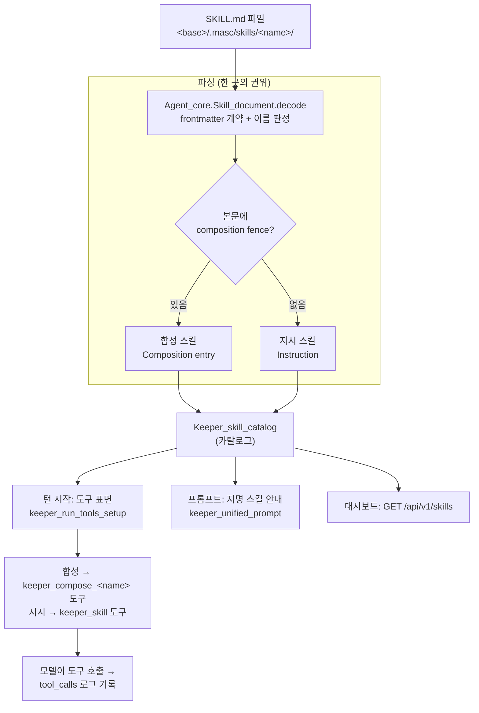
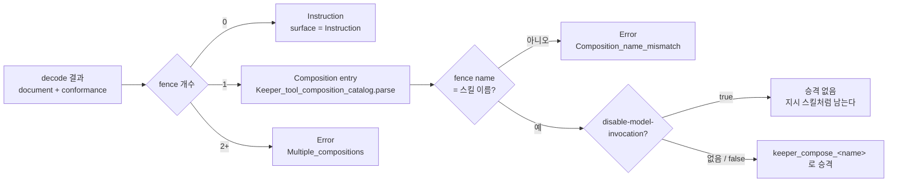
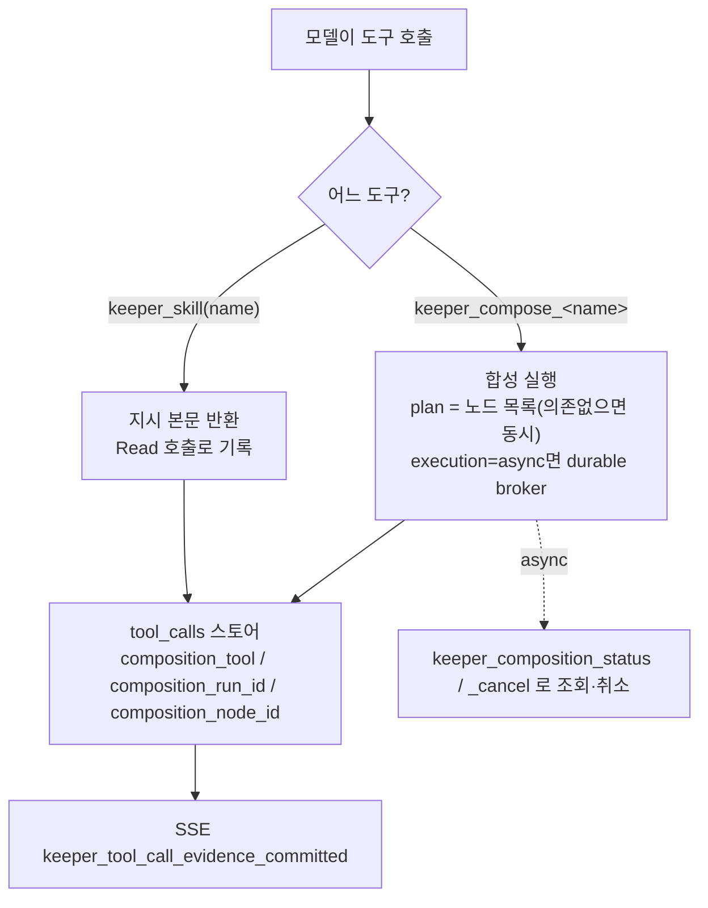

# Skills — 어떻게 도는가 (흐름 + 코드 경로)

`docs/SKILLS.md`는 SKILL.md를 **어떻게 쓰는가**를 다룬다. 이 문서는 그 선언이
런타임에서 **어떻게 도는가**를 순서도와 코드 위치로 정리한다. 설계 근거는
`docs/rfc/RFC-skills-as-tools.md`.

## 0. 한 눈에

스킬은 `<base>/.masc/skills/<name>/SKILL.md` 파일 하나로 선언한다. 본문에
```` ```toml composition ```` fence가 있으면 **합성 스킬**(도구가 된다), 없으면
**지시 스킬**(`keeper_skill` 도구로 본문을 읽는다). 같은 카탈로그를 세 곳이 읽는다:
턴 시작(도구 표면 조립), 프롬프트(지명된 스킬 안내), 대시보드(`/api/v1/skills`).



## 1. 선언과 파싱 — 한 곳의 권위

**파일 → 문서**: `Agent_core.Skill_document.decode`
(`packages/agent_core/lib/skill_document.ml`)가 SKILL.md의 frontmatter 계약을
강제한다. 이름 판정 규칙(`runtime_name`, `skill_document.ml:380`):

- frontmatter `name`과 디렉터리 이름이 **둘 다 유효하고 다르면 디렉터리가 이긴다**
  (`docs/SKILLS.md`가 정한 주인 — task가 스킬을 부를 때 쓰는 이름이 디렉터리라서).
  `Name_mismatch`는 진단으로 남지만 로드는 된다(RFC #30680이 #30205의 hard-reject를
  완화). 프론트매터에 `name`이 없으면 `Missing_name` + 디렉터리 이름 사용.
- 이름이 문법적으로 깨졌으면(`Invalid_name`) 로드 거부.

**문서 → 스킬**: `Keeper_skill_catalog.parse_skill`
(`lib/keeper/keeper_skill_catalog.ml:83`)가 본문의 composition fence를 본다.



fence 개수가 유일한 갈림길은 아니다. frontmatter `disable-model-invocation: true`는
합성이 정상 파싱되고 스킬도 로드되지만 **모델이 볼 수 있는 도구로는 안 올린다** — 절차를
파일로 남기되 모델이 스스로 집어들지 않게 하는 손잡이다. `docs/SKILLS.md §1`이 유일하게
무시하지 않는 확장 키로 적어둔 그 값이다.

**오류는 턴을 막는다**: `of_documents`(`keeper_skill_catalog.ml:112`)가 하나라도
파싱 실패하면 카탈로그 전체가 `Error`. 필수 키 누락·이름 불일치·fence 문법 오류·중복
스킬(`Duplicate_skill`)은 각각 파일과 위치를 가리키는 turn-blocking 오류다. SKILL.md가
없는 디렉터리는 스킬이 아니므로 조용히 건너뛴다(`keeper_run_tools_setup.ml`의
`Exact_missing → Keeper_skill_catalog.empty`).

## 2. 카탈로그를 읽는 세 소비자

카탈로그 로드는 `Keeper_run_tools_setup.load_skill_catalog`
(`lib/keeper/keeper_run_tools_setup.ml:120`) 하나로 통일된다.
`skills_dir_of_base_path = <base>/.masc/skills`. 세 소비자가 같은 로드를 쓴다:

```mermaid
sequenceDiagram
  participant Turn as 키퍼 턴
  participant Setup as keeper_run_tools_setup
  participant Cat as Keeper_skill_catalog
  participant Surface as keeper_tool_composition_surface
  participant Model as 모델(LLM)

  Turn->>Setup: prepare_agent_setup
  Setup->>Cat: load_skill_catalog ~base_path
  Setup->>Setup: validate_held_task_skill_admission
  Note over Setup: 보유 task(current+held)의 스킬이<br/>카탈로그에 있나 / 지시 스킬이면 Read 있나
  Setup->>Surface: make_tools ~instruction_skills ~skill_composition_entries
  Surface-->>Model: 합성 → keeper_compose_&lt;name&gt;<br/>지시 → keeper_skill (표면에 노출)
```

### 2a. 턴 시작 — 도구 표면

`prepare_agent_setup`(`keeper_run_tools_setup.ml`)이 카탈로그를 로드하고
`validate_held_task_skill_admission`으로 **보유한 모든 task**(current + 나머지
Claimed/InProgress, task-364 수리)가 지명한 스킬을 검사한다: 카탈로그에 없는 스킬 →
config error, 지시 스킬인데 `Read` 도구가 없으면 → config error. 통과하면
`Keeper_tool_composition_surface.make_tools`가:

- 합성 스킬 → `keeper_compose_<name>` 도구(`keeper_tool_composition_catalog.ml:116`,
  `tool_name_prefix = "keeper_compose_"`).
- 지시 스킬 → `keeper_skill` 도구 하나(`make_instruction_skill_tool`,
  `keeper_tool_composition_surface.ml:959`). 본문은 이 도구가 서빙한다(#30635 이후
  파일시스템 프로비저닝 불필요).

### 2b. 프롬프트 — 지명된 스킬 안내

`task.skills`(`masc_add_task`가 지정, `lib/task/tool_task_handlers.ml`의
`parse_task_skills`)는 백로그에 저장된다. 프롬프트는 이걸 두 블록으로 싣는다
(`lib/keeper/keeper_unified_prompt.ml`):

- **current task 블록**: `format_task_skills` → `Skills named by this task: …`
  (`config/prompts/keeper.current_task.skills.md`).
- **Skills Named by Tasks You Hold 블록**(task-364): current 말고 다른 보유 task가
  지명한 스킬을 task별 한 줄씩. `format_held_task_skills`
  + `config/prompts/keeper.held_task.skills{,_heading}.md`. 이유: `current_task_id`는
  소유에서 reconcile되고 이미 current가 있으면 유지되므로, 두 번째 task를 claim해도
  그 스킬이 current 블록에 안 실린다. 그래서 별도 블록으로 뽑는다.

두 블록 모두 **이름과 도구만** 싣는다(본문 X). 본문은 tens of KB가 될 수 있어 매 턴
싣기보다 `keeper_skill`로 필요할 때 읽는 게 싸다.

### 2c. 대시보드 — GET /api/v1/skills

`lib/server/server_routes_http_routes_activity.ml`. 발행된 워크스페이스 스냅샷
(`masc.skill-snapshot/v1`, `lib/skill_snapshot`)을 그대로 투영하고, 그 옆에 **사용
횟수**를 붙인다: `effective_entries`마다 턴과 같은 파서(`parse_skill`)로 종류·도구
이름을 정하고, tool-call 로그 꼬리 N행(`Keeper_skill_usage`)에서 합성은 도구 이름으로,
지시는 `keeper_skill`의 `name` 인자로 센다. 깨진 워크스페이스는 빈 목록이 아니라
턴을 막는 오류 문자열 그대로를 돌려준다. 대시보드 Monitor › Skills 패널이 소비.

## 3. 실행과 관측



- 합성 스킬은 plan이다: 의존 없는 노드는 동시 실행(Parallel as a Tool). `execution =
  "async"`면 기존 durable broker로 흐르고 `keeper_composition_status`/`_cancel`로
  조회·취소. "정적 read-only 노드만" 제약은 게이트가 아니라 effect 재실행 안전이다.
- 모든 실행은 `tool_calls` 스토어(`lib/keeper_tool_call_log.ml`)에 노드 단위로 남고
  (`composition_tool`, `composition_run_id`, `composition_node_id`) SSE
  `keeper_tool_call_evidence_committed`로도 흐른다.

## 4. 상태: 무엇이 코드에 남았고 무엇이 파일로 갔나

RFC-skills-as-tools의 하드컷 목표는 "즉석 합성 문법 제거 + `tool-compositions.toml`
삭제". 실제 상태:

| 항목 | 상태 | 근거 |
|------|------|------|
| `tool-compositions.toml` 로더·경로 | **삭제됨** | `keeper_tool_composition_catalog.mli:3` "the standalone tool-compositions.toml path is gone". 남은 언급은 주석의 "예전엔 여기서 왔다" 설명뿐 |
| 합성 정의 (OCaml 리터럴) | **없음** | 정의는 SKILL.md fence. 코드엔 파서만 |
| 도구 help 텍스트 (`[help]`) | **부분 이전** | `tool_help_registry.ml`이 `config/tools/<name>.toml`의 `[help]`에서 읽되, `[help]` 를 실제로 가진 도구는 5개뿐. 나머지는 OCaml derived |
| compose 형제 도구 설명 (OCaml 리터럴) | **남아 있음** | `keeper_plan_execute`·`keeper_composition_status`·`keeper_composition_cancel`의 `description`이 `keeper_tool_composition_surface.ml`의 문자열이고 `config/tools/*.toml`이 없다. `keeper_skill`만 TOML 로 갔다. `plan_execute` 설명은 측정 튜닝 산문이고 주석이 "grammar는 이 문자열에만 살 수 있다"고 명시 — 래칫이 debt 로 추적 |
| `config/tools/<name>.help.md` (RFC 2.4) | **미채택 — 대체됨** | RFC 2.4가 계획한 md 파일 대신 TOML `[help]` 경로로 갔다. 핵심(산문이 OCaml 밖)은 달성. md 파일은 리팩터가 아니라 형식 취향의 문제라 남겨둠 |
| 합성 스킬 이름 (OCaml 하드코딩) | **없음** | `keeper_compose_mission-snapshot`은 주석의 예시 한 곳뿐(`keeper_tool_composition_surface.ml:110`). 실제 이름은 파일에서 |

즉 "스킬화 안 된 합성"이나 "코드에 박힌 합성 정의"는 없다. 다만 model-prose 는 두
갈래로 남는다: 도구 help 는 md 가 아니라 TOML `[help]`에 살고(5개 도구만 채움),
compose 형제 도구 셋(`keeper_plan_execute`·`keeper_composition_status`·`keeper_composition_cancel`)의
`description`은 아직 OCaml 리터럴이다 — model-prose 래칫이 debt 로 추적하고,
`plan_execute` 설명은 주석이 밝히듯 typed object 스키마 때문에 설계상 in-code 다.
"모든 model-prose 가 OCaml 밖" 은 아직 아니다.

## 5. 라이브 배치

파일은 공유 경로 `<base>/.masc/skills/<name>/SKILL.md`에 산다(현재 6개:
background-snapshot, ci-red-attribution, mission-snapshot, tui-pty-scenario,
turn-opening, work-intake). 서버는 발행 스냅샷을 `masc.skill-snapshot/v1`으로 투영하며,
새 배치 후에는 `/health`의 `binary_commit`이 실행 중 바이너리를 가리킨다(런타임 파일
플립은 실행 중 바이너리 기준으로 판단 — `docs/SKILLS.md §6`).
