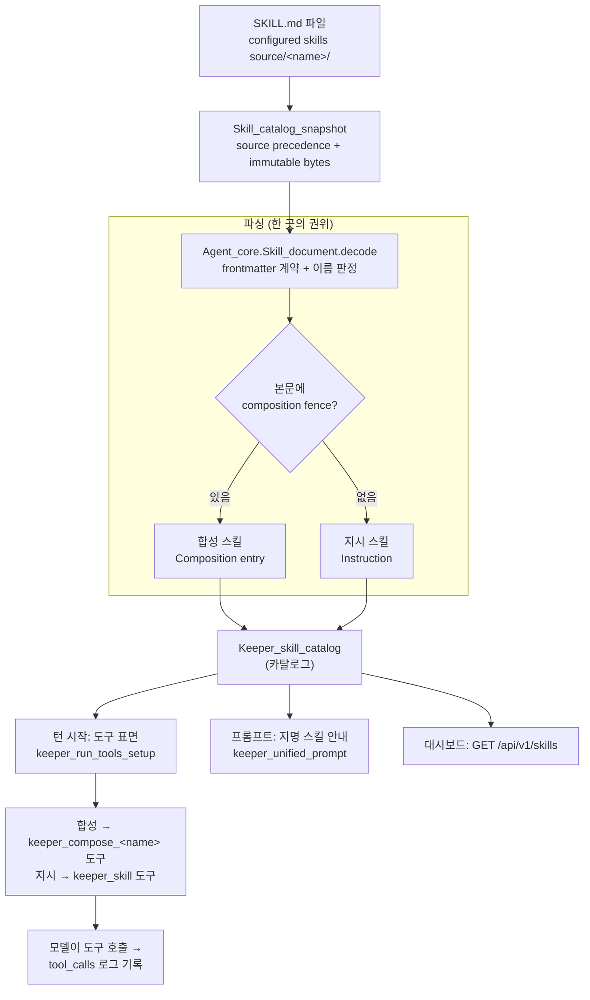
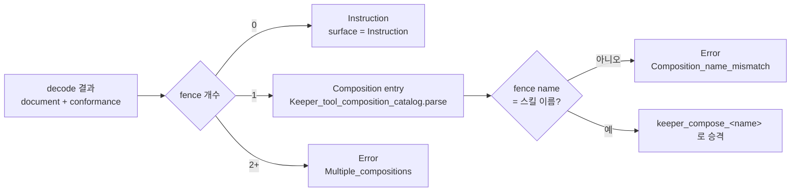
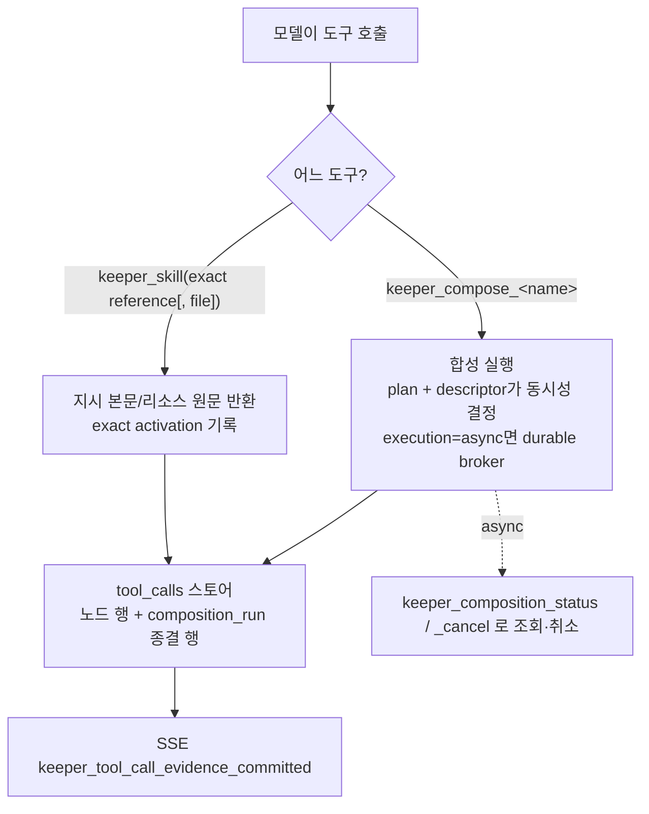

# Skills — 어떻게 도는가 (흐름 + 코드 경로)

`docs/SKILLS.md`는 SKILL.md를 **어떻게 쓰는가**를 다룬다. 이 문서는 그 선언이
런타임에서 **어떻게 도는가**를 순서도와 코드 위치로 정리한다. 설계 근거는
`docs/rfc/RFC-skills-as-tools.md`.

## 0. 한 눈에

스킬은 `runtime.toml`의 `[[skills.sources]]` 아래 `<name>/SKILL.md` 파일 하나로 선언한다. 본문에
```` ```toml composition ```` fence가 있으면 **합성 스킬**(도구가 된다), 없으면
**지시 스킬**(`keeper_skill` 도구로 본문을 읽는다). 같은 카탈로그를 세 곳이 읽는다:
턴 시작(도구 표면 조립), 프롬프트(지명된 스킬 안내), 대시보드(`/api/v1/skills`).



## 1. 선언과 파싱 — 한 곳의 권위

**파일 → 문서**: `Agent_core.Skill_document.decode`
(`packages/agent_core/lib/skill_document.ml`)가 SKILL.md의 frontmatter 계약을
강제한다. 이름 판정 규칙(`runtime_name`, `skill_document.ml:380`):

- frontmatter `name`과 디렉터리 이름이 **둘 다 유효하고 다르면 디렉터리가 이긴다**
  (`docs/SKILLS.md`가 정한 주인 — task가 스킬을 부를 때 쓰는 이름이 디렉터리라서).
  `Name_mismatch`는 진단으로 남지만 로드는 된다(RFC #30680이 #30205의 hard-reject를
  완화). 프론트매터에 `name`이 없으면 `Missing_name` + 디렉터리 이름 사용.
- 선언 이름이 문법적으로 깨져도 디렉토리 이름이 유효하면 디렉토리 이름으로 로드하고
  `Invalid_name` 진단을 남긴다. 둘 다 잘못됐을 때만 로드 거부.

**문서 → 스킬**: `Keeper_skill_catalog.parse_skill`
(`lib/keeper/keeper_skill_catalog.ml:83`)가 본문의 composition fence를 본다.



fence 개수가 유일한 갈림길이다. `masc-composition-tool`, 다른 클라이언트의
`disable-model-invocation`, `allowed-tools`는 모두 명시적으로 거부한다. composition
선언을 남겨 놓고 도구만 숨기는 별도 상태는 없다. 문서용 예시는 더 긴 CommonMark 외부
fence로 감싼다.

**실패와 편차는 다르다**: `Skill_catalog_snapshot`이 source scan 결과와 진단을 먼저
불변 snapshot으로 발행하고, `Keeper_skill_catalog.of_snapshot`이 그 snapshot을 runtime
surface로 한 번 투영한다. 잘못된 composition은 임의로 버리거나 turn 전체를 실패시키지
않고 frozen Instruction과 typed projection diagnostic으로 남는다. 그 exact reference를
task가 지명했는데 snapshot에서 해소되지 않을 때만 admission이 typed error를 반환한다.
SKILL.md가 없는 디렉터리는 스킬이 아니므로 source scanner가 조용히 건너뛴다.

## 2. 카탈로그를 읽는 세 소비자

카탈로그의 권위는 `Skill_catalog_snapshot_service`가 발행한 snapshot 하나다. turn
orchestrator가 turn 경계에서 snapshot을 고정하고 `prepare_agent_setup ~skill_snapshot`에
전달한다. setup, prompt, effective surface, `/api/v1/skills`는 이 snapshot 또는 그 exact
reference를 소비한다. 각 소비자가 파일을 다시 scan/refresh하지 않는다:

```mermaid
sequenceDiagram
  participant Turn as 키퍼 턴
  participant Setup as keeper_run_tools_setup
  participant Snap as skill_catalog_snapshot
  participant Cat as Keeper_skill_catalog
  participant Surface as keeper_tool_composition_surface
  participant Model as 모델(LLM)

  Turn->>Snap: turn 경계에서 published snapshot 고정
  Snap-->>Turn: snapshot_revision + exact source_text
  Turn->>Setup: prepare_agent_setup ~skill_snapshot
  Setup->>Cat: of_snapshot
  Setup->>Setup: validate_held_task_skill_admission
  Note over Setup: 보유 task(current+held)의 스킬이<br/>카탈로그에 있나
  Setup->>Surface: make_tools ~instruction_skills ~skill_compositions
  Surface-->>Model: 합성 → keeper_compose_&lt;name&gt;<br/>지시 → keeper_skill (표면에 노출)
```

### 2a. 턴 시작 — 도구 표면

`prepare_agent_setup`(`keeper_run_tools_setup.ml`)이 전달받은 frozen snapshot을 투영하고
`validate_held_task_skill_admission`으로 **보유한 모든 task**(current + 나머지
Claimed/InProgress, task-364 수리)가 지명한 스킬을 검사한다: 카탈로그에 없는 스킬만
config error다. 지시 본문은 `keeper_skill`이 직접 서빙하므로 `Read`와 무관하다. 통과하면
`Keeper_tool_composition_surface.make_tools`가:

- 합성 스킬 → exact `composition_skill { reference; entry }` closure가 만드는
  `keeper_compose_<name>` 도구. activation recorder는 도구 이름에서 reference를 역추론하지
  않는다.
- 지시 스킬 → `keeper_skill` 도구 하나(`make_instruction_skill_tool`,
  `keeper_tool_composition_surface.ml:959`). 본문은 이 도구가 서빙한다(#30635 이후
  파일시스템 프로비저닝 불필요).

### 2b. 프롬프트 — 지명된 스킬 안내

`task.skills`(`masc_add_task`가 지정, `lib/task/tool_task_handlers.ml`의
`parse_task_skills`)는 백로그에 저장된다. 프롬프트는 이걸 두 블록으로 싣는다
(`lib/keeper/keeper_unified_prompt.ml`):

- **current task 블록**: `format_task_skills` → `Skills named by this task: …`
  (`config/prompts/keeper.current_task.skills.md`).
- **Skills Named by Tasks You Hold 블록**(task-364): current 말고 다른 보유 task가
  지명한 스킬을 task별 한 줄씩. `format_held_task_skills`
  + `config/prompts/keeper.held_task.skills{,_heading}.md`. 이유: `current_task_id`는
  소유에서 reconcile되고 이미 current가 있으면 유지되므로, 두 번째 task를 claim해도
  그 스킬이 current 블록에 안 실린다. 그래서 별도 블록으로 뽑는다.

두 블록 모두 canonical exact reference를 싣는다(본문 X). Keeper는 그 객체를 그대로
`keeper_skill`에 전달한다. 이름-only fallback은 없다. 본문은 매 턴 prompt에 넣지 않고
필요할 때 읽는다.

### 2c. 대시보드 — GET /api/v1/skills

`lib/server/server_routes_http_routes_activity.ml`. 발행된 워크스페이스 스냅샷
(`masc.skill-snapshot/v1`, `lib/skill_snapshot`)과 `Keeper_skill_catalog.of_snapshot`의
exact surface를 함께 투영한다. join key는 source/package/name/content revision 전체이며,
instruction/composition/unavailable과 typed projection diagnostics를 표시한다. 사용 증거는
별도 session activation ledger의 exact activation/delivery/action 기록에서 읽는다. 이름,
tool prefix, 최근 로그 행 수로 사용 횟수를 재구성하지 않는다.

## 3. 실행과 관측



- 합성 스킬은 plan이다. 같은 dependency layer에서도 `Ordinary Concurrent` descriptor
  노드만 동시 실행되고 `Ordinary Serial`/`Terminal`은 각자 직렬 batch다. `execution =
  "async"`면 기존 durable broker로 흐르고 `keeper_composition_status`/`_cancel`로
  조회·취소. "정적 read-only 노드만" 제약은 게이트가 아니라 effect 재실행 안전이다.
- 모든 실행은 `tool_calls` 스토어(`lib/keeper_tool_call_log.ml`)에 노드 단위로 남고
  (`composition_tool`, `composition_run_id`, `composition_node_id`) SSE
  `keeper_tool_call_evidence_committed`로도 흐른다. 이 SSE에는 노드의 `success`,
  `disposition`, `duration_ms`가 로그와 동일하게 실린다. inline/async 실행 모두 별도
  `record_kind=composition_run` 종결 행을 남기며, async는 durable broker settlement가
  확정된 뒤에만 기록한다. 따라서 async 접수 성공을 실행 성공으로 세지 않는다.

## 4. 라이브 배치

파일 위치와 우선순위는 `<base>/.masc/config/runtime.toml`의
`[[skills.sources]]`만이 정한다. source 수나 Skill 이름을 코드·문서에 고정하지 않는다.
서버는 발행 snapshot revision을 API/effective surface에 투영하며, 새 배치 후에는
`/health`의 `binary_commit`과 snapshot revision을 함께 확인한다.
