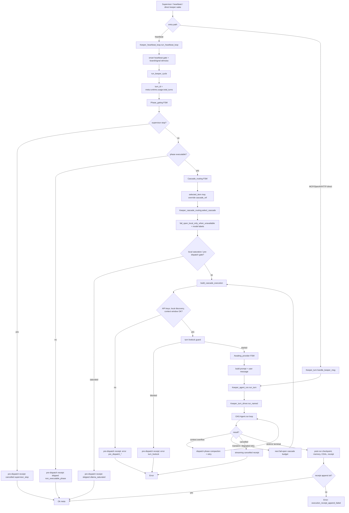
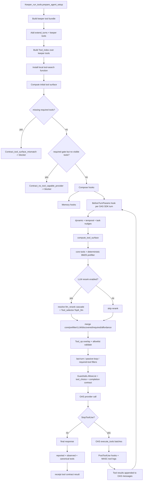
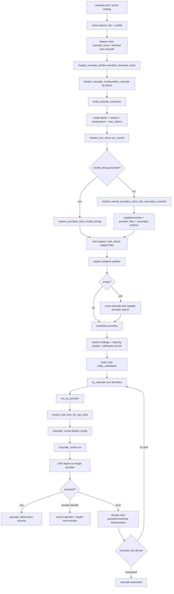
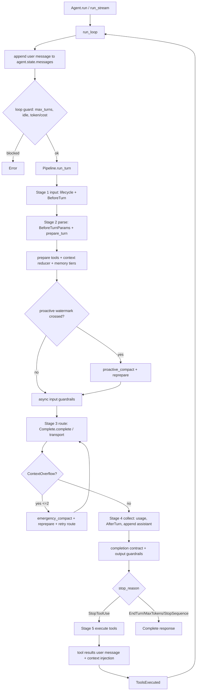
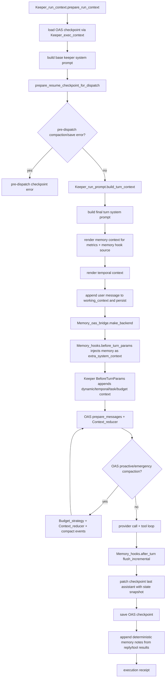

# Keeper/OAS Agent Runtime Flow Comparison

Date: 2026-05-12 Asia/Seoul
Scope:

- MASC keeper turn lifecycle, tool search/use, provider/model/cascade routing.
- OAS single-agent runtime, provider dispatch, memory/context/compaction primitives.
- External references: Claude Agent SDK, Google ADK, OpenAI Agents SDK, OpenClaw, Hermes Agent.

This is the audit snapshot. The follow-up implementation and product-readiness
status live in the goal/plan document below.

Follow-up goal/plan: `docs/design/keeper-runtime-truth-unification-goal.md`

## TL;DR

| Area | Current truth | Risk / missing consideration | Suggested direction |
|---|---|---|---|
| Keeper lifecycle | MASC owns a keeper-cycle FSM above OAS and records pre-dispatch terminal receipts for skips/errors before `Agent.run`. | One "turn" is split across MASC keeper turn, MASC cascade attempts, and OAS agent turns. A reader can easily confuse these clocks. | Add/keep a single turn manifest that records all three counters and every context/cascade/tool decision. |
| Tools | Tool surface is rebuilt every OAS SDK turn: BM25 index, deterministic prefilter, optional LLM rerank, discovered tools, required tools, policy allowlist, `tool_choice`, completion contract, observed/reported/canonical reconciliation. | Tool selection happens before final provider attempt. Provider lane resolution later can change inline-vs-runtime MCP exposure, so receipt/debug surfaces must show both "requested surface" and "resolved lane". | Record provider-lane result next to `tool_surface`; fail loud when required tool policy and provider lane disagree. |
| Provider/model/cascade | `cascade.toml`/catalog routes are MASC-owned; MASC iterates providers and calls OAS as a single-provider runtime per attempt. OAS has its own `Complete_cascade`, but the keeper hot path does not use it. | Two cascade concepts exist. Future fixes can accidentally use OAS cascade semantics in a MASC-owned policy lane. | Document/enforce "one cascade plane per call path"; keep OAS `Complete_cascade` out of keeper hot path unless deliberately migrated. |
| Context/memory/compaction | MASC has pre-dispatch checkpoint hygiene, memory hook injection, OAS proactive/emergency compaction, post-run checkpoint patching, and memory-bank writes. | Context state still straddles MASC `working_context`, OAS checkpoint, raw `[STATE]` text, memory hooks, and durable MASC memory. Boundary doc already calls this a partial migration. | Make OAS checkpoint/session the runtime SSOT and move MASC continuity to structured sidecars/receipts instead of raw markers. |
| External comparison | Claude/OpenAI/ADK put turn loop + context/session near runner. OpenClaw/Hermes expose stronger provider failover and compaction surfaces, closer to MASC. | MASC has stronger operator receipts than most SDKs, but also more boundary complexity than runner-centered systems. | Preserve MASC receipts/governance, but simplify runtime state ownership around OAS primitives. |

## Evidence Map

MASC:

- Keeper entry and pre-dispatch gates: `lib/keeper/keeper_unified_turn.ml:239`, `:303`, `:411`, `:582`, `:1098`, `:1832`.
- Supervisor/heartbeat entry: `lib/keeper/keeper_supervisor.ml:343`, `lib/keeper/keeper_keepalive.ml:734`, `lib/keeper/keeper_heartbeat_loop.ml:655`, `:1584`, `:1686`, `:1744`, `:1754`.
- Direct non-heartbeat entry: `lib/tool_keeper.ml:462`, `:1633`, `lib/server/server_openai_compat.ml:87`, `lib/server/server_routes_http_keeper_stream.ml:52`, `lib/keeper/keeper_turn.ml:205`, `:481`.
- Per-turn OAS setup and dispatch: `lib/keeper/keeper_agent_run.ml:103`, `:169`, `:231`, `:522`, `:1093`, `:1233`, `:1495`, `:1571`.
- Context and checkpoint: `lib/keeper/keeper_run_context.ml:32`, `:80`, `:136`, `:164`, `:169`.
- Prompt/context injection: `lib/keeper/keeper_run_prompt.ml:71`, `:100`, `:109`, `:166`, `:169`; `lib/memory_hooks.ml:1`, `:126`, `:148`.
- Tool search/selection: `lib/keeper/keeper_run_tools.ml:139`, `:278`, `:345`, `:640`, `:733`, `:752`, `:843`, `:908`, `:1035`, `:1219`, `:1464`, `:1483`, `:1650`.
- Tool execution/observation: `lib/keeper/keeper_tools_oas.ml:481`, `:589`, `:947`; `lib/keeper/keeper_hooks_oas.ml:2173`; `lib/keeper/keeper_tool_disclosure.ml:172`, `:201`.
- MASC cascade/provider loop: `lib/keeper/keeper_turn_driver.ml:34`, `:111`, `:150`, `:319`, `:404`, `:867`, `:952`; `lib/keeper/keeper_turn_driver_try_provider.ml:92`, `:118`, `:264`.
- Catalog/provider resolution: `lib/cascade/cascade_catalog_runtime.ml:1230`, `:1270`, `:1375`; `docs/CASCADE-TOML.md`.
- Boundary contract: `docs/OAS-MASC-BOUNDARY.md:66`, `:70`, `:82`, `:86`, `:115`.

OAS:

- Agent entry and loop: `oas/lib/agent/agent.ml:28`, `:64`, `:131`, `:213`, `:301`, `:328`, `:501`.
- Pipeline: `oas/lib/pipeline/pipeline.ml:1`, `:262`, `:290`, `:410`, `:598`, `:657`, `:765`, `:867`.
- Tool preparation/execution: `oas/lib/agent/agent_turn.ml:323`, `:385`, `:455`, `:574`; `oas/lib/agent/agent_tools.ml:611`.
- Tool descriptor/contract/trace: `oas/lib/base/tool.ml:96`, `:109`, `:195`; `oas/lib/agent/agent_tools.ml:177`, `:250`, `:353`; `oas/lib/completion_contract.ml:74`, `:143`; `oas/lib/raw_trace.ml:348`, `:482`, `:506`.
- Provider/cascade primitives: `oas/lib/llm_provider/provider_config.ml`, `oas/lib/llm_provider/complete.ml`, `oas/lib/llm_provider/complete_cascade.ml:191`.
- Context/memory: `oas/lib/context_reducer.ml:16`, `:98`; `oas/lib/memory.ml:16`, `:65`, `:80`.

External official/primary sources checked on 2026-05-12:

- Claude Agent SDK: https://code.claude.com/docs/en/agent-sdk/agent-loop, https://code.claude.com/docs/en/agent-sdk/sessions
- Google ADK: https://adk.dev/agents/llm-agents/, https://adk.dev/sessions/
- OpenAI Agents SDK: https://openai.github.io/openai-agents-python/ref/run/, https://openai.github.io/openai-agents-python/sessions/
- OpenClaw: https://docs.openclaw.ai/concepts/model-failover, https://docs.openclaw.ai/concepts/compaction
- Hermes Agent: https://hermes-agent.nousresearch.com/docs/developer-guide/agent-loop/, https://hermes-agent.nousresearch.com/docs/developer-guide/context-compression-and-caching/

## 1. Keeper Lifecycle

### Flowchart

### Code-Level Sequence

1. `run_keeper_cycle` starts with a stable `keeper_turn_id`, emits `Phase_gating`, and handles supervisor stop before any provider/tool I/O.
2. Heartbeat entry first passes smart heartbeat gates, event-queue/durable-signal overrides, board-event collection, warmup skips, and stimulus classification. Direct MCP/OpenAI/HTTP message paths bypass the heartbeat loop and converge at `Keeper_agent_run.run_turn`.
3. Non-executable phases do not call OAS. They emit `record_pre_dispatch_terminal_observation` and return `Ok meta`.
4. Executable phases route through `Keeper_cascade_routing.select_cascade`, then apply cascade availability/fail-open and model-label resolution.
5. `build_cascade_execution` resolves max context, temperature, and max tokens from cascade/provider capability before prompt construction.
6. `Keeper_turn_livelock.guard_and_record_turn_start` gates dispatch.
7. `Keeper_agent_run.run_turn` creates OAS run context, prepares prompt/history/tool hooks, then calls `Keeper_turn_driver.run_named`.
8. The driver performs MASC-owned provider iteration and calls OAS `Agent.run` once per provider attempt.
9. Post-run code merges tool usage, saves patched OAS checkpoint, writes memory notes, logs CDAL/proof signals, and appends `Keeper_execution_receipt`.
10. Receipt append failure is escalated to turn-level error, not silently logged.

### Situation Matrix

| Situation | Path | Current behavior |
|---|---|---|
| Supervisor stop before I/O | `run_keeper_cycle` entry | Cancel receipt, `Cancelled_supervisor_stop`, returns `Ok meta`. |
| Heartbeat smart gate skips | heartbeat loop before turn | No `run_keeper_cycle` dispatch; classified as busy/idle/warmup/signal gate depending on branch. |
| Direct `masc_keeper_msg` / OpenAI compat / HTTP stream | direct path | Converges at `Keeper_turn.handle_keeper_msg` -> `Keeper_agent_run.run_turn`; bypasses heartbeat scheduling but not OAS/tool/cascade setup. |
| Phase is `Paused`, `Offline`, etc. | phase gate | Skip receipt with `non_executable_phase:*`; no OAS call. |
| `Compacting` / `HandingOff` | cascade routing | Routes to local-only/buffer cascade when executable. |
| Selected board/scope item has cascade ref | selected item branch | Overrides meta cascade_ref before routing. |
| Provider/cascade unavailable before dispatch | `build_cascade_execution` / discovery | Error receipt before OAS; no partial OAS turn. |
| Ollama/local saturation | saturation skip | Skip receipt and optional sleep; no OAS call until cap forces dispatch. |
| Livelock guard blocks | livelock guard | Error receipt and provider-error FSM edge. |
| OAS context overflow | OAS pipeline + MASC retry loop | OAS compacts and retries within its route attempt; MASC can also retry after compaction at keeper level. |
| Ambiguous partial side effect | error classification | Logged and classified; receipt outcome is error. |
| Receipt store fails | `Keeper_execution_receipt.append` | If turn body succeeded, final result becomes `execution_receipt_append_failed`. |

## 2. Tools Search And Use

### Flowchart

### Code-Level Notes

- Tool discovery is not only "search". Search is a tool in the surface: `keeper_tool_search` uses `local_search_fn_ref`, which queries `Agent_sdk.Tool_index.retrieve`, partitions core/visible/discoverable/policy-filtered hits, and adds discovered names to `Keeper_discovered_tools`.
- The actual visible surface is recomputed every OAS SDK turn in `BeforeTurnParams`.
- LLM rerank is a hint layer, not a hard dependency. If rerank cascade resolution, health filtering, or `Tool_selector.select_names` fails, the surface falls back to core + BM25 prefilter + discovered tools.
- Required tools can come from the active task contract and per-call `required_tool_names`.
- The hook sets both `Guardrails.AllowList all_allowed` and `tool_choice`. This is important: `AllowList` constrains execution, while `tool_choice` nudges or forces provider-side tool use.
- OAS later dispatches only `ToolUse` blocks. Parallelism is handled in OAS `execute_tools` via sequential/exclusive/parallel batches.
- MASC does not trust only the final assistant blocks. It reconciles reported tool names from response content, registry-observed names, hook-observed names, canonical aliases, and unexpected names before writing the receipt.
- Tool execution observation has two layers: OAS publishes `ToolCalled` / `ToolCompleted` and raw trace records, while MASC wraps keeper tool handlers and logs keeper-specific route evidence, policy outcomes, and hook observations.

### Tool Edge Cases

| Case | Current behavior |
|---|---|
| Search hits only already-visible core tools | Search result says call them directly; no extra discovery needed. |
| Search hits policy-denied tools | Hidden from visible results and counted as filtered. |
| Required tool already satisfied in prior tool calls | Required `tool_choice` is cleared for that requirement. |
| Last OAS turn | Surface intersects last-turn-safe tools unless required tools remain. |
| Passive loop + actionable signal | Contract enforcement can narrow the surface to force progress. |
| No tools after overlay/filter | Fallback floor tools may be injected; otherwise blocker/receipt mismatch. |
| Provider lacks inline tool support | Provider-lane resolution happens later in `run_try_provider`; this must stay visible in receipt/debugging because tool policy was selected earlier. |
| Pre-tool hook blocks/edits | OAS `PreToolUse` can skip, override, require approval, reject, or edit before execution. |
| MASC keeper policy denies | Keeper handler returns a structured denial/error; OAS records the tool result and loop continues unless retry/contract policy escalates. |
| All tool calls unexpected | MASC disclosure layer can mark contract failure even if OAS executed valid tool blocks. |

## 3. Provider, Model, Cascade

### Flowchart

### Ownership

- `docs/OAS-MASC-BOUNDARY.md` states config ownership directly: cascade schema, parsing, label semantics, and selection policy are MASC-owned.
- The keeper hot path resolves providers through MASC `Cascade_catalog_runtime` and `Keeper_turn_driver`; it does not use OAS `Llm_provider.Complete_cascade` for provider iteration.
- OAS still has reusable provider/cascade primitives (`Provider_config`, `Complete.complete`, `Complete_cascade.complete_cascade`), but in this path it is the single-provider execution engine.

### Config Decision Points

| Decision | Owner | Code path |
|---|---|---|
| Logical route -> cascade profile | MASC | `Keeper_cascade_profile.cascade_name_for_use`, `config/cascade.toml [routes]` |
| Phase override | MASC | `Keeper_cascade_routing.select_cascade` |
| Model label expansion | MASC catalog | `Cascade_runtime.models_of_cascade_name_result` |
| Provider config parsing/filtering | MASC catalog + OAS provider config type | `resolve_named_providers_strict_with_secondary_resolver` |
| Tool capability filter | MASC/OAS bridge | `Provider_tool_support.apply_required_tool_use_filter` and `resolve_tool_lane_for_oas_tools` |
| Provider attempt timeout | MASC | `effective_provider_attempt_timeout_s` |
| Agent loop and tool execution per attempt | OAS | `Agent.run` -> pipeline |
| Cascade observation and receipt | MASC | `Cascade_legacy_runner.cascade_observation_with_metrics`, `Keeper_execution_receipt` |

### Key Reflection

The system currently has two legitimate cascade layers:

1. MASC cascade: fleet/operator policy, keeper phase routing, provider attempt order, admission, fallback, health cooldowns, receipts.
2. OAS cascade primitive: generic provider cascade completion for SDK users.

For keepers, only layer 1 should be treated as the live truth unless a deliberate migration changes the contract. Mixing these layers would make receipt interpretation and failure attribution ambiguous.

## 4. OAS Agent Runtime

### Flowchart

OAS is runner-centered:

- `run_loop` appends the user message once, then recurses after `ToolsExecuted`.
- `Pipeline.run_turn` owns model-call preparation, route, collect, execute, and output mapping.
- Tool calls are executed after an assistant response with `StopToolUse`, then tool results are appended as a user message.
- Context reducers are applied before API calls. Proactive/emergency compaction mutate stored OAS messages, then re-prepare the turn.
- OAS checkpoints capture agent state and context; MASC persists those through keeper-specific stores.

## 5. Context, Memory, Compaction

### MASC/OAS Flowchart

### What Is Added To Instructions

| Source | Injection path |
|---|---|
| Base keeper persona/goals/git policy | `Keeper_prompt.build_keeper_system_prompt` in `prepare_run_context`. |
| Turn-specific world/task context | `build_turn_prompt` callback returns `turn_system_prompt` + `dynamic_context`. |
| Memory context | `Memory_hooks.before_turn_params` appends text to OAS `extra_system_context`; no longer imperatively seeds OAS memory. |
| Temporal context | `Masc_context_injector.render_temporal_summary` appended by keeper `BeforeTurnParams`. |
| Task/claim nudges | Keeper `BeforeTurnParams` appends claim-only, required-tool, last-turn, retry, and budget messages. |
| Tool schemas | OAS `prepare_tools` uses the current `tool_filter_override` and tool JSON. |
| Reduced history | OAS `Context_reducer` applies strategy before model call. |

### What Is Removed Or Replaced

| Mechanism | Removal/replacement |
|---|---|
| Pre-dispatch old checkpoint content | `Keeper_agent_checkpoint_hygiene.prepare_resume_checkpoint_for_dispatch` may compact and save before dispatch. |
| Per-request long history | OAS `Context_reducer` and `Budget_strategy` reduce messages for provider calls. |
| Large tool results | OAS can truncate, stub, clear, or relocate tool results depending on reducer/store options. |
| Context overflow | OAS emergency compaction retries route up to the configured bound. |
| Post-run assistant state | MASC patches last assistant checkpoint with structured state snapshot before saving. |

### Structural Gap

`docs/OAS-MASC-BOUNDARY.md` already marks keeper context/checkpoint as partial: OAS checkpoint is used, but keeper still owns `working_context` and raw text continuity markers. This audit confirms that the runtime works, but the state ownership is still split:

- MASC `working_context` is loaded, repaired, appended, persisted, and then converted to OAS `initial_messages`.
- OAS `Agent.run` mutates its own `agent.state.messages`.
- MASC patches and saves the OAS checkpoint after the run.
- Memory is injected hook-first, but continuity still depends on text blocks and state snapshots.

The improvement target is not "add more compaction"; it is a clearer SSOT: OAS should own runtime transcript/checkpoint state, and MASC should own coordination receipts, sidecars, governance, and durable memory policy.

## 6. External Runtime Comparison

| Runtime | Turn loop | Tool flow | Provider/model/fallback | Memory/context/compaction | Main contrast with MASC |
|---|---|---|---|---|---|
| Claude Agent SDK | Prompt + system + tools + history, then Claude emits tool calls, SDK executes, feeds results, repeats until final text or budget. | Built-ins include file/search/Bash/web/ToolSearch/subagents/skills; permissions gate execution; read-only tool calls can run in parallel. | One Claude model selected by `model`; no documented generic provider fallback chain in checked docs. | Session continuity and automatic compaction near context limit; CLAUDE.md-style rules are reloaded outside transient history. | Similar tool loop, less explicit operator receipt/fallback machinery. |
| Google ADK | `LlmAgent` is reasoning unit; workflow agents provide deterministic sequential/parallel/loop orchestration. | Explicit tools/functions/OpenAPI/AgentTool/memory tools; delegation via subagent descriptions. | Model field selects Gemini/Vertex or wrappers; no first-class automatic provider failover found in checked docs. | `Session` stores events/state; `MemoryService` is searchable cross-session store. | More app-framework style; less built-in autonomous cascade policy. |
| OpenAI Agents SDK | `Runner.run` loops until final output; handoff switches agent; otherwise tool calls execute and loop continues. | Hosted tools, function tools, agents-as-tools, MCP, ToolSearch, Codex tool. | OpenAI Responses/Chat Completions plus custom providers; model/provider can vary per agent/run; no built-in MASC-like failover chain in checked Python docs. | Sessions automate history; SQLite/Redis/SQLAlchemy/Dapr backends; Responses compaction sessions can compact after turns. | Closest OAS-style runner/session model; less fleet-specific governance. |
| OpenClaw | Gateway/session prepares turn for embedded or CLI runtime; steering can be injected between batches. | Core tools, session tools, skills, plugins; tool policy controls exposure. | Explicit primary + fallback model chain, provider/profile rotation, cooldown/disabled state. | Auto-compaction default; summaries saved to transcript; tool-call/result pairs kept together; optional memory flush before compaction. | Closest to MASC cascade/compaction operations, but with a more unified session transcript story. |
| Hermes Agent | `AIAgent.run_conversation()` builds prompt, checks compression, calls provider, executes tool calls, appends results, loops. | Registry-backed tools, plugins, MCP, delegation; concurrent tool calls except interactive tools. | Provider runtime resolver with primary/fallback providers/models and auxiliary chains. | SQLite sessions, injected memory files, session search, dual compression at roughly 50%/85%, tool-pair sanitization. | Similar long-running operational flavor; MASC has stronger typed receipts/CDAL but more OCaml/OAS boundary split. |

## 7. Recommended Improvements

### P0: Runtime Decision Manifest

Create one durable manifest per keeper turn that links:

- MASC keeper turn id, OAS SDK turn count, cascade attempt index.
- Phase gate decision, cascade route/profile, selected model labels, final provider attempt list.
- Tool surface requested by keeper hook, provider-lane-resolved surface, `tool_choice`, completion contract.
- Context sources injected: base prompt hash, dynamic context hash, memory sections count, temporal context hash, reducer/compaction decision.
- Checkpoint ids before/after, state snapshot id, receipt id.

This does not replace receipts; it gives receipts a causality spine.

### P1: Make Cascade Plane Explicit

Add a short invariant to the boundary docs and relevant module comments:

- Keeper path uses MASC cascade.
- OAS `Complete_cascade` is a generic SDK primitive and is not part of keeper provider iteration.
- Any future migration must move observation, health, admission, receipt, and dashboard semantics together.

### P1: Provider-Lane/Tool-Surface Contract

Extend receipt/tool-call context with:

- provider kind/model chosen for the successful attempt,
- inline tool lane vs runtime MCP lane,
- whether required tools were materialized inline, via runtime MCP, or unavailable,
- whether `tool_choice` support was native, emulated, or ignored.

This closes the gap where tool policy is selected before final provider attempt.

### P1: Shrink MASC `working_context`

Move toward:

- OAS checkpoint/session as runtime transcript SSOT,
- MASC state snapshot as structured sidecar,
- memory injection as hook-only text or structured OAS context,
- no direct reliance on raw `[STATE]` blocks for durable continuity.

This aligns with the existing boundary doc P1/P2.

### P2: Compaction Event Unification

Unify these into one decision stream:

- MASC pre-dispatch checkpoint hygiene,
- OAS proactive watermark compaction,
- OAS emergency overflow compaction,
- MASC post-run checkpoint patch/save,
- memory flush before/after compaction.

The stream should answer: what was dropped, summarized, relocated, preserved, or re-injected?

### P2: External Pattern Adoption

Borrow selectively:

- From Claude/OpenAI: keep runner/session ownership tight and make compaction boundaries visible in the run stream.
- From OpenClaw: preserve tool-call/result pairs and store compaction summaries in transcript, not only in side logs.
- From Hermes: maintain structured compaction summaries with goal/progress/blocked/files/next-step sections and iterative recompression.

Do not borrow blindly:

- MASC's governance/CDAL/operator receipt model is stronger than most SDK defaults and should remain MASC-owned.
- ADK-style app services are useful conceptually, but MASC already has stronger runtime receipts and task/board semantics.

## 8. Sanity Check Against Original Questions

| Question | Answered by |
|---|---|
| Keeper lifecycle code flow and flowchart | Sections 1 and 5. |
| Tool search/use code flow and flowchart | Section 2. |
| Provider, model, cascade config/decision/use/turn return | Section 3. |
| External agent SDK/product turn exchange | Section 6. |
| Compaction, memory, context add/remove/instruction insertion comparison | Sections 5, 6, and 7. |

## 9. Verification Performed

- Read-only code inspection of MASC worktree: `/Users/dancer/me/workspace/yousleepwhen/masc-mcp/.worktrees/audit-agent-runtime-flow-20260512`.
- Read-only code inspection of sibling OAS checkout: `/Users/dancer/me/workspace/yousleepwhen/oas`.
- Official/primary external docs opened for Claude, ADK, OpenAI Agents SDK, OpenClaw, and Hermes.
- No build/test command was run because this is a documentation-only audit.
