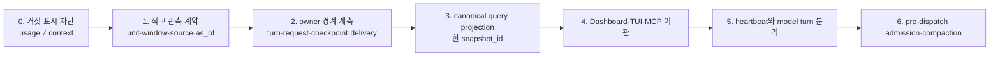
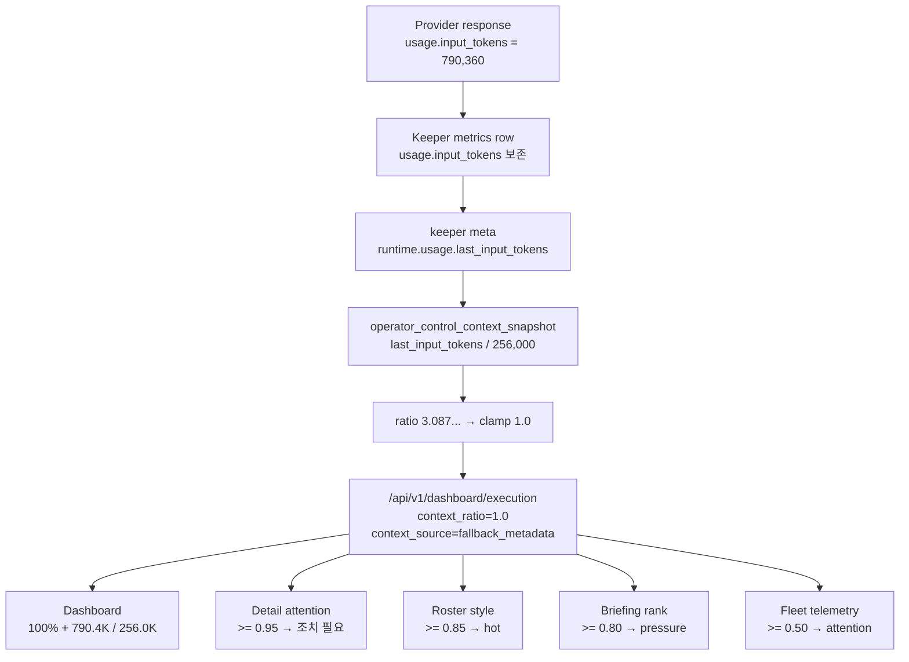
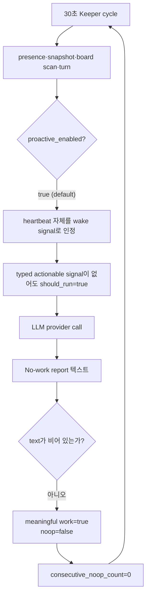
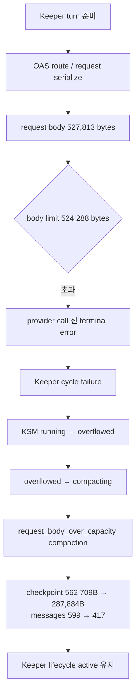
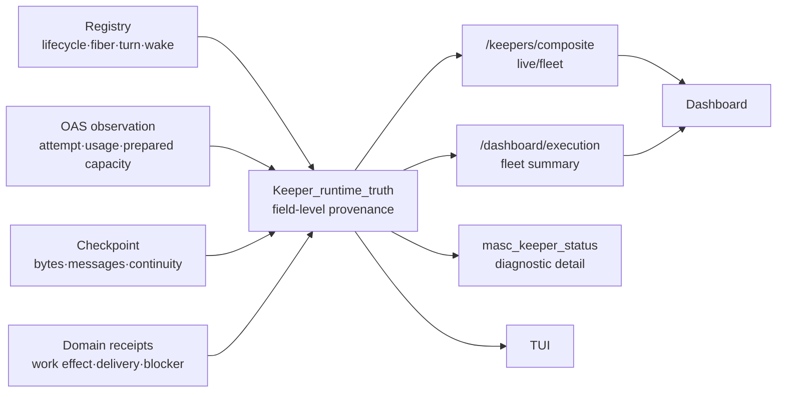

# Keeper Runtime Truth 적대적 감사

**상태**: 구현 전 판단 보고서

**작성 기준 시각**: 2026-07-30 00:40 KST

**감사 대상**: live `/Users/dancer/me/.masc`, MASC `8eda2da0cb`

**질문**: 현재 UI는 실제 Keeper가 무엇을 하고 있는지 얼마나 정확히 말하는가?

## 0. 결론

현재 화면의 `790.4K / 256.0K`, `100%`, `대기 중`, `실행 중`, `조치 필요`는
하나의 상태를 서로 다르게 표현한 것이 아니다. 서로 다른 owner, 시간축, 단위,
cache, projection에서 나온 값을 한 카드 안에 합친 결과다.

가장 중요한 판정은 다음과 같다.

1. **`790.4K / 256.0K`는 현재 context occupancy 증거가 아니다.**
   MASC가 마지막 provider response의 `usage.input_tokens`를 context token 수로
   재명명하고 runtime context budget으로 나눈 값이다. 원시 몫은 약 `308.7%`지만
   backend가 ratio를 `1.0`으로 clamp하여 화면은 `100%`를 표시한다.
2. **그런데 이 잘못된 ratio가 단순 장식에 머물지 않는다.**
   briefing 우선순위, fleet attention, roster hot style, selected Keeper의
   `조치 필요` 판정에 서로 다른 threshold로 다시 사용된다.
3. **`100%인데 Keeper가 계속 돈다`는 사실 자체는 버그가 아니다.**
   usage telemetry는 실행 제어 신호가 아니므로 그 값으로 Keeper를 멈추면 안 된다.
   버그는 usage를 context라고 표시하고, 실제 pre-dispatch capacity를 별도로
   관측하지 않으며, 잘못된 값으로 attention을 만드는 것이다.
4. **실제 overflow는 별도 축에서 발생했다.**
   rondo는 `527,813 bytes > 524,288 bytes`의 serialized request body 오류 뒤에
   `running → overflowed → compacting`으로 전이했고, checkpoint를
   `562,709B → 287,884B`로 줄였다. token window가 아니라 request-body byte
   capacity가 직접 trigger였다.
5. **dashboard만 고치는 것은 잘못된 순서다.**
   먼저 관측 계약을 고치고, live runtime projection을 하나로 만든 뒤,
   dashboard/TUI/MCP가 그 계약을 소비해야 한다.

따라서 권고 순서는 아래와 같다.



## 1. 요청 자체에 대한 적대적 평가

### 1.1 맞는 문제 제기

- 한 Keeper를 보는데 list, selected detail, TUI, MCP가 다른 답을 주는 현상은
  운영상 P0에 가깝다.
- 정보의 lineage와 freshness를 보지 않고 UI 문구만 맞추면 재발한다.
- lifecycle, turn, wake, context, usage, compaction, delivery를 직교 축으로 나누는
  것이 맞다.
- 정상 흐름과 overflow 흐름을 순서도로 분리해야 한다.

### 1.2 기각해야 하는 암묵적 가정

| 가정 | 판정 | 이유 |
|---|---|---|
| `790K / 256K`는 context가 300% 넘었다는 뜻이다 | 기각 | provider usage와 context occupancy는 같은 계측이 아니다 |
| context가 100%면 Keeper를 정지해야 한다 | 기각 | 잘못된 telemetry를 control signal로 승격한다 |
| 모든 UI가 같은 한 단어 상태를 보여야 한다 | 기각 | live/fiber, turn, attention, delivery는 동시에 다른 값을 가질 수 있다 |
| Dashboard UI부터 고치면 된다 | 기각 | producer와 projection이 틀려 다른 UI가 계속 drift한다 |
| 모든 channel이 같은 정보를 보여야 한다 | 기각 | chat은 delivery, Board는 stimulus, health는 server readiness를 답한다 |
| threshold를 조정하면 해결된다 | 기각 | `0.5/0.8/0.85/0.95` 중 어느 값도 잘못된 numerator를 바로잡지 못한다 |
| “No-work report” 문자열을 찾아 no-op 처리하면 된다 | 기각 | model prose string matching은 state transport가 될 수 없다 |

### 1.3 더 올바른 목표

목표는 “한 상태로 보이게 만들기”가 아니다.

> 같은 관측 시점의 공유 사실은 모든 surface에서 같아야 하고, 서로 다른 축은
> 축 이름과 근거를 드러낸 채 동시에 다를 수 있어야 한다.

예를 들어 다음 조합은 정상이다.

- Keeper fiber: `alive`
- current turn: `in_turn`
- wake: `proactive_tick`
- actionable work: `none`
- request capacity: `unknown`
- last turn usage: `790,360 provider input tokens`
- attention: `none`

현재 화면은 이 조합을 `대기 중 + 실행 중 + 조치 필요 + context 100%`로
압축해 의미를 잃는다.

## 2. 관측된 현상

### 2.1 screenshot의 숫자가 만들어지는 경로



이 경로에서 실제 OAS checkpoint message의 model-input token count를 측정하는
단계는 없다. 특히 execution surface는 operator snapshot을
`lightweight_summary=true`로 요청하고, 이 mode는 metrics lookup 없이
`fallback_keeper_context_snapshot`을 직접 사용한다.

### 2.2 같은 시각의 surface 불일치

2026-07-30 00:33:47 KST에 같은 server를 조회했을 때:

| Surface | kidsnote 판정 |
|---|---|
| `/api/v1/dashboard/execution` | `status=idle`, `keepalive_running=true`, `context_ratio=1.0`, `context_tokens=487010`, `context_source=fallback_metadata` |
| `/api/v1/dashboard/briefing` | `status=active`, `context_ratio=1.0`, 최근 tool/attention 요약 |
| `/api/v1/keepers/kidsnote/composite` | `phase=running`, `turn_phase=executing`, `run_state.kind=in_turn`, `wake_kind=proactive_tick`, `is_live=true` |

이 값들은 단순 번역 차이가 아니다.

- `execution`은 큰 cached fleet read model이고 status patch가 agent status와
  keepalive에 의존한다.
- `composite`는 in-memory registry/turn observer의 live FSM view이며 cache TTL이
  5초다.
- `briefing`은 다시 keeper row를 압축하고 context pressure 순위를 계산하는
  30초 cache다.

현재 Dashboard는 flat execution row와 composite를 함께 소비한다. shared
`snapshot_id`나 field별 `as_of`가 없으므로 사용자는 어떤 문구가 어느 시점의
어느 축인지 구분할 수 없다.

### 2.3 값이 급변하는 이유

같은 실행 중에도 kidsnote의 dashboard `context_tokens`는 관측 시점에 따라
`790,360 → 296,385 → 487,010 → 101,845`처럼 바뀌었다. checkpoint가 그만큼
압축·팽창했다는 증거가 아니라, 마지막 response의 provider usage가 교체된
결과다.

실제 latest metrics row에는 다음 값이 있다.

```text
usage.input_tokens = 101,845
usage.cache_read_tokens = 87,586
checkpoint_bytes = 361,091
message_count = 275
context_ratio/context_tokens/context_max = absent
```

서로 다른 단위인 provider tokens, serialized checkpoint bytes, message count를
각각 보존하고 있지만 dashboard fallback이 첫 번째 값을 context로 승격한다.

### 2.4 “No-work인데 계속 돈다”의 실제 흐름



kidsnote의 2026-07-29 metrics 689행 중 `No-work report`로 시작한 행은 221개다.
이 행들에 기록된 provider telemetry 합계는 다음과 같다.

- input tokens: `51,361,703`
- cache-read tokens: `44,079,318`
- latency: `3,261,210ms`
- estimated cost: `$2.5011`

이 수치는 context occupancy가 아니라 provider-reported turn telemetry의 합계다.
그럼에도 “일이 없음을 확인하기 위해 모델을 호출하는 loop”가 운영 비용과
화면 noise를 만들고 있다는 결론에는 충분하다.

### 2.5 실제 overflow와 compaction 흐름



정상 turn 성공 경로의 post-turn code는 compaction decision을 항상
`Not_requested`로 기록한다. 따라서 이번에 관측된 자동 회복은 사전 pressure
관리의 성공이 아니라 request-body error 뒤의 reactive recovery다.

이는 모든 compaction 경로가 error-triggered라는 뜻은 아니다. 수동 compaction
등 다른 entry point는 별도로 존재한다. 여기서 확정할 수 있는 것은 screenshot의
`context 100%`와 관측된 rondo compaction trigger가 서로 다른 계측 축이라는
사실이다.

## 3. 정보 계보

### 3.1 write owner와 artifact

| 사실 | Owner | Canonical artifact | 단위/시간창 |
|---|---|---|---|
| provider 1회 response usage | OAS/provider boundary | raw trace, turn metrics | tokens / response |
| 누적 token·cost telemetry | OAS checkpoint | checkpoint usage stats | tokens / resumed agent lifetime |
| checkpoint 내용 | OAS | checkpoint/session store | messages + serialized bytes |
| Keeper lifecycle/fiber | MASC Keeper registry | in-memory registry + lifecycle events | current |
| current turn substate | MASC turn observer | composite snapshot | current |
| last completed turn 결과 | MASC/OAS boundary | execution receipt, turn record, raw trace | turn |
| Keeper durable counters | MASC | `.masc/keepers/<name>.json` | Keeper lifetime |
| compaction/handoff | MASC + OAS context operation | metrics, manifests, lifecycle events | operation |
| Board/task/HITL wake | 각 MASC domain store | event queue + domain store | event |
| 대화와 delivery | Keeper chat/connector | `.masc/keeper_chat/<name>.jsonl`, receipt | message/delivery |
| server readiness | MASC server | `/health?full=1` | process snapshot |

중요한 점은 **canonical write store가 하나일 수 없다는 것**이다. 이 축들은
실제로 직교한다. 필요한 것은 storage를 한 파일로 합치는 일이 아니라,
owner가 만든 사실을 provenance와 함께 합성하는 **canonical query projection**이다.

### 3.2 현재 read model과 UI

| Surface | 주 입력 | 잘 답하는 질문 | 답하지 못하는 질문 | 현재 문제 |
|---|---|---|---|---|
| Dashboard Keeper Operations list | `/dashboard/execution` + fleet composite | fleet scan, attention, 현재 turn 힌트 | 정확한 context occupancy | 서로 다른 freshness를 한 row에 혼합 |
| Dashboard selected runtime/FSM | keeper composite + flat keeper row + runtime trace | live phase, turn phase, blocker | 누적/durable 전체 상태 | context breach가 headline attention에 섞임 |
| Dashboard Mission/Overview | `/dashboard/briefing` | 요약과 operator focus | 현재 sub-turn 정밀 상태 | derived pressure + 30초 cache |
| TUI Overview | `/dashboard/briefing` | workspace summary | live Keeper detail | Dashboard briefing과 같은 압축 view |
| TUI Keeper detail/log | local metrics JSONL | 과거 metrics를 읽으려는 목적 | 현재 producer의 최신 row | decoder가 현재 없는 context 3필드를 필수 요구해 row decode 실패 |
| `masc_keeper_status` MCP | meta + registry + checkpoint + metrics tail | durable counters, phase, bytes/messages, source paths | composite의 current `run_state` 세부 | 가장 풍부하지만 하나의 live truth는 아님 |
| Dashboard/TUI direct chat | chat stream/history | 무엇을 말했고 전달됐는가 | fiber/context/compaction truth | conversation을 runtime status처럼 읽으면 안 됨 |
| Discord/Slack | connector ingress + same chat store + delivery | 외부 conversation continuity/delivery | 전체 fleet truth | channel provenance는 runtime state와 직교 |
| Board | posts/comments + wake event | 어떤 signal이 있었는가 | Keeper가 실제 처리 중인지 | stimulus와 execution을 혼동하기 쉬움 |
| `/health?full=1` | server/process checks | server readiness, build identity | Keeper progress | ready를 productive로 오해할 수 있음 |
| raw logs/traces | append-only evidence | 사고 원인과 exact failure | 일상 operator scan | 가장 정확하지만 제품 UI가 아님 |

### 3.3 문서와 구현의 drift

현재 `docs/KEEPER-USER-MANUAL.md`는 metrics row에
`context_ratio/context_tokens/context_actions`가 있다고 설명한다. 현재 turn
producer와 heartbeat producer는 이 필드를 쓰지 않는다.

`docs/SYSTEM-EVENT-AND-SNAPSHOT-INVENTORY.md`의 heartbeat SSE 예시도
`context_ratio`를 포함하지만 현재 producer는 `name`, `generation`, `ts_unix`
만 보낸다.

TUI decoder는 이 오래된 계약을 그대로 필수 필드로 간주한다. 즉 이 문제는
backend 한 줄의 오타가 아니라 다음 네 층의 contract drift다.

```text
문서 예시 → TUI decoder → metrics producer → dashboard fallback
   있음       필수          없음            usage로 대체
```

## 4. 직교 상태 모델

### 4.1 반드시 분리할 축

| 축 | 예시 값 | 직접 owner | 다른 축에서 추론 금지 |
|---|---|---|---|
| Process readiness | ready/degraded/down | server health | Keeper alive로 추론 금지 |
| Keeper lifecycle | offline/running/paused/compacting/dead | KSM registry | agent presence로 추론 금지 |
| Fiber liveness | alive/dead/unknown | registry/supervisor | 최근 텍스트로 추론 금지 |
| Turn state | waiting/in_turn/suspended + phase | turn observer | lifecycle `running`으로 busy 추론 금지 |
| Wake provenance | direct/board/schedule/proactive/HITL/etc. | event admission | response text로 추론 금지 |
| Work effect | none/read/state change/external effect | typed receipts | text 존재로 추론 금지 |
| Runtime attempt | slot/model/attempt/outcome | OAS runtime observation | Keeper status로 추론 금지 |
| Context occupancy | prepared input tokens / model token limit | pre-dispatch measurement | usage counter로 추론 금지 |
| Request capacity | serialized bytes / transport limit | serializer/provider adapter | token ratio로 추론 금지 |
| Checkpoint size | bytes/messages | OAS checkpoint | context token으로 재명명 금지 |
| Usage/cost | input/output/cache/cost | provider/OAS | capacity 제어 금지 |
| Continuity | compact/handoff/generation | continuity operation | 높은 usage로 자동 추론 금지 |
| Delivery | pending/sent/failed/acked + channel | chat/connector receipt | model completion으로 전달 성공 추론 금지 |
| Attention | blocked/needs_attention/clean + reason | typed policy over trusted facts | UI-local threshold 금지 |
| Freshness | observed_at/as_of/source/confidence | 각 observation | entity-level 한 timestamp로 덮기 금지 |

### 4.2 operator가 첫 화면에서 봐야 할 최소 집합

한 단어 `status`를 없앨 필요는 없지만, 그것을 전체 진실처럼 보이면 안 된다.
fleet row의 1차 정보는 다음 네 묶음이면 충분하다.

1. **생존**: lifecycle + fiber (`running · alive`)
2. **현재 동작**: turn + wake (`executing · proactive_tick`)
3. **용량/연속성**: token input, request bytes, checkpoint, compaction을 별도 표시
4. **조치**: trusted blocker/attention reason + next action

usage와 cost는 runtime telemetry detail로 내리고, conversation/delivery는 channel
detail로 둔다.

## 5. 목표 관측 계약

### 5.1 observation envelope

모든 숫자와 상태는 최소한 아래 metadata를 가져야 한다.

```json
{
  "value": 527813,
  "unit": "bytes",
  "window": "prepared_request",
  "source": "oas_request_serializer",
  "observed_at": "2026-07-29T15:00:17Z",
  "snapshot_id": "keeper:rondo:turn:625:attempt:1",
  "confidence": "observed"
}
```

`context_ratio: 1.0`처럼 unit, window, source가 없는 scalar는 신규 canonical
contract에서 허용하지 않는다.

### 5.2 capacity는 하나의 percentage가 아니다

권장 schema는 최소 두 admission 축을 가진다.

```text
token_capacity:
  prepared_input_tokens / effective_model_context_tokens

request_body_capacity:
  serialized_request_bytes / effective_request_body_limit_bytes

checkpoint_shape:
  serialized_checkpoint_bytes + message_count

usage:
  provider input/output/cache tokens + cost
```

각 분모가 확인되지 않으면 ratio는 `null`이고 `unknown_reason`을 제공한다.
`fallback_metadata`로 다른 단위를 대신 넣지 않는다.

### 5.3 canonical query projection

새로운 mutable SSOT를 만들지 않는다. backend 내부에 typed
`Keeper_runtime_truth` query projection을 두고 다음 owner 사실을 한
`snapshot_id` 아래 합성한다.



기존 `/api/v1/keepers/composite` fleet route를 live core로 활용할 수 있다.
중요한 것은 endpoint 이름보다 `execution`, `briefing`, `MCP`가 같은 typed
projection 함수를 소비하고 같은 field 의미를 유지하는 것이다.

### 5.4 freshness contract

- response 전체의 `generated_at`만으로 충분하지 않다.
- 합성된 각 axis에 `observed_at`과 `source`가 있어야 한다.
- UI가 서로 다른 `snapshot_id`를 합칠 때는 “동시 snapshot 아님”을 표시해야 한다.
- stale cache는 이전 값을 현재 값처럼 보여 주지 말고 `stale`과 age를 보여 준다.
- SSE는 freshness signal이며 truth payload가 아니라는 기존 원칙을 유지한다.

## 6. 개선 순서

### Phase 0 — 거짓말을 멈추는 최소 수정

목표: 잘못된 계측이 operator attention과 제어 제안으로 번지는 것을 즉시 차단한다.

- `last_input_tokens` 기반 값을 `context_*`로 내보내지 않는다.
- trusted context measurement가 없으면 `context_ratio/tokens/max = null`로 둔다.
- `context_source=fallback_metadata`를 제거하거나
  `last_response_usage`라는 정확한 이름으로 별도 노출한다.
- context가 unknown이면 detail headline의 `조치 필요`에 기여하지 않는다.
- briefing/fleet/roster의 context threshold도 trusted measurement에만 적용한다.
- stale comment와 잘못된 test를 함께 교정한다.

완료 기준:

- `usage.input_tokens=790360`, model limit `256000`, context measurement 없음 fixture가
  `usage=790360`, `context=unknown`, `attention=clean`으로 나온다.
- UI에 `790.4K / 256.0K context`가 사라지고 “최근 provider usage 790.4K”로
  별도 표시되거나 detail에만 남는다.

### Phase 1 — typed observation contract

목표: 이름과 단위를 고정한다.

- `Observation<'a>` envelope: value/unit/window/source/observed_at/snapshot_id/confidence.
- closed sum으로 lifecycle, turn state, wake kind, work effect, capacity kind,
  delivery outcome을 정의한다.
- unknown은 null + typed reason으로 표현한다.
- owner별 contract test와 JSON round-trip test를 추가한다.

완료 기준:

- raw JSON field 이름만 보고 의미를 추정하는 consumer가 없다.
- 단위가 다른 observation끼리 ratio를 만들 수 없도록 type boundary가 존재한다.

### Phase 2 — owner 경계 계측

목표: 실제 실행 전에 capacity를 안다.

- OAS request serializer가 `serialized_request_bytes`와 limit source를 기록한다.
- token counting이 가능한 runtime은 prepared input tokens와 model limit를 기록한다.
- 불가능하면 unknown으로 남기고 tokenizer heuristic을 만들지 않는다.
- checkpoint는 bytes/message count를 계속 별도 보존한다.
- response usage는 per-response telemetry로 유지한다.
- compaction/handoff receipt에 before/after의 동일 단위를 기록한다.

완료 기준:

- request가 network route를 통과하기 전에 token/body 두 admission 결과가 있다.
- 실제 `request_body_too_large` fixture가 사전 `Would_exceed_request_body`로
  분류된다.

### Phase 3 — canonical projection과 surface 이관

목표: 같은 사실은 어디서 보든 같다.

- backend `Keeper_runtime_truth` projection을 만든다.
- `/keepers/composite`, `/dashboard/execution`, briefing, MCP가 이를 소비한다.
- Dashboard가 flat row와 composite를 섞을 때 shared snapshot identity를 확인한다.
- TUI는 local metrics를 독자 schema로 파싱하지 않고 canonical API를 기본으로
  소비한다. offline forensic mode만 raw metrics를 사용한다.
- chat/Board/connector에는 runtime truth 전체를 복제하지 않고 관련
  `turn_ref/snapshot_id` 링크만 제공한다.

완료 기준:

- 동일 `snapshot_id`로 Dashboard, TUI, MCP golden output을 비교하는 contract
  test가 통과한다.
- `idle`과 `in_turn`이 같은 snapshot에 공존할 수 없다.
- 다른 시점이면 stale/as-of 차이가 화면에 명시된다.

### Phase 4 — heartbeat와 model turn 분리

목표: 살아 있기 위해 모델을 호출하지 않는다.

- presence heartbeat, snapshot, board scan, model turn scheduler를 별도 cadence로
  분리한다.
- heartbeat 자체는 model wake reason이 아니다.
- model turn은 typed actionable stimulus 또는 explicit scheduled job이 있을 때만
  admission된다.
- scheduled turn의 효과는 response text 존재가 아니라 typed receipt로 판정한다.
- direct user response의 delivered text와 background no-effect text를 구분한다.
- 문자열 `No-work report` matching은 사용하지 않는다.

권장 work-effect sum:

```text
No_effect
Observation_only
State_transition
Tool_effect
External_delivery
Blocked_with_action
```

완료 기준:

- 30초 presence가 유지되어도 signal 없는 10분 동안 provider call은 0회다.
- direct user message에 대한 text delivery는 meaningful로 유지된다.
- background text-only/no-receipt turn은 no-effect로 집계된다.

### Phase 5 — pre-dispatch admission과 compaction

목표: error 뒤가 아니라 error 전에 연속성을 회복한다.

- token capacity와 request-body capacity를 각각 admission한다.
- breach 축에 맞는 typed compaction trigger를 선택한다.
- compaction 뒤 동일 단위로 재측정하고 조건을 만족할 때만 retry한다.
- compaction과 handoff/generation 승계는 별도 operation으로 유지한다.
- telemetry threshold가 Keeper stop/pause 권한을 갖지 않게 한다.

완료 기준:

- rondo 재현 fixture에서 provider route error 없이 사전 compaction 후 turn이
  진행된다.
- compaction 실패는 source checkpoint를 보존하고 blocker/next action을 노출한다.
- retry가 무한 반복되지 않는다.

### Phase 6 — 운영 검증

다음 시나리오를 한 live build에서 검증한다.

1. signal 없는 10분: heartbeat up, provider call 0.
2. direct chat: wake provenance와 delivery receipt가 Dashboard/TUI/MCP에서 일치.
3. Board wake: Board event ID와 turn_ref가 연결.
4. 큰 checkpoint: token/body admission이 분리 표시.
5. body-limit 근접: pre-dispatch compaction 후 성공.
6. compaction 실패: Keeper alive 또는 typed blocked, source 보존.
7. cache skew injection: UI가 모순 대신 stale/as-of를 표시.
8. restart/handoff: generation lineage와 last handoff가 세 surface에서 일치.

## 7. UI 제안

### 7.1 fleet row

```text
KIDSNOTE
생존  Running · fiber alive       현재  Executing · proactive tick
용량  Tokens unknown · Body 62%  연속성  Gen 1 · compact 18m 전
조치  없음
최근  No effect · 14초 전         Runtime kimi_code.kimi-for-coding
```

원칙:

- `실행 중`과 `대기 중`을 서로 다른 위치에 중복 출력하지 않는다.
- lifecycle과 current turn을 각각 명시한다.
- capacity가 unknown이면 progress bar를 그리지 않는다.
- usage는 capacity bar에 넣지 않는다.
- attention은 reason과 next action이 있을 때만 표시한다.

### 7.2 selected detail

권장 순서:

1. **Now**: lifecycle/fiber/turn/wake/progress
2. **Why**: admitted stimulus, current work, blocker
3. **Capacity**: token/body/checkpoint 세 축
4. **Continuity**: compaction/handoff/generation
5. **Runtime**: attempt, model, last outcome
6. **Delivery**: dashboard/Discord/Slack receipt
7. **Evidence**: source, observed_at, snapshot_id, raw trace link

### 7.3 channel별 최소 표현

- Dashboard/TUI/MCP: shared runtime axes를 동일 contract로 표현.
- Chat/Discord/Slack: message와 delivery를 우선하고, 필요하면 turn status link 제공.
- Board: stimulus accepted/queued/processed receipt를 표시.
- Health: process readiness만 말하고 Keeper productivity를 주장하지 않는다.

## 8. 우선순위와 blast radius

| 우선순위 | 작업 | 위험 | 이유 |
|---|---|---|---|
| P0 | usage→context fallback 제거, attention 차단 | 낮음 | 거짓 operator signal을 즉시 제거 |
| P0 | contract regression fixture | 낮음 | 잘못된 clamp test가 재도입을 막지 못하는 문제 해소 |
| P1 | typed observation + canonical projection | 중간 | 모든 surface drift의 구조적 원인 |
| P1 | TUI current metrics contract 수정 | 중간 | 현재 live detail이 decode 불가 |
| P1 | heartbeat/model-turn 분리 | 높음 | 비용·noise·scheduler semantics 변경 |
| P1 | pre-dispatch capacity/compaction | 높음 | OAS/MASC boundary와 recovery 흐름 영향 |
| P2 | UI information architecture 이관 | 중간 | backend contract 뒤에 해야 재작업 없음 |
| P2 | 문서 SSOT 교정 | 낮음 | 현재 운영자와 구현자가 잘못된 schema를 학습 |

첫 구현 slice는 P0만 닫는 작은 PR이어야 한다. heartbeat와 compaction을 한 PR에
묶지 않는다.

## 9. 반증 기준

이 보고서의 결론도 다음 증거가 나오면 수정해야 한다.

- `790,360`이 실제 prepared model input token count라는 runtime-specific,
  per-request tokenizer 증거.
- metrics 이외의 current producer가 `keeper_context_status` row에 실제
  `context_ratio/tokens/max`를 쓰고 있다는 live evidence.
- `/dashboard/execution`과 composite가 같은 snapshot identity로 atomic하게
  생성된다는 code/runtime evidence.
- background scheduled text가 실제 external delivery/state change receipt를
  항상 동반한다는 typed evidence.
- 정상 성공 path가 `Not_requested` 외의 proactive compaction decision을
  실제로 수행한다는 trace.

현재 조사에서는 위 반증을 찾지 못했다.

## 10. Keeper 운영 4축 snapshot

감사 시점의 kidsnote:

- **Liveness**: server registry 기준 keepalive up, composite `is_live=true`;
  last observed turn은 proactive tick에서 실행 중이었다.
- **Context/capacity**: 실제 token occupancy는 unknown. last response usage와
  checkpoint bytes/message count만 관측됨. 최근 automatic compaction count는
  meta상 1이지만 last compaction timestamp fields는 불완전하다.
- **Succession**: generation 1, `last_handoff_ts=0`, handoff evidence 없음.
  next threshold/ETA는 actual capacity measurement가 없어 계산 불가.
- **Board-reactive**: `board_reactive_turn_count=9`; screenshot turn은
  board-reactive가 아니라 scheduled autonomous였고 tool call 0이었다.

## 11. 근거 ledger

### E1. live build와 API projection

`[근거 E1]`

- 출처: `curl 'http://127.0.0.1:8935/health?full=1'`,
  `curl /api/v1/dashboard/execution`, `curl /api/v1/dashboard/briefing`,
  `curl /api/v1/keepers/kidsnote/composite`
- 확인일시: 2026-07-30 00:23–00:34 KST
- 신뢰도: **High**
- 관측: MASC `0.21.2`, commit `8eda2da0cb`; execution은 idle, composite는
  in-turn/executing인 순간이 존재.

### E2. screenshot turn의 provider usage와 no-work 결과

`[근거 E2]`

- 출처:
  `jq/sed /Users/dancer/me/.masc/keepers/kidsnote/metrics/2026-07/29.jsonl:658`,
  raw trace
  `/Users/dancer/me/.masc/keepers/kidsnote/raw-traces/turn-1785338253386-7d72-000056.jsonl`
- 확인일시: 2026-07-30 00:17–00:37 KST
- 신뢰도: **High**
- 관측: input `790,360`, cache read `790,360`, checkpoint `308,450B`,
  messages `248`, final text `No-work report`, tool call 0.

### E3. usage가 context로 바뀌는 source

`[근거 E3]`

- 출처: `lib/operator/operator_control_context_snapshot.ml:11-19,65-108`,
  `lib/operator/operator_control_snapshot.ml:362-365`,
  `lib/dashboard/dashboard_execution.ml:693-705`,
  `lib/keeper/keeper_unified_metrics_result.ml:34-39,82-99`,
  `lib/inference_utils.ml:35-38`
- 확인일시: 2026-07-30 00:20–00:39 KST, commit `8eda2da0cb`
- 신뢰도: **High**

### E4. UI attention 전파

`[근거 E4]`

- 출처: `dashboard/src/components/agent-roster.ts:123-143,379,1236-1242`,
  `dashboard/src/lib/keeper-runtime-projection.ts:122,278-289,433-440`,
  `dashboard/src/components/fleet-telemetry-utils.ts:14-16,323-365`,
  `lib/dashboard/dashboard_briefing_assembly.ml:178-188`
- 확인일시: 2026-07-30 00:29–00:39 KST, commit `8eda2da0cb`
- 신뢰도: **High**

### E5. cache와 projection 차이

`[근거 E5]`

- 출처: `lib/server/server_dashboard_http_core_cache.ml:10-43`,
  `lib/server/server_dashboard_http_keeper_api.ml:15-16`,
  `lib/server/server_dashboard_http_execution_surfaces.ml:217-223,794-803`,
  `dashboard/src/sse-store.ts:744-752`,
  `dashboard/src/composite-signals.ts:1-49`
- 확인일시: 2026-07-30 00:25–00:39 KST, commit `8eda2da0cb`
- 신뢰도: **High**

### E6. no-work scheduling과 집계

`[근거 E6]`

- 출처: `lib/config/env_config_keeper.ml:489-503`,
  `lib/keeper/keeper_world_observation.ml:1198-1241`,
  `lib/keeper/keeper_config_text.ml:49-52`,
  `lib/keeper/keeper_unified_metrics_support.ml:256-262`,
  `lib/keeper/keeper_unified_metrics_result.ml:43-68,165-180`,
  live metrics aggregate `jq -s`
- 확인일시: 2026-07-30 00:30–00:39 KST
- 신뢰도: **High**

### E7. 실제 request-body overflow와 recovery

`[근거 E7]`

- 출처:
  `/Users/dancer/me/.masc/logs/system_log_2026-07-29.jsonl:147968-147979,149252-149256`,
  `lib/keeper/keeper_post_turn.ml:440-480`
- 확인일시: event 2026-07-30 00:00–00:05 KST, 재확인 00:37 KST
- 신뢰도: **High**

### E8. TUI/document contract drift

`[근거 E8]`

- 출처: `lib/keeper/keeper_heartbeat_snapshot.ml:17-68`,
  `lib/keeper/keeper_unified_metrics_snapshot.ml:89-150`,
  `lib/tui_decode.ml:258-304`, `bin/masc_tui_loader.ml:121-150`,
  `docs/KEEPER-USER-MANUAL.md:565-590`,
  `docs/SYSTEM-EVENT-AND-SNAPSHOT-INVENTORY.md` representative heartbeat section
- 확인일시: 2026-07-30 00:32–00:39 KST, commit `8eda2da0cb`
- 신뢰도: **High**

## 12. 다음 작업의 시작점

첫 구현 PR의 scope는 아래로 제한한다.

1. `fallback_metadata` usage를 context surface에서 제거.
2. context measurement가 없을 때 null + typed unavailable reason 제공.
3. untrusted/unknown context가 attention에 기여하지 않게 backend/frontend 수정.
4. `790K usage / 256K context limit` regression fixture 추가.
5. 해당 schema를 설명하는 user manual과 event inventory 교정.

이 slice가 green/live 검증되기 전에는 heartbeat cadence, no-work 정책,
compaction admission을 동시에 바꾸지 않는다.
