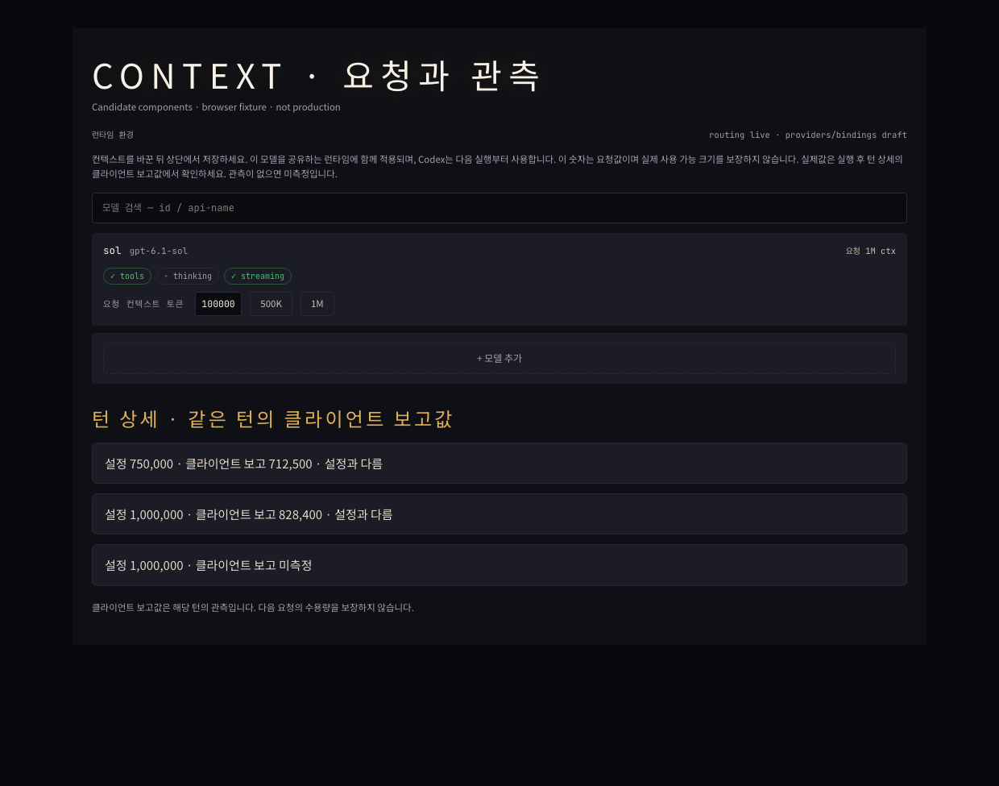

# Context requests and observed client windows

## Candidate UI evidence

Chromium rendered the candidate model editor and the same `ContextWindowFacts`
component used in turn and memory inspectors. Fixture records exercise
750000/712500, 1000000/828400 and missing reported capacity. Browser assertions
verified those numbers, the unmeasured state and the request label. No page
errors occurred. This is a browser fixture, not a deployed dashboard.

## Validation

Four focused dashboard suites passed, 138 tests total: Keeper turn inspector,
memory inspector, runtime environment editor and runtime TOML editor. TypeScript
checking passed. Changed OCaml implementation, interface and scenario source
parse. OCaml behavior tests, type checking, CI and deployment were not run.
Independent backend and frontend source reviewers found no P0/P1/P2 issues;
minor metadata-label and API/interface-comment feedback was incorporated.

The scenarios preserve usage-scope restrictions, configured values, missing
reports and exact same-record associations. A 1000000 configured window with
828400 reported and 414200 input yields 50%, rather than 41.42%. An input exceeding
the reported window remains unavailable, even if it fits the configured window.

## Separate real client observations

Ephemeral read-only GPT-6.1 Sol turns through Codex CLI 0.159.3 on one operator
account completed with the following `modelContextWindow` reports:

| Requested | Client reported |
| ---: | ---: |
|250000|237500|
|500000|475000|
|750000|712500|
|1000000|828400|

The 250000 probe was repeated during this change; the other probes were run
in the preceding configuration work. These are client reports on tiny requests,
not large-prompt acceptance tests, account-wide capacity guarantees or execution
of the candidate MASC binary. No observed number or vendor percentage is
hardcoded into the implementation. Configuration and disabled profile activation
state were not changed by this PR.
