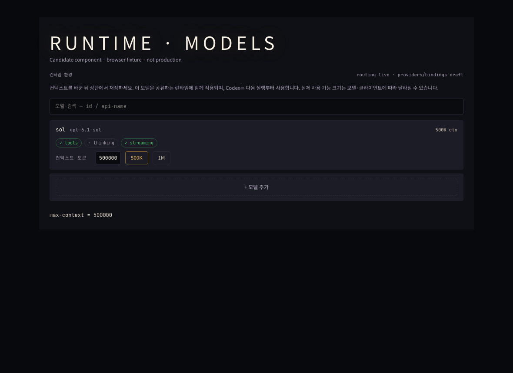

# Model context setting evidence

## Browser fixture

The screenshot renders the candidate `RuntimeEnvironmentEditor` in Chromium,
with fixture TOML and the real TOML field editor. It is not a production dashboard
or installed MASC binary. Playwright clicked 500K and 1M, entered 750000, and
verified the rendered input and TOML draft. No browser page errors occurred.



## Official-client observation

A separate Codex CLI 0.159.3 app-server process used a MASC-managed account home
with `model_context_window = 500000`. An ephemeral, read-only GPT-6.1 Sol thread
completed a tiny text-only request. It reported:

```json
{"model":"gpt-6.1-sol","requested":500000,"observed_modelContextWindow":475000}
{"turn_status":"completed"}
```

This proves the client accepts the 500K request and reports 475K usable context
for this model/account. It does not prove 1M availability, every account, a large
prompt, or the pending MASC process-argument change in #40472.

The operator runtime configuration API accepted and re-read 39 Codex model
profiles at 500000. Four MASC-managed Codex account homes were configured for
500000 on the next process; ongoing turns were not restarted. This is separate
from deployment of the candidate UI.

## Candidate validation

```text
pnpm --dir dashboard test src/components/runtime-toml-editor.test.ts src/components/runtime-environment-editor.test.ts src/lib/runtime-toml-config.test.ts
Test Files 3 passed (3)
Tests 164 passed (164)

pnpm --dir dashboard typecheck
exit 0
```

These cover the persisted preset/custom value, rejection of invalid input,
reset/tab behavior, existing model configuration mutations and direct component
rendering. No local Dune build, CI or candidate UI deployment was performed.
