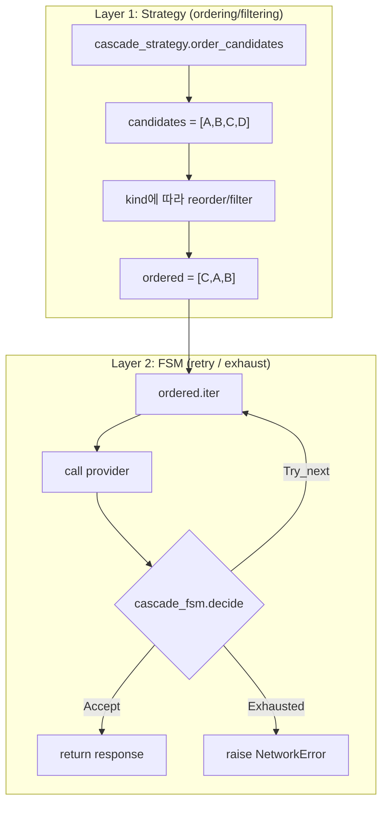
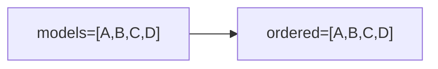
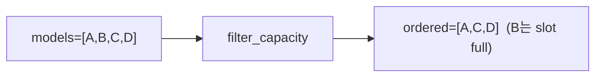
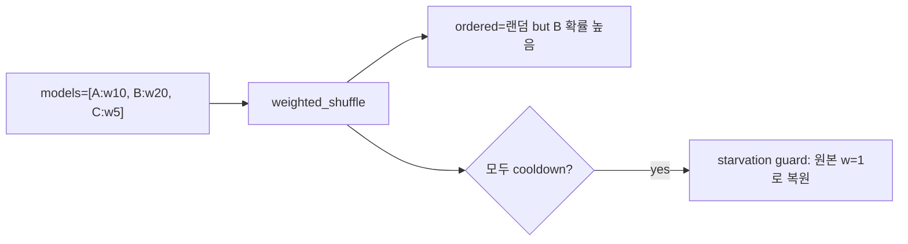
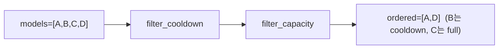
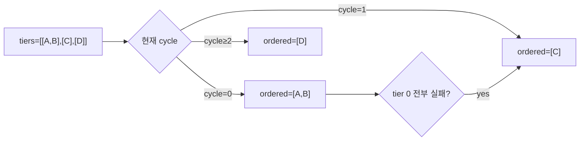
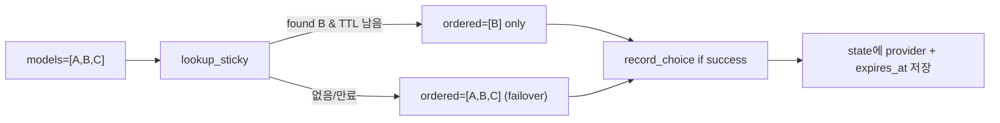
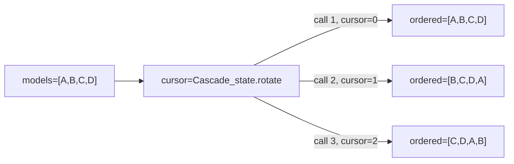

# Cascade Strategy Guide

> **Note**: **Vincent 개인 참고용** 문서입니다. 팀 계약이나 외부 스펙 아님.
> 내가 cascade 전략 체계를 잊었을 때 돌아와 읽는 메모이며,
> 실험하면서 구조가 바뀌면 수시로 재작성될 수 있습니다.
> 공식 계약은 `docs/observability/cascade-metrics.md`와 `specs/boundary/CascadeStrategy*.tla`.

MASC가 cascade profile 안에서 어떤 순서/필터로 provider를 선택하는지 규정하는 전략 카탈로그.

## Scope

- **다루는 것**: 7개 strategy kind의 의도와 동작, 각 profile이 어떤 전략을 쓰는지, 전략 선택 기준.
- **다루지 않는 것**: provider 수준의 retry 정책(`cascade_fsm`), HTTP 에러 분류(`cascade_health_filter`), cooldown 수식(`cascade_health_tracker`).
  이들은 어떤 strategy를 써도 공통으로 작동한다.

## 핵심 분리: 전략 vs FSM

Cascade는 **두 레이어로 분리**돼 있다. 헷갈리면 두 레이어 혼동이 원인이다.



- Strategy는 **"어떤 순서로 시도할지"** 만 결정한다. `order_candidates`가 반환하는 리스트가 곧 시도 순서.
- FSM은 **"실패했을 때 다음으로 갈지 멈출지"** 를 결정한다. `cascade_fsm.decide`의 결과는 `Accept | Try_next | Exhausted`.
- "provider 한 개가 다음 provider로 넘어가는 조건"은 `cascade_health_filter.should_cascade_to_next`:
  - `HttpError` 중 `cascadable_codes` (5xx, 429 등) → true
  - `HttpError 400/422 + "context overflow"` 또는 parse error body → true
  - `AcceptRejected` (정책 거절) → **false** (cascade 안 함)
  - `NetworkError` → true
  - Local resource exhaustion (FD, port) → false

즉 "Failover면 무조건 순회한다"는 오해가 흔한데, **모든 전략은 cascade_fsm이 stop을 반환하면 거기서 끝난다**. 전략은 순서만 바꿀 뿐이다.

## 전략 카탈로그

### 1. `Failover` (default)

**동작**: 입력 그대로 반환. 순서 = 설정 순서. 첫 번째 성공에서 정지.



- **Source**: `cascade_strategy.ml:231` (`Failover -> cands`)
- **언제 쓰나**: "싼 → 비싼" 순으로 내려가는 정석 폴백. cascade.json `*_models` 순서가 곧 선호 순서.
- **언제 안 쓰나**: 첫 번째 provider가 계속 성공하면 나머지는 영원히 호출되지 않는다. 다양성/관찰/부하분산 의도에는 부적합.
- **함정**: 현재 live cascade.json의 9개 profile (`default`, `coding_first`, `keeper_unified`, `nick0cave`, `local_only`, `local_first_thrift`, `overflow_safe_local`, `summarize_quick`, `tool_use_strict`, `playground_custom`, `recovery_local_slow`, `zai_split_a/b`)이 Failover. 이들은 "첫 번째가 거의 늘 성공"이라는 가정을 내재한다.

### 2. `Capacity_aware`

**동작**: 각 provider의 client capacity(슬롯 semaphore)를 먼저 조회, 슬롯이 남아있는 것만 통과.



- **Source**: `cascade_strategy.ml:97` `filter_capacity` + `cascade_strategy.ml:92` `has_capacity` (unknown=fail-open)
- **언제 쓰나**: Ollama/CLI 같은 per-process 단일 슬롯 provider가 섞여있을 때. 다른 keeper가 이미 슬롯을 잡고 있으면 그 provider는 건너뛴다.
- **함정**: capacity 정보가 없는 provider(unknown)는 통과시킨다(fail-open). Health cooldown은 고려하지 않는다 — 실패한 provider도 슬롯만 비어있으면 다시 시도된다.
- **Profile 예**: `capacity_queue_solo`, `capacity_queue_trio`

### 3. `Weighted_random`

**동작**: 각 후보의 `config_weight × health_adjusted_weight`로 weighted shuffle. Cooldown 중인 provider는 weight=0으로 배제, 단 전부 0이면 starvation guard로 원본 복원.



- **Source**: `cascade_strategy.ml:114` `weighted_shuffle`
- **언제 쓰나**: 여러 provider에 부하를 분산. 품질/가격 mix. 단일 벤더 의존도 제거.
- **언제 안 쓰나**: KV cache hit 극대가 필요한 경우 (매 호출 provider가 바뀌므로 cache miss). 재현성이 필요한 실험 (random).
- **Profile 예**: `vendor_mix_balanced`, `keeper_yul`

### 4. `Circuit_breaker_cycling`

**동작**: cooldown 중인 provider 제외 → capacity 있는 것만 → 순서는 그대로.



- **Source**: `cascade_strategy.ml:237-240`
- **언제 쓰나**: 실패가 누적된 provider를 자동으로 쉬게 하고 싶을 때. `cascade_health_tracker`가 실패마다 cooldown 연장.
- **함정**: 모든 provider가 동시에 cooldown이면 빈 리스트 반환 → `filtered_empty` 이벤트 발생 → `StrategyFilteredEmptyStorm` 알림. 부하가 크면 cooldown이 영속화될 수 있다.
- **Profile 예**: `resilient_breaker`

### 5. `Priority_tier`

**동작**: Provider를 여러 tier로 분류. 사이클 N에서 tier N만 시도. 실패 시 다음 사이클에 tier 상승.



- **Source**: `cascade_strategy.ml:163` `tier_for_cycle`, `cascade_strategy.ml:171` `priority_tier_order`
- **언제 쓰나**: "cheap tier 먼저, 실패하면 expensive tier" 같은 단계적 escalation. tier 간 비용/품질 차이가 뚜렷할 때.
- **함정**: `max_cycles`가 낮으면 상위 tier까지 도달 못한다. `cycle ≥ len(tiers)`이면 마지막 tier 고정 (`tier_for_cycle`의 clamp).
- **Config 키**: `*_tiers` (2차원 배열), `*_max_cycles`
- **Profile 예**: `cost_tier_ladder`, `keeper_sangsu`

### 6. `Sticky`

**동작**: 최근 성공한 provider를 `sticky_ttl_ms` 동안 고정. 만료 또는 cand 리스트에 없으면 failover로 fallback.



- **Source**: `cascade_strategy.ml:183` `sticky_order`, `cascade_strategy.ml:253` `record_choice`
- **언제 쓰나**: KV cache hit을 극대화하고 싶을 때. context 연속성이 중요한 긴 세션.
- **함정**: pinned provider가 죽으면 TTL 동안 cascade가 막힐 수 있다. 다만 sticky_order는 pinned가 cand에 없으면 원본 리스트 반환으로 degrade.
- **Config 키**: `*_sticky_ttl_ms` (ms 단위, 기본 300000 = 5분)
- **Profile 예**: `quality_sticky_glm51` (10분 sticky)

### 7. `Round_robin`

**동작**: 전역 cursor 기반 rotation. N번째 호출 = `models[(N+offset) mod len]`부터 시작.



- **Source**: `cascade_strategy.ml:208` `round_robin_order`, `cascade_state.ml` `rotate_round_robin`
- **언제 쓰나**: 공평 순환. 각 provider가 동일 비율로 호출되어야 할 때. **관찰/실험/비교측정** 워크로드에 적합.
- **언제 안 쓰나**: KV cache hit 필요 (매번 provider 바뀜). 첫 번째가 가장 싼/빠른 경우 불이익.
- **특성**: cursor는 `Cascade_state`에 persist. 재현 가능한 순서. Random 아님.
- **Profile 예**: `oauth_cli_rotate`

## 의사결정 매트릭스

의도 → 전략. 이 표에서 역순으로 검색하면 내 cascade가 맞는 전략을 쓰는지 확인할 수 있다.

| 의도 | 전략 | 핵심 trade-off |
|------|------|---------------|
| 싼→비싼 순차 폴백 (기본) | `Failover` | 첫 번째만 계속 성공하면 나머지 미노출 |
| 슬롯 풀 회피 (로컬/CLI 혼재) | `Capacity_aware` | 실패 provider는 capacity만 있으면 재시도 |
| 부하분산, vendor mix | `Weighted_random` | 비결정성, KV cache miss |
| 실패 많은 provider 자동 격리 | `Circuit_breaker_cycling` | 전부 cooldown이면 빈 리스트 |
| tier 0 우선, 실패시 tier 승격 | `Priority_tier` | `max_cycles` 부족하면 상위 tier 미도달 |
| KV cache hit 극대 (N분 고정) | `Sticky` | pinned provider 장애 시 TTL 동안 블록 |
| 공평 순환 (관찰/실험/비교) | `Round_robin` | 매 호출 provider 변경, cache miss |

## Live Profile Inventory

`~/.masc/config/cascade.json`의 현재 상태 (2026-04-17 기준). `*_strategy` 키가 없으면 `Failover` 기본값.

| Profile | Strategy | Models | 용도 주석 |
|---------|----------|--------|----------|
| `default` | Failover | 4 | 범용 기본 |
| `coding_first` | Failover | 4 | 코딩 작업 우선 모델 순서 |
| `local_only` | Failover | 1 | 로컬 Ollama만 |
| `keeper_unified` | Failover | 3 | 통합 keeper (glm → ollama → gemini_cli) |
| `nick0cave` | Failover | 5 | fast implementation bias |
| `local_first_thrift` | Failover | 2 | 로컬 우선 |
| `overflow_safe_local` | Failover | 1 | context overflow 안전 |
| `tool_use_strict` | Failover | 2 | tool calling 엄격 |
| `summarize_quick` | Failover | 2 | 요약 전용 |
| `recovery_local_slow` | Failover | 1 | 복구 경로 |
| `playground_custom` | Failover | 1 | Custom endpoint 실험 |
| `zai_split_a` | Failover | 1 | ZAI 계정 A |
| `zai_split_b` | Failover | 1 | ZAI 계정 B |
| `capacity_queue_solo` | Capacity_aware | 2 | 단일 슬롯 큐 |
| `capacity_queue_trio` | Capacity_aware | 2 | 3-way 슬롯 큐 |
| `vendor_mix_balanced` | Weighted_random | 3 | 벤더 균등 분산 |
| `keeper_yul` | Weighted_random | 3 | yul keeper |
| `resilient_breaker` | Circuit_breaker_cycling | 4 | 자동 쿨다운 |
| `cost_tier_ladder` | Priority_tier | 4 | 비용 tier escalation |
| `keeper_sangsu` | Priority_tier | 3 | sangsu keeper |
| `quality_sticky_glm51` | Sticky | 2 | 10분 고정, KV cache hit |
| `oauth_cli_rotate` | Round_robin | 3 | OAuth CLI 계정 순환 |

**자기진단 one-liner** (내 profile이 뭐 쓰는지 확인):

```bash
python3 -c "
import json
d = json.load(open('$HOME/.masc/config/cascade.json'))
p = {}
for k, v in d.items():
    if k.startswith('_'): continue
    for s in ['_models','_strategy','_tiers','_sticky_ttl_ms']:
        if k.endswith(s):
            p.setdefault(k[:-len(s)],{})[s[1:]] = v
for name, cfg in sorted(p.items()):
    s = cfg.get('strategy', 'Failover(default)')
    print(f'{name:30s} {s}')
"
```

## Configuration Reference

cascade.json에 쓰는 키 전체. `{profile}`는 profile 이름 prefix (예: `keeper_unified`).

### 공통 (모든 전략)

| 키 | 타입 | 기본값 | 설명 |
|----|------|--------|------|
| `{profile}_models` | `string[]` | — | Provider label 리스트 (`"provider:model_id"` 형식) |
| `{profile}_strategy` | `string` | `"failover"` | 전략 kind (아래 7종 중 하나) |
| `{profile}_max_cycles` | `int` | 1 | 전체 cascade 반복 횟수 |
| `{profile}_backoff_base_ms` | `int` | 500 | cycle 간 exponential backoff 시작값 |
| `{profile}_backoff_cap_ms` | `int` | 10000 | backoff 상한 |
| `{profile}_temperature` | `float` | 0.2 | 샘플링 온도 |
| `{profile}_max_tokens` | `int` | 16384 | 응답 최대 토큰 |
| `{profile}_timeout_ms` | `int` | (per-provider default) | 요청 timeout |
| `{profile}_ollama_max_concurrent` | `int` | 1 | 로컬 Ollama client-side semaphore |
| `{profile}_cli_max_concurrent` | `int` | 1 | CLI provider client-side semaphore |
| `{profile}_api_key_env` | `object` | — | provider → env var name 매핑 |

### 전략별 추가 키

| 전략 | 키 | 타입 | 용도 |
|------|----|------|------|
| `priority_tier` | `{profile}_tiers` | `string[][]` | 각 tier의 provider key 리스트 (2차원) |
| `sticky` | `{profile}_sticky_ttl_ms` | `int` | sticky 만료 시간 (기본 300000) |
| `weighted_random` | `{profile}_weighted_entries` | `object[]` | `{label, weight}` 리스트 (models 대신 쓸 수 있음) |

### 전략 값 enum

`failover` | `capacity_aware` | `weighted_random` | `circuit_breaker_cycling` | `priority_tier` | `sticky` | `round_robin`

알 수 없는 값이면 warning 로그 남기고 `failover`로 폴백 (`cascade_config.ml:682-689`).

## Common Pitfalls

### "내 cascade가 fallback을 안 한다"

가장 흔한 증상. 3가지 원인이 가능하다.

1. **`Failover` + 첫 번째 provider가 늘 성공**: 정상 동작. 다양성을 원하면 strategy 변경.
2. **`AcceptRejected` (정책 거절)**: `should_cascade_to_next` 가 `false`를 반환. Cascade 멈춤. 이건 의도된 설계 — 정책 위반은 다른 provider에서도 동일하게 위반된다고 가정.
3. **Local resource exhaustion (FD, port)**: `is_local_resource_exhaustion`이 true → cascade 중단. 모든 provider가 같은 로컬 리소스에 의존한다고 가정.

### "전부 cooldown이라 빈 리스트"

`Circuit_breaker_cycling`만 발생. `StrategyFilteredEmptyStorm` 알림이 울린다. 임시 완화는 cooldown TTL을 낮추는 것 (`cascade_health_tracker` 내부 상수), 근본 해결은 provider 추가 또는 cooldown 정책 재검토.

### "Sticky가 고정 안 된다"

`record_choice`는 Sticky일 때만 state를 쓴다(`cascade_strategy.ml:252`). 다른 전략은 기록 안 함. Sticky로 전환 후 최초 1회 성공이 있어야 state가 생긴다. 초기 상태는 failover로 동작.

### "Round_robin인데 provider가 안 바뀐다"

cursor는 process 내부 상태. MASC 재시작 시 reset. 또한 cursor 증가는 `order_candidates` 호출 시마다 발생하는 것이 아니라 `rotate_round_robin`이 호출될 때만. 한 cycle 내 여러 candidate를 순회해도 cursor는 그대로.

## Cross-references

- 관찰 면 (Prometheus, Grafana, alerting): [`docs/observability/cascade-metrics.md`](../observability/cascade-metrics.md)
- cascade.json 스키마 전체: [`docs/spec/14-configuration.md`](../spec/14-configuration.md)
- TLA+ 형식 검증: `specs/boundary/CascadeStrategy.tla`, `CascadeStrategyStateful.tla`
- 전략 추가 절차: 5-surface 일관성 (code, mli, spec, metric label, dashboard) — 상세는 `cascade-metrics.md` 마지막 섹션

## 변경 이력

- 2026-04-17: 초안 작성. 7 strategy + 22 profile 전수 캡처.
