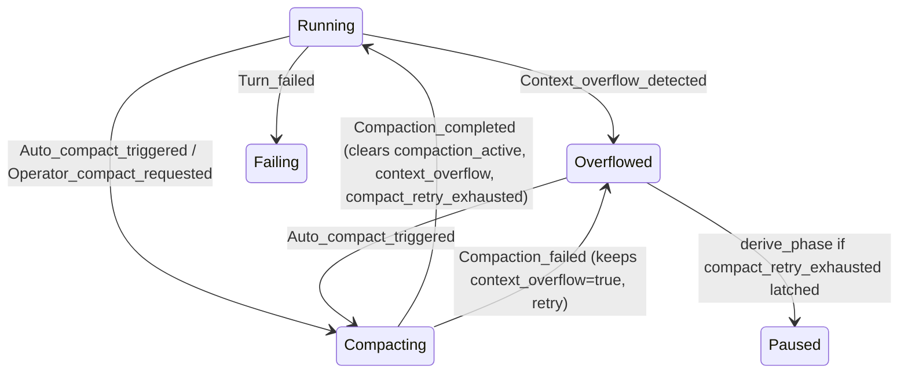

# Context Compaction Lifecycle

> Developer reference for how context compaction works end-to-end in masc-mcp.
> For memory-bank compaction (a separate subsystem), see
> [`specs/bug-models/MemoryCompaction.tla`](../../specs/bug-models/MemoryCompaction.tla)
> and [`keeper_memory_bank.ml`](../../lib/keeper/keeper_memory_bank.ml).

Related work:
- Spec audit: [`docs/audits/compaction-fsm-tla-audit-2026-04-16.md`](../audits/compaction-fsm-tla-audit-2026-04-16.md) (PR #7568)
- Audit subscriber + retention: PR #7580 (v0.9.5)
- Primary TLA+ spec: [`specs/keeper-state-machine/KeeperContextLifecycle.tla`](../../specs/keeper-state-machine/KeeperContextLifecycle.tla)

## 1. Trigger Gates

Evaluated in [`lib/keeper/keeper_compact_policy.ml`](../../lib/keeper/keeper_compact_policy.ml)'s
`compact_if_needed`. Any gate firing causes a compaction attempt. Gates
come from `compaction_policy` record ([`keeper_types.mli:12-19`](../../lib/keeper/keeper_types.mli)):

| Gate | Field | Typical default | Semantics |
|------|-------|-----------------|-----------|
| Ratio | `ratio_gate` | 0.60–0.80 | `context_ratio >= ratio_gate` — soft, early |
| Message | `message_gate` | 80 | `message_count >= message_gate` |
| Token | `token_gate` | 0 (disabled) | backward-compat; most profiles set to 0 |
| Tool-heavy | (hardcoded) | `msg_count>40 ∧ ratio>0.15` | stubs old tool results via `stub_tool_results(keep_recent=2)` |
| Continuity cooldown | `cooldown_sec` | varies | bypass compaction if `now - last_reflection_ts < cooldown_sec` |

**Emergency override** (`context_ratio >= 0.80`) forces compaction even
when continuity cooldown would otherwise block. **Hard cap** (ratio
`>= 0.95`) routes through `Context_overflow_detected` event — hard
failure reported by provider, not just a soft warning.

## 2. Phase Transitions

Defined in [`lib/keeper/keeper_state_machine.mli:20-37`](../../lib/keeper/keeper_state_machine.mli)
(12-state enum). Event handlers in
[`lib/keeper/keeper_state_machine.ml`](../../lib/keeper/keeper_state_machine.ml):



**Key behaviors** (verified by direct read):

- `Compaction_completed _` handler at `keeper_state_machine.ml:374-382`
  clears three conditions: `compaction_active`, `context_overflow`,
  `compact_retry_exhausted`.
- `Compaction_failed _` handler at `keeper_state_machine.ml:383-389`
  only clears `compaction_active`. `context_overflow` stays `true`
  intentionally — retry logic owned by `keeper_unified_turn` retry
  loop; latch is promoted via subsequent events.
- `derive_phase` (`keeper_state_machine.ml:~330`) routes
  `context_overflow && compact_retry_exhausted` to `Paused` (requires
  operator intervention).

**Post-turn lifecycle contract**
([`keeper_state_machine.mli:110-138`](../../lib/keeper/keeper_state_machine.mli)):
`Compaction_started`/`Compaction_completed`/`Compaction_failed` MUST
be dispatched only from `Keeper_post_turn.apply_post_turn_lifecycle`.
Violations reopen the
[`KeepalivePhaseConsistency.tla`](../../specs/bug-models/KeepalivePhaseConsistency.tla)
bug — `NoDrainTransition` / `GhostDispatch` invariants would catch it.

## 3. Strategy Pipeline

Executed by [`lib/keeper/context_compact_oas.ml`](../../lib/keeper/context_compact_oas.ml)
on the keeper side, wrapping OAS's `Context_reducer`:

```
OAS strategies  →  MASC fold  →  Repair  →  Sync
```

| Step | Location | Effect |
|------|----------|--------|
| `PruneToolOutputs` | OAS `Context_reducer` | Tool result content → metadata stubs (name, id, lines, chars, summary) |
| `MergeContiguous` | OAS `Context_reducer` | Merge adjacent same-role messages |
| `DropLowImportance` | OAS `Context_reducer` | Drop low-importance messages deemed prunable |
| `stub_tool_results(keep_recent=2)` | MASC `context_compact_oas.ml` | Tool-heavy path only — structural tool output stub, preserves 4-role semantics |
| `repair_broken_tool_call_pairs` | MASC | Restore orphaned ToolUse/ToolResult pairs (spec invariant `CompactionPairIntegrity`) |
| `sync_oas_context` | MASC | Recompute `message_count`, `token_count`, `context_ratio` |

Message count is additionally bounded by
`default_max_checkpoint_messages = 120` and per-message sub-caps
(text chars ≤16KB, tool result chars ≤8KB, total ≤200KB).

## 4. Observability Surfaces

Compaction is observable through four independent channels. Each has
separate storage / lifecycle / retention.

| Surface | Location | Lifecycle | Retention |
|---------|----------|-----------|-----------|
| **Paired audit JSONL (new)** | `.masc/data/harness-compact/YYYY-MM/DD.jsonl` | written by `Keeper_compact_audit` subscriber on every ContextCompactStarted + ContextCompacted | rolling, default 14 days (`MASC_COMPACTION_AUDIT_RETENTION_DAYS` override) |
| Legacy pre-compact JSONL | `.masc/data/harness-pre-compact/YYYY-MM/DD.jsonl` | written by `Dashboard_harness_health.record_pre_compact` (deprecated) | historical; read-only fallback for existing dashboards |
| Prometheus | `masc_keeper_compactions_total`, `masc_keeper_compaction_ratio_change` | incremented on every compaction attempt / completion | process-lifetime, scrape-based |
| TLA+ trace (opt-in) | `.masc/keepers/<name>.tla-trace.jsonl` | written when `MASC_TLA_TRACE=1` | until operator deletes; zero overhead when disabled |
| Checkpoint store | `.masc/keepers/<name>/traces/<trace_id>/ckpt-<ts>.json` | atomic write after every `Turn_succeeded` | max 3 retained per session |

### CLI: `masc-compaction-audit`

Inspect the paired audit JSONL (v0.9.5+):

```bash
# List paired Start/Complete rows from last 14 days
sb compaction list

# Filter by keeper, show orphan rows (Start without Complete)
sb compaction list --keeper dreamer --orphans-only

# Manually trigger retention sweep
sb compaction list --prune
```

Output format (one line per paired row):
```
[2026-04-16T15:45:02Z] dreamer             proactive  c1234567-dreamer-0 → 54000 → 27000 (Δ27000) phase=proactive(85%)
```

Orphans are labelled explicitly (`ORPHAN_START` / `ORPHAN_COMPLETE`)
for debugging — e.g., server crash mid-compaction produces an
`ORPHAN_START`.

## 5. MASC ↔ OAS Boundary

Responsibilities are split cleanly:

| Concern | Owner |
|---------|-------|
| Gate evaluation (ratio/message/token/tool-heavy/cooldown) | MASC (`keeper_compact_policy.ml`) |
| FSM / phase transitions | MASC (`keeper_state_machine.ml`) |
| Event emission (`ContextCompactStarted`, `ContextCompacted`, `ContextOverflowImminent`) | OAS (`event_bus.ml`) |
| Strategy pipeline execution (`PruneToolOutputs`, `MergeContiguous`, `DropLowImportance`) | OAS (`Context_reducer`) |
| MASC-specific fold (`stub_tool_results`), repair (`repair_broken_tool_call_pairs`) | MASC (`context_compact_oas.ml`) |
| Token/message count after compaction | OAS (source of truth) |
| Audit persistence + retention | MASC (`keeper_compact_audit.ml`) |
| SSE broadcast (dashboard) | MASC (`oas_sse_bridge.ml`) |

Compaction events flow: **OAS publishes** on Event_bus → **multiple
MASC subscribers** consume independently (oas_sse_bridge for SSE,
keeper_compact_audit for persistence). Each subscriber has its own
bounded stream — back-pressure in one does not affect the other.

**Architecture principle**: MASC does not invade OAS's lifecycle (no
reimplemented compaction logic, no separate token counter). MASC
observes via Event_bus and stores via filesystem. See
[`memory/feedback_no-lifecycle-invasion-from-masc.md`](../../../.claude/memory/feedback_no-lifecycle-invasion-from-masc.md).

## 6. Failure Modes

| Mode | Detected by | Phase transition | Recovery |
|------|-------------|------------------|----------|
| Ratio-only trigger, compaction succeeds | `compact_if_needed` → `Compaction_started`/`_completed` | `Running → Compacting → Running` | automatic |
| Provider rejects prompt (hard overflow) | `Context_overflow_detected` | `Running → Overflowed → Compacting` | automatic via retry |
| Compaction returns error | `Compaction_failed { reason }` | `Compacting → Overflowed` (retry) | retry loop in `keeper_unified_turn`; if budget exhausted, latch `compact_retry_exhausted` |
| Retry exhausted | `Operator_clear_requested` or `Context_overflow_detected` after latch | `Overflowed → Paused` | manual: operator must intervene |
| Timeout / cancellation | Eio.Cancel.Cancelled during `Agent.run` | termination propagates; Turn_failed | supervisor restart budget |
| Server crash between Start/Complete | — | next startup: no phase change | audit system flags `ORPHAN_START`; 14-day retention cleans up |
| OAS emits unknown trigger string | subscriber parses to `Unknown_trigger of string` | no phase impact | audit CLI shows `Unknown_trigger(<raw>)` — forward-compat preserved |

## 7. Where to Start Debugging

"Compaction isn't running":
1. Check `compaction_policy` in `keeper_meta.json` — are gates
   configured sensibly? (default ratio_gate=0.6–0.8)
2. Check recent `Dashboard_harness_health` logs for
   `skipped:continuity_cooldown` reason
3. `sb compaction list --since <yesterday>` — does audit show any
   Start events?
4. Check process logs for subscriber errors
   (`keeper_compact_audit: persist_start failed: ...`)

"Compaction runs but context stays full":
1. `sb compaction list` — examine `(Δ)` column; if always small,
   strategy pipeline may not be finding prunable content
2. Check `masc_keeper_compaction_ratio_change` histogram — is ratio
   dropping at all?
3. Check for `Compaction_failed` events in audit — retry-exhausted
   paths will show as `ORPHAN_START` entries until the latch releases

"FSM seems stuck in Paused":
1. Confirm `compact_retry_exhausted = true` in
   `conditions` snapshot
2. Check TLA+ trace (`MASC_TLA_TRACE=1`) to replay last transitions
3. Operator recovery:
   `masc keeper repair --agent <name>` dispatches `Operator_clear_requested`
