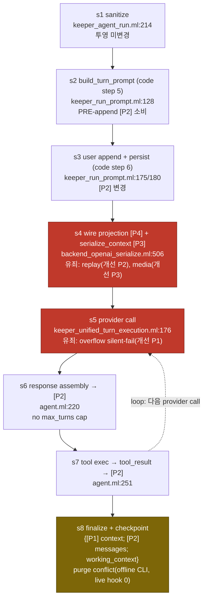

# Kerberos Turn-Flow Provider-Agnostic Audit (2026-07-22)

Keeper turn 데이터 흐름을 provider-agnostic 관점 하나의 칼(single knife)로 코드 레벨 적대 감사한 결과를 코드 앵커(file:line) 기반 SSOT로 기록한다. 워크플로우 19 agents, 판정 24 CONFIRMED / 11 REFUTED. 모든 주장은 워크플로우 산출물 또는 명시된 라이브 로그에서만 가져왔다.

> **표기 범례 (naming legend)**
> - 투영(projection) 필드는 소스 표기 그대로 **[P1] context**, **[P2] messages**, **[P3] serialize_context**, **[P4] wire** 로 쓴다.
> - 개선 우선순위는 **개선 P1 ~ 개선 P7** 로 쓴다 (improvement_ssot priority 1~7).
> - 두 P 체계는 다른 축이므로 접두어(투영 / 개선)로 구분한다.
> - PR/RFC 번호 중 `#25537`(purge), `#25536`(breaker), `RFC-OAS-029`(P2 scope) 는 이 문서를 지시한 태스크가 제공한 컨텍스트이며 워크플로우 JSON 산출물에는 없다. file:line 근거는 모두 워크플로우 산출물 것이다.

---

## 1. 배경

2026-07-15 리팩터 두 건이 proactive context management 를 제거했다.

- masc **#24443** — implicit lifecycle limit carriers 제거.
- masc **#24460** — typed provider overflow 만 신뢰하도록 변경.

결과로 masc 는 provider 가 반응적으로(reactive) 신호하는 overflow 에만 의존하게 되었고, overflow 발생량이 07-15 당일 0 → 3873/day 로 증가했다. 즉 masc 는 사전 truncation/gate 를 잃고, provider 가 보내는 wire overflow 토큰 디코드에 전적으로 의존한다.

이 상태를 하나의 렌즈로 재감사한 것이 본 Kerberos 적대 감사다. 19 agents 가 8 시나리오 × 다수 accusation 을 코드로만(추측/환각 금지) refute 시도하여, 24건 CONFIRMED / 11건 REFUTED 로 판정했다. base trace 시나리오(turn-flow-ssot-baseline)는 accusation 이 아니라 SSOT 정정 항목으로 다루어 verdict 배열이 없다(별도 8개 시나리오가 verdict 를 가짐).

---

## 2. 판정 칼 (single knife)

turn 순서도의 각 단계에서 오직 하나만 묻는다.

> **이 단계가 provider/model 의 IDENTITY(이름/방언/signed 여부)를 알아야 동작하는가, 아니면 스펙 숫자(max_context 등) 하나로 충분한가?**

- 스펙 숫자만으로 충분 → **무죄 (provider-agnostic)**.
- identity 를 알아야 함 → **유죄 (고발)**. masc 경로에 provider 이름 substring(glm/deepseek/kimi 등)이 로직에 있으면 즉시 고발.
- typed capability 분기(예: reasoning_dialect replay_policy)는 "identity 유죄"와 구분해 **파편성(fragmentation)** 등급으로 별도 표기한다. typed variant match 는 substring 이 아니지만 여전히 identity 를 알아야 하므로 파편성으로 살아남는다.
- telemetry/display 목적의 identity 참조는 명시적으로 **무죄** (carve-out).

모든 고발/판정에는 반드시 file:line 근거를 단다.

---

## 3. 핵심 결론

- **masc turn path 는 provider-agnostic 이 코드로 확인됨.** turn-path 파일 전수 grep(`glm|deepseek|kimi|zai|minimax|anthropic|gemini|ollama|openai`)에서 `keeper_agent_run.ml`, `keeper_run_prompt.ml`, `keeper_unified_turn.ml`, `keeper_unified_turn_pre_dispatch.ml`, `keeper_unified_turn_execution.ml`, `keeper_turn_runtime_budget.ml`, `keeper_context_runtime.ml` 모두 0 매치. "masc-side guilt" 로 제기된 모든 accusation 은 **REFUTED** (spec-transition Acc4, task-goal-verify s7/s0-s5, multimodal Acc4/6/7, hitl readiness, memory-os Acc3, judge-fusion config-parse/output-contract).
- **모든 provider identity 의존은 OAS `lib/llm_provider` wire boundary 에 집중.** reasoning_dialect.ml(replay_policy 유도 + GLM 하드코드 predicate + full-identity reasoning_source), `Provider_http_codec.of_config`("kind owns the wire contract"), per-backend media/message serializer(Document→image_url 강제 등), `validate_output_schema_request` 의 GLM json_object-only 하드코드, per-backend finish/stop-reason overflow 디코드. serialization 에는 identity 가 정당하게 필요하므로 이 경계에서의 identity 는 by-design 이다.
- **진짜 정정성(correctness) 결함은 단 하나: 개선 P1 (s5 overflow silent failure).** 나머지 23건은 파편성(fragmentation) — masc 로 누적될 선례이지, 지금 데이터를 잃는 결함은 아니다.

`root_summary` 원문 요지: provider-identity 의존은 거의 전적으로 OAS `lib/llm_provider` wire boundary(특히 reasoning_dialect.ml, provider_http_codec.of_config, per-backend serializer, validate_output_schema_request 의 GLM 하드코드, per-backend overflow 디코드)에 집중되어 있고, masc turn path 자체는 spec-number min() + typed enum + typed ContextOverflow 로 검증 가능하게 provider-agnostic 하다. 유일한 정정성 결함(파편성이 아닌)은 s5 의 non-total overflow 디코드로, 비-canonical/Gemini/Ollama 어휘 overflow 토큰이 `Types.Unknown -> None` 으로 떨어져 masc 반응적 compaction 이 조용히 발화하지 않는 것이다.

---

## 4. Turn 사이클 순서도 (CORRECTED)

base trace(`turn-flow-ssot-baseline`) 감사가 정정한 8단계와 반드시 기록해야 하는 정정 항목이다. 소스의 `base.steps` + `base.corrections` 를 충실히 옮긴다.

### 4.1 8단계 (base.steps)

| 단계 | 이름 | file:line | 투영 변화 |
|---|---|---|---|
| **s1** | sanitize (Section 1 setup) | masc `lib/keeper/keeper_agent_run.ml:214` (`Keeper_run_prompt.sanitize_user_message`; impl = `Inference_utils.sanitize_text_utf8` at `keeper_run_prompt.ml:79`) | 투영 미변경. `run_turn` 최상단에서 raw `user_message` 를 UTF-8 정규화. steps 0-4 = `Keeper_run_context.prepare_run_context`(호출 `keeper_agent_run.ml:307`). |
| **s2** | build_turn_prompt (code step 5, **append 이전 실행**) | masc `lib/keeper/keeper_run_prompt.ml:128` (`build_turn_context` 내부; callback PARAM 선언은 `keeper_agent_run.ml:184-185`; `build_turn_context` 호출은 `keeper_agent_run.ml:371`) | **[P2] = `messages_of_context ctx_work`(PRE-append history, `run_prompt.ml:130`)** 를 읽어 `turn_system_prompt` + `dynamic_context` 구성. 투영 미변경. `memory_context` 는 `run_prompt.ml:132` 에서 `""` 로 강제(무력). |
| **s3** | user append + persist (code step 6) | masc `lib/keeper/keeper_run_prompt.ml:175` append(`Record_user_turn`), `:176` `Skip_uninformative_wake` no-op, `:180` `persist_message` | **[P2] 변경.** `Record_user_turn` 이 `user_msg` 를 `ctx_work` working context 에 append(`:175`) + session history persist(`:178-184`, `is_retry`/`Skip_uninformative_wake` 시 skip). `Skip_uninformative_wake` 는 append 도 persist 도 안 함(`:176`,`:184`). |
| **s4** | wire projection **[P4]** + serialize_context **[P3]** | oas `lib/llm_provider/backend_openai_serialize.ml:506` `typed_history_projection`(replay_policy read `:508`, `Reasoning_history_projection.project` `:510`); dialect→contract map `reasoning_dialect.ml:625-629` | **[P4]** 는 [P2] 에 `Reasoning_replay_contract.replay_policy` 를 serialize/wire 시점에 적용해 유도(`No_replay` 는 prior reasoning block drop). **[P3]** = `serialize_context`(masc `keeper_context_core_accessors.ml:130`): 직접 caller 0; `serialized_bytes` 는 caller 6 개, 전부 telemetry/display 또는 post-compaction 측정으로 **pre-send overflow gate 아님**. |
| **s5** | provider call (retry/rotation 계층 경유) | masc `lib/keeper/keeper_unified_turn_execution.ml:176` (`do_run -> Keeper_agent_run.run_turn`); FSM→Streaming emit `:171-175`; retry_loop wrapper `:272`. 실제 OAS dispatch: `keeper_agent_run.ml:518+` Section 3 → `call_run_named` | **[P4] 전송.** overflow 는 provider-reactive: `max_context`(runtime.toml 스펙)은 turn path 에서 관찰용일 뿐(`keeper_agent_run.ml:418/516/853` telemetry), masc proactive truncation/gate 없음. |
| **s6** | response assembly (assistant: text+thinking+tool_use) | oas `lib/agent/agent.ml:220` core loop → `run_turn_core_detailed :226` → `Ok (`Complete response) :243` | OAS 가 assistant turn 을 조립해 `checkpoint.messages`([P2])에 fold. loop 는 turn_count 비교 없이 재귀(no max_turns cap). |
| **s7** | tool execution → tool_result | oas `lib/agent/agent.ml:251` `Ok (`ToolsExecuted _) -> loop release.after :258` (per-tool-boundary checkpoint 가 masc `keeper_agent_run.ml:548` checkpoint_sink 로 노출) | tool_result block 이 [P2](`checkpoint.messages`)에 append; loop 재진입해 다음 provider call. masc 가 checkpoint_sink 에서 session_id + working_context sidecar restamp(`keeper_agent_run.ml:556-564`). |
| **s8** | finalize | masc `lib/keeper/keeper_agent_run_finalize_response.ml:190` finalize; assistant persist(text-only) `:243-256`; checkpoint save `checkpoint_for_replay_persistence :263`, `replay_suffix_pruned` report `:299-300` | **[P2] session history: assistant 는 TEXT-ONLY 로 persist**(단일 Text block `make_message`, `:246-248`) via `persist_message`(`:253`). checkpoint save([P1] context + [P2] messages), 현재 turn suffix 는 `Keeper_replay_prefix.split`(`:141`)로 격리해 pre-turn history prefix 는 byte-exact 유지, suffix 만 canonicalize(`replay_suffix_pruned`). |

### 4.2 반드시 기록할 정정 (base.corrections)

1. **STEP ORDER 역전.** SSOT 는 (2) user append 를 (3) build_turn_prompt 앞에 두었으나, 코드는 **build_turn_prompt 를 먼저**(`keeper_run_prompt.ml:128`, 주석 'step 5') 실행하고 그 뒤 user append(`keeper_run_prompt.ml:168-184`, 'step 6') 를 한다. build_turn_prompt 는 **PRE-append [P2] history**(`messages_of_context ctx_work`, `run_prompt.ml:130`)를 소비하고, 새 user message 는 그 다음에 append 된다. SSOT 순서는 뒤집혀 있었다.
2. **build_turn_prompt LINE.** SSOT `:184` 는 `keeper_agent_run.ml:184-185` 의 callback PARAMETER 선언일 뿐. 실제 호출은 `keeper_run_prompt.ml:128`(`build_turn_context` 내부, 이 함수는 `keeper_agent_run.ml:371-382` 에서 호출).
3. **provider-call LINE.** SSOT `unified_turn_execution.ml:272` 는 retry_loop(retry/runtime-rotation orchestrator)이지 provider call 이 아니다. provider 에 도달하는 호출은 `keeper_unified_turn_execution.ml:176` 의 `Keeper_agent_run.run_turn`(`do_run` 내부, 정의 `:137`); FSM `Awaiting_provider->Streaming` 전이는 `:171-175`. OAS `Agent.run` 으로의 deeper dispatch 는 `keeper_agent_run.ml:518+`(Section 3 → `call_run_named`).
4. **CHECKPOINT 는 THIRD state 필드를 가짐.** SSOT 는 checkpoint 를 `{context([P1]); messages([P2])}` 로 모델링했으나, 실제 `Agent_sdk.Checkpoint.t`(oas `lib/checkpoint_types.ml:5-30` / `checkpoint.mli`)는 **`working_context : Yojson.Safe.t option`** 도 가진다. masc 는 이것을 sidecar 로 read/write(`keeper_agent_run.ml:546, 560-563`) + 모든 config 필드. **[P1]=context 는 scoped KV**(oas `lib/base/context.mli`: App/User/Session/Temp/Custom scope) — 확인. **[P2]=messages** — 확인. 따라서 checkpoint 는 **세 필드** `{context([P1] KV); messages([P2] list); working_context(Yojson sidecar)}`.
5. **replay_policy VARIANT COUNT.** SSOT 는 4개(No_replay|Provider_hidden_replay|Preserve_always|Drop_without_tool_preserve_with_tool). oas `Reasoning_dialect.replay_policy`(`reasoning_dialect.mli:41-46`)는 **5개** — `Latest_user_turn_tool_calls` 누락.
6. **TWO replay vocabularies.** wire projection 은 dialect policy 를 직접 소비하지 않고 **LEAF contract vocabulary** `Reasoning_replay_contract.replay_policy`(`reasoning_replay_contract.mli:7-13`: `No_replay | Tool_call_assistant_messages_all_history | Tool_call_assistant_messages_latest_user_turn | All_assistant_messages | Provider_opaque_state`)를 소비한다. dialect→contract 매핑은 `reasoning_dialect.ml:625-629`(`No_replay->No_replay`, `Preserve_always->All_assistant_messages`, `Provider_hidden_replay->Provider_opaque_state` 등). SSOT 는 contract-level 을 소비하는 단계에 dialect-level policy 이름을 적었다.
7. **PURGE 는 THREE rules(2개 아님).** SSOT 는 R1/R2 만 나열. `keeper_checkpoint_purge.mli:3-13` 은 **R3 = tool-result clear**(닫힌 cycle 의 ToolResult block content 를 `cleared_tool_result_content` 로 교체, `tool_use_id`/ToolUse pairing 은 보존)를 문서화. 순서: **R2, R3 가 R1 앞에 실행**(`mli:15-17`). `default_config = {dup_threshold=3; keep_recent_messages=20; strip_thinking=true; clear_tool_results=true}`(`mli:47`). **Live-hook count 0 확인**: caller 는 `bin/masc_checkpoint_purge.ml`(offline CLI) 와 test 뿐. (태스크 컨텍스트: purge = #25537.)
8. **P3 nuance.** `serialize_context` 자체는 caller 0(masc); byte-length wrapper `serialized_bytes` 는 caller 6 — 5개는 순수 telemetry/display(`dashboard_http_keeper.ml:700`, `keeper_tool_memory_runtime.ml:510`, `keeper_status_detail.ml:403`, `keeper_post_turn.ml:476`, pre-compact record `keeper_compact_policy.ml:414`), **그러나 `keeper_compact_policy.ml:438/448` 는 before/after bytes 를 CONTROL 결정에 사용**(`Structurally_unchanged` no-op compaction reject). 여전히 provider overflow gate 는 아니므로 SSOT core claim('overflow gate 아님')은 유지되지만 '6곳 전부 display/telemetry' 는 부정확.
9. **window spec.** `glm-5-turbo` max-context = **203000**(`runtime.toml:327`), SSOT 의 '정확히 200k' 는 축약. `deepseek-v4-flash` = **1048576**(`runtime.toml:294`) — 확인.
10. **preserve-thinking 매핑 CONFIRMED, 단 qwen 은 현재 UNROUTED.** active-keeper 모델은 전부 false: `executor->ollama_cloud.deepseek-v4-flash`(preserve-thinking 부재=default false), `sangsu->glm-5-turbo`(명시 false, `runtime.toml:333`), `analyst->mimo.mimo-v2.5`(부재=false); `preserve-thinking=true` 는 `qwen36-35b-a3b-mtp` 뿐(`runtime.toml:270`)이나 현재 이 모델로 라우팅되는 keeper 없음(runpod 404 대체). SSOT 'qwen 만 true' 는 model-definition level 에서 정확.
11. **memory_context 는 inert(dead 아님).** `keeper_run_prompt.ml:132` 가 `memory_context = ""` 상수로 강제. 여전히 threaded/read(`keeper_agent_run.ml:385`, digest `:399/:413`)되므로 필드는 dead 가 아님(제거 시 컴파일 깨짐). 단 현재 turn path 에서는 항상 빈 문자열을 나른다.

### 4.3 Mermaid 순서도

투영([P1]-[P4])과 유죄 단계(s4 replay, s5 overflow, s4 media, s8 purge conflict)를 표시한다.

> 주: s8 의 purge conflict 는 offline CLI 경로(`bin/masc_checkpoint_purge.ml`)이고 live turn-path hook 은 0 이므로, live 결함이 아니라 latent/offline 설계 정합성 항목이다. R2/R3 가 R1 앞에 실행되는 3-rule 순서(correction 7)를 checkpoint finalize 경계와 함께 기록해 둔다.

---

## 5. 개선 SSOT (개선 P1 ~ P7)

`improvement_ssot` 를 priority 순으로 옮긴다. 각 항목의 root/fix 와 file:line 을 보존한다.

### 개선 P1 — s5 (provider call / overflow detection) · **정정성 결함**

- **root:** 반응적 compaction(context 재조립)을 여는 유일한 신호가 per-backend, non-total wire vocabulary 로 디코드된다. OAS `stop_reason_wire.ml` 은 canonical OpenAI/GLM 토큰(`"model_context_window_exceeded" -> Context_window_exceeded`)은 인식(검증됨)하지만, 비-canonical 또는 non-OpenAI-GLM overflow 토큰(`:115` 주석: 'Gemini/Ollama use a different wire vocabulary')은 `Other -> Types.Unknown` 으로 떨어지고, `retry.ml:137` 이 `Types.Unknown _ -> None` 으로 매핑한다. 따라서 variant 토큰으로 신호된 overflow 는 typed ContextOverflow 를 합성하지 못하고, masc 의 exhaustive receiver(`keeper_turn_runtime_budget.ml:404-409 -> Provider_overflow`)가 결코 발화하지 않음 → **silent failure, compaction 없음**. Confirmed: scenario spec-transition Acc2.
- **fix:** finish/stop-reason 디코드를 모든 backend overflow vocabulary(Gemini/Ollama 포함)에 대해 total 하게 만들 것. 인식 불가하지만 overflow-shaped 인 empty completion 은 no-op 대신 fail-loud 로 처리. masc-side spec-number proactive backstop 추가: `max_context` 는 이미 turn path 에 telemetry 로 threaded(`keeper_agent_run.ml:418/516/853`)되어 있으니 이를 gate 로 사용해 overflow 가 provider-reactive 디코드에만 의존하지 않게 할 것. masc ContextOverflow match 는 exhaustive 유지.

### 개선 P2 — s4 (wire projection [P4]) · reasoning replay (RFC-OAS-029 scope)

- **root:** reasoning/thinking replay 와 cross-turn 연속성이 단일 typed capability 가 아니라 provider identity 로 키잉된다. `replay_policy` 는 `config.kind`(`reasoning_dialect.ml:536-571`) + 하드코드 GLM predicate(`is_zai_glm_config`/`glm_should_replay_reasoning` `:604-611`, `provider_config.ml:333`) + wire codec(`Provider_http_codec.of_config`, 'kind owns the wire contract') + full-identity `reasoning_source`(provider_kind+base_url+request_path+model_id, `reasoning_dialect.ml:661-668`)에서 유도된다. 이 reasoning_source 의 raw inequality 는 runtime rotation 시 prior thinking 을 Incompatible 로 조용히 drop 한다(`reasoning_history_projection.ml:229-239`). 두 개의 병렬 replay vocabulary(dialect policy vs `Reasoning_replay_contract`, 매핑 `:622-643`)와 variant-count 불일치(dialect 5개, `Latest_user_turn_tool_calls` 누락)로 가중. Confirmed across spec-transition Acc1, hitl s4-wire, board Acc1/Acc2, task-goal-verify s4-wire, judge-fusion Acc1, thinking-multiturn Acc1/Acc2/Acc3/Acc4/Acc5.
- **fix:** config-parse 시점에 typed reasoning-replay capability record 를 **한 번**(SSOT) resolve 하고 흩어진 kind/GLM 분기 대신 그것으로 replay 를 구동. 두 replay vocabulary 를 하나로 합침. 이미 올바른 typed-capability 패턴(`Thinking_object` arm, `:147-159`)을 일반화해 GLM identity guard 를 흡수. raw `reasoning_source` identity-equality 를 explicit typed rotation policy 로 대체해 연속성 drop 이 우발적 identity mismatch 가 아니라 선언된 결정이 되게 함. wire boundary 에서 identity 를 제거하는 게 아니라(serialization 은 정당하게 필요) 단일 dispatch 로 **가둬** 새 provider 추가 시 흩어진 편집이 불필요하게 함.

### 개선 P3 — s4 (wire projection [P4] — media serialization)

- **root:** 동일 typed media block 이 kind 로 선택된 backend 마다 다르게 직렬화된다: Document 가 OpenAI-compat/GLM 에서 image_url 로 강제(`backend_openai_serialize.ml:230-241`, semantics-altering), Anthropic 에서 document source(`api_common.ml:163-172`), Gemini 에서 inlineData(`backend_gemini.ml:413-414`); image/audio 도 dialect 로 분기. wire 에서 document 가 무엇인지가 backend identity 에 전적으로 의존. Confirmed: multimodal Acc2, Acc3.
- **fix:** per-backend media 지원을 typed capability 로 모델링하고, 지원하지 않는 media 는 admission 에서 reject(Document->image_url 무단 강제 금지). 필요한 cross-format 강제 변환은 wildcard fallback 이 아니라 explicit/typed 로 만들어 document 가 조용히 image 로 재해석되지 않게 함.

### 개선 P4 — s4 (wire projection — structured-output tier)

- **root (2026-07-22 당시):** structured-output tier(native json_schema vs json_object vs prompt)가 `config.kind` 로 선택되며 `validate_output_schema_request` 에 GLM 하드코드 Error(`provider_config.ml:642`: 'Glm supports JSON mode only')가 있었다. 이 identity gate 가 HITL context-summary output-mode(`hitl_summary_worker.ml:197 -> Native_structured/Plain_json_text`), compaction/summary tiering(`keeper_structured_output_schema.ml:338-358`), 당시의 memory-bank durable-summary provider fan-out(`keeper_memory_llm_summary.ml:276-283`)으로 누출됐다. Confirmed: hitl s4-summary, task-goal-verify s7-adjacent, memory-os Acc2. **현재 상태(2026-07-24): memory-bank LLM summary lane 은 hard-delete 되어 더 이상 live consumer 가 아니다.**
- **fix:** structured-output 지원을 runtime.toml 스펙에서 온 typed model capability 로 표현(kind 하드코드 아님)하고, 남은 live 소비자(HITL summary, compaction summarizer)를 하나의 capability-driven tiering 함수로 라우팅. masc 는 이미 delegate 하며 agnostic 유지 — fix 는 결정을 단일 typed leaf 로 localize 하는 것.

### 개선 P5 — s5 (provider call — transport dispatch) · guard

- **root:** transport identity read: endpoint URL builder 가 Gemini 만 벗어남(`complete_sync.ml:96-100`; gemini_url path shape 은 `base_url^request_path` 로 도달 불가), wire codec 선택(`Provider_http_codec.of_config` on `config.kind`), opaque `runtime_id` 로 runtime resolve(`fusion_oas.ml:155 -> runtime_oas_runner.ml:85-98`, fail-closed no fallback), 공유 OAS completion-infra response codec dispatch. 이것은 정당한 transmission boundary 이지만 identity read 가 유일하게 남아야 하는 집중 지점. Confirmed: board Acc3, judge-fusion Acc2, memory-os Acc4.
- **fix:** 이 경계의 identity 는 by-design 으로 받아들이되 단일 `of_config`/url-build dispatch 에 가둠(runtime_id resolution 은 opaque, 이미 올바름). masc turn path 상류로 provider-identity read 가 추가로 누출되지 않음을 assert 하는 boundary test 추가(REFUTED accusation 들이 이미 masc turn path 가 provider substring grep-clean 임을 보였으니 이를 regression guard 로 인코딩).

### 개선 P6 — s4 (capability typing — fragmentation) · typed field

- **root:** typed capability 비대칭. `supports_image/audio/video` 는 typed 필드지만 document 지원은 typed 필드가 없고 overloaded catch-all `supports_multimodal_inputs`(`runtime_schema.ml:102-105`; `runtime_agent.ml:462-464`)로 매핑되어 document 를 독립 표현 불가. 2026-07-22 감사 당시에는 memory-bank LLM summary lane 의 `is_direct_completion_provider`(`keeper_memory_llm_summary.ml:49-52`)가 provider roster 에 compile-couple 된 별도 파편성도 있었으나, **2026-07-24 lane 삭제로 이 표면은 현재 코드에 존재하지 않는다.** Historical verdict: multimodal Acc5(파편성), memory-os Acc1(파편성).
- **fix:** typed `supports_document_input` 필드 추가로 document 지원을 first-class 로. 삭제된 `is_direct_completion_provider` 에는 대체 capability 또는 compatibility path 를 만들지 않는다.

### 개선 P7 — s4/s5 (pre-send token measurement)

- **root:** pre-send token-measurement 가용성(`supports_completion_request_measurement`, `count_tokens_sync.ml:78-86`)이 kind 로 분기(Anthropic|Kimi -> true, 나머지 -> false) — identity gate — 이지만 masc turn path 에서는 inert(lib/ 내 caller 0; keeper subcall 은 `Complete.complete` 로 admit/measure 우회, OAS pipeline_stage_route 전용). Confirmed: multimodal Acc1(identity branch 실재; 실효 severity low).
- **fix:** masc turn path 가 pre-send admission 을 채택하면 measurement 지원을 typed capability 로 표현. 그전까지는 OAS-pipeline-only 로 문서화해 active masc-path gate 로 오인되지 않게. 긴급 변경 불필요.

---

## 6. 시나리오별 Goal / Matrix

`scenario_designs` 9개를 소절로 옮긴다. 각 시나리오의 CONFIRMED/REFUTED 판정 근거는 `perScenario` verdict 에서 요약한다.

### 6.0 turn-flow-ssot-baseline (BASE trace audit)

- **Goal:** 8-step masc/oas turn-flow SSOT trace(투영 [P1] context / [P2] messages / [P3] serialize_context / [P4] wire, + checkpoint)를 코드와 대조해 step ordering, line anchor, 투영 semantics 를 정정.
- **Matrix axes:** turn step(s1-s8) × 투영 필드([P1]/[P2]/[P3]/[P4]) × repo(masc/oas) × SSOT claim vs code reality.
- **Confirmed gaps:** §4.2 correction 1~11 전체(step order 역전, build_turn_prompt line anchor, provider-call line, checkpoint 3번째 `working_context` 필드, replay_policy 5 variant, two vocabularies, purge 3 rules R2/R3-before-R1, P3 control-decision nuance, window 203000/1048576, preserve-thinking qwen unrouted, memory_context inert-but-threaded).
- **Design direction:** SSOT 문서를 코드에 맞게 정정(build_turn_prompt-before-append, 정확한 line anchor, checkpoint 3번째 필드, replay 5 variant, dialect-vs-contract 2-vocabulary 구분, purge 3-rule R2/R3-before-R1). memory_context 를 inert-but-threaded 로 명시. serialize_context 의 control-decision nuance(compaction no-op reject) 기록해 [P3] 를 통째로 telemetry 로 라벨하지 않기. spec 숫자 exact 유지(203000, 1048576).

### 6.1 spec-transition (context-window matrix) — 2 CONFIRMED / 2 REFUTED

- **Goal:** masc turn-path context-window + overflow 메커니즘이 1-40 turn context-window 전이 매트릭스 전체에서 provider-agnostic(spec-number 구동, min() + typed ContextOverflow{limit})이고, 모든 identity 의존이 OAS wire boundary 에 갇혀 있음을 확인.
- **Matrix axes:** context-window 크기(256k/200k/1M/256k) × turn index(1-40) × window band 별 active model/provider × 감사 turn step(s4 wire / s5 overflow / s6 loop / s4 dashboard).
- **Confirmed gaps:** Acc1(s4/[P4], CONFIRMED) — replay_policy 선택이 `config.kind` + GLM-only predicate 에 의존, max_context 숫자로는 [P4] 를 shaping 불가(`reasoning_dialect.ml:576/604-611`, `backend_openai_serialize.ml:506-510`). Acc2(s5, CONFIRMED) — 유일한 reassembly-opening 신호가 provider-fragmented wire vocabulary 로 디코드; 비-canonical overflow 토큰 -> Other -> `Types.Unknown` -> `retry.ml:137` None -> masc 반응적 compaction 미발화(silent failure). masc receiver 자체는 provider-agnostic/exhaustive.
- **REFUTED:** Acc3(s6 loop) — OAS core loop 의 `~model:` 는 `log_turn` telemetry 전용, 분기는 typed result 로만(`agent.ml:234-258`); turn_count unbounded 는 accumulation-bound 이슈지 identity 결함 아님. Acc4(dashboard) — masc turn path grep 0 매치, `server_dashboard_http_runtime_info.ml:1542-1543` 의 glm_clear_thinking/glm_replay_reasoning 은 display-only.
- **Design direction:** replay 유도를 위한 단일 typed capability table; overflow 디코드를 all backend vocabulary 에 대해 total/fail-loud 로 + masc spec-number backstop(max_context 이미 telemetry 가용); masc ContextOverflow match exhaustive 유지.

### 6.2 multimodal — 4 CONFIRMED / 3 REFUTED

- **Goal:** multimodal 입력 처리(token measurement, media-block serialization, capability gating)가 spec 숫자로 결정되는가 provider identity 로 결정되는가를 media type × backend 전반에서 판정.
- **Matrix axes:** media type(image/audio/document/video) × provider backend(OpenAI-compat/Anthropic/Gemini/GLM/Kimi/Ollama/DashScope) × capability source(runtime.toml model_caps 스펙 vs kind fallback) × turn step(measure/serialize/cap-gate).
- **Confirmed gaps:** Acc1(CONFIRMED, 단 실효 low) — `supports_completion_request_measurement` 가 kind 분기(Anthropic|Kimi -> true, `count_tokens_sync.ml:78-86`); identity branch 실재하나 masc turn path 에서 inert(lib/ caller 0). Acc2(CONFIRMED) — Document 가 OpenAI-compat/GLM 에서 image_url 로 강제(semantics-altering) vs document source(Anthropic) vs inlineData(Gemini). Acc3(CONFIRMED) — image/audio wire 포맷이 provider dialect 로 분기, backend 는 kind 로 선택. Acc5(CONFIRMED, 파편성) — image/audio/video 는 typed 플래그, document 만 catch-all `supports_multimodal_inputs`(`runtime_schema.ml:102-105`).
- **REFUTED:** Acc4 — kind->base caps fallback 은 masc 경로에서 all-false 스펙 default 로 덮여 미도달(`runtime_agent.ml:658-668`, `runtime_schema.ml:132-135`). Acc6 — Kimi/Anthropic serialize 분기는 ToolResult-only, media byte-identical(`api_common.ml`). Acc7 — `provider_name_of_kind` 은 dead display-only helper(호출처 0).
- **Design direction:** per-backend media 지원을 typed capability 로; unsupported media 는 admission 에서 reject; typed `supports_document_input` 필드 추가.

### 6.3 hitl — 2 CONFIRMED / 1 REFUTED

- **Goal:** HITL context-summary judging 과 resume re-serialization 이 provider identity 에 의존하는지, HITL feature readiness 가 provider-agnostic 인지 확인.
- **Matrix axes:** output mode(Native_structured / Plain_json_text) × provider kind(GLM json_object-only vs schema-capable) × resume path(fresh turn vs accumulated [P2] reasoning replay) × readiness(runtime configured vs not).
- **Confirmed gaps:** s4-summary(CONFIRMED) — output-mode 선택이 provider identity 필요, `validate_output_schema_request` 가 `config.kind` 로 typed-dispatch + GLM json_object-only 하드코드 Error(`provider_config.ml:642-645`); masc 는 Ok->Native_structured / Error->Plain_json_text 매핑(`hitl_summary_worker.ml:197`), operator summary 실제 degrade(`:313-316`). s4-wire(CONFIRMED) — HITL resume 시 누적 [P2] 재직렬화가 provider reasoning-dialect identity 로 prior reasoning/tool block replay-or-drop(`reasoning_dialect.ml:535-617`).
- **REFUTED:** readiness — `hitl_summary_runtime_id` 는 runtime-label pin 이지 provider identity 아님(`runtime.ml:1237/1271-1273`); readiness 는 runtime 존재만 확인(`hitl_summary_worker.ml:26-40`), provider-agnostic. 잔여 identity 내용은 acc-1 의 downstream 중복.
- **Design direction:** capability-driven output-mode 를 runtime 스펙에서; resume replay 를 단일 reasoning-replay capability 통합에 fold.

### 6.4 board — 3 CONFIRMED / 0 REFUTED

- **Goal:** board post/comment turn flow 가 masc 에서 provider-agnostic 이고, identity 의존이 OAS wire-boundary tail(reasoning replay, codec, endpoint URL — board ToolUse/ToolResult block 이 다음 provider call 로 직렬화될 때 상속)에 갇혀 있음을 확인.
- **Matrix axes:** wire concern(reasoning replay / codec selection / endpoint URL) × provider kind × block type(ToolUse/ToolResult 는 agnostic 보존 vs Thinking/ReasoningDetails 는 replay-gated).
- **Confirmed gaps:** Acc1(CONFIRMED, 파편성) — board assistant message 의 Thinking/ReasoningDetails replay 여부가 identity-derived replay_policy 로 결정; board tool block 은 provider-agnostic 보존(`reasoning_block_supported` true 는 Thinking|ReasoningDetails 만, `backend_openai_serialize.ml:506-522`; ToolUse `:516`/ToolResult `:517` 는 `-> false`). Acc2(CONFIRMED, 파편성) — wire codec/dialect 가 provider identity 필요, Kimi->Anthropic_messages, Glm->Glm_chat(`provider_http_codec.ml:9-23`, 'kind owns the wire contract'). Acc3(CONFIRMED, low) — next-call endpoint URL 이 identity 로 분기, Gemini 만 distinct URL builder(base_url^request_path 로 도달 불가, `complete_sync.ml:96-100`).
- **Design direction:** 동일 reasoning-replay 통합(단일 capability table) + 단일 `of_config` codec/URL dispatch; board 코드 자체는 무변경 필요(이미 agnostic — identity 의존은 상속 tail 이지 board-specific 아님).

### 6.5 task-goal-verify — 3 CONFIRMED / 2 REFUTED

- **Goal:** masc task/goal/verify FSM dispatch 가 provider-agnostic(typed enum + lifecycle/agent identity 만, provider substring 0)임을 확인하고, 주변 wire/structured-output 경로의 provider-identity 누출 위치를 특정.
- **Matrix axes:** turn step(s4 wire / s7 verdict transform / s7-adjacent structured tier / s0-s5 turn seed) × FSM(task/goal/verify) × provider kind × structured lane(json_schema/json_object/prompt).
- **Confirmed gaps:** s4 wire(CONFIRMED) — claim/goal/verify tool-call assistant message 의 replay 가 GLM 조건부(replay_policy Preserve_always vs No_replay flip)로 결정(`reasoning_dialect.ml:604`). s7-adjacent(CONFIRMED) — structured-lane tiering(compaction plan / hitl summary mid-turn firing)이 model-identity 키잉 capability query 로 json_schema vs json_object vs prompt 선택, GLM 은 native tier 미도달(`keeper_structured_output_schema.ml:338-358 -> provider_config.ml:642`). null-accusation acquittal(CONFIRMED) — `lib/workspace`/`lib/task` provider substring 0(`workspace_task_transitions.ml`, `workspace_goals.ml:71-75`, `workspace_task_verification.ml`).
- **REFUTED:** s7 verdict-format — `apply_review_verdict_output_schema` 가 무조건 `without_response_format`(모든 provider Off, `workspace_metric_hooks.ml:401-404`, `keeper_structured_output_schema.ml:315/296-301`), identity 무관; provider 이름은 rationale 주석에만. s0/s5 turn seed — 선언된 runtime.toml `preserve_thinking` 를 runtime_id 로 읽는 spec 패턴(`runtime_inference.ml:51-55`), acquitted spec resolver 와 구조 동일, innocent.
- **Design direction:** replay + structured-output tiering 을 capability table 로 통합; 이미 agnostic 한 FSM dispatch 는 보존.

### 6.6 judge-fusion — 2 CONFIRMED / 2 REFUTED

- **Goal:** fusion panel/judge out-of-band subcall 의 provider-identity 의존이 runtime-routing seam 과 OAS reasoning_dialect typed 분기에 집중되고 fusion orchestration 로직에는 없음을 확인.
- **Matrix axes:** subcall role(panel fan-out / judge) × wire concern(replay P4' / routing seam runtime_id / config-parse kind / judge output-contract) × provider kind(GLM live).
- **Confirmed gaps:** Acc1(CONFIRMED, 파편성) — fusion panel/judge subcall 이 실제 OAS agent 를 fork(`fusion_oas.ml:194`)해 GLM-identity reasoning_dialect 분기 상속, P4' replay_policy/dialect 가 identity 로 shaping(`reasoning_dialect.ml:592-612`). Acc2(CONFIRMED, low) — judge/panel subcall 이 provider_config 선택에 model identity(runtime_id) 필요; `resolve_runtime_providers` 는 total id-keyed lookup, fail-closed no fallback(`runtime_oas_runner.ml:85-98`).
- **REFUTED:** config-parse boundary — `provider_kind_for_http_provider` 는 Parse-don't-validate SSOT consolidation(scatter 아님, load-time fail-closed, `runtime_adapter.ml:214-238`)이고 Acc1 실체와 중복. judge/panel output-contract 비대칭 — ROLE-based(judge 는 structured JSON 파싱, panel 은 free-text embed), strip 근거는 provider-agnostic(`keeper_structured_output_schema.ml:277-295`), identity-driven 아님.
- **Design direction:** reasoning-replay 통합; runtime_id resolution 은 opaque 유지(이미 올바름, provider substring/per-provider 분기 없음).

### 6.7 memory-os — 3 CONFIRMED / 1 REFUTED (2026-07-22 historical verdict)

- **Goal:** 2026-07-22 시점 memory-os Write/Make/wire 경로가 provider-agnostic 이고, coupling 은 OAS 공유 infra 에 갇힌 typed-variant 파편성이지 masc provider-substring guilt 가 아님을 판정.
- **Matrix axes:** memory path(librarian Write gate / memory-bank durable summary / thinking-off tuning / shared completion infra) × gate type(identity kind-match / json_schema capability / unconditional tuning / transport dispatch) × provider kind.
- **Confirmed gaps:** Acc1(CONFIRMED, 파편성) — 당시 librarian Write gate 가 `is_direct_completion_provider`(exhaustive `Provider_kind` match, catch-all 없음, `keeper_memory_llm_summary.ml:49-52`)로 identity read + memory-os Write 를 provider roster 에 compile-couple; 모든 arm 이 `-> true` 라 behaviorally dead 였다. Acc2(CONFIRMED, 파편성) — 당시 memory-bank durable-summary chain 이 `is_direct_completion_provider` AND json_schema capability(`summary_schema_supported`)로 fan-out 필터, json_object-only(GLM 등) drop(`keeper_memory_llm_summary.ml:276-283`). **Acc1/Acc2의 해당 lane 은 2026-07-24 hard-delete 되었으며 현재 live gap 이 아니다.** Acc4(CONFIRMED, low) — 2026-07-22 당시 librarian/consolidation 이 shared OAS `Complete.complete` 로 handoff하고 `config.kind` dispatch 로 URL/response codec 을 선택했다(`complete_sync.ml:97-99/183-213`). Librarian direct-completion path 는 #25647 exact-output lane 으로 교체되어 더 이상 live transport dispatch 가 아니며, 현재 residual 은 consolidation direct call 뿐이다.
- **REFUTED:** Acc3(thinking-off tuning) — 모든 provider 에 무조건 set(no kind branch, `keeper_librarian_runtime.ml:225-234`, `keeper_memory_os_consolidation_runtime.ml:74-88`), identity-blind, provider-agnostic.
- **Design direction:** 삭제된 memory-bank LLM summary lane 은 대체하지 않는다. 남은 consolidation transport dispatch 만 confined OAS boundary 로 수용한다.

### 6.8 thinking-multiturn — 5 CONFIRMED / 0 REFUTED

- **Goal:** turn 간 reasoning/thinking 연속성의 provider-identity 의존을 감사: 저장된 thinking 이 wire 에서 replay 되는가 drop 되는가, provider/model rotation 이 identity mismatch 만으로 연속성을 깨는가.
- **Matrix axes:** wire concern(base replay policy / GLM identity gate / reasoning_source identity equality / codec of_config / Thinking_object typed capability) × provider kind × rotation(same runtime vs runtime rotation changing base_url/model_id).
- **Confirmed gaps:** Acc1(CONFIRMED) — base replay_policy 가 `config.kind` 분기, Anthropic/Gemini 는 Preserve_always 하드코드, Ollama 는 Latest_user_turn_tool_calls(`reasoning_dialect.ml:536-571`); identity 필요, spec 숫자 아님. Acc2(CONFIRMED) — GLM identity 가 thinking replay Preserve_always vs No_replay gate(`is_zai_glm_config`, `:604-611`); typed variant match(substring 아님, SSOT wording 정정)이나 여전히 identity-gated. Acc3(CONFIRMED) — stored-thinking replayability 를 full identity(provider_kind + provider_instance SHA of base_url/request_path + canonical_model_id)로 판단; source!=target 이면 runtime rotation 시 prior thinking 을 Incompatible 로 drop(`reasoning_dialect.ml:661-668`, `reasoning_history_projection.ml:229-239`, `types.ml:437-442`). Acc4(CONFIRMED, med) — thinking 을 on-wire replay vs provider opaque state delegate(Openai_responses->Provider_hidden_replay)를 `config.kind` 로 선택('kind owns the wire contract', `provider_http_codec.ml:9-23`). Acc5(CONFIRMED, 파편성 — NOT identity-guilty) — `Thinking_object` arm 은 `caps.thinking_control_format`(typed capability)로 키잉, deepseek 이름은 branch predicate 아닌 constant label(`reasoning_dialect.ml:147-159`); 올바른 패턴, No_thinking_control arm 의 identity guard 와 대비.
- **Design direction:** 단일 typed reasoning-replay capability + explicit typed rotation policy 로 provider/model rotation 시 연속성 drop 을 선언된 결정으로; `Thinking_object` typed-capability 패턴(Acc5, target design)을 일반화해 GLM identity guard(Acc2)를 흡수, identity 를 branch predicate 에서 제거.

### 6.9 connector — board + task-goal-verify 와 ISOMORPHIC (동형)

`connector` 시나리오는 별도 스캐폴드가 아니라 **board + task-goal-verify 와 동형(isomorphic)**이다. stimulus-injection(외부 자극 주입) 경로는 board/task-goal-verify 가 이미 감사한 것과 동일한 wire tail 을 상속한다: [P2] replay(개선 P2)와 [P5] transport tail. connector-specific 코드가 존재하지 않으므로 별도의 provider-identity 표면이 없다. 워크플로우의 connector trace 는 schema cap 에서 실패했으나, 그 실체는 이 두 homolog(board Acc1/Acc2/Acc3, task-goal-verify s4-wire/s7-adjacent)로 이미 커버되었다. 따라서 connector 는 독립 개선 항목을 만들지 않으며 개선 P2/P5 의 통합으로 함께 해소된다.

---

## 7. 라이브 실측 보강 (2026-07-22 logs)

워크플로우 코드 감사와 별개로, 2026-07-22 라이브 로그가 위 결함들의 실제 발생을 보인다. (아래 사실은 태스크가 제공한 라이브 로그 관측이며 file:line 은 워크플로우 산출물의 코드 앵커와 일치시킨다.)

- **kimi-k2.6 `reasoning_replay_dropped incompatible_source=52`** — 개선 P2 의 라이브 증거. runtime rotation 시 `reasoning_source` identity-equality 가 prior thinking 을 Incompatible 로 drop 하는 경로(`reasoning_history_projection.ml:229-239`)가 실제 52회 발생. 코드 감사의 thinking-multiturn Acc3 / spec-transition Acc1 이 라이브로 재현됨.
- **memory_os consolidation `kind_mismatch` rejections (garnet 27->27, 0 merged)** — 2026-07-22 당시 개선 P4/P6 표면의 라이브 증거였다. 당시 memory-bank durable-summary chain 의 capability/identity 필터(`keeper_memory_llm_summary.ml:276-283`, Acc2)와 provider roster compile-coupling(`:49-52`, Acc1)에 대응한다. **2026-07-24 해당 lane 이 삭제되었으므로 이 관측을 현재 consolidation 경로의 live 원인으로 사용하지 않는다.**
- **GLM SSE `malformed_delta_tool_call blank_id` → 70s wasted → auto-recoverable zombie** — overflow silent-fail 경로(개선 P1)와 **동일한 crash-threshold-bypass zombie class** 이나 trigger 는 다르다. overflow 는 non-total 디코드로, 이건 SSE delta 파싱 결함으로 각각 다른 지점에서 keeper 를 crash-threshold 아래로 유지한 채 무한/무의미 시간 소모를 만든다. 즉 "auto-recoverable 하지만 실질 진전 없음" 이라는 좀비 증상이 두 개의 다른 트리거에서 공통으로 나타난다.
- **breaker #25536 (in-lane retry cap 3)** 이 이 SSE-parse 경로를 커버하는지는 **UNVERIFIED**. overflow 경로와 마찬가지로 SSE-parse 좀비가 in-lane retry cap 에 잡히는지 라이브로 확인되지 않았으므로, 개선 P1 backstop 설계 시 SSE-parse 좀비도 같은 fail-loud 게이트로 잡히는지 별도 검증이 필요하다.

---

## 8. 우선순위 로드맵

1. **개선 P1 (correctness) — 별도 진행 중.** s5 overflow 디코드를 total/fail-loud + masc spec-number backstop. OAS 쪽에서 병렬로 수정 중이며(다른 세션/에이전트), masc-side spec-number backstop 은 follow-up 이다. `max_context` 는 이미 turn path telemetry 로 threaded(`keeper_agent_run.ml:418/516/853`)되어 있으므로 gate 화가 masc 단독으로 가능.
2. **개선 P2 (reasoning-replay single typed capability, RFC-OAS-029 scope).** config-parse 시점 단일 typed reasoning-replay capability record + 두 replay vocabulary 통합 + raw `reasoning_source` identity-equality 를 explicit typed rotation policy 로 대체. 라이브 kimi-k2.6 incompatible_source=52 가 우선순위 근거.
3. **개선 P3 / P4 (media + structured-output typed capabilities).** per-backend media 지원(개선 P3, `supports_document_input` 포함) + structured-output tier(개선 P4)를 runtime.toml 스펙 기반 typed capability 로. 남은 두 소비자(HITL/compaction)를 단일 tiering 함수로.
4. **개선 P5 (guard).** transport dispatch identity 를 단일 `of_config`/url-build 에 가두고, masc turn path 상류로의 provider-identity 누출 부재를 assert 하는 boundary regression test 추가.
5. **개선 P6 (typed field).** `supports_document_input` typed 필드 추가. `is_direct_completion_provider` kind-match 는 memory-bank LLM summary lane 과 함께 삭제 완료했으며 대체하지 않는다.
6. **개선 P7** 은 masc turn path 가 pre-send admission 을 채택하기 전까지 긴급 변경 불필요, OAS-pipeline-only 로 문서화.

---

## 부록 A. 판정 집계

| 시나리오 | CONFIRMED | REFUTED |
|---|---|---|
| turn-flow-ssot-baseline (base trace) | — (correction 11항목) | — |
| spec-transition | 2 | 2 |
| multimodal | 4 | 3 |
| hitl | 2 | 1 |
| board | 3 | 0 |
| task-goal-verify | 3 | 2 |
| judge-fusion | 2 | 2 |
| memory-os | 3 | 1 |
| thinking-multiturn | 5 | 0 |
| **합계** | **24** | **11** |

workflow: 19 agents, phases Base → Trace → Refute → Synthesize.

## 부록 B. 출처

- 워크플로우 산출물(JSON): `result.base`(steps + corrections), `result.perScenario`(8 시나리오 verdict + 1 null base), `result.synth`(improvement_ssot / scenario_designs / root_summary).
- 라이브 로그 관측(2026-07-22): kimi-k2.6 reasoning_replay_dropped, memory_os kind_mismatch, GLM SSE malformed_delta_tool_call.
- 태스크 제공 컨텍스트: #24443/#24460(07-15 refactor), #25537(purge), #25536(breaker), RFC-OAS-029(개선 P2 scope).
