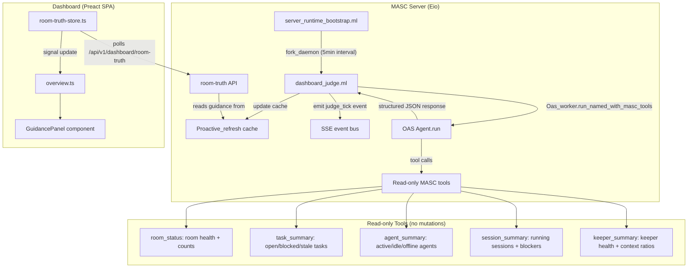

# LLM Judge for Dashboard Intervention Recommendations

Issue: #1870

## Problem Statement

The dashboard home screen has five sections that are empty or show only deterministic fallbacks:

1. **Recommended interventions** ("지금 떠 있는 추천 개입은 없습니다")
2. **Pending approvals** (always empty)
3. **Social activity** ("truth 없음")
4. **Judgment layer** (deterministic fallback only: "안정", "missing")
5. **Observation gaps** (empty list)

Root causes:
- The `guidance` field in room-truth API returns an empty object.
- The existing `dashboard_governance_judge.ml` does governance-only judgments (`Oas_worker.run_named ~max_turns:1`), without tools, and its output is not wired to the home screen sections.
- No agent-loop-based judge exists that can inspect room state via tools and produce structured recommendations.

## Design Constraints

- **LLM cascade**: `llama:auto` (local) then `glm:auto` (cloud fallback). No paid APIs in the critical path.
- **Latency budget**: The judge runs in a background fiber; dashboard reads from a cache. The user never waits on LLM completion.
- **Existing pattern**: `Dashboard_governance_judge.start` uses `Eio.Fiber.fork_daemon` with a periodic loop. The new judge follows this same pattern.
- **OAS Agent.run**: The new judge uses `Oas_worker.run_named_with_masc_tools` to give the LLM read-only tools for inspecting room state, instead of a single-turn prompt with a factual JSON dump.

## OAS/MASC 계층 분리 (Inference belongs in OAS)

LLM judge는 본질적으로 추론/평가 태스크다. "Inference belongs in OAS" 원칙에 따라 판단 로직과 트리거를 분리한다.

| 계층 | 책임 | 위치 |
|------|------|------|
| **OAS** | Judge agent 정의, scoring 로직, 도구 스키마, 출력 파싱, confidence 계산 | `oas/lib/judge/` (신규 모듈) |
| **MASC** | 트리거 (주기적 fiber), 컨텍스트 수집 (room/keeper/task 상태), 결과 캐시, SSE emit, dashboard 렌더링 | `masc/lib/dashboard/dashboard_judge.ml` |

MASC는 OAS에 "이 컨텍스트로 판단해달라"고 요청한다. OAS가 "어떻게 판단할지" (프롬프트, scoring, 구조화)를 소유한다.

이 분리의 이점:
- OAS judge를 다른 프로젝트에서도 재사용 가능
- MASC에 inference 코드가 누적되지 않음 (god object 방지)
- Judge 로직 테스트가 MASC room 의존성 없이 가능

## Architecture



## Data Flow

### 1. Judge Execution (Server-side, periodic)

```
Every 5 minutes (Pulse tick):
  1. Dashboard_judge.refresh_once is called
  2. OAS Agent is built with:
     - cascade_name: "dashboard_judge"
     - system_prompt: structured judgment instructions
     - tools: 5 read-only MASC tools
     - max_turns: 3 (tool calls + final answer)
     - temperature: 0.2
     - max_tokens: 4096
  3. Agent calls tools to gather room state
  4. Agent produces structured JSON response
  5. Response is parsed and cached
  6. SSE event "judge_tick" is emitted
```

### 2. API Response (room-truth endpoint)

The existing `/api/v1/dashboard/room-truth` endpoint already has an `operator` section with `recommendation_summary` and `attention_summary` fields. The judge output slots into this structure:

```json
{
  "operator": {
    "health": "warn",
    "attention_summary": {
      "count": 2,
      "bad_count": 1,
      "warn_count": 1,
      "provenance": "dashboard_judge",
      "top_item": {
        "severity": "bad",
        "summary": "Session s-abc has been blocked for 45 minutes with no agent activity"
      }
    },
    "recommendation_summary": {
      "count": 1,
      "provenance": "dashboard_judge",
      "top_action": {
        "action_type": "nudge_agent",
        "target_type": "session",
        "target_id": "s-abc",
        "reason": "Agent dreamer claimed task t-123 but has not produced output in 45 min"
      }
    }
  },
  "guidance": {
    "generated_at": "2026-03-22T10:30:00Z",
    "model_used": "qwen3.5-35b-a3b",
    "judge_online": true,
    "interventions": [
      {
        "id": "int-001",
        "urgency": "high",
        "category": "blocked_session",
        "summary": "Session s-abc blocked: agent idle for 45min",
        "recommended_action": {
          "action_kind": "nudge",
          "target_type": "session",
          "target_id": "s-abc",
          "reason": "Agent dreamer claimed t-123 but has not responded"
        },
        "confidence": 0.85,
        "evidence": ["session s-abc last_event 45min ago", "agent dreamer heartbeat ok"]
      }
    ],
    "observations": [
      {
        "category": "idle_agent",
        "summary": "Agent sangsu has been quiet for 2 hours despite 3 open tasks",
        "severity": "warn"
      }
    ],
    "social_summary": "2 broadcasts in last hour. Board activity: 1 post, 3 comments.",
    "judgment_layer": {
      "communication": "warn",
      "alignment": "ok",
      "risk": "low"
    }
  }
}
```

### 3. Dashboard Rendering

The dashboard already has `SituationBanner`, `AttentionSpotlight`, and the overview sections. The `guidance` field from room-truth feeds into these components:

- `SituationBanner`: uses `guidance.judgment_layer` for the overall health beacon
- `AttentionSpotlight`: uses `guidance.interventions` filtered by urgency
- A new `GuidancePanel` component: renders the full intervention list and observations
- `NarrativeTimeline`: receives `judge_tick` SSE events

## Judge Tools (Read-only)

| Tool | Input | Output | Purpose |
|------|-------|--------|---------|
| `room_status` | none | `{room, agents_count, tasks_count, keepers_count, health}` | Room-level overview |
| `task_summary` | `?status_filter` | `{total, open, blocked, stale, by_status: {...}}` | Task backlog analysis |
| `agent_summary` | none | `{total, active, idle, offline, agents: [{name, state, last_seen, claimed_tasks}]}` | Agent activity |
| `session_summary` | none | `{total, running, blocked, sessions: [{id, goal, status, blocker?, elapsed_sec, members}]}` | Session health |
| `keeper_summary` | none | `{total, keepers: [{name, generation, context_ratio, last_heartbeat}]}` | Keeper health |

These tools are thin wrappers over existing room data accessors (`Room.agent_list`, `Room.task_list`, etc.), formatted as JSON strings for the LLM.

## Judge System Prompt (Summary)

The system prompt instructs the judge to:
1. Call tools to inspect current room state.
2. Identify anomalies: blocked sessions, idle agents, stale tasks, keeper context pressure.
3. Output strict JSON matching the `guidance` schema.
4. Assign urgency levels (`high`, `medium`, `low`) based on duration and impact.
5. Produce at most 5 interventions and 5 observations per cycle.
6. State "no interventions needed" when the room is healthy (do not fabricate issues).

## Cascade Configuration

Add to `config/cascade.json`:
```json
{
  "dashboard_judge_models": ["llama:auto", "glm:auto"]
}
```

## SSE Events

New event type for the dashboard to track judge activity:

```typescript
// New SSE event
case 'judge_tick': {
  // Update judge status indicator in dashboard
  // Show "last judged at" timestamp
  break
}
```

## Dashboard Component: GuidancePanel

Location: `dashboard/src/components/overview/guidance-panel.ts`

Renders:
- A section header "운영 판단" with judge status indicator (online/offline, last refresh time)
- Intervention cards sorted by urgency (high = red left border, medium = amber, low = gray)
- Each card: summary text, recommended action badge, evidence list (collapsed by default)
- Observation list below interventions
- Social activity one-liner
- Judgment layer badges (Communication / Alignment / Risk)
- Fallback message when judge is offline: "판단 에이전트 오프라인. 결정론적 지표만 표시합니다."

The component reads from `roomTruth.value.guidance` (already normalized through `room-truth-store.ts`).

## Phase Breakdown

### Phase 1: Foundation (this PR after design approval)

**Backend:**
- [ ] Create `lib/dashboard/dashboard_judge.ml` with:
  - Judge state type and cache
  - 5 read-only tool definitions (wrappers over Room accessors)
  - System prompt
  - `refresh_once` using `Oas_worker.run_named_with_masc_tools`
  - `start` function with periodic loop (5 min default, env var override)
  - JSON response parser with fallback on parse failure
- [ ] Add `"dashboard_judge_models"` to `config/cascade.json`
- [ ] Wire `Dashboard_judge.start` into `server_runtime_bootstrap.ml`
- [ ] Inject judge output into room-truth API `guidance` field
- [ ] Emit `judge_tick` SSE event after each refresh

**Frontend:**
- [ ] Add `guidance` field normalization in `room-truth-store.ts`
- [ ] Add `judge_tick` SSE handler in `sse.ts`
- [ ] Create `GuidancePanel` component with intervention cards
- [ ] Wire `GuidancePanel` into `overview.ts`

**Test:**
- [ ] Unit test: judge JSON parsing (valid, malformed, empty)
- [ ] Unit test: tool output formatting
- [ ] Test: fallback behavior when LLM is unavailable

### Phase 2: Scoring and Prioritization

- [ ] Urgency scoring algorithm: combine duration-based heuristics with LLM confidence
- [ ] Deduplication: suppress repeated interventions for the same target within TTL
- [ ] History: persist judge outputs to `Dated_jsonl` store (same pattern as governance judge)
- [ ] Dashboard: intervention trend chart (last 24h)
- [ ] Dashboard: "dismiss" action for interventions (operator acknowledgment)

### Phase 3: Actionable Recommendations

- [ ] Add write tools to the judge's toolkit (behind a gate):
  - `nudge_agent`: broadcast a message to a specific agent
  - `pause_session`: pause a stalled session
  - `reassign_task`: reassign a stale task
- [ ] Human-in-the-loop gate: all write actions require `pending_confirm` approval
- [ ] Wire approved actions to existing `masc_execute` + `masc_operator_confirm` flow
- [ ] Dashboard: "approve" / "reject" buttons on intervention cards

### Phase 4: Absorb Legacy Judge

- [ ] Migrate `dashboard_governance_judge.ml` judgments into the new judge
- [ ] Remove `dashboard_governance_judge.ml`
- [ ] Update governance dashboard tab to use new judge data
- [ ] Remove `governance_judge` cascade entry from `cascade.json`

## Relation to Existing Code

| Existing Module | Relation | Action |
|----------------|----------|--------|
| `dashboard_governance_judge.ml` | Current governance judge, single-turn, no tools | Phase 4: absorb and remove |
| `operator_digest_guidance.ml` | Guidance layer for operator digest | Phase 1: new judge writes to same `guidance` fields |
| `operator_judgment.ml` | Operator judgment storage | Phase 2: reuse for persistence |
| `server_runtime_bootstrap.ml` | Subsystem starter | Phase 1: add `Dashboard_judge.start` |
| `server_dashboard_http.ml` | Room-truth API builder | Phase 1: inject guidance from judge cache |
| `room-truth-store.ts` | Frontend room-truth normalizer | Phase 1: add guidance normalization |
| `sse.ts` | SSE event handler | Phase 1: add judge_tick handler |

## Risks and Mitigations

| Risk | Impact | Mitigation |
|------|--------|------------|
| LLM produces invalid JSON | Judge output is empty | Fallback to deterministic heuristics (existing behavior). Parse with try/catch, log error. |
| LLM hallucinates interventions | False alarms in dashboard | System prompt strictly forbids fabrication. Confidence threshold (>0.5) for display. Phase 2 adds dedup. |
| Local llama-server is down | No judge output | Cascade falls back to GLM cloud. If both fail, judge_online=false and dashboard shows fallback message. |
| 5-min interval is too frequent | LLM resource waste on idle rooms | Check room activity before calling LLM. Skip if no events since last judgment. |
| Tool calls add latency | Judge takes >60s | max_turns=3 limits tool calls. Timeout at 120s. Background fiber means dashboard is never blocked. |
