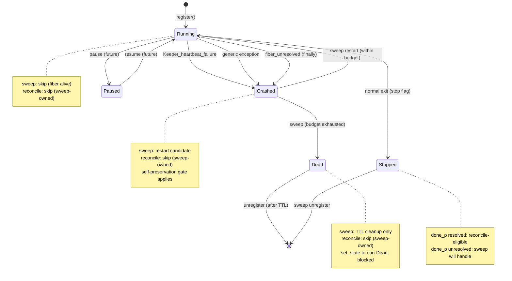

# Adaptive Heartbeat and Cascade Scheduling RFC

**Status**: Draft
**Date**: 2026-03-29
**Scope**: Keeper keepalive, Keeper supervisor, Keeper registry, Room resilience, Cascade inference
**Tracking**: [#3635](https://github.com/jeong-sik/masc-mcp/issues/3635)
**One sentence**: 키퍼 하트비트를 work-as-heartbeat 기반 적응형으로 전환하고, restart 경로에 mass-failure 억제를 추가하며, cascade 레벨 스케줄링 방향을 제시한다.

## Related Documents

- `./adaptive-heartbeat-production-rollout-rfc.md`
- `./adaptive-heartbeat-observability-slo-spec.md`
- `./adaptive-heartbeat-validation-and-alert-wiring-spec.md`
- `./adaptive-heartbeat-grpc-and-phi-rollout-rfc.md`
- `./adaptive-heartbeat-phi-enforcement-rfc.md`
- `./adaptive-heartbeat-safety-harness-spec.md`
- `./contract-driven-agent-loop-rfc.md`
- `./oas-masc-state-boundary.md`
- `../ADAPTIVE-HEARTBEAT-PRODUCTION-RUNBOOK.md`
- `../SUPERVISOR-MODE.md`
- `../COMMAND-PLANE-RUNBOOK.md`

**Document role**: 이 문서는 Phase 0-2의 implementation design RFC다. Canonical HTTP/file keeper path의 production rollout, observability/SLO, operator procedure는 아래 문서들을 canonical source로 본다.

- `docs/design/adaptive-heartbeat-production-rollout-rfc.md`
- `docs/design/adaptive-heartbeat-observability-slo-spec.md`
- `docs/design/adaptive-heartbeat-validation-and-alert-wiring-spec.md`
- `docs/design/adaptive-heartbeat-grpc-and-phi-rollout-rfc.md`
- `docs/design/adaptive-heartbeat-phi-enforcement-rfc.md`
- `docs/design/adaptive-heartbeat-safety-harness-spec.md`
- `docs/ADAPTIVE-HEARTBEAT-PRODUCTION-RUNBOOK.md`

## Readiness Snapshot

- Phase 0 (Measurement): `Go` — config SSOT 정비 + per-stage profiling
- Phase 1 (Work-as-Heartbeat): `Go with caveats` — Phase 0 측정 결과에 따라 scope 조정
- Phase 2 (Restart Resilience): `Go` — self-preservation은 supervisor 경로만 수정
- Phase 2b (Phi Accrual): `No-Go` — gRPC heartbeat가 production에서 활성화된 후에만 착수
- Phase 3 (Cascade Scheduler): `No-Go` — Phase 0-2 baseline 2주 이상 확보 후 별도 RFC

## 1. Problem Statement

### 1.1 두 경로의 구분 (필수 전제)

Keeper liveness에는 두 개의 독립 경로가 있다. RFC의 모든 제안은 이 구분을 전제한다.

**Path A-1: Self-Stop → Reconcile (durable keeper 경로)**

```
keepalive fiber: presence sync 연속 5회 실패
  → Atomic.set stop true (keeper_keepalive.ml:147-151)
  → run_heartbeat_loop 정상 반환
  → launch_supervised_fiber: done_r resolve `Stopped (keeper_supervisor.ml:46-48)
  → sweep_and_recover: done_p = `Stopped → to_unregister (keeper_supervisor.ml:125-126)
  → reconcile_keepalive_keepers: durable keeper가 not running → supervise_keepalive 재호출 (keeper_supervisor.ml:100-113)
  → 재기동된 keeper가 동일 실패 반복 → 무한 self-stop/reconcile 루프
```

**Path A-2: Fiber Crash → Backoff Restart**

```
keepalive fiber: unhandled exception (run_heartbeat_loop에서 catch 안 된 예외)
  → Fun.protect ~finally: done_r resolve `Crashed msg (keeper_supervisor.ml:54-62)
  → sweep_and_recover: done_p = `Crashed → to_restart (keeper_supervisor.ml:127)
  → backoff_delay(restart_count): 10s → 20s → 40s → 80s → 160s → 300s
  → max_restarts 도달 시 "dead" 선언 (keeper_supervisor.ml:128)
```

Storm 조건: **Path A-1이 주요 storm 경로다.** underlying cause(filesystem 장애 등)가 지속되면 self-stop → reconcile → 재기동 → 즉시 self-stop 루프가 N개 keeper에서 동시 발생한다. reconcile에는 backoff도 없고 mass failure 감지도 없다. Path A-2(Crashed → backoff)는 backoff로 자연 감속되지만, Path A-1(Stopped → reconcile)은 감속 메커니즘이 없다.

**Path B: Room Zombie Cleanup (room_gc 경로)**

```
agent JSON의 last_seen ISO timestamp
  → now - last_seen > threshold (resilience.ml:46)
  → threshold: 300s (agent), 3600s (keeper) — 하드코딩 (resilience.ml:5, 60)
  → room_gc.ml:61: cleanup_zombies → stale agent file 삭제
```

이 경로는 keeper restart와 무관하다. Room에서 오래된 agent JSON 파일을 정리하는 hygiene 작업이다.

**Config SSOT 문제**: `resilience.ml`의 300.0/3600.0이 하드코딩되어 있고, `env_config_runtime.ml`의 env var surface와 연결되지 않음. 이 불일치가 Phase 0에서 먼저 정비되어야 한다.

### 1.2 Heartbeat_smart ↔ Keeper Loop 단절

`heartbeat_smart.ml`은 busy_skip + idle_multiplier를 구현하지만, `tool_heartbeat.ml` (MCP tool 경유 agent heartbeat)에서만 사용된다.

`keeper_keepalive.ml`의 30s loop는 이 로직을 적용하지 않는다. Unified turn을 막 완료한 keeper도 30초 후 무조건 full presence sync를 실행한다. Turn 완료 자체가 liveness 증거인데 인정하지 않는다.

이 단절이 코드로 확인된 유일한 구조적 비효율이다.

### 1.3 가설 (측정 필요)

다음은 per-stage profiling 전까지 가설이다:

- 30s loop에서 `ensure_keeper_room_presence`가 지배적 I/O 비용인지?
- `collect_board_events`, `maybe_tick_from_keepalive` 비용은 무시 가능한지?
- Room scope가 현재 single room (All == Current, keeper_coordination.ml:41-45)이므로 multi-room fan-out 비용은 0인지?

Phase 0에서 측정한다.

### 1.4 Unified Turn 중 Max Silence

Keepalive fiber는 단일 fiber다. `run_unified_turn` 호출(keeper_keepalive.ml:348) 중에는 loop가 blocking되어 presence sync나 lease 갱신이 불가능하다. 현재 실질적 max silence는 LLM inference timeout (~100s, Cloudflare constraint)이지만, 이 값이 zombie detection이나 supervisor sweep에 명시적으로 연결되어 있지 않다.

## 2. Non-Goals

- Eio runtime을 다른 concurrency 모델로 교체하지 않는다.
- Fiber memory 최적화 (50 keeper = ~200KB, LLM context 5GB 대비 무의미).
- 범용 workflow engine을 만들지 않는다 (CDAL RFC 범위).
- Room zombie cleanup(Path B) 알고리즘을 이 RFC에서 교체하지 않는다.
- Multi-domain scaling (single domain에서 50 keeper 운영에 충분).

## 3. Current State

### 3.1 Keepalive Loop (keeper_keepalive.ml:110-416)

30s + 20% jitter 주기로 다음을 순차 실행:

| Stage | Code | Cadence | I/O |
|-------|------|---------|-----|
| Room presence sync | `ensure_keeper_room_presence` (keeper_coordination.ml:47) | Every 30s | File read + write (single room) |
| Snapshot collection | JSONL append + SSE broadcast + OAS event | Every `snapshot_interval_sec` (300s) | File write + HTTP |
| Board event scan | `collect_board_events` (keeper_world_observation.ml) | Every 30s | Directory scan |
| Unified turn | `run_unified_turn` (conditional) | Proactive gate | LLM inference (blocking) |
| Recurring tasks | `dispatch_due` | Every 30s | Conditional broadcast |
| Improve loop tick | `maybe_tick_from_keepalive` | Every 30s | Unknown (needs measurement) |

### 3.2 Supervisor (keeper_supervisor.ml:114-169)

- Sweep interval: 30s (configurable via `KeeperSupervisor.sweep_interval_sec`)
- Detection: `Eio.Promise.peek entry.done_p`
- Restart: exponential backoff 10s→300s, max 5 restarts
- Reconciliation: durable keepers auto-recover on sweep

### 3.3 In-Process vs Network Failure Detection

| Detection Method | Layer | Latency | Used For |
|-----------------|-------|---------|----------|
| `Promise.peek done_p` | In-process | Instant (cooperative yield) | Fiber crash/stop |
| Room `last_seen` threshold | Filesystem | Fixed 300s/3600s | Stale agent file cleanup |
| gRPC HeartbeatAck | Network | Configurable | Remote keeper health (optional) |

### 3.4 Smart Heartbeat (heartbeat_smart.ml)

```ocaml
type config = {
  base_interval_s: float;     (* 30.0 *)
  idle_multiplier: float;     (* 3.0 *)
  busy_skip: bool;            (* true *)
  idle_threshold_s: float;    (* 300.0 *)
}
```

현재 `tool_heartbeat.ml:38`에서만 사용. `keeper_keepalive.ml`에 미적용.

## 4. Design

### Phase 0: Measurement and Config SSOT (1주)

**Objective**: 가설 검증 + config 하드코딩 정비.

**Step 0.1: Per-stage profiling**

`keeper_keepalive.ml` loop의 각 stage에 타이머 계측을 추가한다.

**Observer effect 방지**: per-stage timing을 매 cycle마다 file에 쓰면 "I/O 병목" 가설을 측정 행위 자체가 악화시킨다. 따라서 **in-memory ring buffer + sampled flush** 방식을 사용한다.

```ocaml
(* In-memory ring buffer: cycle마다 메모리에만 기록 *)
let timing_ring = Ring_buffer.create 100 in  (* 최근 100 cycles *)

(* 각 stage를 Timer.measure로 감싸되 결과는 메모리에만 *)
let presence_ms = Timer.measure (fun () -> ensure_keeper_room_presence ...) in
let board_ms = Timer.measure (fun () -> collect_board_events ...) in
Ring_buffer.push timing_ring { presence_ms; board_ms; ... };

(* Flush: 기존 snapshot cadence (300s)에 맞춰 aggregate를 JSONL에 추가 *)
(* 새로운 I/O를 만들지 않고 기존 snapshot write에 편승 *)
if snapshot_due then begin
  let agg = Ring_buffer.aggregate timing_ring in  (* p50, p95, max *)
  Dated_jsonl.append metrics_store (add_timing_fields snapshot agg)
end
```

측정값은 기존 snapshot JSONL write에 필드를 추가하는 방식으로 flush한다. 별도 write를 만들지 않는다. 최소 1주간 수집 후 분석.

**Step 0.2: Config SSOT 정비**

`resilience.ml`의 하드코딩을 env_config로 연결:

```ocaml
(* Before — resilience.ml *)
let default_zombie_threshold = 300.0

(* After — resilience.ml *)
let default_zombie_threshold =
  Env_config_runtime.Zombie.threshold_seconds  (* MASC_ZOMBIE_THRESHOLD_SEC, default 300.0 *)
```

기존 env var 이름(`MASC_ZOMBIE_THRESHOLD_SEC`, `MASC_KEEPER_ZOMBIE_THRESHOLD_SEC`)과 모듈 이름(`Env_config_runtime.Zombie.threshold_seconds`, `keeper_threshold_seconds`)을 그대로 사용한다. 새 이름을 만들지 않는다.

| File | Change |
|------|--------|
| `lib/room/resilience.ml:5` | 하드코딩 `300.0` → `Env_config_runtime.Zombie.threshold_seconds` |
| `lib/room/resilience.ml:60` | 하드코딩 `3600.0` → `Env_config_runtime.Zombie.keeper_threshold_seconds` |
| `lib/config/env_config_runtime.ml` | 변경 없음 (이미 `MASC_ZOMBIE_THRESHOLD_SEC`, `MASC_KEEPER_ZOMBIE_THRESHOLD_SEC` 존재) |

### Phase 1: Work-as-Heartbeat (2-3주, LOW risk)

**Objective**: Keeper loop에 Heartbeat_smart 패턴 적용. Turn 완료를 liveness 증거로 인정.

**Mechanical Definition (기계적 정의)**:

| 속성 | 값 |
|------|-----|
| Lease owner | Keepalive fiber (유일한 writer) |
| Renew point (a) | `ensure_keeper_room_presence` 호출 시 (기존) |
| Renew point (b) | Turn 완료 후 `Room.heartbeat_in_room` **성공** 시 (신규) |
| Max silence budget | `MASC_KEEPER_MAX_SILENCE_SEC` (default 120s) |
| Turn 중 갱신 | 불가 (fiber blocking). max silence = max turn duration |
| Freshness skip | `now - !last_successful_heartbeat_ts < MAX_SILENCE_SEC`이면 presence sync skip |
| Failure reset | `Room.heartbeat_in_room` **성공** 시에만 `consecutive_failures := 0` (room I/O 건강 증거) |

**Scope boundary (필수)**:

`last_successful_heartbeat_ts`는 **room-level freshness** (presence sync skip)에만 사용한다. 이 timestamp는 `Room.heartbeat_in_room`이 **성공**한 시점에만 갱신된다. Turn 완료 시점이 아니다 — turn이 성공해도 room heartbeat가 실패하면 timestamp는 갱신되지 않고, presence sync skip도 발동하지 않는다. 이렇게 해야 filesystem/room 장애가 turn 성공으로 가려지지 않는다.

Supervisor의 fiber liveness 판정(`done_p` Promise)과 완전 독립이다. fiber가 `Crashed`면 `last_successful_heartbeat_ts`와 무관하게 dead이다.

```
                        ┌─ Supervisor (Path A) ─┐
done_p: Crashed ───────>│  restart (SSOT)       │  ← timestamp 관여 안 함
done_p: None (alive) ──>│  skip                 │
                        └───────────────────────┘

                          ┌─ Keepalive Loop ────────────────┐
last_successful_heartbeat │  skip presence sync             │
 < MAX_SILENCE_SEC ──────>│  (room heartbeat already done)  │
                          └─────────────────────────────────┘
                          ↑ 갱신 조건: Room.heartbeat_in_room 성공
                          ↑ turn 완료만으로는 갱신 안 됨
```

**Implementation**:

**State boundary**: `last_successful_heartbeat_ts`는 keepalive loop 내부의 **local `ref float`**로 관리한다. keepalive loop는 `read_meta`로 상태를 읽지 `keeper_registry`를 직접 읽지 않으므로 (keeper_keepalive.ml:119), registry에 필드를 추가하면 SSOT가 분리된다. 단일 fiber 내 freshness hint이므로 local ref가 적절하다.

| Step | File | Change |
|------|------|--------|
| 1.1 | `lib/keeper/keeper_keepalive.ml` | `let last_successful_heartbeat_ts = ref 0.0` (loop 시작 시 local ref 선언) |
| 1.2 | `lib/keeper/keeper_keepalive.ml` (unified turn 블록) | Turn 완료 후: (a) `Room.heartbeat_in_room` 호출 (facade 경유, keeper_coordination.ml:65과 동일 경로), (b) heartbeat **성공** 시에만 `last_successful_heartbeat_ts := Time_compat.now ()` + `consecutive_failures := 0`, (c) heartbeat 실패 시 timestamp 갱신 안 함 (presence sync skip 미발동) |
| 1.3 | `lib/keeper/keeper_keepalive.ml:126` | `now - !last_successful_heartbeat_ts < MAX_SILENCE_SEC`이면 presence sync skip (room-I/O 기반 lease) |
| 1.4 | `lib/config/env_config_keeper.ml` | `MASC_KEEPER_WORK_AS_HEARTBEAT` (bool, default true), `MASC_KEEPER_MAX_SILENCE_SEC` (int, default 120) |
| 1.5 | `test/test_work_as_heartbeat.ml` | (a) Turn 완료가 presence sync를 대체하는지, (b) heartbeat 실패 시 consecutive_failures가 유지되는지, (c) room I/O 실패가 turn 성공으로 가려지지 않는지 |

**삭제된 Step**: 기존 1.5 (supervisor에서 `last_turn_completion_ts`로 alive 보완 판정) — `done_p`가 SSOT이므로 override 금지.

**Feature flag**: `MASC_KEEPER_WORK_AS_HEARTBEAT=false`로 기존 동작 즉시 복원 가능.

### Phase 2: Restart Resilience — Self-Preservation (3-4주, MEDIUM risk)

**Objective**: Path A (supervisor restart)에 mass failure 감지 + 억제 추가.

**Storm 경로 분석 (Phase 2 전제)**:

Mass self-stop storm은 `to_restart`(Crashed)가 아니라 `reconcile`(Stopped → re-launch) 경로에서 발생한다 (Section 1.1 Path A-1). 따라서 self-preservation gate는 **두 경로 모두**에 적용해야 한다.

**설계 선택: self-stop을 structured Crashed로 전환**

현재 self-stop은 `Atomic.set stop true` → 정상 반환 → `Stopped`로 resolve된다. 이를 structured exception으로 전환하여 `Crashed` 경로로 라우팅한다.

**구현 주의: `launch_supervised_fiber` 변경 필수**

현재 `~finally` 블록(keeper_supervisor.ml:50-63)은 항상 generic `"fiber terminated without resolution"` 문자열을 사용한다. custom exception을 raise해도 그 메시지가 보존되지 않는다. 따라서 `launch_supervised_fiber`의 body에서 structured exception을 **명시적으로 catch하여 resolve**해야 한다:

```ocaml
(* Before: keeper_supervisor.ml:41-63 *)
Fun.protect
  (fun () ->
    run_heartbeat_loop ...;
    resolve reg.done_r `Stopped; ...)
  ~finally:(fun () ->
    ... resolve reg.done_r (`Crashed "fiber terminated without resolution"))

(* After: body에서 structured exception catch + state 전이 + resolve *)
Fun.protect
  (fun () ->
    (try
       run_heartbeat_loop ...;
       set_state ~base_path meta.name Stopped;  (* state 전이 *)
       resolve reg.done_r `Stopped;
       publish_lifecycle "stopped" meta.name "normal exit"
     with
     | Keeper_heartbeat_failure info ->
         let reason = failure_reason_to_string info.reason in
         set_state ~base_path meta.name Crashed;  (* state 전이: Running → Crashed *)
         record_crash ... meta.name (Time_compat.now ()) reason;
         resolve reg.done_r (`Crashed reason);
         publish_lifecycle "crashed" meta.name reason))
  ~finally:(fun () ->
    ... (* generic fallback: set_state Crashed + resolve 기존 유지 *))
```

```ocaml
(* keeper_keepalive.ml:147 — raise structured exception *)
if !consecutive_failures >= max_consecutive_heartbeat_failures then
  raise (Keeper_heartbeat_failure {
    reason = Heartbeat_consecutive_failures !consecutive_failures;
    keeper_name = m.name;
  })
```

**`keeper_state` 확장 (필수 선행)**:

현재 `keeper_state = Running | Paused | Stopped`. `Crashed` variant가 없어서 structured crash 시 state가 `Running`으로 남으면 `is_running`, `running_count`, spawn slot, reconcile 판단이 전부 꼬인다.

```ocaml
(* Before: keeper_registry.ml *)
type keeper_state = Running | Paused | Stopped

(* After *)
type keeper_state = Running | Paused | Stopped | Crashed | Dead
```

- `Crashed`: 오류 종료, restart 대상 (backoff 적용)
- `Dead`: restart budget 소진, 재기동 금지 (tombstone)
- `is_running`은 `Running`만 true. `is_registered`는 entry 존재 여부 (state 무관).

**Dead tombstone (restart budget 보호)**:

현재 exhausted keeper는 unregister 후 meta 파일이 남는다 (keeper_types.ml:601). `keepalive_keeper_names`가 meta를 읽어 reconcile 대상으로 반환하므로, unregister된 exhausted keeper가 orphan처럼 보여 즉시 재기동된다 — restart budget이 무력화된다.

해결: **exhausted keeper를 unregister하지 않고 `Dead` state로 유지**한다. Dead entry는 registry에 남아 `is_registered = true` → reconcile skip.

```ocaml
(* Before: keeper_supervisor.ml:128 — exhausted *)
if entry.restart_count >= max_restarts then
  to_unregister := entry :: !to_unregister  (* → meta 남음 → reconcile re-launch *)

(* After: Dead tombstone *)
if entry.restart_count >= max_restarts then begin
  Keeper_registry.set_state ~base_path entry.name Dead;
  publish_lifecycle "dead" entry.name "restart budget exhausted";
  (* Dead entry stays in registry. is_registered = true → reconcile skips *)
  (* Periodic cleanup: Dead entries > DEAD_TTL (default 3600s) can be unregistered *)
end
```

Dead entry cleanup: sweep에서 `state = Dead AND now - last_restart_ts > DEAD_TTL`이면 먼저 meta 파일에 `paused = true` 를 durable write 하고, 그 write가 성공했을 때만 unregister 한다. paused write가 실패하면 tombstone을 registry에 유지하고 다음 sweep에서 retry 한다. 이렇게 해야 unregister-only 성공으로 orphaned durable keeper가 되어 reconcile re-launch 되는 경로를 막을 수 있다.

**Reconcile 제외 규칙 (필수)**:

sweep 순서 변경만으로는 부족하다. reconcile은 **registry에 entry가 존재하는 keeper를 건드리면 안 된다**.

```ocaml
(* Before: keeper_supervisor.ml:100 — reconcile 조건 *)
| Ok (Some meta) when not meta.paused
      && not (Keeper_registry.is_running ~base_path meta.name) ->
    supervise_keepalive ...

(* After: registry에 entry가 존재하면 skip *)
| Ok (Some meta) when not meta.paused
      && not (Keeper_registry.is_registered ~base_path meta.name) ->
    (* registry에 없는 = 완전히 orphaned durable keeper만 reconcile *)
    supervise_keepalive ...
```

`is_registered`는 entry 존재 여부만 확인한다 (state 무관). 이렇게 하면:
- `Running`: is_registered = true → reconcile skip (정상)
- `Crashed` (backoff pending): is_registered = true → reconcile skip (backoff 경로가 소유)
- `Crashed` (suppressed): is_registered = true → reconcile skip (다음 cycle에서 재평가)
- `Dead` (exhausted): is_registered = true → reconcile skip (tombstone)
- `Stopped` → unregister 후 entry 삭제 → is_registered = false → reconcile re-launch (정상)
- `Dead` → TTL 경과 → unregister + meta `paused=true` → reconcile의 `not meta.paused`가 영구 제외
- Server restart 후 orphaned: registry empty → is_registered = false → reconcile re-launch (정상)

**Sweep 순서 변경 (보완)**:

순서 변경은 reconcile 제외 규칙의 보완이다. 단독으로는 불충분하지만, 제외 규칙과 함께 defense-in-depth를 제공한다.

```ocaml
let sweep_and_recover ctx =
  let entries = Keeper_registry.all ~base_path () in
  (* 1. Crashed/Stopped 분류 + restart(with backoff)/unregister 처리 *)
  (* 2. self-preservation gate 적용 *)
  (* 3. reconcile — registry에 없는 orphaned durable keeper만 대상 *)
  reconcile_keepalive_keepers ctx;
```

**Failure reason codes (cohort detection 기반)**:

crash_msg prefix matching은 "fiber terminated without resolution"으로 over-group되기 쉽다. 대신 structured failure_reason을 도입한다:

```ocaml
type failure_reason =
  | Heartbeat_consecutive_failures of int   (* 연속 presence sync 실패 *)
  | Fiber_unresolved                        (* 예상치 못한 fiber 종료 *)
  | Exception of string                     (* 구체적 exception *)
```

cohort는 `failure_reason` variant로 판별한다 (string matching이 아닌 ADT matching).

**Self-Preservation Rule**:

Ratio-only 조건은 소규모 cluster에서 과도하게 공격적이다. **ratio AND 절대 수** 이중 조건을 적용한다.

```
sweep_and_recover에서:
  restart_candidates = len(to_restart)
  total_keepers = len(entries)  (* Running + Crashed, Stopped 제외 *)
  ratio = restart_candidates / total_keepers

  if ratio > SELF_PRESERVATION_RATIO (default 0.3)
     AND restart_candidates >= MIN_CANDIDATES (default 2):

    (* cohort 판별: failure_reason variant 기준 *)
    let cohorts = group_by failure_reason to_restart in
    let dominant_cohort = largest cohort in

    if dominant_cohort.size >= MIN_CANDIDATES then
      log "self-preservation: %d/%d keepers, cohort: %s"
        dominant_cohort.size total_keepers
        (failure_reason_to_string dominant_cohort.reason)
      publish OAS event "keeper_self_preservation_triggered"
      skip restarts for dominant_cohort this cycle
      (* 다른 cohort의 restart는 허용 *)
    else
      proceed with normal restart

  next cycle: re-evaluate (suppression은 1 cycle = 30s만)
```

소규모 예시: keeper 3개 중 1개 crash → candidates=1 < min=2 → 정상 restart. keeper 5개 중 3개 `Heartbeat_consecutive_failures` → ratio 60%, same cohort, candidates=3 → 해당 cohort만 억제.

| Step | File | Change |
|------|------|--------|
| 2.0a | `lib/keeper/keeper_registry.ml` | `keeper_state`에 `Crashed` variant 추가 + `is_registered` 함수 추가 |
| 2.0b | `lib/keeper/keeper_supervisor.ml:41` | `launch_supervised_fiber` body에서 `Keeper_heartbeat_failure` catch + `set_state Crashed` + structured resolve |
| 2.1 | `lib/keeper/keeper_keepalive.ml:147` | self-stop `Atomic.set stop true` → `raise (Keeper_heartbeat_failure ...)` |
| 2.2 | `lib/keeper/keeper_supervisor.ml:100` | reconcile 조건: `not (is_running)` → `not (is_registered)` (registry entry 있으면 skip) |
| 2.3 | `lib/keeper/keeper_supervisor.ml:114` | `sweep_and_recover` 순서 변경: restart/unregister → reconcile |
| 2.4 | `lib/keeper/keeper_supervisor.ml` | `failure_reason` ADT 도입 + cohort grouping |
| 2.5 | `lib/keeper/keeper_supervisor.ml` | self-preservation gate (ratio + min_candidates + dominant cohort) |
| 2.3 | `lib/keeper/keeper_supervisor.ml` | self-preservation event 발행 (dominant cohort 정보 포함) |
| 2.4 | `lib/config/env_config_keeper.ml` | `MASC_KEEPER_SELF_PRESERVATION_RATIO` (float, default 0.3), `MASC_KEEPER_SELF_PRESERVATION_MIN_CANDIDATES` (int, default 2) |
| 2.5 | `test/test_self_preservation.ml` | (a) 소규모 1/3 crash → restart 허용, (b) 대규모 same cohort → cohort만 억제, (c) mixed cohort → 각각 판정 |

**Breaking change 주의**: Step 2.0에서 self-stop이 `Stopped` → `Crashed`로 변경되면, 기존에 `Stopped`를 기대하던 로직(dashboard, metrics)에 영향이 있을 수 있다. 구현 시 `Crashed` sub-variant 또는 별도 `SelfStopped` state 도입을 검토.

### Phase 2b: Phi Accrual — gRPC Only (선행조건: gRPC 활성화)

**Scope 제한**: Phi accrual은 gRPC heartbeat stream(keeper_keepalive.ml:458-552)에서만 적용한다.

| Detection Need | Method | Change |
|---------------|--------|--------|
| In-process fiber death | Promise.peek (기존) | 변경 없음 |
| Room file staleness | Fixed threshold (Phase 0에서 configurable) | 변경 없음 |
| Network heartbeat loss | **Phi Accrual (신규)** | gRPC ack 도착 간격 기반 |

**Shadow Mode 요구사항**:
- 2주간 phi 값 로그만 기록, 판정은 기존 방식 유지
- Confusion matrix: TP/FP/TN/FN 집계
- 수용 기준: FP < 1%, FN < 5%
- Kill switch: `MASC_PHI_ACCRUAL_ENABLED=false`
- False-positive audit: phi >= threshold인데 keeper가 실제 alive인 건수 추적

| Step | File | Change |
|------|------|--------|
| 2b.1 | **NEW** `lib/keeper/phi_accrual.ml` | Sliding window + normal CDF phi 계산 |
| 2b.2 | `lib/keeper/keeper_keepalive.ml:493` | gRPC ack 수신 시 `Phi_accrual.record` 호출 |
| 2b.3 | Shadow mode 로깅 | phi 값 + 실제 상태 병기 |
| 2b.4 | `test/test_phi_accrual.ml` | 순수 단위 테스트 |

### Phase 3: Cascade Scheduler (별도 RFC)

이 RFC에서는 방향만 기술한다. 상세 설계는 Phase 0-2 baseline 2주 이상 확보 후 별도 RFC로 작성한다.

**Direction**:

1. **Priority queue**: Reactive(user message, @mention) > Proactive(idle warmup) > Background(improve loop)
   - 근거: Agent.xpu (arXiv:2506.24045) — priority preemption으로 91%+ reactive latency 감소
2. **Task DAG analysis**: 같은 room의 keeper 간 dependency 분석 (Independent / Sequential / Pipeline)
   - 근거: arXiv:2504.07347 — interconnected agent network에서는 work-conserving만으로 불충분
3. **Collaboration mode routing**: MasRouter (arXiv:2502.11133) 패턴 — model 선택과 collaboration mode를 동시 결정
4. **Cache-aware scheduling**: Helium (arXiv:2603.16104) 패턴 — same-room keeper 간 context prefix 공유

Phase 3 착수 조건:
- Phase 0 측정 데이터에서 cascade 레벨 비효율이 확인됨
- Phase 1+2 배포 후 2주 이상 baseline 확보
- Cascade scheduler 별도 RFC 작성 + 리뷰

## 5. Boundary Health

| Phase | Risk | Boundary Crossing | Mitigation |
|-------|------|-------------------|-----------|
| Phase 0 | LOW | None (config + instrumentation) | 기존 동작 변경 없음 |
| Phase 1 | LOW | keeper_keepalive 내부 (local ref, 모듈 경계 변경 없음) | Feature flag로 즉시 복원 |
| Phase 2 | MEDIUM | keeper_supervisor 내부 수정 | 1 cycle 억제만 (30s), 다음 cycle에서 재평가 |
| Phase 2b | MEDIUM | gRPC heartbeat ↔ phi detector (new module) | Shadow mode + kill switch |
| Phase 3 | HIGH | cascade ↔ keeper (new scheduler layer) | 별도 RFC로 분리 |

**가장 큰 위험들**:
1. Phase 1에서 presence skip이 downstream consumer(dashboard, SSE)가 기대하는 `last_seen` 갱신을 누락시킬 수 있음. Step 1.2에서 turn 완료 시 `Room.heartbeat_in_room`을 명시적으로 호출하여 방지.
2. Phase 1에서 `last_successful_heartbeat_ts`가 supervisor의 `done_p` SSOT를 침범하지 않도록 scope를 엄격히 분리. freshness(presence skip)와 liveness(fiber death)는 독립 관심사.

## 5.1 Keeper State Machine



**Owner 구분**: sweep_and_recover가 Running/Paused/Crashed/Dead를 관리. reconcile_keepalive_keepers는 orphaned(registry에 없음) 또는 Stopped+resolved 상태만 재시작.

## 6. Implementation Checklist

- [ ] Phase 0.1: Per-stage timer 계측 (keeper_keepalive.ml)
- [ ] Phase 0.2: Config SSOT (resilience.ml 하드코딩 → env_config)
- [ ] Phase 0: 1주 측정 + 결과 기록
- [ ] Phase 1.1: `last_successful_heartbeat_ts` local ref in keepalive loop
- [ ] Phase 1.2: Turn 완료 후 `Room.heartbeat_in_room` 호출, **성공 시에만** timestamp 갱신 + `consecutive_failures := 0`
- [ ] Phase 1.3: Presence sync conditional skip (`MAX_SILENCE_SEC` 기반 lease)
- [ ] Phase 1.4: Config (feature flag + max silence)
- [ ] Phase 1.5: Tests (freshness skip + room I/O failure 독립 검증)
- [ ] Phase 2.0a: `keeper_state`에 `Crashed` + `Dead` variant 추가 + `is_registered` 함수
- [ ] Phase 2.0b: `launch_supervised_fiber` body에서 structured catch + `set_state Crashed` + resolve
- [ ] Phase 2.0c: Exhausted keeper를 unregister 대신 `Dead` state 유지 (tombstone) + TTL 후 cleanup
- [ ] Phase 2.1: `keeper_keepalive.ml:147` self-stop → structured exception raise
- [ ] Phase 2.2: reconcile 조건 변경 (`is_running` → `is_registered`)
- [ ] Phase 2.3: `sweep_and_recover` 순서 변경 (restart/unregister → reconcile)
- [ ] Phase 2.4: `failure_reason` ADT 도입
- [ ] Phase 2.5: Self-preservation gate (ratio + min_candidates + cohort)
- [ ] Phase 2.6: Config (ratio, min_candidates)
- [ ] Phase 2.7: Tests (소규모/대규모/mixed cohort + reconcile 제외 + state 전이)
- [ ] Phase 2b (gRPC 활성화 후): Phi accrual + shadow mode

## 7. Labeling Protocol

| Label | Value |
|-------|-------|
| `area:` | `keeper` |
| `target:` | `next` |
| `type:` | `enhancement` |
| `promise:` | `ops visibility` |

Phase별 이슈 분리 시:
- Phase 0: `[Heartbeat] Per-stage profiling + config SSOT`
- Phase 1: `[Heartbeat] Work-as-heartbeat for keeper keepalive`
- Phase 2: `[Heartbeat] Self-preservation in supervisor restart`
- Phase 2b: `[Heartbeat] Phi accrual for gRPC heartbeat`
- Phase 3: 별도 RFC + 별도 issue

## Research References

### Academic Papers

| Paper | Key Insight | Phase |
|-------|-------------|-------|
| arXiv:2504.07347 (Li, Dai, Peng) | Work-conserving scheduling은 독립 agent에 충분하지만, interconnected agent network에서는 DAG-aware 필요 | P3 |
| arXiv:2506.24045 (Agent.xpu) | Priority preemption + slack piggybacking. Reactive > Proactive. 91%+ latency 감소 | P3 |
| arXiv:2507.06520 (Gradientsys) | Centralized scheduler + hybrid sync/async + capacity-aware dispatch | P3 |
| arXiv:2502.11133 (MasRouter, ACL 2025) | Collaboration mode + role + model routing. 52% overhead 감소 | P3 |
| arXiv:2603.16104 (Helium, 2026-03) | Cache-aware agentic scheduling. 1.56x speedup via KV cache reuse | P3 |
| arXiv:2603.13605 (Orla, Harvard) | Request execution과 workflow policy 분리 | P3 |
| PLDI 2021 (Retrofitting Effect Handlers) | Eio fiber overhead ~1%. Fibers 1.67-4.29x faster than Lwt | All |

### Industry / Production Systems

| System | Pattern | Relevance |
|--------|---------|-----------|
| K8s KEP-589 | Lease(10s) + Status(5min) 분리. 80% write 감소 at 5k nodes | P1 lease/sync 분리 참조 |
| Cassandra/Akka | Phi Accrual Failure Detector. phi=8 → 99.9999% confidence | P2b |
| Netflix Eureka | Self-preservation: >15% simultaneous miss → suppress eviction | P2 |
| Uber Ringpop (SWIM) | O(1) per-node message cost, O(log N) propagation | Scale 참조 |
| OpenClaw | Per-agent heartbeat + orchestration batching + Lobster workflow | P1 패턴 참조 |
| Tokio cooperative yield | 128 ops budget/tick. 3x tail latency improvement | Eio fiber 스케줄링 참조 |

### Key Numbers

| Metric | Value | Source |
|--------|-------|--------|
| Eio fiber per keeper | ~2-4KB | PLDI 2021 |
| 50 keepers total fiber memory | ~200KB (vs 5GB LLM context) | Benchmark |
| K8s lease vs status write reduction | 80% | KEP-589, 5k nodes |
| Phi=8 false positive rate | 0.0001% | Cassandra default |
| Agent.xpu reactive latency reduction | 91%+ | arXiv:2506.24045 |
| MasRouter overhead reduction | 52% on HumanEval | ACL 2025 |
