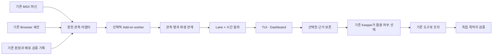

# Lane Add-on v0: 기존 활동에 관측과 관계를 추가한다

상태: 구현 중. 이 문서는 합격 계약이며 실제 합격 보고서가 아니다.

Lane Add-on은 기존 MASC 원장과 실행 환경 위에 붙는 선택적 관측·관계 레이어다.
MSX Lane의 머신, Browser Lane의 세션, Keeper의 도구와 턴 소유권을 재사용한다.
패키지 하나가 여러 Lane 행을 제공할 수 있다. 지표 하나를 보여주기 위해 Keeper나
새 프로세스 실행자를 하나씩 만들지 않는다. 패키지 worker는 관측 계산만 격리한다.

## 지켜야 하는 제품 계약

attach, detach, Add-on 장애는 기존 Keeper의 권한·도구·진행 중 작업을 축소하지 않는다.
추가 근거는 활용·보류·무시할 수 있다. 승인이나 응답을 원래 활동의 선행조건으로 만들지 않는다.
오류와 지연은 해당 관측의 부족으로 표시한다. 기존 실행의 필수 기록은 그대로 보존한다.
공유 자원 때문에 성능 영향이 0이라고 주장하지 않는다. 기준 측정 후 사용자가 정한
허용 범위에서 기존 활동이 계속되는지 판정한다.

v0는 두 가지를 증명한다. 외부 패키지 확장 계약이 작동하고, 선택한 근거가 기존 Keeper의
실제 조치와 독립 검증까지 전달된다. 생산성이나 판단력 향상은 별도 비교 실험의 주장이다.

## 공통 확장 경계

패키지 `lane.toml`은 id, revision, title, image, command와 실제 worker 자원 한도를 선언한다.
observe와 derive는 역할이며 성숙도 순서가 아니다. v0는 state/act를 제공한다고 주장하지 않는다.
worker의 MCP는 전송 규약이다. 제품의 추가 단위는 도구 목록이 아니라 관측·관계·시간·표현이다.
코어가 도메인 의미를 해석하지 않고 공통 row/coverage를 검사하고 표시한다.

파일로 설치할 때는 별도의 `<resolved-config-root>/lane-addons/*.toml` 선언이 패키지와 binding을
연결한다. 지원하는 예제, 반영 시점, 설정 오류와 제거의 의미는 [TOML 설치 안내](../guides/lane-addon-toml.md)를 따른다.

run_id는 관측 묶음의 식별자다. 별도의 MASC 실행기나 격리된 기억·inbox를 뜻하지 않는다.
각 설치 instance_id는 패키지와 binding, namespace, worker 소유권을 식별한다.
같은 패키지를 두 번 붙여도 행과 증거 선택이 충돌하지 않는다.

원천 어댑터는 `snapshot_file`, `msx_capture`, `browser_document`다. 패키지는 어댑터가
제공한 관측을 읽으며 파일 경로를 임의로 열거나 브라우저를 조작하지 않는다.
새 의미 패키지를 붙이려고 서버 dispatcher, TUI 메뉴, Dashboard 컴포넌트를 수정해야 하면 실패다.
새 장치 프로토콜에 필요한 원천 드라이버 개발과 기존 관측에 의미 레이어를 붙이는 일은 구분한다.

## 기존 MSX·Browser Lane과의 관계

MSX 머신은 기존 `Msx_lane`이 소유한다. Add-on은 원자적인 `capture_with_identity`를 사용한다.
load/restore에서 incarnation을 새로 만들고 frame과 함께 보존한다. 관측 때문에 step,
입력, 포커스, peek의 전역 차분 기준을 변경하지 않는다. 한 번의 관측 이미지 처리와
worker 계산은 머신 잠금 밖으로 옮긴다. 공유 머신의 frame과 게임 내 턴은 다른 시간이다.

Browser는 이미 열린 정확한 client/tab/document를 읽는다. 현재 조작이 진행 중이면
선택적 관측은 부족으로 남기며 기존 조작을 기다리도록 큐를 늘리지 않는다.
자동화 쪽도 관측을 위해 다른 탭·프레임으로 전환하거나 세션을 만들지 않는다.
URL, document ID, HTML, 시각은 동일 문서에서 한 번에 수집한다.
`Browser_source_context.digest`는 소스 파일의 해시이며 배포 revision으로 사용하지 않는다.

Web 패키지가 비교하는 것은 선언한 기대 revision과 그 URL에서 읽은 HTML 문서의
`masc-revision` / `masc-revision-namespace` 메타다. 본문·template 속 비활성 마커는 제외한다.
배포 영수증은 별도의 주장이다. `/version` 응답이나 screenshot의 revision을 HTML에 대입하지 않는다.
대상 ID, 환경, 정확한 URL, 요청 식별자가 다른 관측을 같은 배포로 합치지 않는다.
functional probe는 client/tab/document까지 일치해야 한다. 기대 manifest의 실제 bytes와
digest는 독립 검증 시 확인하며, 선언된 해시 문자열만으로 검증되었다고 말하지 않는다.

## 사건, 지식, 시간

원시 관측에는 직접 관찰한 ID, 실제 관측자·실행자, revision, 근거만 기록한다.
배정된 runtime을 실제 실패 후보로 대체하지 않는다. 실제 actor가 없으면 null이다.
의미적 인과와 confidence는 파생 주장에 속한다. 인접한 시각만으로 인과를 만들지 않는다.

각 행은 wall-clock과 선택적인 domain clock을 가진다. MSX frame, 게임 턴,
Keeper absolute_turn은 서로 다른 축이며 trace_id나 지역 turn을 전역 시간으로 바꾸지 않는다.
v0의 window 질의는 wall-clock 범위다. domain clock은 문맥으로 함께 표시한다.

Slice는 질의다. 저장하는 것은 원천 관측과 파생 출력, 설치 이력, 선택해 고정한 근거다.
질의는 source별 incarnation/cursor/누락·지연을 반환한다. 미래의 모든 과거 질의를 복구할 수
있다고 약속하지 않는다. 이미 Keeper가 사용한 선택 근거는 detach와 원천 교체 뒤에도 읽혀야 한다.

이력 질의는 선택한 사건을 응답 공간에 먼저 담고, 남은 공간에는 선택한 기록의 source coverage를
우선 담는다. 나머지 coverage를 다 담지 못하면 누락을 표시하고 partial로 반환한다.
coverage에는 독립적인 시각이 없으므로 시간창 밖이라고 추정해 버리거나 완전함을 주장하지 않는다.
선택한 사건과 coverage를 분리해 읽는 두 번의 스캔은 같은 highwater에서 멈춘다.

## 진행과 장애 경계

한 instance에 독립 Docker container와 server-owned fiber를 둔다. Keeper 턴 switch를 쓰지 않는다.
한 관측이 실행 중일 때 추가 갱신 신호는 하나로 합친다. 원장 전체를 알림 큐에 넣지 않는다.
기존 활동의 완료 신호나 명시적인 observe 요청을 이용하며 새 세계 scheduler는 만들지 않는다.
inspect는 마지막 완료 관측과 pending/error 상태를 함께 반환한다. 다른 worker의 완료를 기다리지 않는다.

CPU·memory·pids·응답 크기는 TOML 자원 계약이며 실제 Docker 적용값을 확인한다.
이 한도는 Keeper 행동 budget이 아니다. 격리가 실패하면 그 Add-on만 실패하며 host 실행으로 대체하지 않는다.
detach는 정확한 container ID의 제거와 부재를 확인한다. Docker CLI 종료를 container 종료로 대체하지 않는다.
daemon 장애로 제거를 확인하지 못하면 cleanup incomplete다. 다른 Lane은 진행한다.
특히 Docker create 응답 이전에 daemon이 멈추면 아직 컨테이너 ID를 확보하지 못한 상태다.
그 구간의 detach를 완료로 표시하지 않는다. 재시작 후 ID가 없는 설치는 해당 인스턴스의
정확한 container 이름으로 찾고 이름·소유권 label·실제 ID를 확인한 뒤 제거한다. Docker 조회와
제거 후 부재 확인이 성공해야 정리가 완료된다. 조회 실패나 소유권 불일치를 정상 제거로 바꾸지 않는다.
플러그인의 initialize/observe hang과 Docker daemon 자체의 장애를 별도 결과로 기록한다.

근거 전달은 기존 Keeper 메시지 경로를 사용한다. 전달 영수증과 Keeper의 실제 읽기·조치,
독립 검증은 서로 다른 증거다. 선택적으로 보낸 근거가 상위 지침으로 승격되지 않는다.
Keeper에게 전달할 때는 선택한 원문을 기존 Tool blob store에 동일한 SHA-256으로 보존하고,
표준 artifact manifest로 자식 근거를 연결한다. Keeper는 기존 `keeper_artifact_read`로 읽는다.
host 파일 경로를 guest에서 읽으라고 요구하거나 샌드박스의 mount 범위를 넓히지 않는다.
제거가 확인되고 상태가 저장되면 worker와 마지막 출력은 메모리에서 해제하며,
이후의 조회와 증거 선택은 보존한 기록을 사용한다.

## 합격 행렬

기반과 원천 어댑터를 준비한 뒤 host revision을 고정하고 외부 패키지를 설치한다.
아래 9개 항목은 실행별 근거 경로와 host/image/package revision을 함께 기록한다.

| 항목 | 관측할 결과 |
|---|---|
| Web 확장 계약 | 코어 수정 없이 attach·inspect·slice·detach, 자동 TUI/Dashboard 표시 |
| MSX 확장 계약 | 같은 코어 계약으로 frame clock과 incarnation 표시 |
| Web 반례 | 같은 대상 A/B는 불일치, 다른 대상은 연결 안 함, 같은 revision 기능 실패는 별도, 모르면 unknown |
| 행동 활용 | 선택 근거 → Keeper 선택·조치 → 새 독립 브라우저 관측과 기능 검증 |
| 정지 MSX | frame·상태·입력 원장·다른 소비자 차분 기준 유지 |
| 실행 중 장애 | Keeper와 controller 진행 중 오류·hang·부하·알림 적체에도 기존 활동 진행 |
| 선택권 | 근거 무시·보류에 새 승인·응답 의무가 생기지 않음 |
| 제거와 보존 | 문제 worker 제거 후 다른 owner 생존, 선택 근거 원문·해시 재확인 |
| 성능 | 기준 측정, 사용자 허용 범위 확정, 같은 시나리오로 재측정 |

정지 시험은 실행 중 시험을 대신하지 않는다. hang 시험은 장벽을 붙들어 둔 동안
primary 작업이 완료되는지 확인한다. 같은 벽시계 시각에 동일 frame을 요구하지 않는다.
잘못 연결한 결과 0건은 실행한 반례 집합 안의 결과다. 무오류의 보편적 보장이 아니다.

런타임 Goal은 `goal-lane-addon-v0`, metric은
`<base-path>/.masc/evidence/lane-addon-v0-20260910/acceptance.json`의
`passed_checks == required_checks == 9`다. 사용자 성능 허용값이 없으면 완료로 표시하지 않는다.
도구·화면 fixture 테스트 통과는 실제 런타임 행렬의 자동 합격 근거가 아니다.

## 후속 범위와 연구 근거

v0 뒤에는 게임 대회/웹 프로젝트의 행동 가능한 레이어, fork/compare, 자연어 구성,
시간 유효성을 가진 지식 승격을 검증한다. 이번 구현에 새 World runtime, 다중 Curator,
자동 수익 최적화, Keeper 규칙 강화를 넣지 않는다.

효용 실험은 A 기존 조사, B 같은 원문 묶음, C 같은 원문+파생 관계로 나눈다.
B와 C가 같으면 자료 수집·전달이 가치를 만든 것이며, 관계 추론의 이득을 주장하지 않는다.

Concordia의 구성요소 설계는 재사용 가능한 환경 조각과 그 조합을 분리하는 참고가 된다.
이것이 MASC 레이어의 효용을 증명하지는 않는다.
[Multi-Actor Generative AI as a Game Engine, 2025](https://arxiv.org/abs/2507.08892).

협력 에이전트 평가 연구도 상황이 달라지면 성과가 일반화되지 않을 수 있음을 다룬다.
따라서 단일 성공 데모를 판단력 향상으로 확대하지 않고 독립 시나리오로 검증한다.
[Concordia cooperation evaluation, NeurIPS 2025](https://arxiv.org/abs/2512.03318).

관측 오류가 본래 애플리케이션 장애로 전파되지 않아야 한다는 경계는
[OpenTelemetry error handling](https://opentelemetry.io/docs/specs/otel/error-handling/)을 참고한다.
Keeper의 선택권과 실행 중 게임의 비간섭은 MASC에서 별도로 시험해야 하는 계약이다.
