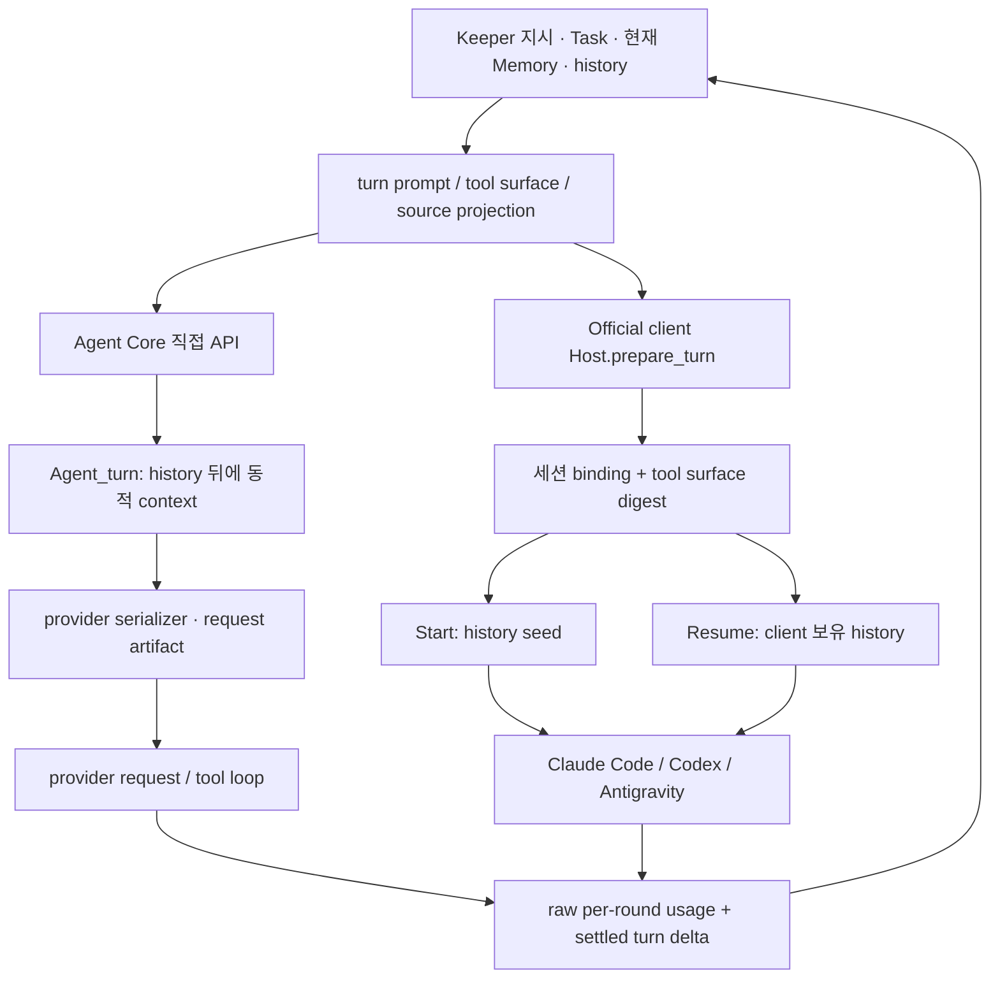

# Provider 입력·출력 토큰 최적화: 흐름 감사와 구현 순서

작성: 2026-09-09. 조사 소스: `fda5de1388eae0095ab6708564d16ec760bbd453`.
읽기 전용 live 확인: binary `ccb1b2f4c152fcbdb2e12ecc218c90e267f9ebcd`, started_at `2026-09-09T08:37:14Z`, health ok.
당일 기록에는 재시작 전 실행도 포함된다. 현재 소스가 모든 표본을 생성했다고 간주하지 않는다.

현재 `<base-path>/.masc/config/runtime.toml`도 읽었다. 선언된 provider는 11개이며 protocol은 openai-compatible-http, messages-http, ollama-http, codex-app-server, claude-code, antigravity-cli다. 이는 설정 inventory이며 11개가 현재 모두 호출 가능하다는 뜻은 아니다. provider 이름만으로 wire protocol을 추정하지 않는다.

## 판단

먼저 실제 전송·정산의 측정 단위를 맞추고, **CLI 동적 지시 분리 → 도구 스키마 노출 → Memory OS recall → 도구 입출력 재사용 → 세션 전환** 순서로 작은 실험을 진행한다. 토큰 budget이나 행동 제한을 추가하는 계획이 아니다. 성공한 작업 하나를 끝내는 데 실제 보고된 입력·출력 토큰과 불필요한 왕복을 줄이는 계획이다.

이미 있는 최적화는 보존한다. CLI resume에 전체 history를 다시 넣는 일반적인 버그는 현재 경로에서 발견하지 못했다. Agent Core의 동적 문맥은 이미 tail에 있고, Anthropic 자동 캐싱도 구현돼 있다. 이들을 다시 만드는 PR은 필요 없다.

## 숫자가 의미하는 것

- 전송 바이트: MASC→CLI IPC와 MASC→provider HTTP는 다른 경계다. CLI가 보유한 history와 native tool schema는 전자의 크기로 알 수 없다.
- provider 입력 토큰 총량: 캐시에서 읽은 토큰을 포함한다. tokenizer와 usage 계약을 provider별로 확인한다.
- 새로 처리되는 입력의 accounting proxy: 정규화된 input − cache_read. Anthropic cache creation도 여기에 포함된다. 원장의 cache_miss만 보면 cache creation을 놓친다.
- output: 모델 응답의 텍스트뿐 아니라 도구 인자·코드 생성도 포함한다. reasoning 포함 여부는 provider 계약으로 구분한다. 미지원 카운터는 unknown으로 남긴다.
- 캐시 재사용은 input 총량을 없애지 않는다. 또한 usage는 하드웨어 FLOP/KV counter의 직접 계측이 아니다.
- 물리적 소비를 알려면 성공한 최종 턴 외에 실패·재시도·failover 시도도 별도 provider request ID로 세어야 한다. 실패 응답의 usage 부재를 0으로 처리하면 안 된다.

## 현재 실행 흐름

### Agent Core

`keeper_run_prompt.ml:97` → `keeper_run_tools_hooks.ml:786,850,1085` → `agent/agent_turn.ml:29` → `llm_provider/complete.ml` → 각 backend.

- 첫 라운드에서 Memory OS recall을 조립하고, 같은 턴의 post-tool round에서는 다시 넣지 않는다.
- extra context는 typed provenance를 가진 User 메시지로 history 끝에 붙인다. system prefix를 매 라운드 갱신하는 구조는 아니다.
- `prepare_tools`는 현재 Tool_set의 전체 schema를 직렬화한다. surface가 넓으면 매 요청의 논리 입력이 크다.
- `backend_anthropic.ml:375`는 system/tools breakpoint와 top-level automatic caching을 구성한다. OpenAI compatible/Responses는 각각 usage의 cache hit를 읽는다. Ollama의 cache_read=0과 provider가 보고하지 않는 cache counter는 실제 KV 재사용 0이라는 증거가 아니다.
- `keeper_model_input_demotion.ml`에 blob 참조 치환이 이미 있다. 새로운 truncator를 만들기보다 existing projection과 exact artifact를 활용해야 한다.

### CLI Provider

`keeper_official_client_host.ml:371` → `keeper_*_runtime.ml` → `runtime/runtime_*` → CLI 자체 agent loop.

| 경계 | Claude Code | Codex app-server | Antigravity |
|---|---|---|---|
| 새 세션 | initial_turn_prompt에 history+goal | 새 thread에 history inject | system+history+goal |
| 재개 | goal, 기존 session history 유지 | prompt, 기존 thread history 유지 | typed turn context+goal |
| 동적 context | Host의 System 메시지를 system_prompt에 합침 | System 메시지를 developerInstructions에 합침 | resume prompt에 별도 포함 |
| identity 변화 | runtime/tool surface 변경 시 fresh claim | 동일 | 동일한 surface reconciliation 경로 |
| 이번 표본 | usage 관측 있음 | usage 관측 있음 | 해당 모델 정산 표본 없음 |

직접 코드 근거:
- `keeper_official_client_host.ml:89,430`: hook extra context를 provenance-marked System으로 변환.
- `keeper_claude_code_runtime.ml:28,551,562`: System→system prompt, resume에는 goal만 seed. `runtime_claude_code.ml:1272`: 실제 `--system-prompt` 전달.
- `keeper_codex_runtime.ml:607,632`: System→developerInstructions. `runtime_codex_app_server.ml:1162,1176`: thread start/resume 필드.
- `keeper_antigravity_runtime.ml:214`: resume 시 turn-local context를 별도로 전달.
- `keeper_official_client_session_store.ml:740,818`: runtime 변경 또는 tool surface digest 불일치 시 fresh session. 이것을 무조건 제거하면 client가 보유한 도구 계약과 실제 실행기가 어긋난다.

## 읽기 전용 표본

[집계 JSON](../evidence/provider-token-baseline-20260909.json), [재현 스크립트](../../scripts/analysis/provider-token-baseline.py).
UTC 2026-09-09 00:00:04–10:32:28 ledger prefix. 수집 완료 10:32:41 UTC. 16개 파일의 읽은 바이트 길이와 SHA-256 기록. prompt/body·인증정보는 보고서에 저장하지 않는다. malformed JSON 0건. 파일별 prefix snapshot이므로 전체 runtime의 원자적 snapshot은 아니다.

### 정산 토큰: raw와 합산하지 않음

| 모델 | resolved rows | input | cache read | cache creation | output | read/input |
|---|---:|---:|---:|---:|---:|---:|
| Claude Sonnet 5 | 324 | 431,264,171 | 423,146,067 | 8,115,626 | 420,919 | 98.12% |
| GLM 5.3 | 213 | 19,578,945 | 13,986,944 | 0 | 260,648 | 71.44% |
| GLM 5.3 Flash | 50 | 5,001,014 | 2,622,848 | 0 | 99,387 | 52.45% |
| Codex Spark | 146 | 9,267,294 | 7,354,240 | 0 | 109,607 | 79.36% |

서로 다른 Keeper·작업·실행 라운드 수다. 모델 효율 비교나 전체 실패 시도까지 포함한 청구 총액이 아니다. Claude의 큰 input은 한 API 요청의 context 크기라고 읽을 수 없다: CLI 내부 라운드 집계가 포함될 수 있다.

`costs`는 raw_observation과 resolved_delta를 함께 가진다. `model_inference_metrics_reader.ml:80`는 raw를 제외하며, `keeper_unified_turn_success.ml:423`는 settled delta를 쓴다. **두 종류가 존재하는 것은 중복 청구 버그의 증거가 아니다.** 이번 분석도 별도 집계했다.

### 요청 구성

- Hook capture 3,120건. 같은 Keeper의 인접 3,108쌍에서 base system prompt는 전부 동일. tools_ref는 2,947쌍 동일, 161쌍 변경.
- non-null extra context를 비교할 수 있는 1,351쌍 중 동일한 것은 1쌍.
- hook tool schema: 중앙값 71,456B, 최대 160,062B.
- hook extra context: 크기가 알려진 1,627건, 중앙값 65,095B, 최대 134,798B.
- turn record 1,107건. Memory recall block 900건: 중앙값 47,740B, 최대 120,797B.
- wire_shape 구성 기록 505건: tool schema 중앙값 70,135B; tool result 504건 중앙값 42,470B; tool-use 인자 504건 중앙값 33,182B; assistant text 496건 중앙값 27,655B.

Hook capture는 `keeper_run_tools_hooks.ml:1085`의 조립 경계다. **최종 CLI system/developer 지시나 provider HTTP payload의 동일성 증명이 아니다.** tool 변화 161쌍을 CLI session reset 161건으로 간주해서도 안 된다. CLI durable_shape를 provider 입력 바이트로 오인하지 않는다. 바이트를 임의의 `/4`로 토큰 환산하지 않는다.

## 다음 작은 PR / PoC

### P0 — 실제 요청 단위의 token baseline

기존 request artifact / turn_ref / usage resolution에 provider request 또는 CLI 내부 호출 identity와 attempt를 연결한다. terminal 성공에 도달하지 못한 시도의 known usage도 보존한다. unknown은 별도 집계한다.

산출: input total/cache read/cache creation/output/reasoning provenance, transmitted bytes, session start/resume reason, tool and stable-prefix digest, input component bytes. TUI도 같은 원장에서 읽는다. raw와 delta 중 어떤 것을 보고 있는지 명시한다.

검증: 다중 tool round·실패 후 failover·CLI resume 각 시나리오에서 leaf request usage 합과 상위 settled delta가 맞는지 설명 가능한 reconciliation. 같은 요청 재생으로 두 번 합산 0건. 누락은 숨기지 않고 count를 남긴다.

### P1 — CLI stable instructions와 turn context의 분리

Claude/Codex의 System context 합성은 source-confirmed cache invalidation 후보다. Agent Core tail 경계와 Antigravity의 turn-local 경계를 참고한다. CLI가 제공하는 적절한 typed turn input으로 동적 사실을 전달하고, 장기 정책·권한은 system/developer에 유지한다. 무작정 모든 System을 User로 내려서는 안 된다.

PoC: 고정 정책+동일 history에 서로 다른 world-state를 넣은 10턴. 실제 CLI 전송 지시 digest가 정책 변경 전까지 일정한지, 최신 사실/우선순위/HITL 전달이 유지되는지 확인한다. input total과 input−cache_read를 따로 측정한다. 현재 Claude 98.12%이므로 큰 절감률을 사전 약속하지 않는다.

### P2 — Tool surface 온디맨드 노출

70KB대 schema를 무조건 매번 제공할 필요가 있는지 비교한다. 기존 capability search, exact refs, task skills, composition 경로를 사용한다. task에 필요한 core tools + 검색/명시적 activation으로 선택하고 schema 본문은 필요할 때 노출한다. 노출 목록 순서와 직렬화는 deterministic하게 유지한다.

CLI에서는 schema를 조금 줄이려고 session을 자주 초기화하면 오히려 손해다. session의 immutable contract와 lazy registry가 공존 가능한지 provider capability로 판단한다. 지원하지 않는 동적 도구 교체를 되는 것처럼 가정하지 않는다.

검증: 전체 catalog 접근 가능성, 미리 예상하지 못한 도구 발견, 권한 일치, same-task 성공률을 보존하면서 최종 provider tokenizer input 감소. 도구 발견에 추가된 출력·왕복도 합산한다. keyword classifier나 수제 score threshold로 최종 선택하지 않는다.

### P3 — Memory recall의 revision-aware 전달

`keeper_memory_os_recall.ml:36`은 LLM-selected current facts 전체를 렌더한다. 모든 역사 기록을 전부 넣는 것은 아니지만 현재 선택 snapshot 자체가 크다. 변경되지 않은 사실의 반복 전달과 새 snapshot 교체를 분리한다.

PoC: source revision+fact ID 기준으로 add/replace/invalidate를 전달하고, receiver가 해당 baseline을 실제 보유한다는 receipt를 남긴다. Agent Core의 extra context는 ephemeral이므로 단순히 다음 턴에서 빼면 기억을 잃는다. baseline을 재구성하는 provider-bound materialization 또는 검증된 durable conversation anchor가 먼저 필요하다. 새 provider/새 session/compaction/ack 없음에는 필요한 baseline을 다시 전달한다.

검증: 10턴 전 사실 질문, source 변경, 부정된 fact, compaction과 failover 뒤 연속성. byte 감소가 아닌 reported input 감소와 기억 보존을 함께 본다. 문자열 유사도 dedup이나 임의 top-N 삭제 금지.

### P4 — 도구 입출력과 생성 코드 재사용

이미 있는 blob demotion을 우선 활용한다. 결과의 queryable artifact + 필요한 projection을 제공하고, full body는 exact handle로 읽는다. cursor/next-read arguments와 typed failure를 보존한다. CLI 초기 history codec은 ToolResult content와 structured_content를 함께 렌더할 수 있으므로, 동일 정보를 실제로 중복 전달하는 사례부터 검사한다. 다른 의미를 가진 두 필드를 임의로 삭제하지 않는다.

출력 절감은 답을 강제로 짧게 만들기보다 같은 코드·도구 인자 재생성을 줄이는 데 둔다. 기존 artifact/patch/typed composition을 참조하거나 기존 DAG에 입력을 바인딩해 긴 스크립트를 매번 생성하지 않도록 한다. independent reads를 한 요청/병렬 그룹으로 모으되 의존 결과를 보지 않고 다음 행동을 실행하지 않는다.

검증: tool output full read→cursor continuation, schema error 수정, long code 수정, failed node 재조립. input/output의 전체 에피소드 합, tool 재호출 수, 완료 결과를 A/B 비교한다. 이 항목은 기여 크기가 관측됐지만 불필요한 비율은 아직 측정하지 않았다.

### P5 — 전환과 재개 비용 관측·개선

fresh reason을 runtime change / tool contract change / recovery / missing settlement로 구분한다. 지금은 단일 current binding이므로 다른 runtime으로 갔다 돌아올 때 재주입 가능성이 있다. 이전 provider session을 재사용하려면 그 사이 메시지와 tool effects를 정확히 동기화해야 한다. session map만 추가하고 오래된 context를 재개하는 것은 금지한다.

검증: A→B→A failover와 source/tool 변경. 효과 중복 0, pending input 누락 0, 요구한 이전 턴 기억 유지. provider affinity는 동률의 재사용 이점으로만 고려하며 모델·provider 선택권이나 failover를 막는 gate가 되지 않는다.

## 실행 및 완료 기준

P0는 측정 기반, P1/P2/P3/P4는 독립 PoC가 가능한 작은 PR, P5는 session continuity 계약을 다루는 별도 단계다. 한꺼번에 prompt를 수정하지 않는다. 각 실험은 동일 Task/입력/성공조건, 동일 provider/model/tool capability를 고정하고 cold/warm을 따로 비교한다. 성공 확인에 필요한 코드·질문·증거는 유지한다.

두 arm 모두 10턴을 완주하고 기능 검증에 통과한 뒤, input total / input−cache_read / output / 추가 호출 / latency를 비교한다. 최적화 항목에 해당하는 token 감소가 실제 usage로 입증될 때만 채택한다. 다른 축의 증가를 숨기지 않는다. provider 미지원·usage missing은 결과 표에 명시한다. 하네스의 token budget, magic timeout, reasoning 일괄 축소, pending event 삭제는 이 계획에 없다.

현재는 조사·읽기 전용 집계 완료다. production provider 동작 변경, token 절감 실험, 빌드/CI, browser screenshot은 수행하지 않았다. Antigravity와 다른 API provider의 동등한 실측 표본 확장이 남아 있다.

## 외부 문서 대조

- [OpenAI Prompt caching](https://developers.openai.com/api/docs/guides/prompt-caching): 동일 prefix를 재사용하며 dynamic content는 뒤에 배치한다. 캐시가 output을 재사용하는 것은 아니다.
- [Claude Code prompt caching](https://code.claude.com/docs/en/prompt-caching): client가 전체 context를 다시 제공하며 exact prefix 변경은 이후 캐시 재사용에 영향을 준다. CLI IPC가 작아도 provider input이 작다는 뜻은 아니다.
- [Anthropic Prompt caching](https://platform.claude.com/docs/en/build-with-claude/prompt-caching): cache creation/read usage와 breakpoint를 구분한다. 실제 지원 여부와 최소 캐시 길이는 provider/model 계약에 따른다.

공식 문서는 캐시 원리를 뒷받침한다. MASC의 실제 절감률은 위 PoC로 별도 증명한다.
