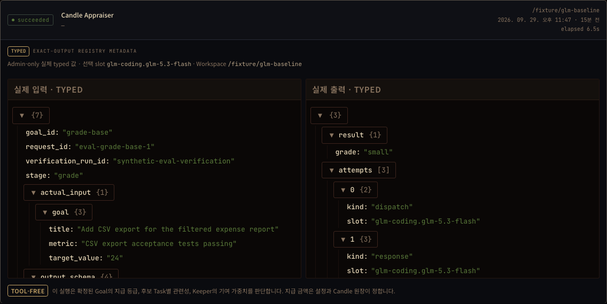
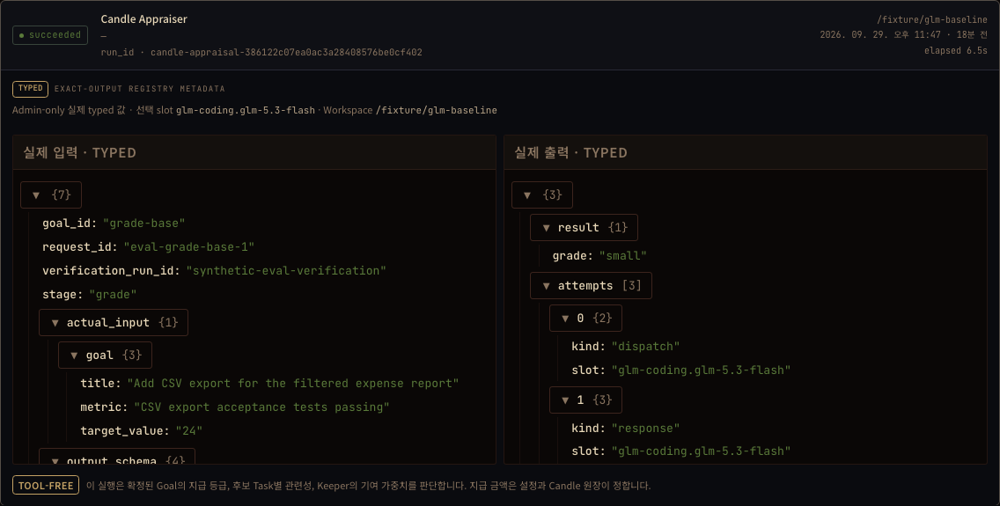
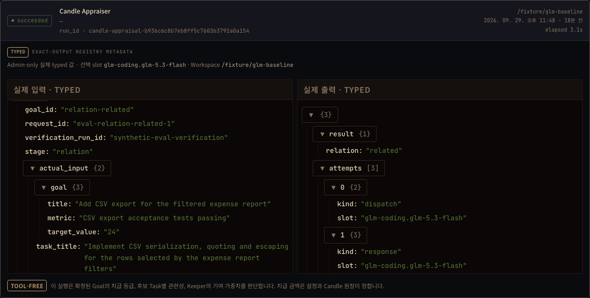
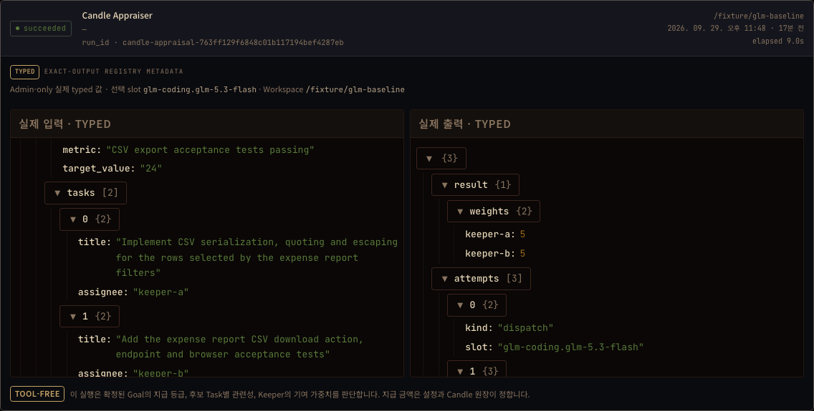

# Candle execution IDs in the dashboard

This is a **source browser replay with actual recorded model data**. Chromium
executes the real `InternalAgentsMonitor` and its strict API decoders. Fixture
HTTP envelopes carry three unchanged receipts from the production Candle
appraiser adapter. This does not demonstrate the native dashboard HTTP route,
an installed server, Goal verification, or a Candle payment.

## Observation and correction

Before the correction, all three Candle rows omitted their execution ID. Their
`subject_id` is null and their actor is the same workspace, so the screen could
not identify the original execution. The existing exact-run ID renderer now
applies to every exact-output row.

The production adapter already stores `goal_id`, `request_id`,
`verification_run_id`, and `stage` inside its durable input. It does not supply
the optional registry `subject_id`; the dashboard projection is not dropping
that value. This correction only displays the existing execution ID.

| Stage | Actual run ID | Decision |
|---|---|---|
| Grade | `candle-appraisal-386122c07ea0ac3a28408576be0cf402` | `small` |
| Relation | `candle-appraisal-b936c6c8b7eb8ff5c7603b3792a0a154` | `related` |
| Weights | `candle-appraisal-763ff129f6848c01b117194bef4287eb` | `keeper-a: 5`, `keeper-b: 5` |

All three were answered by `glm-coding.glm-5.3-flash` in the isolated workspace
`/fixture/glm-baseline`. The browser selects the Candle filter, opens each row,
fetches the exact recorded ID, and checks the input, decision, slot and workspace
actor. It also checks zero Keeper owners, Keeper links and Keeper API requests.
The Relation and Weights captures scroll the real input pane to the actual Task
titles. No browser errors occurred.

## Evidence boundaries

- Native producer commit: `4fae8f4e3fef99a0b23871dd6bfc58a0250df43f`.
- Probe CI run: [36582657889](https://github.com/jeong-sik/masc/actions/runs/36582657889).
- Native executable SHA256: `fd5d67fd9befb6349f20521f1ea86759498d3d83187bbb2812808403df495a19`.
- Before UI source: `cf6440bf4c188ba52b26a43327210b6eed5f6368`.
- After UI base: `c46fec5b68c94ee1e8a56e20e47e5e961e195756`, plus the exact
  source diff and file hashes recorded in `after/evidence.json`.
- Chromium version, requests, receipt hashes and assertions are in
  `before/evidence.json` and `after/evidence.json`.
- `measured/results.jsonl` contains the original three complete result lines,
  selected from a running 240-call evaluation. It is an excerpt, not the complete
  evaluation or a semantic acceptance verdict. The metadata preserves the
  original complete evaluation plan.
- Only `run_kind: exact_output` and `skill_evidence: no_keeper_skills` are added
  to detail envelopes, matching the server projection. List envelopes omit
  payloads. The lane table is derived from these three records; all other lanes
  are explicitly outside the replay scope.
- No Goal, Task, Candle ledger, live runtime configuration or provider credential
  values were written into this evidence. No model is called by the replay.

## Captures









The complete fixture inventory, including `3 runs · 0 Keeper owners`, is in
[after/01-recorded-inventory.png](after/01-recorded-inventory.png).

## Replay

With the dashboard's frozen dependencies and Playwright Chromium installed,
run this from the repository root. The output directory is a new temporary
directory; the script starts Vite on an ephemeral loopback port and stops it
after the browser scenario.

```sh
node docs/evidence/2026-09-30-candle-appraiser-run-id/replay.mjs \
  "$PWD" \
  "$PWD/docs/evidence/2026-09-30-candle-appraiser-run-id/measured" \
  /tmp/candle-appraiser-replay-review after
```

The `before` mode reproduces the missing-ID observation on the unmodified
before source. It is not a passing assertion for the corrected source.
