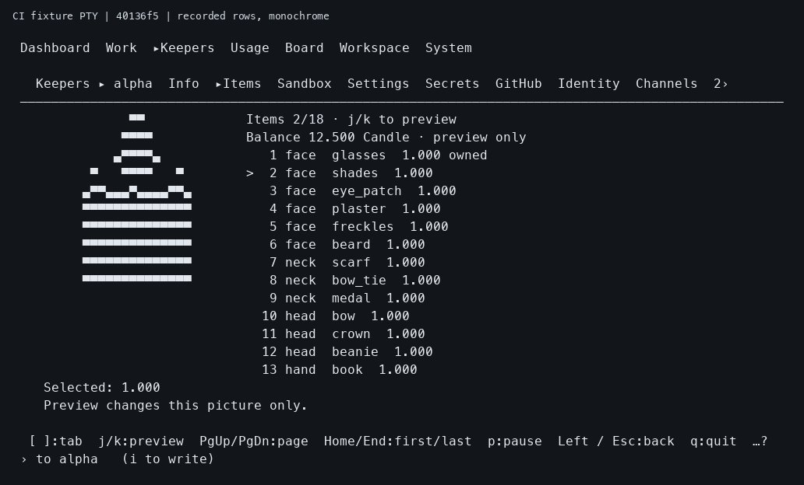

# Item TUI proof at 40136

Tested source: `40136f564910544a84f9d4acd09c48e511dbf82e`.
[Test run 36671846210](https://github.com/jeong-sik/masc/actions/runs/36671846210)
completed successfully, including the targeted Test step and remaining checks.
Adding these artifacts to a later commit preserves this execution; it does not
prove that later source or an installed runtime.

The compressed raw log records seven portrait/Item PTY scenarios passing in
39 seconds, the tab-strip PTY passing in nine seconds, and 54 Keeper control
cases passing. The tested assertions include:

- Selected Item price and preview notice remain visible at 18 rows and after
  resizing to 50 columns; Home, End and page keys retain a selected item.
- A long account error uses the full width and withdraws Kitty portrait
  placement; returning to Info restores the portrait, and exit deletes it.
- Automatic account and price changes refresh the Item pane.
- Workspace authority changes invalidate the old account. A held older reply
  cannot replace the fresh account after returning to the workspace.

The original `manifest.json` identifies the actual executed TUI binary:
`8192ad7e7ec507535b1b22e1264bfa9ddf16f95f501062de3ff5c41ee92b8309`.
Inputs are synthetic Item account HTTP responses through that real executable
in a PTY. Eight captured frames and their corresponding raw PTY byte streams
are retained. Multiple frames can belong to one scenario.

This image renders the recorded 100-column, 24-row `shades-preview.txt` for
viewing. Its font and color are presentation choices; it is not a screenshot
of native pixels or the installed terminal. `rendered-preview.json` links its
input and PNG hashes. The original text and PTY bytes remain unchanged.

`SHA256SUMS` covers every retained file except itself. This evidence proves
fixture PTY behavior at the named source. Real served-dashboard acceptance,
paid transaction/restart checks, model decisions and operational rollout
require their own evidence.
