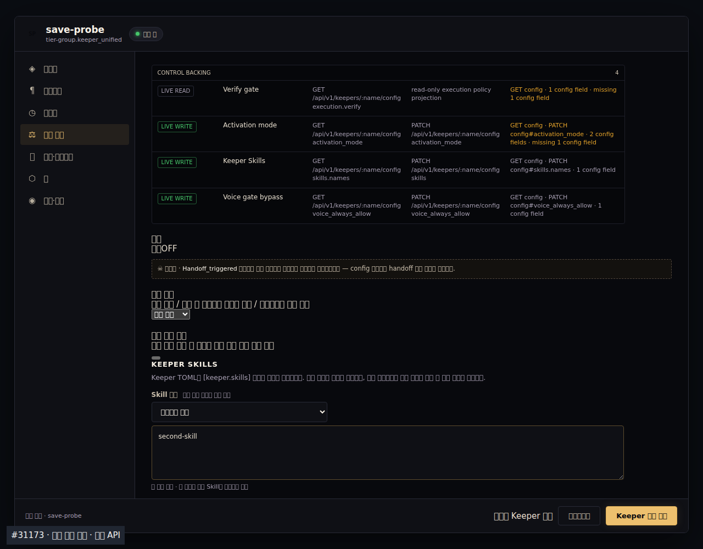
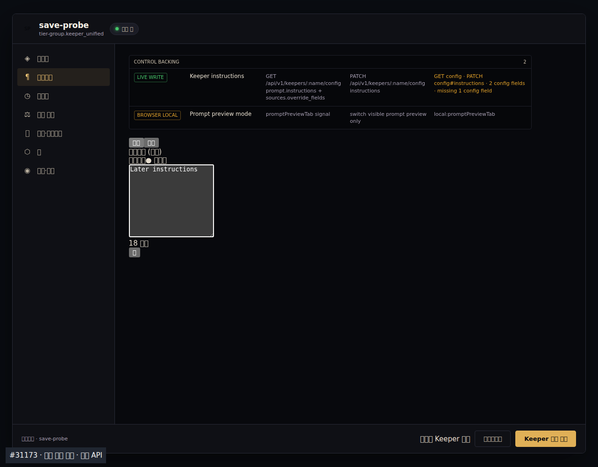

# Keeper config edits during a save (#31173)

The [published-source supplement](source-bound/README.md) binds fresh focused tests, TypeScript, and Chromium execution to commit `056c5648b13d2c6b2829390554b4f03d093e418a` and records the earlier browser timeouts alongside the passing run.

The delayed save response used to reset the draft, losing edits made after the request. The fix reconciles the current draft against the submitted draft on the server response. Fields unchanged since submission accept server normalization; later edits remain dirty and use the returned revision on their next save. Prompt input is observed while typing in both inline and expanded editors, so a focused textarea is included.

[근거] Verified 2026-09-30 09:19 UTC, High for the commands and isolated source behavior below. Base: `58347bd20a9112ec5b578348ea69426f1a382e3c`. This package is local execution evidence; it does not claim installed-server or CI acceptance.

| Check | Command / source | Result |
|---|---|---|
| Original implementation | panel Vitest, `red.log.gz` | 4 failed, 115 passed |
| Reconciliation without live prompt input | panel Vitest, `red-focused.log.gz` | 1 failed, 118 passed; editor removed before focused input was committed |
| Final panel + API | `pnpm exec vitest run src/components/keeper-config-panel.test.ts src/api/dashboard-keeper-config.test.ts --config vitest.config.ts --no-file-parallelism --maxWorkers=1`, `green.log.gz` | 135 passed, exit 0 |
| Final Dashboard | `pnpm exec vitest run --config vitest.config.ts --no-file-parallelism --maxWorkers=1`, `full-vitest.log.gz` | 728 files / 10,212 tests passed, exit 0; 354.44s |
| TypeScript | `pnpm exec tsc --noEmit --pretty false` | exit 0, no diagnostics |
| Chromium source panel | `browser.mjs`, `browser-receipt.json` | 4 POSTs, preserved later inputs and unsaved runtime draft, revisions adopted, no page errors |

The `.log.gz` files contain the exact raw command output, compressed without changing its bytes; read with `gzip -dc <file>`. The Vitest commands ran from `dashboard/` with inherited `MASC_CONFIG_DIR` and `MASC_BASE_PATH` removed. The two RED logs deliberately exercise earlier implementations; they are not failures of the submitted fix. The full-suite log predates the published head; the subsequent test-only cleanup removes an extra blank line and names the existing expand-button expression. That original execution did not capture per-file hashes, so it remains historical run evidence rather than an exact-current-head receipt.

The browser loads the actual `KeeperConfigPanel` with a synthetic API. It holds POST responses while editing, releases each response, checks DOM values and second-save payloads, and captures the real source panel. All requests stay on the isolated loopback server; this does not exercise a live workspace. Reproduce from repository root, with Playwright Chromium available:

```sh
node docs/evidence/2026-09-30-keeper-config-save/browser.mjs dashboard <new-output-directory>
```





The raw HTTP payloads and DOM snapshots are in `browser-receipt.json`; screenshot labels may use missing font fallbacks in the minimal Linux browser environment. Reading the English input values and asserting the recorded DOM/payloads does not establish installed-server acceptance.

— jazz-developer 🎷
