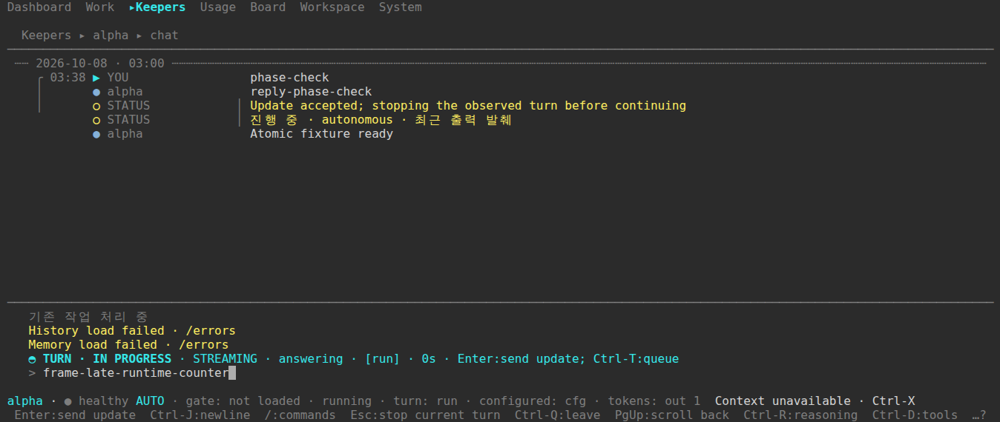
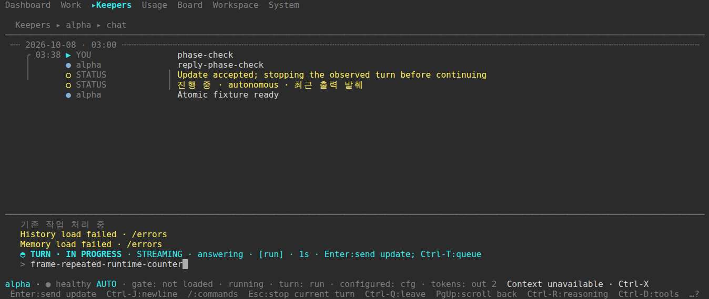

# Recorded model-phase token witnesses

These are original PNG and ANSI exports from [CI run 37723000966](https://github.com/jeong-sik/masc/actions/runs/37723000966), built from `ccf863dc991fe20d197472579350f592a154cede`. The run completed successfully: the model-response-phase PTY scenario passed and nine native-progress tests passed. Its full capture bundle has fifteen frames; the two runtime-counter frames are exported here.

The input was delivered through controlled HTTP/SSE fixtures to the actual TUI executable. The PNGs are browser replays of recorded terminal frames. They are fixture PTY evidence, not live-provider or installed-binary evidence.

| Frame | Terminal | Observed processing witness |
| --- | --- | --- |
| [Late runtime metadata](02-late-runtime-counter.png) | 140 × 30 | `tokens: out 1` while `STREAMING` remains visible |
| [Repeated runtime metadata](04-repeated-runtime-counter.png) | 140 × 30 | `tokens: out 2` while `STREAMING` remains visible |

The counter follows each runtime metadata event on the wire. Seeing the updated counter proves that the client processed the preceding event; an unchanged `STREAMING` label alone would not establish that. The suite retains its original 120-column phase checks and uses these additional 140-column frames where the complete token clause fits.





## Source and artifact identity

The tested source and parent `415eb22e1c85af9c5121a6935b27adf9379b562f` differ only in `changelog.d/41798.md`, `41799.md`, and `41804.md`. Their non-documentation source trees are equal. This establishes that the fixture repair is present in the tested source; it does not establish a new build or identical binary for the parent, whose embedded commit identity would differ.

[provenance.json](provenance.json) records the actual source, run, binary digest, runner-log digest, frame digests, terminal geometry and captured counter rows. The original ANSI files accompany the PNGs. All fifteen original frames were checked for matching PNG/ANSI hashes, geometry and terminal replay; these two exported frames were also visually inspected. The exports preserve their original bytes.

To retrieve the full recorded capture bundle:

```sh
gh run download 37723000966 --repo jeong-sik/masc \
  --name chat-phase-studio-ccf863dc991fe20d197472579350f592a154cede \
  --dir /tmp/masc-model-phase-recorded-captures
```

## Limits visible in the frames

These older frames still show generic receipt `STATUS` rows and History/Memory load-failure notices. They do not prove the later historical-receipt label or healthy history/memory loading. The screenshots are uncropped and retain those notices. Current-head independent approval, a new binary, deployment and real provider behavior remain separate verification requirements.
