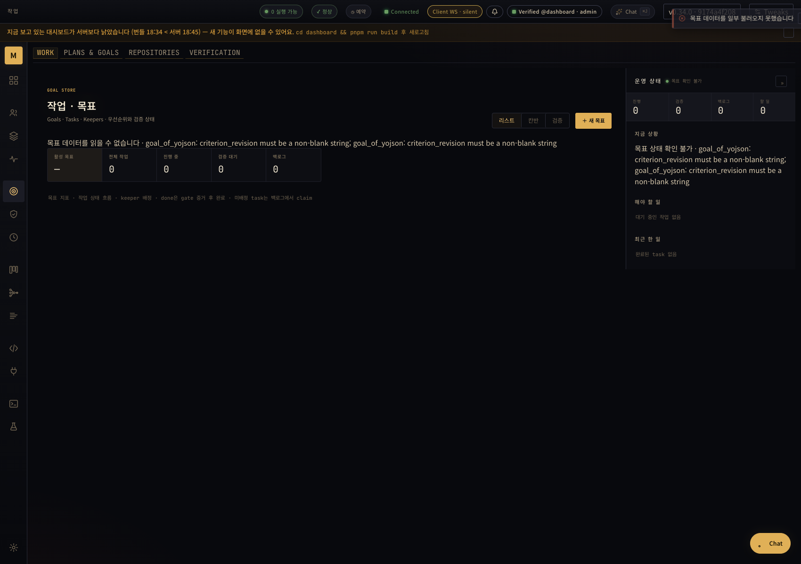

# Goal 원본 오류: 실제 서버와 브라우저 증거

CI에서 만든 서버 `9174a4f2089cc629f68956cb4c6a2382c7c6895d`와 같은 패키지의 Dashboard를 격리 base path에서 실행했다. 잘못된 Goal 파일의 오류가 실제 HTTP 응답과 Work 화면에 전달되는 것을 확인했다. 브라우저 요청을 가로채거나 응답을 합성하지 않았다.

## 확인한 동작

- Planning, Goal tree, Goal detail이 `goal_store_unavailable`와 원본 parser의 원인을 반환한다. 오류를 정상적인 빈 목록으로 바꾸지 않는다.
- 실제 브라우저가 받은 Planning/tree 응답은 별도 HTTP 조회의 응답과 SHA-256이 같다.
- Work에 원인이 표시되고 활성 Goal 수는 `—`로 나온다. `주의 목표 없음 · 정상 순환` 문구는 없다.
- 브라우저 JavaScript 오류는 없었다. 격리 서버는 검증 후 exit code 0으로 종료했다.

## 증거와 재현 조건

[manifest.json](manifest.json)에 서버·서빙한 index·증거 파일의 SHA-256 및 요청 경로를 기록했다. 원본 HTTP JSON, 브라우저에서 관측한 응답, DOM 텍스트와 스크린샷은 수정하지 않고 복사했으며, 복사 전에 원래 receipt의 해시와 비교했다.

1. [release CI 34263329211](https://github.com/jeong-sik/masc/actions/runs/34263329211)의 성공한 macOS ARM64 job artifact를 사용한다. 이 문서는 전체 release workflow 성공을 주장하지 않는다.
2. 별도 base path에 `input-goals.json`을 `.masc/goals.json`으로 배치한다. `criterion_revision`이 없는 입력이다. 해당 파일을 준비한 뒤 서버를 시작한다.
3. 전용 환경은 `PATH`, `LANG`, `TMPDIR`와 같은 패키지의 Dashboard를 가리키는 `MASC_ASSETS_DIR`만 사용했다. 임시 Keeper 설정의 autoboot를 끄고 비어 있는 운영 환경에서 실행했다.
4. manifest의 세 API 경로를 조회하고 Work 화면으로 이동한다. 각각의 JSON, 화면 문구와 Goal KPI를 확인한다.
5. 서버를 정상 종료한다. 운영 서버나 운영 데이터에는 적용하지 않았다.

## 범위와 남은 검증

이는 위 커밋의 Goal 원본 오류 경로 증거다. 이후 Goal–Task 연결 및 Task 삭제 수정의 실행 증거가 아니다. 운영 배포, Provider 호출, Keeper 장기 실행, 정상 Goal 파일로의 복구까지 증명하지 않는다.

Dashboard는 명시적인 assets override로 제공했다. 원자적 설치와 `Installed_dashboard`의 manifest 검증 경로는 실행하지 않았다. 같은 빌드임에도 스크린샷에 나오는 오래된 Dashboard 경고는 이 override 경로의 시간 비교에서 발생했으며 별도 수정 대상으로 남겼다.

실행 중 파일 변경을 30초간 관측한 별도 시도는 route의 60초 cache TTL보다 짧았다. 그 시도를 갱신 실패의 증거나 복구 성공으로 사용하지 않는다. 전체 로컬 서버 로그와 원래 receipt는 이 저장소 bundle에 포함하지 않았다.
