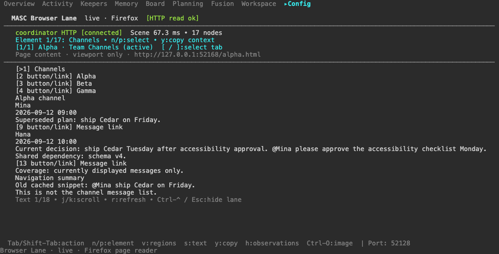
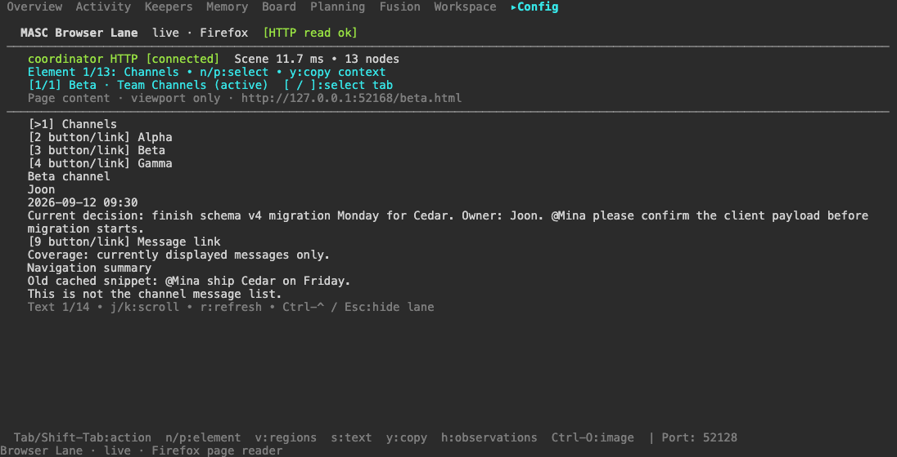
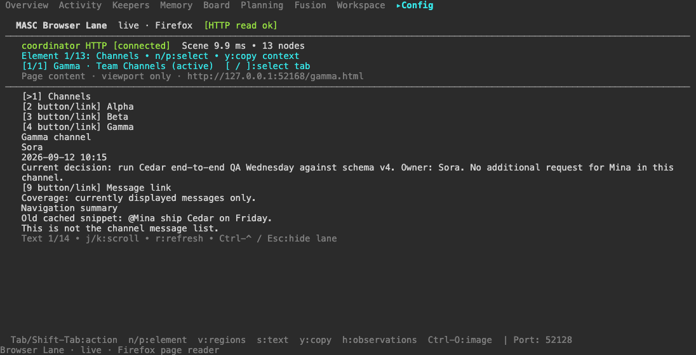
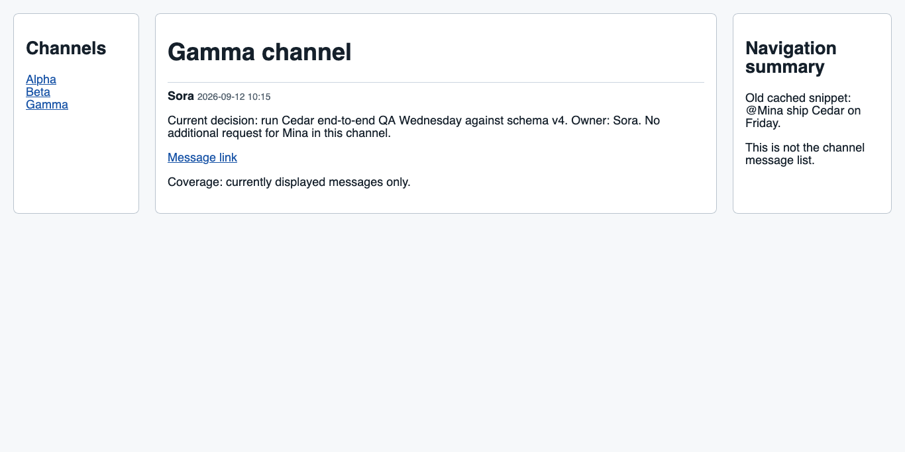

# TUI selection to three-channel live browsing

A copied navigation region previously led the Keeper to try following the region
as a link twice, then end its turn without reading any channel. That failed task
is preserved in `before/`. With the selected region's typed Enter action included
in the copied context, the combined candidate completed the same three-channel
request through three live compositions. Both runs used a synthetic local site,
an isolated Firefox profile, the Browser Lane extension/native host and
`codex_subscription.gpt-5.6-luna`. No Slack or production browser was accessed.

| Observation | Before | Combined candidate |
| --- | --- | --- |
| Requested channel summary | Not completed | Alpha, Beta and Gamma completed |
| Outer tool calls / errors | 2 / 2 | 6 / 0 |
| Successful live compositions | 0 | 3 |
| Retained scene observations | 0 | 4 |
| Raw outer-result UTF-8 bytes | 4,208 | 38,446 |
| Observed turn elapsed | 31.252 s | 45.648 s |
| Keeper operation state | Succeeded | Succeeded |

Operation completion is not task success: the before answer explicitly says it
cannot summarize the channels. These are single natural trials, not a controlled
speed or token benchmark. The earlier recovered attempt in
[browser-live-content-20260913](../browser-live-content-20260913/README.md) used
13 calls and 25,153 result bytes. This candidate used fewer calls but more result
bytes; no net token-saving or universal reliability claim follows.

## What was actually connected

- Before: native source `cc757326f8ebb1d4d3d4ac08486bb507352be35f`, with an
  experimental live composition from `07c2479c49452ef8fcda6e64b01b2d81e84d40b4`.
  The copied context had `view: regions`, `tag: nav`, and no `defaultAction`.
- After: combined source `ee73f5fd4b6d042500b0d8e9ff807d4900848448`, combining
  [#35682](https://github.com/jeong-sik/masc/pull/35682) caller-input classification
  and [#35686](https://github.com/jeong-sik/masc/pull/35686) typed copied actions.
  Its [native CI build](https://github.com/jeong-sik/masc/actions/runs/34714192559)
  supplied the server, TUI and native host. All three hashes were checked against
  the downloaded artifact before execution. `after/native/` preserves provenance.
- Both browser packages in `after/packaged-skills/` were exported by that server
  binary using `skills-refresh --export-to`, then installed unchanged. Bundle
  receipts and the complete package hashes are in `after/bundle.json`.
- Actual extension, installer and imported repository Python files were checked
  against the candidate commit. Only the extension's native-host name was changed
  to use an exclusively created private test manifest. Source hashes are in
  `after/candidate-source-proof.json`; the loaded extension bytes are retained.
- A temporary WebDriver session bootstrapped the isolated Firefox profile. All
  subsequent Keeper page reads and interactions used the live extension and
  native host. This demonstrates live Browser Lane, not a replacement browser engine.

The recorded after operation is `kmsg-0ae3f0be57b53de1eb9527ca778d6cc1`, trace
`trace-1789242280537-00000`, Keeper `browser-handoff-proof-10240000`.

## Observed route and answer

The native TUI emitted the clipboard bytes retained in `after/clipboard-osc52.bin`.
Their decoded context reached the user message unchanged. The selected `region`
carries a scoped `BrowserRead` default action derived from the same typed action
that handles Enter in the TUI.

The Keeper loaded `browser-lanes` and the site instruction, performed that scoped
read, then called `keeper_compose_browser-live-click-content` for each channel.
Each composition followed an observed anchor and read destination content. Child
receipts preserve the actual source document, client, tab and navigation result.
There were no failed calls or artifact-read roundtrips in this trial. Consequently
this trial does not itself test model recovery after an invalid argument; that
behavior remains the separate browser-surface scenario in #35682.

The answer correctly reports Alpha's Tuesday release after accessibility approval,
no explicit Alpha owner, and Mina's Monday checklist request. It reports Joon's
Monday schema-v4 migration and payload request in Beta, and Sora's Wednesday QA
with no additional Mina request in Gamma. The three message links match the
observed pages. It excludes the superseded Friday plan and sidebar cache, and
limits coverage to displayed messages. The combined Cedar/schema-v4 work is a
synthesis of those messages, not proof of an official project-wide execution order.
The exact answer and original outputs are retained in each `composition-audit.json`.

## Shared TUI observation

The same native TUI process stayed open across the entire Keeper turn. Its input
log records no keystrokes after the request began. Replaying 57 complete terminal
frames found each channel's current URL, heading and message body together.
The four retained scene blobs also equal the exact JSON slices returned to the
Keeper, joined through the original tool receipts.






TUI PNGs are xterm replays of complete native PTY prefixes, not reconstructed
mockups. The Firefox image is a final live capture. They do not claim synchronized
pixel/frame identity between a Keeper result and the screenshot. Historical
observation browsing is verified separately in the earlier delivery evidence.

## Verification and limits

Run the portable, read-only audit from any checkout:

```sh
python3 -B docs/evidence/browser-context-recovery-20260913/audit.py
```

It checks the complete file inventory, original outer/child receipt joins,
clipboard bytes, source and destination guards, retained scene bytes, package and
binary identities, complete TUI frame prefixes and cleanup records. The archived
offline audit checks the recorded replay text and prefix boundaries; it does not
render PTY bytes again. The separate `scripts/audit-live-content-tui.py` procedure
performed the xterm replay and captured the PNGs during this verification.
The archived
`scripts/` preserve how the live evidence was produced; those experimental
launchers retain local dependency/scratch paths and are not a portable live runner.
No bearer or provider credential values are included.

The [combined focused run](https://github.com/jeong-sik/masc/actions/runs/34714194010)
passed TUI text, native history and 17 composition cases. It failed a later
browser-surface case because the new recovery fixture retired an ID reused by
that case. The new recovery assertions themselves passed. The test-only followup
`10e24b0735` isolates the ID; its
[focused run](https://github.com/jeong-sik/masc/actions/runs/34714957961) passed all
nine browser-surface cases. Its log is `after/native/input-recovery-10e-suite-log.txt`,
separate from this unchanged product binary. Original combined output, including
the failure, is kept in `after/native/combined-suite-log.txt`.

Each experiment finalized its owned Keeper, closed its private browser profile,
removed only its own native-host manifest, and exited its server/driver/TUI with
status 0. This evidence does not establish the identity or behavior of the user's
deployed local binary. It also does not establish behavior on Slack, dynamic SPAs,
other providers, hidden message history, or arbitrary sites.
